<a id="readme-top"></a>
# Nano Banana Pro/GPT-5/Grok/豆包 Image Prompts

🎉 欢迎来到 Nano Banana Pro/GPT-5/Grok/豆包 图片提示词（Prompts）精选！

🎉 提示词持续更新中。。。

🎉 在线演示地址：https://opennana.com/awesome-prompt-gallery/

## 🆕 项目改造说明
- 新增 `scripts/generate-dataset.js`，可将仓库内的 Markdown 案例自动解析为结构化的 `data/prompts.json` 数据集，包含来源、图片、提示词、示例、备注及自动生成的分类标签。
- 提供全新的前端页面（`index.html` + `assets/`），支持画廊浏览、标签筛选、关键字搜索、案例详情查看以及提示词一键复制。
- 如需更新数据，先维护 Markdown 文件，再运行 `node scripts/generate-dataset.js` 重新生成 JSON，最后通过任意静态服务器打开 `index.html` 即可体验（例如 `python3 -m http.server 8000`）。
- 画廊页面会自动聚合所有标签，可快速组合筛选；点击卡片进入详情，可查看全部示例图、提示词及备注。

## 获取最新提示词？你可以通过这3个渠道。
<div style="width: 98%;">
<table>
  <tr>
    <!-- 左侧文字单元格 -->
    <td style="width: 60%; padding: 2px; vertical-align: middle; border: none;">
      <p>1、微信公众号：松果先森</p>
      <p>2、我的X地址：https://x.com/songguoxiansen</p>
      <p>3、扫一扫，拉你进大群《AI技术学习交流群》</p>
    </td>
    <!-- 右侧图片单元格 -->
    <td>
      
    </td>
  </tr>
</table>
</div>

<a id="prompt-toc"></a>
## 📖 案例目录
*   [案例 1103：水泥台阶的慵懒格调 ](#prompt-1103)
*   [案例 1102：高密度的中文 3D 信息图 ](#prompt-1102)
*   [案例 1101：日系妆容极致美女9宫格提示词 ](#prompt-1101)
*   [案例 1100：镜前比心的甜妹胶片肖像 ](#prompt-1100)
*   [案例 1099：新中式水墨绘本 ](#prompt-1099)
*   [案例 1098：黄金时刻窗影九宫格肖像 ](#prompt-1098)
*   [案例 1097：浅灰运动bra的自在时刻 ](#prompt-1097)
*   [案例 1096：巨人与书页里的微缩童话世界 ](#prompt-1096)
*   [案例 1095：一张超写实的影棚照片 ](#prompt-1095)
*   [案例 1094：立体光影人像与叠层的视觉碰撞 ](#prompt-1094)
*   [案例 1093：女性在阳光洒满的复古咖啡馆里 ](#prompt-1093)
*   [案例 1092：治愈系黏土微缩世界 ](#prompt-1092)
*   [案例 1091：度假酒馆的胶片瞬间 ](#prompt-1091)
*   [案例 1090：2D扁平卡通插画风格 ](#prompt-1090)
*   [案例 1089：从一块完全透明的有机玻璃板下方仰望 ](#prompt-1089)
*   [案例 1088：线织肖像 ](#prompt-1088)
*   [案例 1087：橙色超跑的都市天轨竞速 ](#prompt-1087)
*   [案例 1086：红妆剪影金辉玉颜 ](#prompt-1086)
*   [案例 1085：一只性感小野猫 ](#prompt-1085)
*   [案例 1084：高端香水广告模板 ](#prompt-1084)
*   [案例 1083：卧室微光里的慵懒瞬间 ](#prompt-1083)
*   [案例 1082：黑白九宫格黑衣男子的多面情绪肖像 ](#prompt-1082)
*   [案例 1081：黑衣女子与恶魔影迹的心理肖像 ](#prompt-1081)
*   [案例 1080：3D文字慢动作镜头下的薯片 ](#prompt-1080)
*   [案例 1079：OOTD时尚杂志封面 ](#prompt-1079)
*   [案例 1078：建筑工地广告缩微图 ](#prompt-1078)
*   [案例 1077：温馨的室内生日庆祝拼贴画 ](#prompt-1077)
*   [案例 1076：雨夜都市的沉思女性 ](#prompt-1076)
*   [案例 1075：笔记本纸上的创作风格来绘制内容 ](#prompt-1075)
*   [案例 1074：天然唇部极致特写 ](#prompt-1074)
*   [案例 1073：一个可爱的3D卡通人物 ](#prompt-1073)
*   [案例 1072：一张超逼真的3D商业照片 ](#prompt-1072)
*   [案例 1071：奶凶奶凶的女生 ](#prompt-1071)
*   [案例 1070：4宫格照片 ](#prompt-1070)
*   [案例 1069：监测医疗仪表盘 ](#prompt-1069)
*   [案例 1068：食物微距图 ](#prompt-1068)
*   [案例 1067：黑白肖像里的静谧思绪 ](#prompt-1067)
*   [案例 1066：铂金发丝的晨间自拍 ](#prompt-1066)
*   [案例 1065：极简主义照片级写实平面广告 ](#prompt-1065)
*   [案例 1064：金发碧眼身材健美的年轻女子 ](#prompt-1064)
*   [案例 1063：浴室镜子自拍 ](#prompt-1063)
*   [案例 1062：城市丝带 ](#prompt-1062)
*   [案例 1061：路口转角反光镜 ](#prompt-1061)
*   [案例 1060：极简空间的向上凝视 ](#prompt-1060)
*   [案例 1059：活力四射的自拍 ](#prompt-1059)
*   [案例 1058：新中式水墨绘本 ](#prompt-1058)
*   [案例 1057：咖啡馆的雨天小确幸 ](#prompt-1057)
*   [案例 1056：与手机原图同框的铅笔肖像 ](#prompt-1056)
*   [案例 1055：国际顶流时尚杂志封面 ](#prompt-1055)
*   [案例 1054：逆光发梢的温柔怅惘 ](#prompt-1054)
*   [案例 1053：一幅极其细腻的日式水彩插画 ](#prompt-1053)
*   [案例 1052：空姐浮生记 ](#prompt-1052)
*   [案例 1051：冬日晴空下的闺蜜团 ](#prompt-1051)
*   [案例 1050：3D风格的女子靠在五彩缤纷的墙上 ](#prompt-1050)
*   [案例 1049：角色设定草图 ](#prompt-1049)
*   [案例 1048：女性面部涂口红和唇彩效果的图像 ](#prompt-1048)
*   [案例 1047：博物馆展品级别的昆虫知识科普图谱 ](#prompt-1047)
*   [案例 1046：一则超写实的旅行广告 ](#prompt-1046)
*   [案例 1045：杂志配有儿童绘画作品 ](#prompt-1045)
*   [案例 1044：电影照片故事板 ](#prompt-1044)
*   [案例 1043：高清超写实的微距照片 ](#prompt-1043)
*   [案例 1042：一块记录菜肴的烹饪传承展板 ](#prompt-1042)
*   [案例 1041：博物馆展品级别的鱼类知识科普图谱 ](#prompt-1041)
*   [案例 1040：K-Pop偶像报纸时尚概念 ](#prompt-1040)
*   [案例 1039：一张精致的时尚大片 ](#prompt-1039)
*   [案例 1038：现代动画概念美术风格 ](#prompt-1038)
*   [案例 1037：用手机屏幕把运动世界装进口袋 ](#prompt-1037)
*   [案例 1036：一场盛大壮观的烟花表演 ](#prompt-1036)
*   [案例 1035：夜间烟花表演 ](#prompt-1035)
*   [案例 1034：16 种不同的表面材质 ](#prompt-1034)
*   [案例 1033：花香调香水(柔美浪漫) ](#prompt-1033)
*   [案例 1032：一个微缩的世界 ](#prompt-1032)
*   [案例 1031：新年新气象新衣服 ](#prompt-1031)
*   [案例 1030：彩色铅笔插图 ](#prompt-1030)
*   [案例 1029：九宫格海马体精致写真 ](#prompt-1029)
*   [案例 1028：书籍电影风格海报 ](#prompt-1028)
*   [案例 1027：竖版全身节日海报 ](#prompt-1027)
*   [案例 1026：城市景观上空绽放的壮观烟花照片 ](#prompt-1026)
*   [案例 1025：一只人的手握着一枚细长狭长的竖版模切书签 ](#prompt-1025)
*   [案例 1024：水果包装 ](#prompt-1024)
*   [案例 1023：品牌商品包装 ](#prompt-1023)
*   [案例 1022：一只手拿着一个细长的竖式镂空书签 ](#prompt-1022)
*   [案例 1021：电商商品KV图 ](#prompt-1021)
*   [案例 1020：帅气的9宫格海马体写真 ](#prompt-1020)
*   [案例 1019：逼真的 Vogue 杂志封面风格的时尚肖像 ](#prompt-1019)
*   [案例 1018：多角度特写的写真海报图 ](#prompt-1018)
*   [案例 1017：牛肉面挂牌 ](#prompt-1017)
*   [案例 1016：3D表情包 ](#prompt-1016)
*   [案例 1015：中国水墨画风格邮票 ](#prompt-1015)
*   [案例 1014：虚拟与现实的融合 ](#prompt-1014)
*   [案例 1013：烟花在水滨城市上空勾勒出主题的形状 ](#prompt-1013)
*   [案例 1012：迷你品牌小夜灯设计 ](#prompt-1012)
*   [案例 1011：深红色连衣裙女生拿着白葡萄酒 ](#prompt-1011)
*   [案例 1010：金色长卷发和白皙肤色的女子 ](#prompt-1010)
*   [案例 1009：无肩带连衣裙女生拿着白葡萄酒杯 ](#prompt-1009)
*   [案例 1008：2026写实摄影棚时尚肖像 ](#prompt-1008)
*   [案例 1007：2026新年海报 ](#prompt-1007)
*   [案例 1006：超写实俯视微距摄影 ](#prompt-1006)
*   [案例 1005：女子仿佛从刚冲洗出来的照片中浮现出来 ](#prompt-1005)
*   [案例 1004：冬季森林中年轻女子的3x3网格拼贴画 ](#prompt-1004)
*   [案例 1003：现代Bento网格布局产品展示设计 ](#prompt-1003)
*   [案例 1002：宫廷管弦乐队在一根树枝上演奏音乐 ](#prompt-1002)
*   [案例 1001：香港维多利亚港烟花秀 ](#prompt-1001)
---
## [点击：查看901-1000个提示词](https://github.com/songguoxs/gpt4o-image-prompts/blob/master/1000.md)
## [点击：查看801-900个提示词](https://github.com/songguoxs/gpt4o-image-prompts/blob/master/900.md)
## [点击：查看701-800个提示词](https://github.com/songguoxs/gpt4o-image-prompts/blob/master/800.md)
## [点击：查看601-700个提示词](https://github.com/songguoxs/gpt4o-image-prompts/blob/master/700.md)
## [点击：查看501-600个提示词](https://github.com/songguoxs/gpt4o-image-prompts/blob/master/600.md)
## [点击：查看401-500个提示词](https://github.com/songguoxs/gpt4o-image-prompts/blob/master/500.md)
## [点击：查看301-400个提示词](https://github.com/songguoxs/gpt4o-image-prompts/blob/master/400.md)
## [点击：查看201-300个提示词](https://github.com/songguoxs/gpt4o-image-prompts/blob/master/300.md)
## [点击：查看101-200个提示词](https://github.com/songguoxs/gpt4o-image-prompts/blob/master/200.md)
## [点击：查看100提示词](https://github.com/songguoxs/gpt4o-image-prompts/blob/master/100.md)

<a id="prompt-1103"></a>
## 案例 1103：水泥台阶的慵懒格调 (来源 [@oggii_0](https://x.com/oggii_0/status/2008392317858976144)) 模型：Nano banana pro

<div style="display: flex; justify-content: space-between;">

</div>

**提示词：**
```
{
  "subject": "Young woman sitting casually on outdoor concrete stairs, posing with a cool, confident demeanor.",
  "clothing": "Oversized grey and beige plaid flannel shirt worn open, plain black crew-neck t-shirt underneath, loose-fitting dark trousers, chunky white sneakers.",
  "hair": "Long, straight light brown hair with a middle part, falling naturally over the shoulders.",
  "face": "Neutral, poised expression with defined red lips, eyes concealed behind sunglasses.",
  "accessories": "Round dark sunglasses with thin metal frames, simple silver chain necklace.",
  "environment": "Urban setting with a tall, grey concrete apartment block featuring a grid of windows in the background, weathered concrete steps in the foreground.",
  "lighting": "Soft, diffuse natural daylight indicative of an overcast sky, creating even illumination without harsh shadows.",
  "camera": "Low-angle shot looking up at the subject, emphasizing the height of the background building, sharp focus on the subject with a slightly softened background.",
  "style": "Urban streetwear photography, 90s grunge aesthetic, moody and atmospheric, cinematic vertical composition."
}
```

**中文提示词：**
```
{
“主题”：“年轻女子随意地坐在户外水泥台阶上，摆出一副冷静自信的姿态。”
“服装”：“宽松的灰米色格子法兰绒衬衫敞开穿着，内搭黑色圆领T恤，宽松的深色长裤，厚底白色运动鞋。”
“头发”：“长长的、笔直的浅棕色头发，中分，自然垂落在肩上。”
“面部表情”：“表情自然沉稳，红唇饱满，双眼藏在太阳镜后。”
配饰：圆形深色太阳镜，细金属镜框；简约银链项链。
“环境”：“城市环境，背景是一栋高耸的灰色混凝土公寓楼，窗户呈网格状排列；前景是风化的混凝土台阶。”
“照明”：“柔和、漫射的自然日光，类似于阴天的光线，营造出均匀的照明效果，没有生硬的阴影。”
“相机”： “低角度仰拍拍摄对象，强调背景建筑的高度，主体清晰对焦，背景略微虚化。”
“风格”：“都市街头服饰摄影，90年代颓废美学，情绪化和氛围化，电影般的竖幅构图。”
}
```

<a id="prompt-1102"></a>
## 案例 1102：高密度的中文 3D 信息图 (来源 [@op7418](https://x.com/op7418/status/2008475243015487497)) 模型：Nano banana pro

<div style="display: flex; justify-content: space-between;">
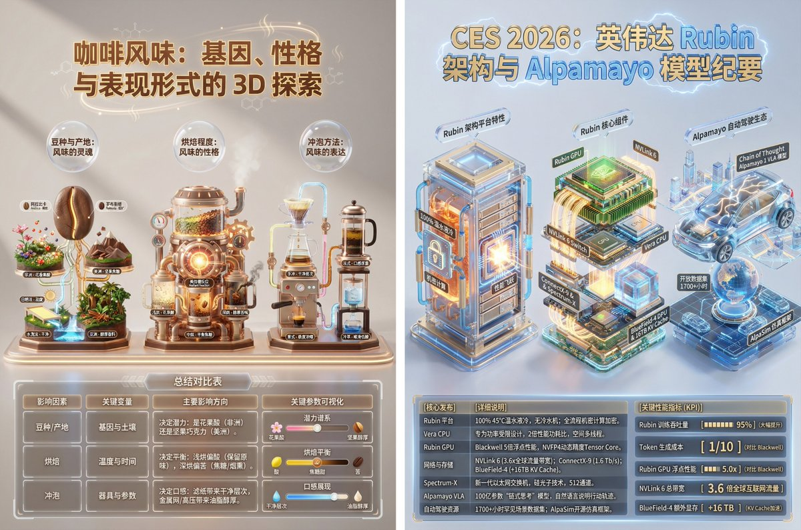
</div>

**中文提示词：**
```
基于下面文字主题，创作一张高密度的中文 3D 信息图。
风格要求为：
顶部：主标题区，居中展示该主题的 3D 艺术字标题。
中间部分展示相关物品或者抽象内容的 3D 微缩模型，造型极其复杂华丽、材质高级（如发光、透明、镀金）、体积庞大、带有炫酷的特效光晕。
信息叠加层（Smart UI）：
悬浮标签： 在每个模型上方，悬浮一个 3D 气泡，写上该模型或者内容的名称。
底部：数据矩阵区
生成一个整齐的多列数据表，我提供的文本信息。
自动生成参数： 请根据主题自动选择多个最关键参数并以图形化进度条或数字形式展示。
风格与渲染：
视角： 正面平视或 30 度等轴测视角，确保三个物品处于同一水平线。
材质： 类似于“盲盒玩具”与“产品渲染”的结合，既可爱又有极高的物理真实感（C4D / Octane Render）。
背景： 干净的纯色摄影棚背景，带有柔和的投影。

文本信息为：
```

<a id="prompt-1101"></a>
## 案例 1101：日系妆容极致美女9宫格提示词 (来源 [@servasyy_ai](https://x.com/servasyy_ai/status/2008498909677842652)) 模型：Nano banana pro

<div style="display: flex; justify-content: space-between;">
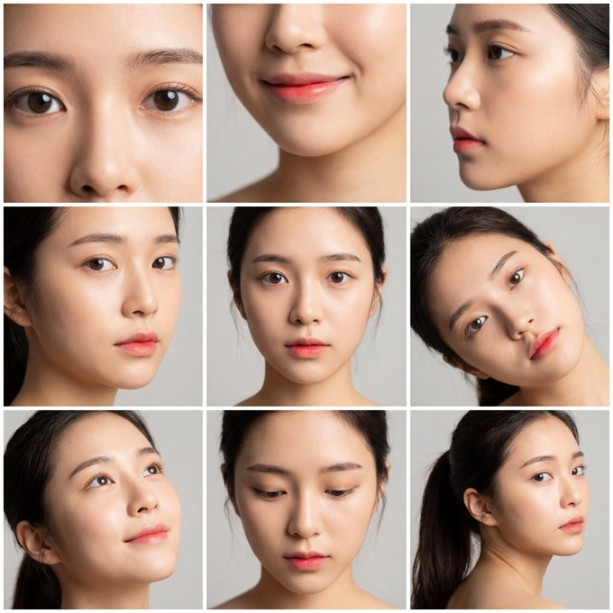
</div>

**提示词：**
```
Nine grid layout collage featuring the same beautiful East Asian woman with Japanese makeup style in nine different close-up shots and angles:
(1) extreme close-up of eyes, (2) close-up of lips and lower face, (3) side profile close-up, (4) three-quarter face close-up, (5) straight-on portrait close-up, (6) tilted head close-up, (7) looking up
close-up, (8) looking down close-up, (9) over-shoulder close-up.
Each shot shows: woman, young, East Asian, large expressive eyes, thick natural lashes, black hair hair, casual, modern, comfortable, ponytail with bangs, fair skin, pale complexion, visible pores,
natural imperfections, oval face, delicate refined Asian facial structure, symmetrical features, Korean K-beauty makeup style, fresh natural dewy skin, gradient lips, straight brows, innocent gaze,
relaxed, cozy, warm, inviting, textile and wood combination, cozy natural pairing, soft fabrics with warm wood, natural window light, soft window lighting, diffused daylight, nordic, scandinavian, soft
morning sunlight streaming through windows, fresh and energizing atmosphere, gentle shadows, rim light, edge glow, cyan glow, beauty lighting, soft lighting, 45-degree, studio backdrop, light grey,
clean background
```

**中文提示词：**
```
九宫格拼贴布局，呈现同一位妆容为日式风格的东亚美女的九种不同特写镜头与角度：
（1）眼部极致特写；（2）唇部及下半张脸特写；（3）侧脸特写；（4）四分之三侧脸特写；（5）正面人像特写；（6）歪头特写；（7）抬头仰视特写；（8）低头俯视特写；（9）肩后视角特写。
每一张镜头均呈现以下特质：年轻东亚女性，灵动大眼，浓密自然睫毛，乌黑秀发，造型休闲简约、兼具现代感，发型为空气刘海搭配马尾，肤质白皙透亮，毛孔清晰可见，保留自然原生瑕疵，脸型为鹅蛋脸，拥有精致立体的东亚面部轮廓，五官匀称对称；妆容为韩式美妆风格，打造清透自然的水光肌底妆，搭配渐变唇妆与平直眉形，眼神澄澈纯真；整体氛围放松惬意、温暖亲和；背景采用织物与木材的组合搭配，营造自然舒适的质感；光线为自然光透过窗户洒入的柔光，是散射的日光，兼具北欧斯堪的纳维亚风格的柔和质感，清晨的阳光透过窗棂倾泻而入，烘托出清新活力的氛围，光影层次柔和，勾勒出轮廓光与边缘光晕，带一抹青蓝色光泽，为美妆专属打光，光线柔和且采用 45° 布光，背景为影棚专用的浅灰色纯色简洁布景。
```

<a id="prompt-1100"></a>
## 案例 1100：镜前比心的甜妹胶片肖像 (来源 [@BubbleBrain](https://x.com/BubbleBrain/status/2008531763430129825)) 模型：Nano banana pro

<div style="display: flex; justify-content: space-between;">
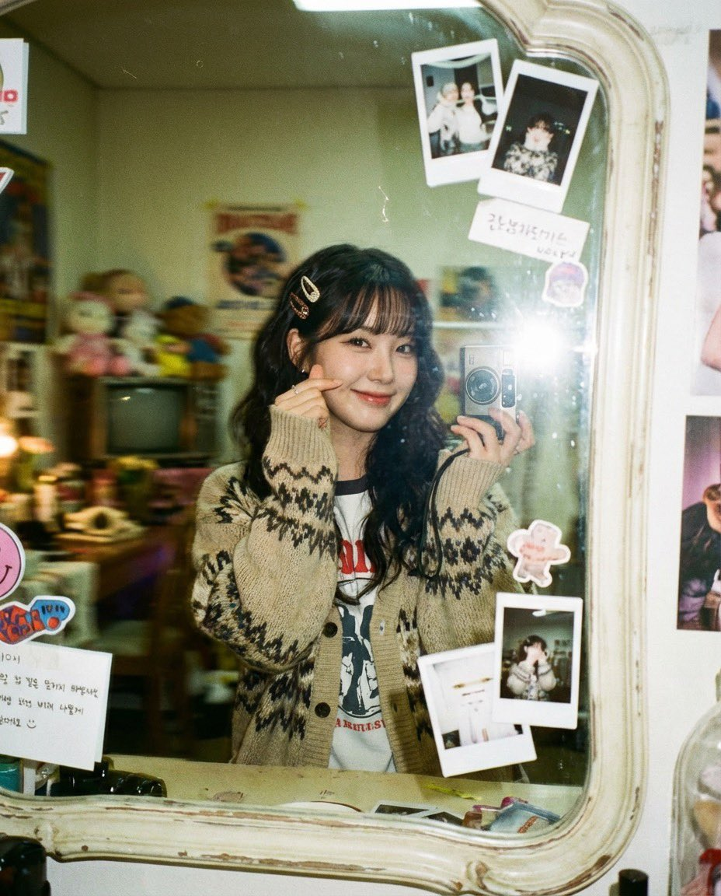
</div>

**提示词：**
```
{
  "protocol_manifest": {
    "version": "14.1_retro_dynamic_fingerheart",
    "objective": "90s Lo-Fi Film Portrait with Panning Motion",
    "aspect_ratio": "4:5",
    "rendering_engine": {
      "type": "Analog Film Simulation",
      "fidelity_tier": "Raw Scan / Texture Rich",
      "special_technique": "Slow Shutter Panning + Flash Freeze"
    }
  },
  "subject_logic": {
    "biometric_layer": {
      "identity_target": "Young cute Korean K-pop idol",
      "archetype": "Pure / Fresh face / Innocent charm",
      "facial_configuration": {
        "gaze": "Sweet, engaging eye contact with the mirror reflection",
        "expression": "Gentle, warm smile / Making a small finger heart gesture (thumb and index finger crossed) near her cheek",
        "makeup": "Light, youthful 'fruit juice' makeup style, glossy lips"
      }
    },
    "hair_and_style": {
      "style": "Soft, dark wavy hair with cute bangs",
      "accessory": "Colorful retro hair clips or scrunchie visible"
    }
  },
  "wardrobe_logic": {
    "apparel_specs": {
      "primary_garment": {
        "type": "Oversized vintage colorful knit cardigan",
        "layers": "Worn over a cute graphic baby tee",
        "style": "Y2K / 90s cozy retro cute"
      }
    }
  },
  "prop_logic": {
    "environment_props": {
      "main_prop": "Large vintage wall mirror with an ornate, slightly worn frame",
      "decorations": "Mirror covered with cute stickers, polaroids, and handwritten notes",
      "foreground_elements": "Blurry retro items suggesting a messy teen room (plushies, colorful cups)"
    }
  },
  "environment_logic": {
    "scenography": {
      "location": "Cozy, cluttered backstage dressing room or bedroom",
      "vibe": "Nostalgic, intimate, warm, chaotic cute"
    },
    "illumination_architecture": {
      "source": "On-camera Direct Flash (Point-and-shoot style)",
      "characteristics": {
        "shadows": "Harsh, defined flash shadows behind the subject",
        "highlights": "Bright specular reflection of the flash bulb visible in the mirror"
      }
    }
  },
  "technical_logic": {
    "optical_configuration": {
      "shot_type": "Medium portrait capturing reflection (Photographer not visible)",
      "lens_simulation": "35mm compact film camera lens",
      "motion_effect": "Significant horizontal motion blur (panning streaks) on background and edges, subject relatively frozen by flash"
    },
    "film_simulation_directives": {
      "film_stock": "Fuji Superia 800 / Kodak Portra 400 (Pushed)",
      "noise_profile": "Heavy, visible film grain and color noise",
      "color_grading": "Lo-fi, warm greenish tint typical of cheap film scans, vibrant reds and yellows",
      "artifacts": "Light leaks, dust specks, vignetting from flash fall-off"
    }
  }
}
```

**中文提示词：**
```
{
"协议清单": {
"版本": "14.1_retro_dynamic_fingerheart",
“目标”：“90年代低保真电影人像，带有摇摄运动”，
"aspect_ratio": "4:5",
"渲染引擎": {
"type": "模拟胶片模拟",
"fidelity_tier": "原始扫描/纹理丰富",
"特殊技巧": "慢速快门摇摄 + 闪光定格"
}
},
"subject_logic": {
"biometric_layer": {
"identity_target": "年轻可爱的韩国K-pop偶像",
“原型”：“纯洁/清新的面孔/天真无邪的魅力”，
"facial_configuration": {
“凝视”：“与镜中倒影进行甜蜜、引人入胜的眼神交流”，
“表情”：“温柔温暖的微笑/脸颊旁做出小小的爱心手势（拇指和食指交叉）”
妆容：清爽、青春的“果汁”妆容风格，亮泽的唇妆
}
},
"hair_and_style": {
“发型”：“柔软的深色波浪卷发，配上可爱的刘海”，
“配饰”： “可见的彩色复古发夹或发圈”
}
},
"wardrobe_logic": {
"apparel_specs": {
"primary_garment": {
“类型”：“超大复古彩色针织开衫”
“叠穿”：“穿在可爱的图案婴儿T恤外面”，
风格：Y2K/90年代舒适复古可爱风
}
}
},
"prop_logic": {
"environment_props": {
"main_prop": "大型复古壁镜，带有华丽、略有磨损的镜框"
“装饰品”：“镜子上贴满了可爱的贴纸、拍立得照片和手写便条”，
"前景元素": "模糊的复古物品，暗示着凌乱的青少年房间（毛绒玩具、彩色杯子）"
}
},
"environment_logic": {
"场景设计": {
“地点”：“舒适、杂乱的后台更衣室或卧室”，
氛围：怀旧、亲密、温暖、略带混乱的可爱
},
"illumination_architecture": {
“来源”：“机顶直接闪光灯（傻瓜式闪光灯）”
“特征”： {
“阴影”：“主体背后清晰、锐利的闪光灯阴影”，
“亮点”：“镜子中可以看到闪光灯泡明亮的镜面反射”
}
}
},
"technical_logic": {
"optical_configuration": {
"shot_type": "中景人像，捕捉倒影（摄影师不可见）",
"lens_simulation": "35mm 小型胶片相机镜头",
“motion_effect”：背景和边缘有明显的水平运动模糊（平移条纹），主体在闪光灯的作用下相对静止。
},
"film_simulation_directives": {
"film_stock": "富士 Superia 800 /柯达 Portra 400 (增感)",
"noise_profile": "明显的胶片颗粒和色彩噪点",
“color_grading”: “低保真、暖绿色调，典型的廉价胶片扫描效果，鲜艳的红色和黄色”，
“瑕疵”：漏光、灰尘颗粒、闪光灯衰减造成的暗角
}
}
}
```

<a id="prompt-1099"></a>
## 案例 1099：新中式水墨绘本 (来源 [@onetoinfai](https://x.com/onetoinfai/status/2008345252185145445)) 模型：Nano banana pro

<div style="display: flex; justify-content: space-between;">
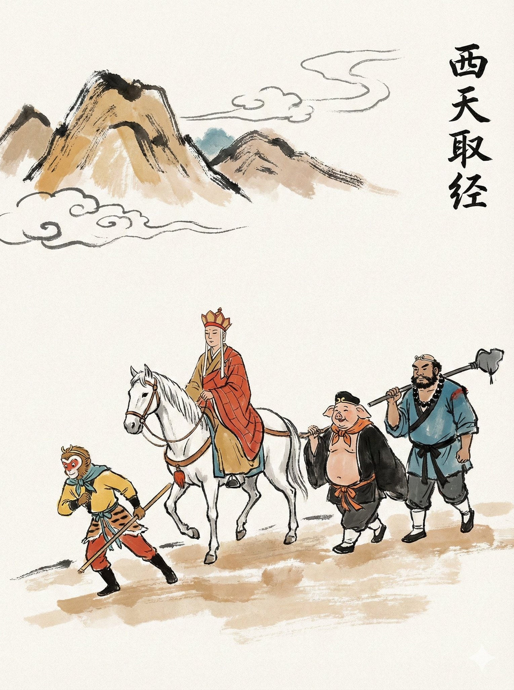
</div>

**中文提示词：**
```
新中式水墨绘本，致敬80年代上美影风格。强调大巧若拙的毛笔触感与宣纸纹理，低饱和矿物色，极简留白构图。画面人物为主体视觉，比例3:4，[此处替换你的主体或场景描述]。
```

<a id="prompt-1098"></a>
## 案例 1098：黄金时刻窗影九宫格肖像 (来源 [@saniaspeaks_](https://x.com/saniaspeaks_/status/2008149378851328329)) 模型：Nano banana pro

<div style="display: flex; justify-content: space-between;">
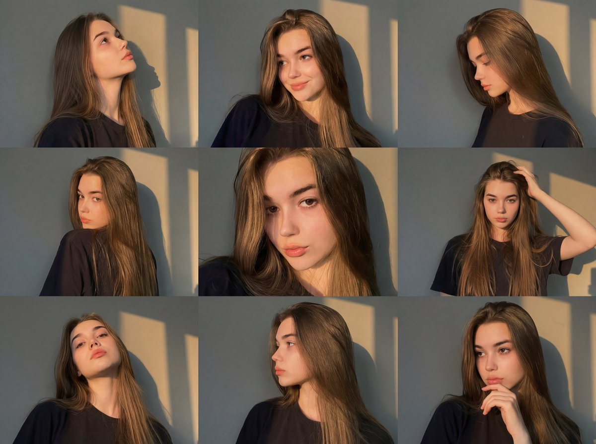
</div>

**提示词：**
```
{
  "image_generation": {
    "face": {
      "preserve_original": true,
      "reference_match": true,
      "description": "Maintain the same facial structure, skin tone, eye shape, and natural expressions across all frames, with consistent identity in each pose."
    },

    "photo_style": {
      "type": "golden hour portrait collage",
      "camera_angle": "varied close-up and medium portrait angles",
      "lighting": "warm golden hour sunlight casting soft window shadows",
      "mood": "soft, calm, intimate, aesthetic",
      "texture": "natural skin texture, soft highlights, gentle contrast",
      "focus": "sharp focus on face with smooth background falloff"
    },

    "subject": {
      "poses": [
        "looking upward toward light",
        "soft smile facing camera",
        "side profile with downward gaze",
        "over-the-shoulder glance",
        "direct close-up with relaxed lips",
        "hand in hair casual pose",
        "head tilted back toward light",
        "clean side profile portrait",
        "thoughtful pose with hand near chin"
      ],
      "expression": "natural, minimal, relaxed, emotionally subtle",
      "hair": {
        "style": "long straight hair worn loose",
        "color": "light to medium brown",
        "details": "natural shine with soft light highlights"
      },
      "clothing": {
        "type": "casual minimalist outfit",
        "details": "simple dark t-shirt with no visible branding"
      }
    },

    "composition": {
      "layout": "3x3 grid collage",
      "consistency": "uniform lighting and background across all frames",
      "framing": "clean portrait framing with slight pose variation"
    },

    "environment": {
      "setting": "indoor space near a window",
      "background": "plain wall with warm sunlight and shadow patterns",
      "atmosphere": "quiet, minimal, artistic indoor ambiance"
    },

    "aesthetic": {
      "style": "Instagram aesthetic portrait set",
      "features": [
        "golden hour light",
        "window shadow patterns",
        "minimal makeup",
        "natural expressions",
        "clean editorial portrait look"
      ]
    }
  }
}
```

**中文提示词：**
```
{
"image_generation": {
“脸”： {
"preserve_original": true,
"reference_match": true,
“描述”：“在所有帧中保持相同的面部结构、肤色、眼睛形状和自然表情，并在每个姿势中保持一致的身份。”
},

"photo_style": {
“类型”：“黄金时段肖像拼贴画”，
"camera_angle": "各种特写和中景人像角度",
“光线”：“温暖的金色阳光在窗外投下柔和的影子”，
“氛围”：“柔和、平静、亲密、唯美”，
“纹理”：“自然的肌肤纹理，柔和的高光，温和的对比度”，
“焦点”： “面部清晰对焦，背景平滑过渡”
},

“主题”： {
“姿势”：[
“仰望光明”，
“对着镜头露出柔和的微笑”，
“侧脸向下凝视”
“回头瞥一眼”，
“嘴唇放松的直接特写”，
“手放在头发上，随意的姿势”，
“头向后仰向光线方向”，
“干净的侧面肖像”，
“沉思的姿势，手放在下巴附近”
],
“表达方式”：“自然、简约、放松、情感细腻”，
“头发”： {
“发型”：“长直发披散着”，
颜色：浅棕色至中棕色，
“细节”：“自然光泽，带有柔和的高光”
},
“衣服”： {
类型：休闲简约装扮，
详情：一件简单的深色T恤，没有任何可见的品牌标识。
}
},

“作品”： {
"布局": "3x3 网格拼贴",
“一致性”：“所有帧的照明和背景都保持一致”，
“构图”: “干净的人像构图，姿势略有变化”
},

“环境”： {
“设置”：“靠近窗户的室内空间”，
“背景”：“阳光温暖照射下的素色墙壁，光影交错”，
“氛围”： “安静、简约、充满艺术气息的室内氛围”
},

“审美的”： {
"风格": "Instagram美学人像套装",
“特征”： [
“黄金时段的光线”，
“窗影图案”，
“淡妆”
“自然表达”，
“干净利落的编辑人像风格”
]
}
}
}
```

<a id="prompt-1097"></a>
## 案例 1097：浅灰运动bra的自在时刻 (来源 [@underwoodxie96](https://x.com/underwoodxie96/status/2008507854534103390)) 模型：Nano banana pro

<div style="display: flex; justify-content: space-between;">
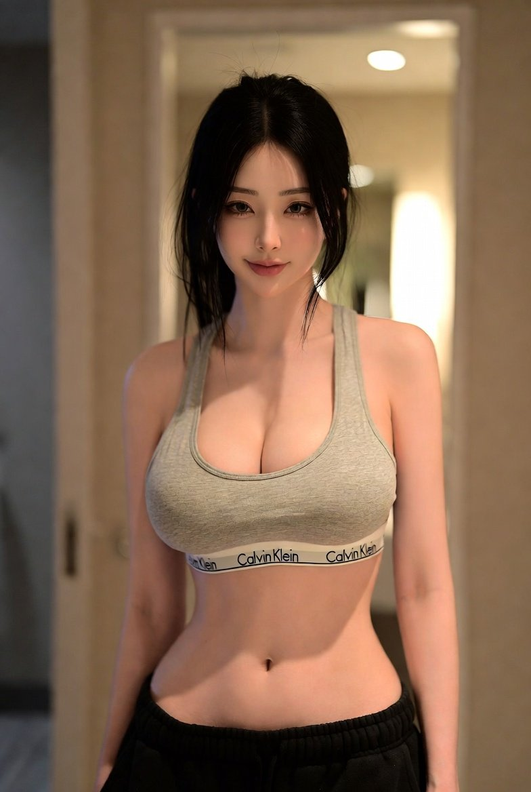
</div>

**提示词：**
```
{   "subject": {     "description": "a young woman taking a low-resolution mirror selfie, with a well-shaped pose that naturally emphasizes her full chest and toned waist",     "mirror_rules": "mirror selfie, readable text orientation, no mirrored letters, ignore physical mirror inversion, realistic reflection",     "age": "early to mid 20s",     "expression": {       "eyes": {         "look": "calm and self-aware",         "energy": "relaxed confidence",         "direction": "looking at phone screen"       },       "mouth": {         "position": "gently closed",         "energy": "neutral and composed"       },       "overall": "cool, effortless, quietly attractive"     },     "face": {       "preserve_original": true,       "makeup": "very light makeup, natural skin texture"     },     "hair": {       "color": "black",       "style": "long straight hair falling naturally",       "effect": "slightly messy, lived-in look"     },     "body": {       "frame": "slim with visible fitness tone",       "waist": "defined and tight",       "chest": "full and prominent, naturally emphasized by posture and sports bra support",       "legs": "partially visible",       "skin": {         "visible_areas": ["arms", "shoulders", "chest area", "waist", "abdomen"],         "tone": "light warm skin tone",         "texture": "real skin with visible grain",         "lighting_effect": "warm indoor light shaping natural curves"       }     },     "pose": {       "position": "standing with torso slightly twisted",       "base": "weight shifted to one hip",       "overall": "well-balanced, flattering, naturally aesthetic"     },     "clothing": {       "top": {         "type": "sports bra",         "color": "light gray",         "details": "visible Calvin Klein logo band",         "effect": "tight fit enhancing chest and upper body shape"       },       "bottom": {         "type": "sweatpants",         "color": "black",         "details": "low-waist, relaxed fit"       }     }   },   "accessories": {     "device": "smartphone held in one hand"   },   "photography": {     "camera_style": "smartphone mirror selfie aesthetic",     "angle": "eye-level mirror reflection with slight body angle",     "shot_type": "waist-up portrait emphasizing body curves",     "aspect_ratio": "9:16 vertical",     "texture": "low-resolution, compressed social media image, visible noise and grain",     "lighting": "warm indoor bathroom lighting",     "depth_of_field": "deep focus, no artificial blur"   },   "background": {     "setting": "bathroom or hotel restroom",     "wall_color": "light beige",     "elements": ["mirror", "door frame"],     "atmosphere": "private, quiet, casual",     "lighting": "soft warm ambient light"   },   "the_vibe": {     "energy": "effortless physical confidence",     "mood": "intimate and self-contained",     "aesthetic": "raw, unpolished social media selfie",     "authenticity": "feels like a reposted or saved phone photo",     "intimacy": "close, personal space",     "story": "a spontaneous mirror check where posture and body awareness do the work",     "caption_energy": "no explanation, just presence"   },   "constraints": {     "must_keep": [       "low-resolution phone photo look",       "naturally emphasized chest",       "flattering body pose",       "realistic proportions",       "mirror selfie realism"     ],     "avoid": [       "HD studio quality",       "over-sharpened details",       "pornographic posing",       "exaggerated anatomy",       "artificial lighting"     ]   },   "negative_prompt": [     "ultra high resolution",     "studio photo",     "anime",     "plastic skin",     "oversexualized pose",     "unrealistic body"   ] }
```

**中文提示词：**
```
{ "subject": { "description": "一位年轻女子正在拍摄低分辨率的镜子自拍，姿势优美，自然地突出了她丰满的胸部和紧致的腰部", "mirror_rules": "镜子自拍，文字方向清晰可读，无镜像，忽略镜子的实际倒置，真实反射", "age": "20岁出头到20岁中期", "expression": { "eyes": { "look": "平静而自信", "energy": "放松的自信", "direction": "看着手机屏幕" }, "mouth": { "position": "轻轻闭合", "energy": "中性而沉稳" }, "overall": "酷酷的，毫不费力的，低调的魅力" }, "face": { "preserve_original": true, "makeup": "非常淡的妆容，自然的肤质" }, "hair": { "color": "黑色", "style": "自然垂落的长直发", "effect": "略显凌乱，自然随性" }, "body": { "体型："纤细，线条流畅，展现健美身材", "腰部："线条清晰紧致", "胸部："丰满挺拔，姿势和运动文胸的支撑自然凸显", "腿部："部分可见", "皮肤："{"可见区域："["手臂", "肩膀", "胸部", "腰部", "腹部"]", "肤色："温暖的浅肤色", "纹理："真实肌肤，可见纹理", "光照效果："温暖的室内光线塑造自然曲线" } }, "姿势："{"位置："站立，躯干略微扭转", "重心："重心移至一侧臀部", "整体："匀称，修身，自然美观" }, "服装："{"上衣："{"类型："运动文胸", "颜色："浅灰色", "细节："可见的Calvin Klein标志带", "效果："紧身设计，凸显胸部和上半身线条" }, "下装："{"类型：" “运动裤”, “颜色”: “黑色”, “细节”: “低腰，宽松版型” } } }, “配饰”: { “设备”: “单手握持的智能手机” }, “摄影”: { “相机风格”: “智能手机镜面自拍美学”, “角度”: “与眼睛齐平的镜面反射，身体略微倾斜”, “拍摄类型”: “强调身体曲线的半身肖像”, “宽高比”: “9:16 竖屏”, “纹理”: “低分辨率、压缩的社交媒体图像，可见噪点和颗粒”, “光线”: “温暖的室内浴室灯光”, “景深”: “深焦，无人工模糊” }, “背景”: { “场景”: “浴室或酒店洗手间”, “墙壁颜色”: “浅米色”, “元素”: [“镜子”, “门框”], “氛围”: “私密、安静、休闲”, “光线”: “柔和温暖的环境光” }, “氛围”: { "能量": "毫不费力的自信","情绪": "亲密而内敛","美学": "未经修饰的社交媒体自拍","真实性": "感觉像是转发或保存的手机照片","亲密感": "亲密的个人空间","故事 "一次自发的镜子自拍，姿势和身体意识自然而然地展现出来","标题能量 "无需解释，只需存在" }, "限制": { "必须保留"": [ "低分辨率手机照片风格","自然突出的胸部","讨喜的身体姿势","真实的比例","镜子自拍的真实感" ], "避免"": [ "高清影棚品质","过度锐化的细节","色情姿势","夸张的解剖结构","人工照明" ] }, "负面提示"": [ "超高分辨率","影棚照片","动漫","塑料皮肤","过度性感的姿势","不真实" ] 身体” ] }
```

<a id="prompt-1096"></a>
## 案例 1096：巨人与书页里的微缩童话世界 (来源 [@94vanAI](https://x.com/94vanAI/status/2008388342535336172)) 模型：Nano banana pro

<div style="display: flex; justify-content: space-between;">
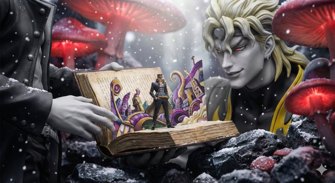
</div>

**提示词：**
```
{
  "structured_prompt_template": {
    "subject": "main giant character description (e.g., Dio Brando with blonde hair red eyes pale skin yellow-black outfit)",
    "action": "examines old open book",
    "book_content": "illustration shows [tiny character] in [outfit] [expression/pose] in colorful surreal miniature [scene] wonderland emerging from pages",
    "hands": "giant hands holding book",
    "contrast": "scale contrast giant [main character] vs tiny [tiny character] world",
    "atmosphere": "magical atmosphere, snow-covered ground, fantastical plants glowing mushrooms",
    "style_base": "monochrome, limited_palette, black red white gray, selective color on [key accents]",
    "photography": "photo, selective focus, miniaturization, bokeh, high detail, vivid, perspective control, tilt lens, macro photography",
    "weights": "charming:1.3, bright:1.2, oversized plants:1.1",
    "mood": "mysterious magical vibrant, shimmering light, dreamy whimsical serene, soft focus, extremely detailed",
    "elements": "rocks, [expression], side view, floating hair, falling snowflakes, snowdrifts, oversized mushrooms",
    "quality": "masterpiece, best quality, intricate details, cinematic lighting, surreal composition"
  },
  "example_filled": {
    "subject": "Dio Brando with blonde hair red eyes pale skin yellow-black outfit",
    "action": "examines old open book",
    "book_content": "illustration shows young Jotaro Kujo in classic school uniform with hat chain serious expression standing confidently in colorful surreal miniature JoJo city wonderland emerging from pages",
    "hands": "giant hands holding book",
    "contrast": "scale contrast giant Dio Brando vs tiny illustrated Jotaro Kujo world",
    "atmosphere": "magical atmosphere, snow-covered ground, fantastical plants glowing red mushrooms",
    "style_base": "monochrome, limited_palette, black red white gray, selective color on red eyes and some accents",
    "photography": "photo, selective focus, miniaturization, bokeh, high detail, vivid, perspective control, tilt lens, macro photography",
    "weights": "charming:1.3, bright:1.2, oversized plants:1.1",
    "mood": "mysterious magical vibrant, shimmering light, dreamy whimsical serene, soft focus, extremely detailed",
    "elements": "rocks, subtle arrogant smile, side view, floating hair, falling snowflakes, snowdrifts, oversized mushrooms",
    "quality": "masterpiece, best quality, intricate details, cinematic lighting, surreal composition"
  },
  "final_prompt_order": [
    "style_base",
    "photography",
    "weights",
    "mood",
    "elements",
    "subject",
    "action",
    "book_content",
    "hands",
    "contrast",
    "atmosphere",
    "quality"
  ]
}
```

**中文提示词：**
```
{
"structured_prompt_template": {
“主题”：“主要巨人角色描述（例如，金发红眼的迪奥·布兰度，皮肤苍白，身穿黄黑色服装）”，
“行动”：“查看旧的打开的书”，
"book_content": "插图展示了[小人物]身着[服装][表情/姿势]，置身于从书页中浮现的色彩斑斓、超现实的微缩[场景]仙境中。"
“手”： “拿着书的巨手”，
“对比”：“规模对比：巨大的[主角]世界与微小的[小角色]世界”，
“氛围”：“神奇的氛围，白雪皑皑的地面，奇幻的植物和发光的蘑菇”，
"style_base": "单色，有限调色板，黑色红色白色灰色，[关键强调色]选择性着色",
“摄影”: “照片、选择性对焦、微缩化、散景、高细节、生动、透视控制、倾斜镜头、微距摄影”
“权重”：“迷人：1.3，明亮：1.2，超大植物：1.1”，
“氛围”：“神秘、神奇、充满活力、闪烁的光芒、梦幻、奇幻、宁静、柔焦、极其细致”，
“元素”：“岩石、[表情]、侧视图、飘动的头发、飘落的雪花、雪堆、超大的蘑菇”，
“品质”：“杰作，最佳品质，精细的细节，电影般的灯光，超现实的构图”
},
"example_filled": {
“主题”：“迪奥·布兰度，金发红眼，皮肤苍白，身着黄黑色服装”，
“行动”：“查看旧的打开的书”，
“book_content”：“插图展现了年轻的空条承太郎身穿经典校服，头戴帽子链，表情严肃，自信地站在色彩斑斓、超现实的微型JoJo城市仙境中，该仙境从书页中浮现出来。”
“手”： “拿着书的巨手”，
"contrast": "规模对比巨人迪奥·白兰度 vs 小插图九条承太郎的世界",
“氛围”：“神奇的氛围，白雪皑皑的地面，奇幻的植物和闪闪发光的红色蘑菇”，
"style_base": "单色，有限调色板，黑色红色白色灰色，选择性地为红色眼睛和一些点缀色",
“摄影”: “照片、选择性对焦、微缩化、散景、高细节、生动、透视控制、倾斜镜头、微距摄影”
“权重”：“迷人：1.3，明亮：1.2，超大植物：1.1”，
“氛围”：“神秘、神奇、充满活力、闪烁的光芒、梦幻、奇幻、宁静、柔焦、极其细致”，
“元素”：“岩石、略带傲慢的微笑、侧脸、飘动的头发、飘落的雪花、雪堆、巨大的蘑菇”，
“品质”：“杰作，最佳品质，精细的细节，电影般的灯光，超现实的构图”
},
"final_prompt_order": [
"style_base",
“摄影”，
“重量”，
“情绪”，
“元素”，
“主题”，
“行动”，
"book_content",
“手”，
“对比”，
“气氛”，
“质量”
]
}
```

<a id="prompt-1095"></a>
## 案例 1095：一张超写实的影棚照片 (来源 [@iamsofiaijaz](https://x.com/iamsofiaijaz/status/2008434033701879836)) 模型：Nano banana pro

<div style="display: flex; justify-content: space-between;">
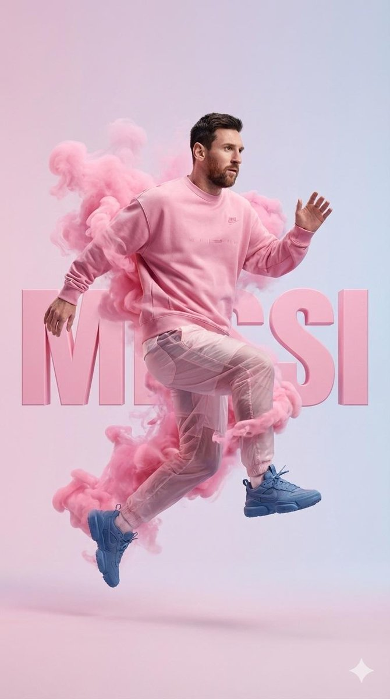
</div>

**提示词：**
```
A hyper-realistic studio photograph of a male athlete mid-air as if running or jumping, wearing a pastel pink sweatshirt and light pink jogger pants, with soft blue sneakers. Pink powder smoke is exploding and swirling around his body, especially behind him and around his legs, creating a dynamic motion effect. Clean minimal background with a soft gradient from light gray to pale pink. Cinematic lighting, ultra-sharp focus, shallow depth of field, fashion advertising style, high detail, 8k, soft shadows, professional studio photography.
```

**中文提示词：**
```
这是一张超写实的影棚照片，一位男性运动员身穿粉色运动衫和浅粉色运动裤，脚穿浅蓝色运动鞋，在空中仿佛奔跑或跳跃一般。粉色粉末烟雾在他周围爆炸并旋转，尤其是在他的身后和腿部周围，营造出动感十足的动态效果。背景简洁干净，由浅灰色柔和地过渡到淡粉色。照片采用电影级灯光、超清晰对焦、浅景深，风格时尚广告，细节丰富，8K分辨率，阴影柔和，展现出专业的影棚摄影水准。
```

<a id="prompt-1094"></a>
## 案例 1094：立体光影人像与叠层的视觉碰撞 (来源 [@Arminn_Ai](https://x.com/Arminn_Ai/status/2008251441018810640)) 模型：Nano banana pro

<div style="display: flex; justify-content: space-between;">
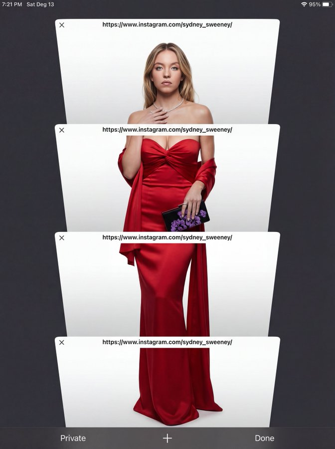
</div>

**提示词：**
```
Subject Reference: A full-body portrait of [INSERT SUBJECT NAME].
Scene Description: A full-body, centered portrait of the subject [INSERT POSE DESCRIPTION]. The subject has [INSERT EXPRESSION], staring directly at the camera. The immediate background behind the subject is a [INSERT BACKGROUND TYPE, e.g., seamless, pure high-key white studio backdrop]. Crucially, the subject is lit with volumetric studio lighting that creates deep definitions, realistic shadows, and a strong 3D quality on her body and the folds of the outfit, distinguishing her sharply from the flat background without casting shadows on the floor.

CRITICAL DETAIL (UI Layer): The entire photographic image is digitally layered beneath a simulated mobile phone browser interface overlay. Four distinct, clean, white, rectangular browser window elements are stacked vertically and angled slightly, segmenting the subject. Each window bar contains the sharp text '[INSERT LINK OR TEXT HERE]'. The area outside the active white browser windows is a solid, uniform, dark charcoal gray/black matte UI frame, with absolutely no light bleed or color gradients.

Style: Hybrid Composition: A highly realistic, three-dimensional studio photograph with deep color depth, overlaid with flat, clean digital graphics. Lighting Quality: Specific volumetric studio lighting focused ONLY on the subject. Soft, directional light from slightly off-center to sculpt the body and the rich texture of the fabric, creating depth. The background must remain completely flat.

Color Palette: High contrast. [INSERT OUTFIT COLOR] outfit against [INSERT BACKGROUND COLOR] backdrop, framed by the dark matte gray UI.

Texture and Mood: Realistic skin and rich fabric texture contrasting with the smooth digital elements of the UI. Intentional inclusion of subtle digital noise/grain to mimic a screen capture. Full body, centered portrait. Ensure the head and feet are fully within the frame before segmentation. Angle: Straight eye-level view, perpendicular to the subject.

Framing Elements: Four overlapping, white browser windows/tabs. The pose is elegant and fluid. The bottom interface elements (e.g., 'Private', 'Done') must be clean and visible. Focal Length: Standard portrait lens (approx. 50mm equivalent) for realistic proportions.

Camera Type: Simulated high-quality smartphone screen capture of a professional photo. Depth of Field: Shallow enough to focus sharply on the subject, allowing the background to be soft. Post Processing: Clean digital segmentation. Contrast adjusted to enhance depth.

Avoid Keywords: Floor shadows, flat lighting, 2D look, inconsistent UI color, bleeding colors, HDR, oversharpened. Location: Simulated E-commerce studio ([INSERT BACKGROUND TYPE]).
```

**中文提示词：**
```
主题参考：[插入人物姓名]的全身肖像。
场景描述：一张全身居中肖像照，拍摄对象为[插入姿势描述]。拍摄对象[插入表情]，直视镜头。拍摄对象身后的背景是[插入背景类型，例如：无缝纯白色高调影棚背景]。关键在于，拍摄对象使用了立体感强的影棚灯光，营造出丰富的层次感、逼真的阴影以及强烈的立体感，使人物与平坦的背景形成鲜明对比，且不会在地面投下阴影。

关键细节（用户界面层）：整张照片以数字方式叠加在模拟的手机浏览器界面之上。四个清晰的白色矩形浏览器窗口垂直堆叠并略微倾斜，将拍摄对象分割开来。每个窗口的边框上都清晰地显示着“[在此处插入链接或文本]”。活动白色浏览器窗口之外的区域是一个纯色、均匀的深炭灰色/黑色哑光用户界面边框，完全没有光线溢出或颜色渐变。

风格：混合构图：高度逼真、立体感强的影棚照片，色彩饱满，叠加简洁的平面数字图像。光线：采用特定的立体感影棚灯光，仅聚焦于拍摄对象。柔和的定向光从略微偏离中心的位置照射，勾勒出人物的体态和织物丰富的纹理，营造出景深。背景必须保持完全平坦。

配色方案：高对比度。[插入服装颜色]服装搭配[插入​​背景颜色]背景，并以深哑光灰色用户界面为框。

质感与氛围：逼真的皮肤和丰富的织物纹理与光滑的UI数字元素形成对比。特意添加细微的数字噪点/颗粒感，以模拟屏幕截图的效果。全身居中肖像。分割前请确保头部和脚部完全位于画面内。角度：平视视角，垂直于拍摄对象。

构图元素：四个重叠的白色浏览器窗口/标签页。姿势优雅流畅。底部界面元素（例如“隐私”、“完成”）必须清晰可见。焦距：标准人像镜头（约 50mm 等效焦距），以呈现真实的比例。

相机类型：模拟高品质智能手机屏幕截图，呈现专业照片效果。景深：足够浅，可清晰对焦主体，同时虚化背景。后期处理：清晰的数字分割。调整对比度以增强景深。

避免使用的关键词：地板阴影、平面照明、2D 外观、不一致的 UI 颜色、颜色溢出、HDR、过度锐化。位置：模拟电子商务工作室([插入背景类型])
```

<a id="prompt-1093"></a>
## 案例 1093：女性在阳光洒满的复古咖啡馆里 (来源 [@BubbleBrain](https://x.com/BubbleBrain/status/2008376050435166528)) 模型：Nano banana pro

<div style="display: flex; justify-content: space-between;">
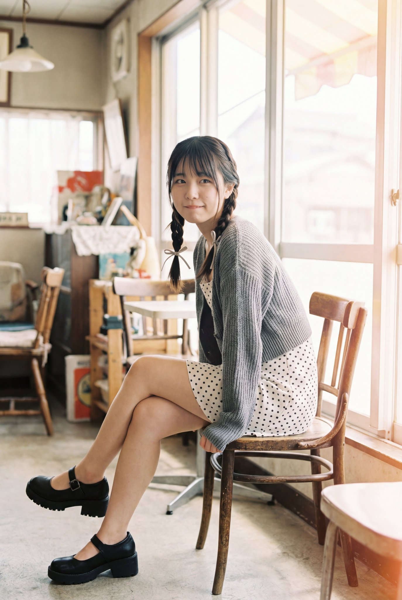
</div>

**提示词：**
```
Analog 35mm film photography, Fujifilm NC simulation style with heavy grain. A candid portrait of a young Japanese woman embodying a pure yet sexy allure (pure desire aesthetic) in a sunlight-drenched retro cafe. She has dark hair in twin braids with ribbons. She wears the opened gray cropped cardigan bolero over the short white mini dress with black polka dots. Her pose is coy and alluring: sitting sideways on a wooden chair with her legs crossed dynamically, highlighting her chunky black Mary Jane shoes. She twists her upper body to look back over her shoulder at the camera with a shy, enticing glance, gently biting her lower lip. The image features significant overexposure, creating dreamy blown-out highlights from a large window, washed-out pastel tones, light leaks, and a nostalgic, high-noise film texture.
```

**中文提示词：**
```
这是一张采用富士NC模拟风格拍摄的35mm胶片照片，颗粒感较重。照片中，一位年轻的日本女性在阳光洒满的复古咖啡馆里，展现出一种纯真而性感的魅力（纯粹的欲望美学）。她深色的头发编成两条辫子，并用丝带固定。她身穿一件敞开的灰色短款开襟羊毛衫，内搭一件饰有黑色波点的白色迷你连衣裙。她的姿势既娇羞又迷人：侧身坐在木椅上，双腿交叠，凸显出她脚上的黑色厚底玛丽珍鞋。她扭动上半身，回眸看向镜头，眼神羞涩而诱人，轻轻咬着下唇。照片采用明显的过曝处理，营造出透过大窗户透出的梦幻般的过曝高光、柔和的粉彩色调、漏光以及怀旧的高噪点胶片质感。
```

<a id="prompt-1092"></a>
## 案例 1092：治愈系黏土微缩世界 (来源 [@0x00_Krypt](https://x.com/0x00_Krypt/status/2008345655618793843)) 模型：Nano banana pro

<div style="display: flex; justify-content: space-between;">
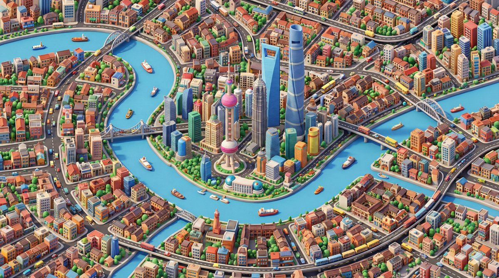
</div>

**提示词：**
```
Isometric illustration, huge map of {CITY_NAME}, wide angle aerial view, claymorphism style, toy-like miniature world. 

CENTER: Iconic landmarks of {CITY_NAME} rendered in exaggerated scale, positioned prominently to define the city center.

GEOGRAPHY: The city's main geographic structure (such as a winding river, a coastline, or a major highway system) cutting through the composition to create visual flow.

SURROUNDINGS: Extremely dense cityscape, hundreds of tiny colorful residential buildings, complex winding roads, busy traffic with tiny toy cars.

ATMOSPHERE: Vibrant high saturation colors, cute, playful, rich details, crowded composition, soft smooth textures, ambient occlusion shadows, sunny daylight. 

--ar 16:9 --stylize 400
```

**中文提示词：**
```
等轴测插画，{城市名称} 大幅地图，广角鸟瞰视角，黏土拟物风格，玩具质感的微缩世界。
中心区域：以夸张比例绘制 {城市名称} 的标志性地标，醒目排布以界定城市核心位置。
地理布局：融入城市核心地理结构（如蜿蜒河流、海岸线或主干道系统），贯穿画面以营造视觉动线。
周边环境：极致密集的城市景观，数以百计色彩缤纷的迷你民居建筑，复杂蜿蜒的道路网络，点缀穿梭其中的玩具质感小车，呈现繁忙交通景象。
氛围设定：高饱和度明快色彩，整体风格可爱活泼，细节丰富饱满，构图紧凑充实，质感柔和顺滑，搭配环境闭塞阴影，呈现晴朗白昼的明亮效果。
-- 画面比例 16:9 -- 风格化强度 400
```

<a id="prompt-1091"></a>
## 案例 1091：度假酒馆的胶片瞬间 (来源 [@sidona](https://x.com/sidona/status/2008365364925624489)) 模型：Nano banana pro

<div style="display: flex; justify-content: space-between;">
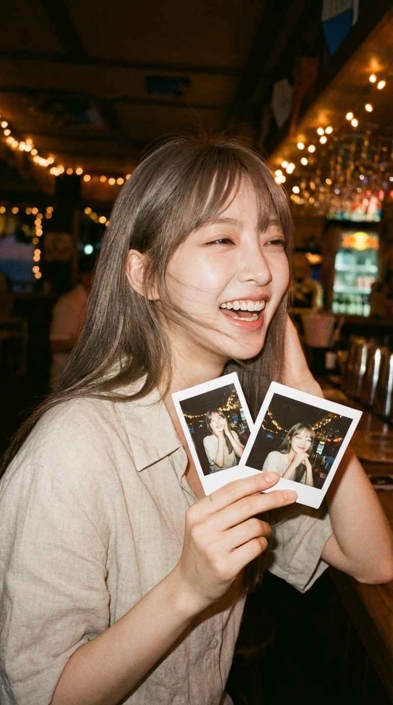
</div>

**提示词：**
```
{
  "prompt": {
    "goal": "Use the uploaded person as the only subject. Create an ultra-photorealistic vacation-bar scene where she is holding two Polaroid instant photos of herself, laughing happily. Cozy, relaxed, warm, personal. Strong Fuji film / Fujifilm color vibe.",
    "identity_lock": {
      "use_uploaded_person": true,
      "same_face_same_body": "STRICT",
      "no_extra_people": true,
      "no_face_morphing": true
    },
    "subject": {
      "count": 1,
      "description": "The uploaded young woman, fully human, natural anatomy and skin texture.",
      "wardrobe": {
        "style": "vacation casual-chic",
        "options": [
          "light linen shirt slightly open over a simple camisole",
          "sleek black tank top with a thin chain necklace",
          "summer dress with subtle texture (no loud patterns)"
        ],
        "avoid": ["overly glam red-carpet styling", "anime / doll look"]
      },
      "expression_and_action": {
        "main_emotion": "genuine happy laughter, eyes slightly squinted, cheeks lifted, very candid and warm",
        "pose": "She holds two Polaroid instant prints close to her chest with both hands, angled toward the camera. One Polaroid slightly higher than the other, casual overlap.",
        "micro_gestures": [
          "one shoulder slightly raised in a playful, shy joy",
          "head tilted a bit, as if reacting to a friend behind the camera",
          "fingers lightly gripping the Polaroid edges, nails natural"
        ],
        "gaze": "She looks at the camera like it’s a friend taking the photo."
      },
      "polaroid_props": {
        "count": 2,
        "content": "Each Polaroid shows the same uploaded woman (strict identity). Both are candid vacation moments, not studio portraits.",
        "details": [
          "classic white Polaroid borders with slight wear, tiny corner bends",
          "subtle fingerprints and gloss reflections on the Polaroid surface",
          "no readable text, no random letters"
        ],
        "variation_between_two": [
          "Polaroid A: she is smiling softly with a drink in hand",
          "Polaroid B: she is mid-laugh with wind-touched hair"
        ]
      }
    },
    "environment": {
      "scene": "a cozy vacation bar lounge (tropical resort or rooftop beach bar)",
      "background_elements": [
        "warm wooden bar counter or rattan furniture",
        "soft bokeh string lights",
        "blurred bottles and glassware far behind",
        "a hint of ocean/skyline through a window (very subtle)"
      ],
      "human_traces": [
        "condensation ring on the table",
        "a half-finished cocktail nearby (optional, subtle)",
        "a folded linen napkin and a small menu card (no readable text)"
      ],
      "avoid": [
        "crowded bar",
        "busy signage",
        "obvious brand logos",
        "text-heavy menus"
      ]
    },
    "composition": {
      "orientation": "vertical portrait (3:4)",
      "framing": "medium shot (waist-up), subject centered, hands and both Polaroids clearly visible",
      "depth": "shallow depth of field, background creamy bokeh, face and Polaroids tack-sharp",
      "story_feel": "like a friend captured a perfect candid moment"
    },
    "lighting": {
      "global_light": "soft warm ambient bar lighting + gentle golden-hour fill (cozy, flattering)",
      "flash_logic": "subtle on-camera flash pop to create that candid snapshot vibe, but not harsh",
      "polaroid_inner_light": "inside the Polaroid images, a slightly stronger direct flash look (photo-within-photo realism)",
      "shadows": "soft, natural shadows with warm highlights"
    },
    "color_and_film": {
      "fuji_vibe": "Fujifilm color science, nostalgic film tones, soft highlight roll-off",
      "look": [
        "Fuji Classic Chrome mood",
        "or Fuji Pro 400H pastel warmth",
        "or Fuji Superia-style gentle greens and warm skin"
      ],
      "texture": "fine film grain, slight halation on highlights, natural skin tones (no plastic skin)"
    },
    "camera_details": {
      "style": "ultra photorealistic fashion-candid photography",
      "lens": "35mm or 50mm look",
      "aperture": "f/1.8 - f/2.8",
      "focus_priority": "eyes and Polaroid prints sharp, everything else softly blurred",
      "quality": "high detail, realistic reflections, true-to-life proportions"
    },
    "negative_constraints": [
      "no extra fingers",
      "no warped hands",
      "no duplicated faces",
      "no weird text",
      "no illustration / anime / doll",
      "no over-smoothing skin",
      "no distorted Polaroid borders"
    ]

  }
}
```

**中文提示词：**
```
{
“提示词”： {
“目标”：“以上传的人物照片为唯一主体。创作一个超写实的度假酒吧场景，照片中她手持两张自己的宝丽来即时照片，笑容灿烂。营造温馨、轻松、温暖、个性化的氛围。强烈的富士胶片/富士胶片色彩风格。”
"identity_lock": {
"use_uploaded_person": true,
"same_face_same_body": "严格",
"no_extra_people": true,
"no_face_morphing": true
},
“主题”： {
“计数”：1，
描述：上传的年轻女性，完全是人类，拥有自然的解剖结构和皮肤纹理。
“衣柜”： {
风格：度假休闲时尚
“选项”： [
“一件浅色亚麻衬衫微微敞开，里面是一件简单的吊带背心”，
“一件简洁的黑色背心，搭配一条细链项链”，
“质地柔和的夏季连衣裙（没有花哨的图案）”
],
避免：[“过于华丽的红毯造型”、“动漫/娃娃造型”]
},
"expression_and_action": {
“主要情绪”： “发自内心的快乐大笑，眼睛微微眯起，脸颊微微上扬，非常坦率和温暖”，
“姿势”：“她双手捧着两张宝丽来即时照片，贴近胸前，照片角度朝向镜头。一张照片略高于另一张，两张照片自然重叠。”
“微手势”：[
“一只肩膀微微抬起，带着一丝俏皮而羞涩的喜悦”，
“头微微歪着，好像在回应镜头后面的朋友”，
“手指轻轻捏着宝丽来相机的边缘，指甲自然垂落”
],
“凝视”：“她看着镜头，就像是朋友在给她拍照一样。”
},
"polaroid_props": {
“计数”：2，
“内容”：“每张宝丽来照片都显示的是同一位上传的女性（身份明确）。两张照片都是度假时的抓拍，并非影棚肖像照。”
“细节”： [
“经典的白色宝丽来相框边框略有磨损，边角有轻微弯曲”，
“宝丽来表面上的细微指纹和光泽反射”，
“没有可读文本，没有随机字母”
],
"variation_between_two": [
“宝丽来A：她手里拿着饮料，面带温柔的微笑。”
“宝丽来B：她开怀大笑，头发被风吹拂着”
]
}
},
“环境”： {
“场景”：“一个舒适的度假酒吧休息室（热带度假村或屋顶海滩酒吧）”，
“背景元素”：[
“温暖的木质吧台或藤制家具”，
“柔和散景串灯”，
“模糊的瓶子和玻璃器皿远远地”
透过窗户可以看到一丝海洋/天际线的景色（非常微妙）
],
"human_traces": [
“桌上的冷凝环”，
“附近有一杯喝了一半的鸡尾酒（可选，比较含蓄）”，
“一块折叠好的亚麻餐巾和一张小菜单（上面没有可辨认的文字）”
],
“避免”： [
“拥挤的酒吧”，
“繁忙指示牌”
“明显的品牌标识”，
“文字过多的菜单”
]
},
“作品”： {
“方向”: “竖屏（3:4）”
“构图”：“中景（腰部以上），主体居中，双手和两张宝丽来照片清晰可见”，
“景深”：“浅景深，背景柔和的散景，人脸和宝丽来照片清晰锐利”，
"story_feel": "就像朋友捕捉到的完美自然瞬间"
},
“灯光”： {
"global_light": "柔和温暖的酒吧氛围灯光 + 柔和的黄金时段补光（舒适、讨喜）",
"flash_logic": "微妙的机顶闪光灯，营造出那种抓拍的感觉，但又不会显得刺眼",
"polaroid_inner_light": "在宝丽来照片内部，呈现略强的直射闪光效果（照片中的照片真实感）",
“阴影”：“柔和自然的阴影，带有温暖的高光”
},
"color_and_film": {
"fuji_vibe": "富士胶片色彩科学，怀旧胶片色调，柔和的高光过渡",
“看”： [
“富士经典铬调”
“或者富士Pro 400H柔和暖色调”，
“或者富士山型柔和的绿色和温暖的肤色”
],
“质感”：“细腻的胶片颗粒，高光处略带光晕，自然的肤色（无塑料感皮肤）”
},
"camera_details": {
“风格”：“超写实时尚抓拍摄影”，
“镜头”：“35mm 或 50mm 视角”，
“光圈”: “f/1. 8 - f /2.8”
"focus_priority": "眼睛和宝丽来照片清晰，其他一切都柔和模糊",
“品质”：“细节丰富，反射逼真，比例真实”
},
"negative_constraints": [
“没有多余的手指”，
“没有扭曲的手”，
“没有重复的面孔”，
“没有奇怪的文本”，
“无插图/动漫/玩偶”，
“不会过度磨皮”，
“没有变形的宝丽来照片边缘”
]

}
}
```

<a id="prompt-1090"></a>
## 案例 1090：2D扁平卡通插画风格 (来源 [@VoxcatAI](https://x.com/VoxcatAI/status/2008405620773605849)) 模型：Nano banana pro

<div style="display: flex; justify-content: space-between;">
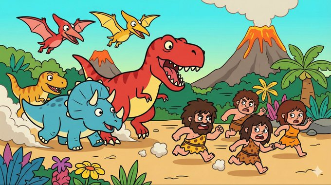
</div>

**中文提示词：**
```
(比例: 16:9)，[详细内容]。极具辨识度的2D扁平卡通插画风格，极粗的黑色轮廓线描边，手绘矢量感，Q版可爱人物造型，赛璐珞平涂上色（大色块，无渐变），高对比度配色。纯粹的插画作品，无任何游戏UI界面。
```

<a id="prompt-1089"></a>
## 案例 1089：从一块完全透明的有机玻璃板下方仰望 (来源 [@cfryant](https://x.com/cfryant/status/2008198858405462492)) 模型：Nano banana pro

<div style="display: flex; justify-content: space-between;">
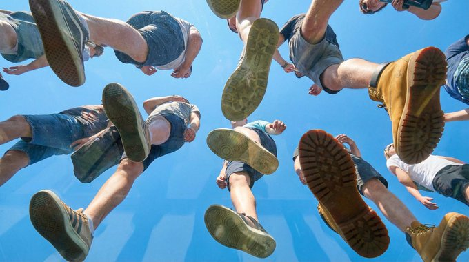
</div>

**提示词：**
```
View from under a plane of completely transparent plexiglass. We are looking straight up. Many people are walking on the plexiglass. In the background is a pure blue sky. No buildings visible. No edges or separations in the plexiglass. It’s as if the plexiglass isn’t even there. We are very close to the people. The people are in the process of walking. The people are walking generally from left to right. The soles of their shoes are very close to the foreground.
```

**中文提示词：**
```
从一块完全透明的有机玻璃板下方仰望。我们正对着上方。许多人在有机玻璃板上行走。背景是纯净的蓝天。看不到任何建筑物。有机玻璃板没有任何边缘或缝隙。仿佛它根本不存在。我们离这些人很近。他们正在行走。人们大致从左向右走。他们的鞋底几乎贴着前景。
```

<a id="prompt-1088"></a>
## 案例 1088：线织肖像 (来源 [@aleenaamiir](https://x.com/aleenaamiir/status/2008488506692366681)) 模型：Nano banana pro

<div style="display: flex; justify-content: space-between;">
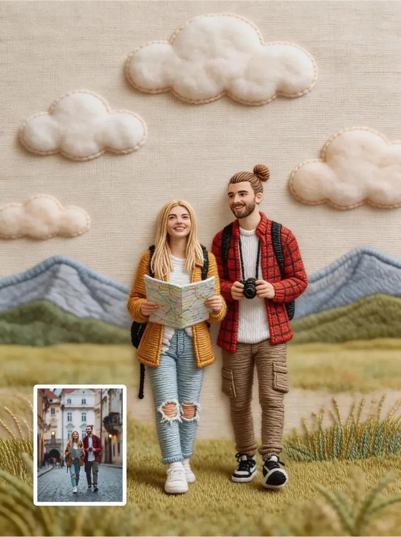
</div>

**提示词：**
```
Use the uploaded image as the strict character reference.
Preserve the character’s facial structure, expression, skin tone, hairstyle, outfit, proportions, and pose exactly as shown.

Do not modify, beautify, stylize, or reinterpret the face in any way beyond embroidery translation.
Render the character as hyper-detailed hand embroidery artwork, using realistic satin stitches, long-and-short stitches, and dense fill stitches to create natural depth, fabric texture, and thread sheen.

Visible embroidery threads, precise stitch direction following facial contours, smooth gradients formed through thread layering, high stitch density, museum-quality textile craftsmanship.

Neutral fabric background, soft studio lighting, ultra-sharp macro detail, photorealistic embroidery realism, no illustration or cartoon style.
```

**中文提示词：**
```
请使用上传的图片作为严格的角色参考。
完全按照图中所示保留角色的面部结构、表情、肤色、发型、服装、比例和姿势。

除了刺绣翻译之外，不得以任何方式修改、美化、风格化或重新诠释人脸。
将角色渲染成超精细的手工刺绣艺术品，使用逼真的缎纹针脚、长短针脚和密集的填充针脚来创造自然的深度、织物纹理和线迹光泽。

可见的绣线，精准的针脚方向贴合面部轮廓，通过线层叠成的平滑渐变，高密度的针脚，博物馆级别的纺织工艺。

中性布料背景，柔和的影棚灯光，超清晰的微距细节，逼真的刺绣效果，非插画或卡通风格。
```

<a id="prompt-1087"></a>
## 案例 1087：橙色超跑的都市天轨竞速 (来源 [@LewisAi_Lab](https://x.com/LewisAi_Lab/status/2008423171842879985)) 模型：Nano banana pro

<div style="display: flex; justify-content: space-between;">
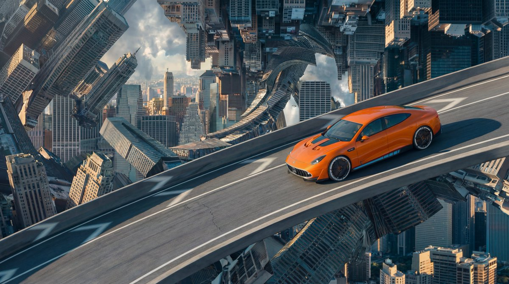
</div>

**提示词：**
```
{
  "subject": {
    "core": "bright orange low-profile streamlined sports car",
    "action_pose": "accelerating rapidly along a right-upward spiral arc, body slightly leaning forward, wheels showing motion blur"
  },
  "environment_set_design": {
    "overall_environment": "aerial spiral highway above New York City",
    "details_props": [
      {
        "object": "spiral asphalt suspended racetrack",
        "surface": "gray asphalt texture with white arrows and road markings",
        "position": "foreground extending diagonally to the right and upward"
      },
      {
        "object": "stationary skyscraper clusters",
        "arrangement": "vertically mirrored symmetrical layout along horizontal central axis, upper half inverted skyscrapers and blocks linked with lower half upright city buildings",
        "density": "dense geometric architectural blocks on both sides"
      }
    ]
  },
  "composition_camera": {
    "camera_angle": "high aerial top-down view",
    "composition_logic": "spiral highway and white guide lines form diagonal leading lines, main subject positioned at right golden ratio section",
    "shot_type_focal_length": "medium close-up, equivalent 35-50mm mid focal length",
    "focus_point": "front half of car body and front wheels, background buildings moderately blurred to emphasize subject"
  },
  "atmosphere_mood": {
    "overall_mood": "dynamic, tense, cinematic realism",
    "time_of_day": "morning",
    "weather_air": "clear sky, warm sunlight, no clouds"
  },
  "lighting_color": {
    "lighting_setup": "key light is direct sunlight from front-side, city buildings reflect natural fill light",
    "light_color": "natural daylight white with warm tint"
  },
  "photography_technical": {
    "aperture": "f/1.4",
    "camera": "ARRI ALEXA Plus",
    "lens": "Zeiss prime lens"
  },
  "art_style": {
    "reference": "Blade Runner 2049",
    "render_quality": "cinematic still frame archive style"
  },
  "color_grading": {
    "grading_strategy": "overall cool blue tone with warm golden highlights, shadows in charcoal gray to enhance contrast",
    "film_simulation_lut": "cinematic LUT with cool tones and neutral darks",
    "highlight_tone": "cool blue",
    "shadow_tone": "deep blue and charcoal gray",
    "saturation_contrast": "medium saturation overall, high contrast"
  },
  "negative_prompts": {
    "avoid": ["noise", "film grain", "clouds"]
  }
}
```

**中文提示词：**
```
{
“主题”： {
“核心”： “亮橙色低矮流线型跑车”，
"action_pose": "沿右上螺旋弧线快速加速，身体略微前倾，车轮呈现运动模糊"
},
"environment_set_design": {
"overall_envirent": "纽约市上空的螺旋形空中高速公路",
"details_props": [
{
“物体”：“螺旋沥青悬空赛道”，
“路面”: “灰色沥青纹理，带有白色箭头和道路标线”，
“位置”：“前景向右上方斜延伸”
},
{
“对象”：“静止的摩天大楼群”，
“布局”：“沿水平中心轴线垂直镜像对称布局，上半部分为倒置的摩天大楼和街区，下半部分为直立的城市建筑”，
“密度”：两侧密集的几何建筑体块
}
]
},
"composition_camera": {
"camera_angle": "高空俯视",
"构图逻辑": "螺旋形高速公路和白色引导线形成对角引导线，主体位于右侧黄金分割点",
"shot_type_focal_length": "中近景，等效焦距 35-50mm"
"focus_point": "车身前半部分和前轮，背景建筑物适度虚化以突出主体"
},
"atmosphere_mood": {
"overall_mood": "动态、紧张、电影般的现实主义",
"time_of_day": "早上",
"weather_air": "晴空万里，阳光温暖，无云"
},
"lighting_color": {
"lighting_setup": "主光源为来自正面的直射阳光，城市建筑反射自然补光",
"light_color": "带有暖色调的自然日光白"
},
"photography_technical": {
光圈：f/1.4，
“摄像机”： “ARRI ALEXA Plus”，
镜头：蔡司定焦镜头
},
"art_style": {
参考资料：《银翼杀手2049》
"render_quality": "电影级静帧存档风格"
},
"color_grading": {
“配色策略”：整体采用冷蓝色调，高光部分为暖金色，阴影部分为炭灰色以增强对比度。
"film_simulation_lut": "具有冷色调和中性暗部的电影风格 LUT",
"highlight_tone": "冷蓝色",
"shadow_tone": "深蓝色和炭灰色",
"saturation_contrast": "整体中等饱和度，高对比度"
},
"negative_prompts": {
避免：[“噪音”、“胶片颗粒”、“云”]
}
}
```

<a id="prompt-1086"></a>
## 案例 1086：红妆剪影金辉玉颜 (来源 [@ttmouse](https://x.com/ttmouse/status/2008273570175349157)) 模型：Nano banana pro

<div style="display: flex; justify-content: space-between;">

</div>

**中文提示词：**
```
1. 宏观风格与媒介
- 核心媒介: 高清商业人像摄影 (High-end Commercial Photography)
- 美学流派: 新中式美学 (New Chinese Style), 节日时尚大片

2. 主体与IP身份
- 核心主体: 年轻东亚女性侧颜特写 (Close-up profile of young Asian woman)
- IP/名人锁定: 穿着红色旗袍 (Red Cheongsam), 佩戴珍珠项链与红色花卉耳环

3. 世界逻辑与物理
- 物理法则: 真实光学投影 (Real optical projection), 面部光影贴合面部起伏
- 空间构成: 人眼平视视角 (Eye-level), 极近距离接触

4. 数据与信息层
- 文本提取: 无文本
- 品牌与符号: 红色剪纸艺术前景 (Red paper-cut art foreground) - 包含仙鹤、蝴蝶与牡丹纹样

5. 材质与纹理
- 核心材质: 超写实皮肤质感 (Hyper-realistic skin), 哑光卡纸 (Matte cardstock), 温润珍珠
- 触感细节: 逆光下可见的面部绒毛 (Visible vellus hair backlit), 次表面散射效果 (Subsurface scattering)

6. 光影与氛围
- 光照模型: Gobo投影布光 (Gobo lighting/Projected shadows) - 复杂的镂空花纹光影投射在人物面部
- 整体氛围: 金色暖阳侧逆光 (Warm golden hour light), 高饱和度喜庆红调, 梦幻且清晰

7. 技术参数
- 镜头与渲染: 85mm-100mm 微距镜头 (Macro lens), 浅景深 (Shallow depth of field), 前景虚化 (Bokeh foreground)
- 构图指令: 框式构图 (Framed composition), --ar 3:4
```

<a id="prompt-1085"></a>
## 案例 1085：一只性感小野猫 (来源 [@MANISH1027512](https://x.com/MANISH1027512/status/2008483784643969168)) 模型：Nano banana pro

<div style="display: flex; justify-content: space-between;">
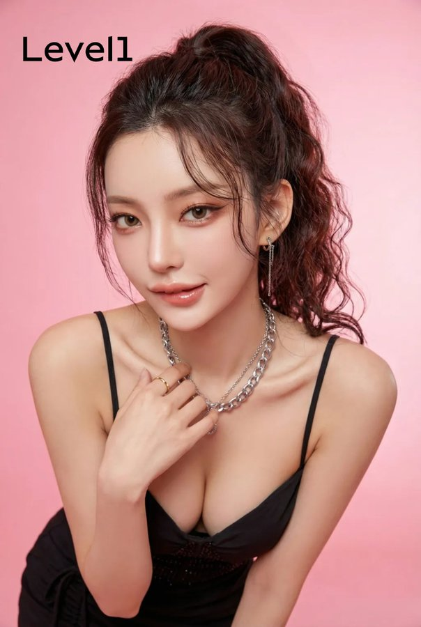
</div>

**提示词：**
```
Photorealistic edit using the input person photo as strict identity reference: keep the same face, facial features, skin tone, hairstyle (color/bangs/length/volume), outfit and accessories unchanged (no face swap, no new person, no hair/outfit change). Change only expression/pose/perspective/background. Light flirty expression: gentle eye contact, slightly raised brows, a subtle mischievous smirk, a soft barely-there lower-lip bite (not exaggerated). Vibe: teasing her boyfriend in a cute, tasteful way (not explicit). Pose: leaning forward toward the camera like a curious little wild kitty; close wide-angle (24–28mm) with mild foreground exaggeration; face in sharp focus. Replace background with a clean solid pink seamless studio backdrop (very subtle gradient ok). No explicit sexual content, no tongue out, no porn-like posing, no nudity escalation, no extra fingers, no deformed limbs, no text/watermark/frame.
```

**中文提示词：**
```
以输入人像照片为严格身份基准进行写实风格编辑：保持面部、五官、肤色、发型（颜色 / 刘海 / 长度 / 发量）、服饰及配饰完全不变（禁止换脸、禁止替换人物、禁止修改发型与服饰）。仅调整表情 / 姿势 / 视角 / 背景。
表情要求轻快撩人：眼神轻柔对视，眉峰微扬，嘴角勾起一抹狡黠的浅笑，下唇轻咬（幅度极淡，避免夸张）。
氛围设定：以可爱又得体的方式调侃男友（不含露骨内容）。
姿势设计：身体前倾朝向镜头，宛如一只充满好奇心的小野猫；采用 24–28mm 焦段的近距离广角拍摄，搭配轻微的前景畸变效果；面部保持清晰锐利的对焦。
背景替换为纯净纯色的粉色无缝影棚背景布（允许添加极淡的渐变效果）。
禁止出现露骨色情内容、禁止吐舌、禁止模仿色情片姿势、禁止暴露身体部位、禁止手指数量异常、禁止肢体畸形、禁止添加文字 / 水印 / 画框。
```

<a id="prompt-1084"></a>
## 案例 1084：高端香水广告模板 (来源 [@0xbisc](https://x.com/0xbisc/status/2008098771381690572)) 模型：Nano banana pro

<div style="display: flex; justify-content: space-between;">
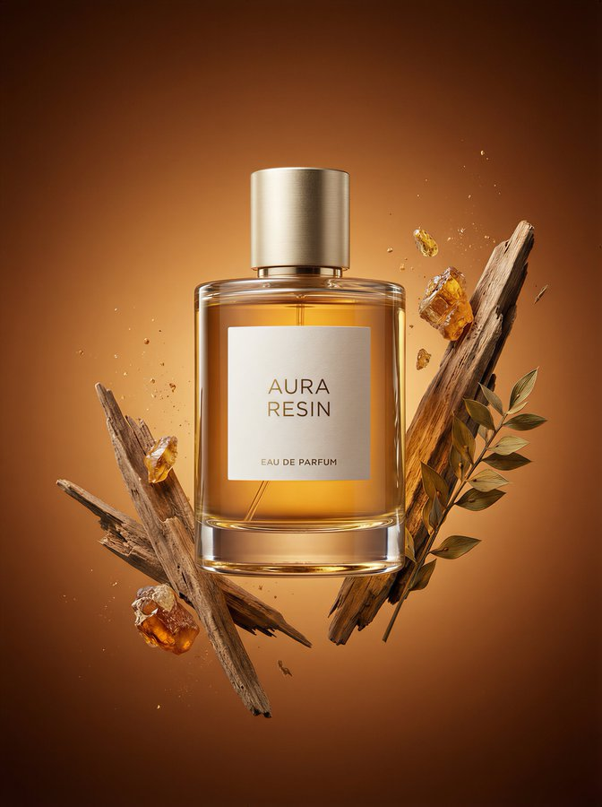
</div>

**提示词：**
```
{
  "scent_profile": "Floral",

  "prompt": "Ultra high-end luxury perfume campaign image for a world-class prestige fragrance. A premium rectangular perfume bottle with perfectly balanced proportions typical of iconic global luxury brands, refined, substantial, and timeless, never tall, never slender, never vial-like. The bottle is crafted from thick, heavy, crystal-clear glass with softly rounded edges, visible weight, optical depth, and precise craftsmanship, filled with luminous liquid appropriate to a high-end perfume. A minimal ivory or warm off-white label is centered on the bottle, featuring ultra-clean modern sans-serif typography, extremely sparse text, and confident negative space. The cap is a champagne-gold or pale-gold brushed metal cylinder with precise machining and subtle, controlled reflections. The bottle floats calmly in space with quiet authority and confidence. Surrounding the bottle are exactly three distinct types of scent-related visual elements autonomously selected by the AI based on the provided scent_profile. These three element types represent different dimensions of the fragrance family, such as structural material forms, botanical or organic references, and atmospheric or sensory effects. All elements originate from the broader natural, botanical, and material context of the scent profile as understood in high-end perfumery. The elements are abstracted, symbolic, refined, and art-directed, never literal, never illustrative, never decorative. The elements are positioned close to and partially embracing the bottle, following its silhouette and contours rather than floating freely in space, creating a sense of attachment and intentional interaction with the product. The elements gently overlap the bottle edges in places, while maintaining clarity of the label and overall form. Spacing is controlled and elegant, with no bulky masses and no excessive gaps, forming a cohesive sculptural arrangement designed around the bottle. The background is a rich, noble, scent-matched tonal gradient with depth and luminosity, not dark or gloomy, but dense and refined. The background color harmonizes with the scent_profile. The background maintains medium-to-high brightness with elevated color density, subtle light falloff, and a refined vignette that enhances contrast without heaviness. Lighting is museum-quality studio lighting with a controlled warm key light, soft sculpting fill, and a precise rim light defining the bottle edges against the noble background. Glass refraction and reflections are perfect and premium, with no harsh highlights. Depth of field is moderate: the bottle and label are razor sharp, while decorative elements soften subtly with depth but remain clearly articulated. The overall mood is iconic, restrained, confident, luxurious, and unmistakably expensive, resembling a flagship global luxury perfume campaign.",

  "negative_prompt": "pure white background, dull gray background, muddy brown, overly dark background, gloomy lighting, flat background, e-commerce lighting, floating decorations detached from the bottle, scattered elements, bulky clusters, cheap, low-end, mass-market, indie look, playful mood, cartoon style, plastic materials, thin glass, lightweight bottle, sample bottle, vial, test tube, fashion vial, visible branding text, logos, watermarks, noise, grain, oversharpening, blown highlights, distorted glass, warped label, fisheye perspective, people, hands, extra objects",

  "aspect_ratio": "3:4",
  "quality": "ultra high detail, photorealistic, luxury commercial retouching",
  "style": "iconic luxury perfume photography, global prestige brand, cinematic, timeless, haute parfumerie"
}
```

**中文提示词：**
```
{
"scent_profile": "花香",

“提示”：这是一张超高端奢华香水广告宣传图，展现了世界级尊贵香氛的魅力。香水瓶身采用高级矩形设计，比例完美平衡，彰显全球标志性奢侈品牌的经典气质，精致、厚重、永恒，绝非纤细修长，也绝非小瓶状。瓶身由厚重、晶莹剔透的玻璃打造而成，边缘圆润柔和，质感十足，视觉深度和精湛工艺尽显匠心。瓶内盛装着与高端香水相得益彰的晶莹液体。瓶身中央饰以简约的象牙色或暖米白色标签，采用简洁现代的无衬线字体，文字极简，留白恰到好处。瓶盖为香槟金或浅金色拉丝金属圆柱体，做工精细，光泽柔和。香水瓶仿佛悬浮于空间之中，散发着沉稳的气场和自信。环绕瓶身的是三种不同的与香氛相关的视觉元素，由人工智能根据提供的香氛配置文件自动选择。这三种元素分别代表了香水家族的不同维度，例如结构……材质形态、植物或有机元素，以及氛围或感官效果。所有元素均源自高端香水领域对香氛特征更广泛的自然、植物和材质语境的理解。这些元素经过抽象化、象征化、精致化和艺术化处理，绝非写实、插图式或装饰性的。它们紧贴瓶身，部分环绕瓶身，贴合其轮廓和线条，而非自由漂浮于空间，从而营造出一种与产品紧密相连、互动交流的感受。元素在某些地方轻柔地覆盖瓶身边缘，同时保持标签和整体造型的清晰度。间距控制得当，优雅流畅，没有笨重的块状结构，也没有过多的缝隙，形成围绕瓶身设计的和谐雕塑般的布局。背景采用与香氛相匹配的丰富、高贵的色调渐变，兼具深度和光泽，而非阴暗或沉闷，而是浓郁而精致。背景色与香氛特征和谐统一。背景保持中高亮度，色彩密度高，光线衰减自然，并呈现出精致的暗角效果。增强对比度而不显厚重。灯光采用博物馆级别的摄影棚灯光，主光温暖可控，辅以柔和的塑形光和精准的轮廓光，勾勒出瓶身边缘，与高贵的背景形成鲜明对比。玻璃的折射和反射完美而高级，没有刺眼的高光。景深适中：瓶身和标签清晰锐利，装饰元素随着景深略微柔化，但依然清晰可辨。整体氛围经典、内敛、自信、奢华，且价格不菲，宛如一款全球旗舰级奢侈香水广告大片。

"negative_prompt": "纯白色背景、暗灰色背景、浑浊的棕色、过暗的背景、昏暗的灯光、扁平的背景、电商灯光、与瓶子分离的漂浮装饰、散落的元素、笨重的簇状物、廉价、低端、大众市场、独立风格、俏皮的氛围、卡通风格、塑料材质、薄玻璃、轻质瓶子、样品瓶、小瓶、试管、时尚小瓶、可见的品牌文字、标志、水印、噪点、颗粒、过度锐化、高光溢出、扭曲的玻璃、变形的标签、鱼眼透视、人物、手、多余的物体",

"aspect_ratio": "3:4",
“品质”：“超高细节、照片级逼真、高端商业修图”，
“风格”： “标志性的奢华香水摄影，全球知名品牌，电影般的，永恒的，高级香水”
}
```

<a id="prompt-1083"></a>
## 案例 1083：卧室微光里的慵懒瞬间 (来源 [@SimplyAnnisa](https://x.com/SimplyAnnisa/status/2007876757119287381)) 模型：Nano banana pro

<div style="display: flex; justify-content: space-between;">
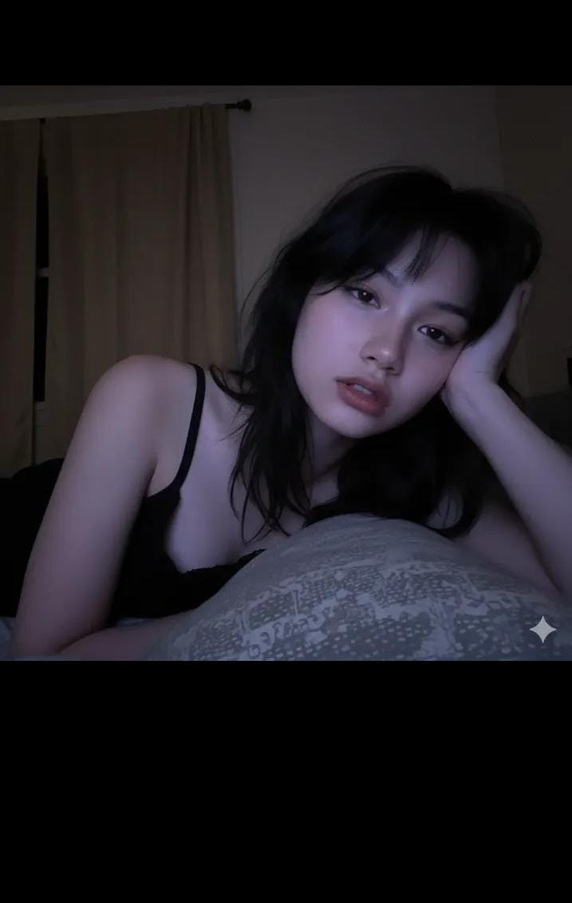
</div>

**提示词：**
```
Vertical, realistic low-light phone selfie in a dim bedroom at night. Same face as reference (no changes). Cool bluish-purple screen glow lighting on a pale face; background mostly dark with beige blackout curtains on the left. Sleepy, cozy, late-night lo-fi vibe.
Close-up, slightly low angle. Subject lying on stomach, propped on a grey pillow with subtle pattern. Messy black bedhead hair with wispy bangs. Soft, dreamy/blank stare, mouth slightly open. Hand near face, index finger touching lowerlip.
Wearing a black sleeveless camisole; thin lace strap visible, left shoulder bare. Soft focus, visible grain/noise, high contrast between lit face and dark background.
Negative Prompt:
bright daylight, sunshine, studio/flash lighting, warm/orange tones, outdoor, sharp focus, professional camera, 4k clean, smooth skin, heavy makeup, cartoon, anime, 3D render, deformed hands, extra/missing fingers, out-of-focus face.
```

**中文提示词：**
```
夜晚昏暗的卧室里，用手机拍摄的竖屏低光自拍。脸部与参考图相同（未做任何修改）。苍白的脸上泛着冷调的蓝紫色屏幕光晕；背景以深色为主，左侧是米色遮光窗帘。营造出一种慵懒、舒适、深夜的低保真氛围。
特写镜头，略低角度。人物俯卧，枕在带有细微纹路的灰色枕头上。凌乱的黑色头发，刘海稀疏。眼神柔和，略带梦幻/空洞，嘴唇微张。一只手放在脸旁，食指轻触下唇。
身穿黑色无袖吊带背心；细蕾丝肩带清晰可见，左肩裸露。柔焦效果，可见颗粒/噪点，面部光线充足，背景较暗，对比度高。
否定提示：
明亮的日光、阳光、影棚/闪光灯照明、暖色调/橙色调、户外、清晰对焦、专业相机、4K 清晰、光滑的皮肤、浓妆、卡通、动漫、3D 渲染、变形的手、多余的/缺失的手指、失焦的脸。
```

<a id="prompt-1082"></a>
## 案例 1082：黑白九宫格黑衣男子的多面情绪肖像 (来源 [@rovvmut_](https://x.com/rovvmut_/status/2008025334600564817)) 模型：Nano banana pro

<div style="display: flex; justify-content: space-between;">
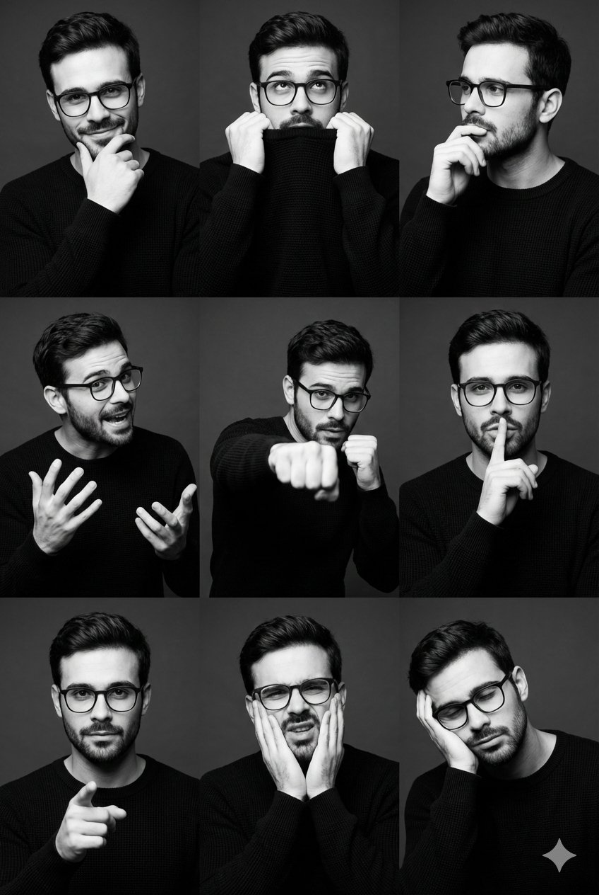
</div>

**提示词：**
```
{
"image_type": "studio portrait collage",
"layout": {
"structure": "3x3 grid",
"aspect ratio": "2:3",
"orientation": "vertical",
"spacing": "even margins between frames",
"consistency": "same subject and styling across all frames"
},
"subject": {
"count": 1,
"gender_presentation": "male",
"age_range": "late 20s to early 30s",
"ethnicity": "unclear / ambiguous",
"build": "athletic, lean",
"hair": {
"color": "dark brown",
"style": "short sides with voluminous swept-back top",
"texture": "smooth with natural wave"
},
"facial_hair": {
"type": "light stubble",
"density": "low to medium"
},
"wardrobe": {
"top": "long-sleeve knit sweater",
"color": "black",
"fit": "slim fit",
"texture": "fine ribbed or waffle knit"
}
},
"expressions_and_poses": [
"smirking with hand on chin",
"pulling sweater collar to mouth",
"thoughtful side gaze with hand near lips",
"animated mid-gesture with expressive hands",
"boxing/fist-forward dynamic pose",
"finger-to-lips 'shh' gesture",
"direct gaze with pointing finger",
"mock pain or exaggerated discomfort expression",
"head resting on hand, fatigued or bored"
],
"composition": {
"framing": "medium close-up to medium shot",
"camera_angle": "eye-level",
"cropping": "consistent head-and-torso framing",
"negative_space": "minimal, subject-centered"
},
"lighting": {
"style": "studio",
"setup": "single key light with soft fill",
"direction": "front-left dominant",
"contrast": "medium to high",
"shadow_quality": "soft-edged shadows with sculpted facial definition"
},
"color_and_tone": {
"palette": "monochrome",
"treatment": "black and white",
"contrast": "high contrast",
"midtones": "well-preserved skin detail",
"highlights": "controlled, non-blown"
},
"background": {
"type": "seamless studio backdrop",
"color": "dark gray to near-black",
"texture": "smooth, matte",
"distractions": "none"
},
"technical_details": {
"lens_equivalent": "50mm–85mm portrait range",
"depth_of_field": "moderate, subject fully in focus",
"sharpness": "high",
"grain": "minimal to none",
"resolution": "high-resolution editorial quality"
},
"artistic_style": {
"genre": "fashion/editorial portraiture",
"mood": "confident, playful, expressive",
"influences": "modern menswear editorial, actor portfolio photography",
"storytelling": "personality exploration through varied expressions"
},
"post_processing": {
"skin_retouching": "natural, minimal",
"contrast_curve": "strong S-curve",
"clarity": "moderate",
"vignette": "subtle or none"
},
"typography": {
"present": false
},
"overall_aesthetic": "clean, masculine, contemporary studio portrait series optimized for branding, modeling, or editorial use"
}
```

**中文提示词：**
```
{
"image_type": "工作室肖像拼贴画",
“布局”： {
“结构”：“3x3 网格”，
“宽高比”: “2:3”
“方向”: “垂直”，
“间距”：“帧之间的均匀边距”，
“一致性”：“所有画面主题和风格相同”
},
“主题”： {
“计数”：1，
"gender_presentation": "男",
"age_range": "20多岁到30岁出头",
“种族”： “不清楚/含糊不清”，
“体型”： “运动型，精瘦”
“头发”： {
“颜色”: “深棕色”
“发型”：“两侧短，顶部蓬松向后梳”，
“纹理”：“光滑，带有自然波浪”
},
"facial_hair": {
“类型”: “浅胡茬”
“密度”：“低至中等”
},
“衣柜”： {
上衣：长袖针织衫，
“颜色：黑色”，
“合身”: “修身”
“纹理”: “细罗纹或华夫格针织”
}
},
"expressions_and_poses": [
“手托下巴，嘴角带着一丝冷笑”
“把毛衣领拉到嘴边”，
“若有所思地侧目，手放在嘴唇附近”，
“用富有表现力的双手做出动画般的动作”
“拳击/拳头向前动态姿势”，
“手指放在嘴唇上，表示‘嘘’的手势”，
“直视并用手指指向”，
“假装痛苦或夸张的不适表情”，
“手托着头，显得疲惫或无聊”
],
“作品”： {
“构图”：“中近景到中景镜头”，
"camera_angle": "平视"
“裁剪”：“一致的头部和躯干构图”，
"负空间": "极简，以主体为中心"
},
“灯光”： {
"风格": "工作室",
“设置”：“单主光搭配柔光填充”，
“方向”：“左前主导”，
“对比度”：“中高”，
"shadow_quality": "柔和的阴影，勾勒出面部轮廓"
},
"color_and_tone": {
"调色板": "单色",
“处理方式”：“黑白”，
“对比度”：“高对比度”，
“中间色调”：“保存完好的皮肤细节”，
“亮点”： “控制得当，未过火”
},
“背景”： {
“类型”：“无缝摄影棚背景”，
“颜色”：“深灰色到近乎黑色”，
“质地”：“光滑，哑光”，
“干扰因素”： “无”
},
"technical_details": {
"lens_equivalent": "50mm–85mm 人像范围",
"depth_of_field": "中等，主体完全清晰"
“锐度”: “高”
“颗粒”： “极少或没有”，
“分辨率”： “高分辨率编辑质量”
},
"artistic_style": {
“genre”: “时尚/编辑肖像”
“情绪”：“自信、活泼、富有表现力”，
“影响因素”：“现代男装时尚大片、演员作品集摄影”，
“故事讲述”：“通过多样化的表达方式探索个性”
},
"post_processing": {
"skin_retouching": "自然，极简"
"contrast_curve": "强S曲线",
“清晰度”：“中等”，
“小插曲”： “含蓄或无含蓄”
},
"排版": {
“存在”：否
},
"overall_aesthetic": "简洁、阳刚、现代的影棚肖像系列，适用于品牌推广、模特拍摄或编辑用途"
}
```

<a id="prompt-1081"></a>
## 案例 1081：黑衣女子与恶魔影迹的心理肖像 (来源 [@ZaraIrahh](https://x.com/ZaraIrahh/status/2007987863993135476)) 模型：Nano banana pro

<div style="display: flex; justify-content: space-between;">
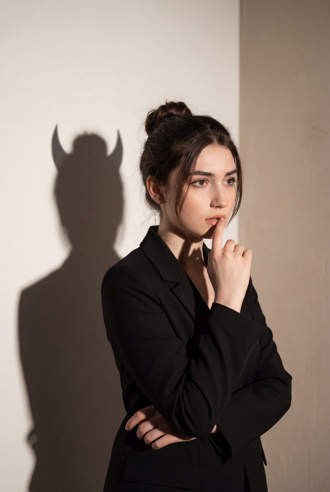
</div>

**提示词：**
```
{ "composition": { "framing": "vertical portrait, mid-torso crop", "subject_position": "subject placed slightly left of center, facing right in three-quarter profile", "negative_space": "large empty wall space on right used to project shadow", "visual_concept": "contrast between subject and symbolic shadow creating duality" }, "subject": { "gender_presentation": "female-presenting", "age_range": "young adult", "pose": "right hand raised with index finger touching lips, contemplative stance", "facial_expression": "pensive, introspective, slightly tense", "gaze_direction": "looking off-frame to the right" }, "hair": { "color": "dark brown", "style": "messy bun with loose strands framing face", "texture": "natural, slightly tousled" }, "clothing": { "type": "tailored blazer", "color": "matte black", "style": "minimalist, formal, modern", "fit": "structured shoulders, fitted silhouette", "details": " no visible accessories" }, "lighting": { "light_source": "single hard light positioned front-left of subject", "quality": "hard, directional", "shadow_behavior": "sharp, high-contrast shadow cast onto wall", "mood_effect": "dramatic, psychological, symbolic" }, "shadow": { "shape": "human silhouette with exaggerated devil horns", "clarity": "well-defined edges", "symbolism": "inner conflict, hidden nature, dual personality" }, "color_palette": { "dominant_colors": [ "black", "warm beige", "soft brown" ], "saturation": "low", "contrast": "high between subject and background" }, "background": { "type": "plain interior wall", "texture": "subtle painted wall grain", "color": "off-white / light beige", "environment": "studio or controlled indoor space" }, "camera_characteristics": { "lens_look": "standard to short telephoto perspective", "depth_of_field": "moderate, subject and shadow in focus", "distortion": "minimal", "angle": "eye-level" }, "artistic_style": { "genre": "conceptual portrait photography", "aesthetic": "moody, minimalist, psychological", "influences": "symbolism, chiaroscuro lighting", "narrative": "visual metaphor of hidden thoughts or darker inner self" }, "post_processing": { "skin_tone": "natural, softly smoothed", "color_grading": "neutral with slight warmth", "sharpening": "moderate on facial features", "noise": "minimal" }, "overall_tone": { "emotion": "introspective, tense, mysterious", "visual_message": "contrast between outward composure and inner complexity" } }
```

**中文提示词：**
```
{ "构图": { "取景": "竖幅肖像，半身特写", "主体位置": "主体位于画面中心偏左，面向右侧，四分之三侧面", "留白": "右侧大片空白墙面用于投射阴影", "视觉概念": "主体与象征性阴影形成对比，营造二元性" }, "主体": { "性别呈现": "女性", "年龄范围": "青年", "姿势": "右手抬起，食指轻触嘴唇，沉思的姿态", "面部表情 "沉思，内省，略显紧张", "目光方向 "看向画面右侧外" }, "头发": { "颜色": "深棕色", "造型 "凌乱的发髻，几缕碎发垂在脸颊两侧", "质感 "自然，略显蓬松" }, "服装": { "类型 "修身西装外套", "颜色 "哑光黑", "款式：" “极简主义、正式、现代”“合身”“结构化的肩部，修身的轮廓”“细节”“无可见配饰”},“光线”:{“光源”:“位于主体左前方的一盏硬光”“质量”:“硬光，定向光”“阴影行为”:“投射在墙上的清晰、高对比度的阴影”“情绪效果”:“戏剧性的、心理的、象征性的”},“阴影”:{“形状”:“带有夸张恶魔角的轮廓”“清晰度”:“清晰的边缘”“象征意义”:“内心冲突、隐藏的本性、双重人格”},“调色板”:{“主色调”:[“黑色”、“暖米色”、“柔和的棕色”]“饱和度”:“低”“对比度”:“主体与背景之间对比度高”},“背景”:{“类型”:“普通的内墙”“纹理”:“细微的墙面纹理”“颜色”:“灰白色/浅色米色", "环境": "影棚或可控室内空间" }, "相机特性": { "镜头视角": "标准至短焦远摄视角" "景深": "中等，主体和阴影清晰" "畸变": "极少" "角度": "平视" }, "艺术风格": { "类型": "概念人像摄影" "美学": "情绪化、极简主义、心理" "影响": "象征主义、明暗对比" "叙事 "隐藏思想或内心深处的视觉隐喻" }, "后期处理 { "肤色": "自然、柔和" "色彩分级 "中性，略带暖色调" "锐化 "面部特征适中" "噪点 "极少" }, "整体色调 { "情绪": "内省、紧张、神秘" "视觉信息 "对比度" }介于外在的沉着冷静和内在的复杂复杂之间” } }
```

<a id="prompt-1080"></a>
## 案例 1080：3D文字慢动作镜头下的薯片 (来源 [@Ankit_patel211](https://x.com/Ankit_patel211/status/2007849409485402510)) 模型：Nano banana pro

<div style="display: flex; justify-content: space-between;">
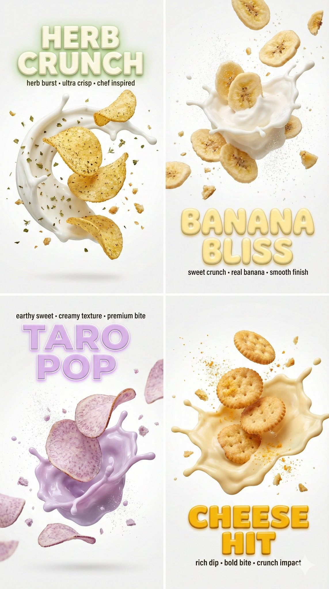
</div>

**提示词：**
```
{
  "project_configuration": {
    "shot_type": "macro_still_image",
    "global_settings": {
      "aspect_ratio": "9:16",
      "chaos_weight": 15,
      "color_profile": "high-key",
      "environment": {
        "backdrop": "clean_white",
        "lighting_style": "cinematic_bloom",
        "atmosphere": "ethereal"
      }
    },
    "camera_optics": {
      "body": "Canon EOS R5",
      "lens": "85mm f/1.2",
      "depth_of_field": "shallow_bokeh",
      "focus_point": "snack_and_cream_interaction"
    }
  },
  "scene_data": [
    {
      "id": "item_001",
      "snack_component": {
        "type": "herb-seasoned chips",
        "surface": "crisp_golden",
        "physics": "suspended_mid_air"
      },
      "fluid_component": {
        "material": "Mediterranean herb cream",
        "color": "thick_white",
        "behavior": "frozen_splash_arc",
        "texture": "glossy"
      },
      "particle_system": {
        "frozen_elements": "liquid_droplets",
        "spices": ["oregano_flakes", "thyme_flakes"],
        "debris": "hyper-detailed_crumbs"
      },
      "text_overlay": {
        "main_text": "HERB CRUNCH",
        "main_text_style": "Bold extruded 3D lettering, creamy white with soft green edge glow",
        "secondary_text": "herb burst • ultra crisp • chef inspired",
        "secondary_text_style": "Tiny funky handwritten sans",
        "placement": "Upper third, floating behind chips",
        "integration": "Text appears suspended in space, harmonized with splash composition"
      }
    },
    {
      "id": "item_002",
      "snack_component": {
        "type": "banana chips",
        "surface": "crisp",
        "physics": "suspended"
      },
      "fluid_component": {
        "material": "vanilla cream",
        "color": "thick_white",
        "behavior": "frozen_burst",
        "texture": "soft_creamy"
      },
      "particle_system": {
        "frozen_elements": "soft_arc_droplets",
        "spices": ["fine_sugar_dust"],
        "debris": "detailed_banana_crumbs"
      },
      "text_overlay": {
        "main_text": "BANANA BLISS",
        "main_text_style": "Rounded 3D bubble text, soft pastel yellow with creamy highlights",
        "secondary_text": "sweet crunch • real banana • smooth finish",
        "secondary_text_style": "Tiny funky doodle-style lettering",
        "placement": "Center-right, slightly tilted",
        "integration": "Playful floating text, poster-style balance"
      }
    },
    {
      "id": "item_003",
      "snack_component": {
        "type": "taro chips",
        "surface": "lavender-tinted_crisp",
        "physics": "suspended"
      },
      "fluid_component": {
        "material": "taro cream",
        "color": "pastel-purple",
        "behavior": "frozen_eruption",
        "texture": "glossy_viscous"
      },
      "particle_system": {
        "frozen_elements": "mid-air_droplets",
        "spices": ["sugar-dust_particles"],
        "debris": "soft_drifting_taro_crumbs"
      },
      "text_overlay": {
        "main_text": "TARO POP",
        "main_text_style": "Clean geometric 3D text, pastel purple with soft neon rim light",
        "secondary_text": "earthy sweet • creamy texture • premium bite",
        "secondary_text_style": "Tiny funky mono-sans",
        "placement": "Upper left, aligned with splash curve",
        "integration": "Text glow matches taro cream color palette"
      }
    },
    {
      "id": "item_004",
      "snack_component": {
        "type": "cheese crackers",
        "surface": "textured",
        "physics": "suspended"
      },
      "fluid_component": {
        "material": "cheese dip",
        "color": "pale-yellow",
        "behavior": "frozen_splash",
        "texture": "thick"
      },
      "particle_system": {
        "frozen_elements": "static_droplets",
        "spices": ["cheddar_powder"],
        "debris": "soft_drifting_cracker_crumbs"
      }
```

**中文提示词：**
```
{
"project_configuration": {
"shot_type": "macro_still_image",
"global_settings": {
"aspect_ratio": "9:16",
"chaos_weight": 15,
"color_profile": "高调",
“环境”： {
“背景”： “纯白”
"lighting_style": "cinematic_bloom",
“氛围”： “空灵的”
}
},
"camera_optics": {
“机身”: “佳能 EOS R5”
镜头：85mm f/1.2，
"景深": "浅散景",
"focus_point": "snack_and_cream_interaction"
}
},
"scene_data": [
{
"id": "item_001",
"snack_component": {
“类型”: “香草调味薯片”
"表面": "crisp_golden",
"physics": "悬停在空中"
},
"fluid_component": {
“成分”： “地中海草本霜”，
"color": "thick_white",
"行为": "frozen_splash_arc",
“质感”： “光泽”
},
"particle_system": {
"frozen_elements": "liquid_droplets",
香料：[牛至片，百里香片]
"碎片": "超细节碎屑"
},
"text_overlay": {
"main_text": "香草脆片",
"main_text_style": "粗体立体3D字体，乳白色，边缘带有柔和的绿色光晕",
"secondary_text": "香草爆浆 • 超脆 • 主厨灵感"
"secondary_text_style": "Tiny funky handwritten sans",
“位置”：“上三分之一，漂浮在薯片后面”，
“融合”：“文字仿佛悬浮在空间中，与泼墨构图和谐统一”
}
},
{
"id": "item_002",
"snack_component": {
“类型”: “香蕉片”
表面： 酥脆，
“物理学”： “暂停”
},
"fluid_component": {
“材料”: “香草奶油”
"color": "thick_white",
"行为": "frozen_burst",
质地：柔滑细腻
},
"particle_system": {
"frozen_elements": "soft_arc_droplets",
香料：["细糖粉"]，
"碎片": "详细的香蕉屑"
},
"text_overlay": {
"main_text": "香蕉的幸福"
"main_text_style": "圆润的3D气泡文字，柔和的粉黄色，带有奶油色高光",
"secondary_text": "香甜酥脆 • 真香蕉 • 口感顺滑"
"secondary_text_style": "Tiny funky doodle style lettering",
“位置”：“居中偏右，略微倾斜”
“融合”：“趣味十足的悬浮文字，海报式的平衡”
}
},
{
"id": "item_003",
"snack_component": {
“类型”： “芋头片”
"表面": "淡紫色_清脆"
“物理学”： “暂停”
},
"fluid_component": {
“材料”: “芋头霜”
“颜色”: “淡紫色”
"行为": "冻结喷发",
"texture": "glossy_viscous"
},
"particle_system": {
"frozen_elements": "空中液滴",
“香料”：[“糖粉颗粒”]，
"碎片": "柔软的漂浮芋头屑"
},
"text_overlay": {
"main_text": "芋头流行",
"main_text_style": "简洁的几何3D文字，淡紫色，带有柔和的霓虹边缘光"
"secondary_text": "泥土般的甜味 • 奶油般的质地 • 高级口感",
"secondary_text_style": "Tiny funky monosans",
“位置”：“左上角，与飞溅曲线对齐”
“整合”：“文字发光与芋头奶油色调相匹配”
}
},
{
"id": "item_004",
"snack_component": {
“类型”：“奶酪饼干”，
“表面”: “有纹理的”，
“物理学”： “暂停”
},
"fluid_component": {
“材料”: “奶酪蘸酱”
“颜色”： “淡黄色”，
"行为": "frozen_splash",
“质地”： “厚实”
},
"particle_system": {
"frozen_elements": "static_droplets",
香料：["切达干酪粉"]，
"碎片": "柔软的漂浮饼干屑"
}
```

<a id="prompt-1079"></a>
## 案例 1079：OOTD时尚杂志封面 (来源 [@rionaifantasy](https://x.com/rionaifantasy/status/2007871901289554096)) 模型：Nano banana pro

<div style="display: flex; justify-content: space-between;">
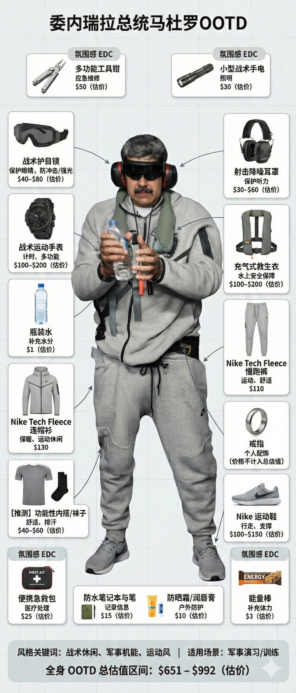
</div>

**中文提示词：**
```
基于我提供的【参考人物照片】生成一张“穿搭拆解信息图”（Outfit Breakdown）。
【硬性要求】

人物居中、清晰、与参考照片一致（同一人同一穿搭）。
四周用标注卡片 + 引线箭头拆解单品。
每个标注卡片必须包含：单品小图 （真实感图片，不是动画风格）+ 名称（中文为主）+ 作用 + 价格（USD；不确定就区间并标注估价）。
卡片排版整齐，避免遮挡人物主体与关键单品。
【穿搭拆解（自动识别并补全）】

配饰：帽子 / 眼镜 / 耳饰 / 项链 / 手表
外层：外套 / 夹克 / 西装 / 大衣 / 开衫
上装：T恤 / 衬衫 / 针织 / 卫衣
下装：牛仔裤 / 西裤 / 裙子 / 短裤
鞋：运动鞋 / 皮鞋 / 靴子 / 高跟鞋
包：托特 / 腋下包 / 双肩包 / 邮差包
贴身层（合规服饰推测）：【推测】内衣/内裤/情趣内衣/背心打底/安全裤/袜子（必须标注【推测】）
【私人物品 EDC（氛围感版本，合规）】

在人物周围额外增加 6–10 个“随身物品/洗漱与氛围用品”标注卡片，要求与人物风格匹配（通勤/约会/街头/派对/健身 其一）：
香水 / 口红或润唇膏 / 防晒 / 护肤小样 / 身体乳 / 耳机 / 随身听 / 游戏机（可选）
剃毛刀/剃须刀 / 口香糖或薄荷糖 / 打火机与香烟/项链/耳钉/乳钉/舌钉（可选）
香薰蜡烛或香薰喷雾（可选）
褪黑素 / 非那雄胺片 等（可选）
创可贴 / 湿巾 / 避孕套/飞机杯/震动棒/跳蛋/润滑液/肛塞/口球/乳夹（可选）

【推测规则】

对看不见的贴身层可以推测，但必须标注【推测】；最多给 2 个候选，并标明“更可能”的那个。
EDC 根据人物风格与场景选择，保持合理与一致性，不要堆砌不相关物品。
【价格规则（USD）】

价格统一用美元：例如 $79 或 $80–$120（估价）。
给真实合理的电商常见价位；不确定则给区间，并标注“估价”。
整体价位层级保持一致：{平价 / 中端 / 高端}。
若识别出品牌与具体型号：给单一价格；若不确定品牌：给区间价 + “估价”。
【版式】

杂志感信息图风格：背景干净、文字清晰、卡片整齐、信息密度高但不杂乱。

标题：{……OOTD}

风格关键词：{风格关键词}

适用场景：{场景}
【新增：全身 OOTD 总估值（必须输出）】

在信息图底部增加一个汇总模块（Summary Bar）：
全身 OOTD 总估值（USD）：$X（估价）
若单品存在区间价：同时给出 最低估值 与 最高估值：
总估值区间：$X_low – $X_high（估价）
计算规则：
单品为单一价格 → 直接相加
单品为区间价 → 低位相加得到 X_low，高位相加得到 X_high
EDC 物品不计入 OOTD 总估值（除非明确属于穿搭单品，如包、配饰）
```

<a id="prompt-1078"></a>
## 案例 1078：建筑工地广告缩微图 (来源 [@aleenaamiir](https://x.com/aleenaamiir/status/2008017541340565526)) 模型：Nano banana pro

<div style="display: flex; justify-content: space-between;">
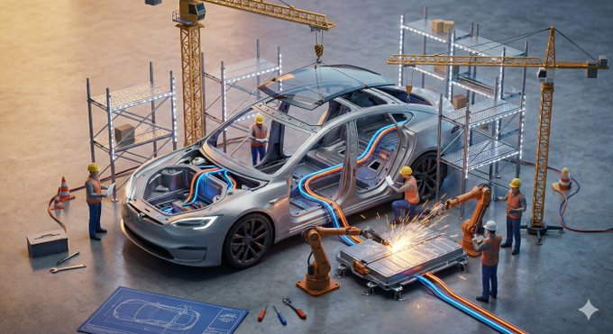
</div>

**提示词：**
```
A miniature construction crew assembling [PRODUCT] like a skyscraper. Cranes, scaffolding, sparks flying. Playful but hyper-real, brand-campaign ready.
```

**中文提示词：**
```
一支微缩建筑队正在组装[产品]，就像建造摩天大楼一样。起重机、脚手架、火花四溅。既充满趣味又无比逼真，随时可用于品牌宣传活动。
```

<a id="prompt-1077"></a>
## 案例 1077：温馨的室内生日庆祝拼贴画 (来源 [@AIwithkhan](https://x.com/AIwithkhan/status/2008009106448412951)) 模型：Nano banana pro

<div style="display: flex; justify-content: space-between;">
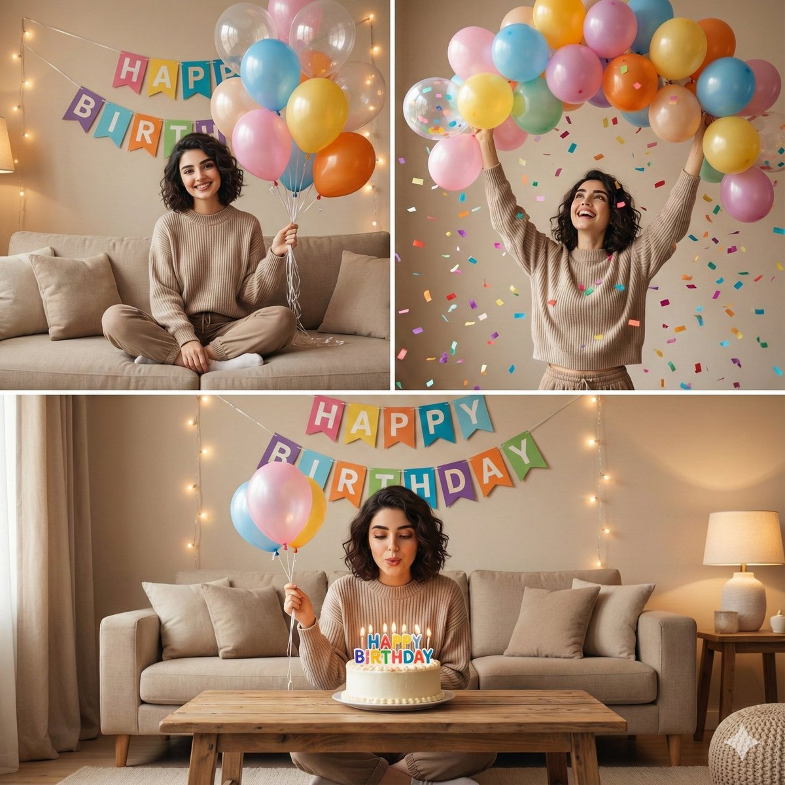
</div>

**提示词：**
```
A cozy indoor birthday celebration collage featuring the same woman in multiple moments. Warm, soft-lit living room with neutral beige tones. Colorful “HAPPY BIRTHDAY” decorative banner hanging on the wall as party décor. In one frame, she sits cross-legged on a couch holding transparent confetti balloons and solid color balloons, smiling warmly. In another frame, she raises a large arch of colorful balloons above her head, celebrating joyfully as confetti falls. In another frame, she sits on the couch blowing out candles on a birthday cake placed on a wooden coffee table in front of her, holding balloons in one hand. Casual cozy outfit, natural expressions, realistic skin tones, warm ambient lighting, festive yet intimate home celebration mood, lifestyle photography style, clean composition, ultra-realistic, 1:1 aspect ratio.
```

**中文提示词：**
```
一组温馨的室内生日庆祝拼贴画，展现了同一位女士的多个瞬间。温暖柔和的客厅灯光，以中性米色调为主。墙上悬挂着色彩缤纷的“生日快乐”装饰横幅，作为派对装饰。其中一张照片中，她盘腿坐在沙发上，手捧透明的五彩纸屑气球和纯色气球，笑容灿烂。另一张照片中，她高举着一个巨大的彩色气球拱门，五彩纸屑飘落，她欢欣雀跃。还有一张照片中，她坐在沙发上，吹灭摆放在面前木质茶几上的生日蛋糕上的蜡烛，一只手拿着气球。照片风格休闲舒适，人物表情自然，肤色真实，环境灯光温暖，营造出既喜庆又温馨的居家庆祝氛围，展现了生活方式摄影的风格，构图简洁，画面超写实，宽高比为1:1。
```

<a id="prompt-1076"></a>
## 案例 1076：雨夜都市的沉思女性 (来源 [@saniaspeaks_](https://x.com/saniaspeaks_/status/2007996411955286116)) 模型：Nano banana pro

<div style="display: flex; justify-content: space-between;">
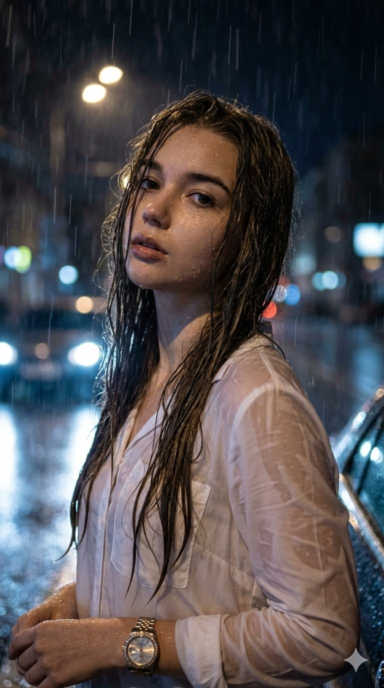
</div>

**提示词：**
```
{
  "type": "image_generation_prompt",
  "aspect_ratio": "9:16",
  "style": "hyper-realistic cinematic night portrait",
  "identity_preservation": {
    "use_reference_image": true,
    "strict_identity_lock": true,
    "alter_face": false,
    "alter_hair": false,
    "notes": "Preserve 100% of the subject’s face, facial structure, proportions, skin texture, and hairstyle exactly as in the reference image."
  },
  "subject": {
    "gender": "female",
    "pose": {
      "position": "standing outdoors in the rain at night",
      "head": "tilted slightly upward",
      "gaze": "looking upward, feeling the rain"
    },
    "expression": "intense, emotional, contemplative",
    "appearance": {
      "hair": {
        "state": "wet and tousled",
        "notes": "Hair must remain identical to the reference image, only affected naturally by rain"
      },
      "skin": {
        "details": [
          "raindrops glistening on the face",
          "natural skin texture",
          "no smoothing or beautification"
        ]
      }
    },
    "wardrobe": {
      "top": "soaked white button-up shirt clinging naturally to the body",
      "accessories": [
        "luxury wristwatch on the wrist"
      ]
    }
  },
  "environment": {
    "setting": "outdoor urban environment at night",
    "weather": "heavy rain",
    "atmosphere": "moody, dramatic, cinematic"
  },
  "lighting": {
    "style": "dramatic low-key lighting",
    "features": [
      "deep shadows",
      "strong highlights on water droplets",
      "cinematic contrast"
    ]
  },
  "visual_effects": {
    "rain": "water droplets frozen in motion",
    "motion": "subtle rain streaks visible",
    "depth": "cinematic depth of field"
  },
  "camera": {
    "shot_type": "portrait",
    "angle": "eye-level to slightly low",
    "focus": "sharp focus on face and upper body",
    "look": "professional photography style"
  },
  "quality": {
    "resolution": "high resolution",
    "realism": "ultra-photorealistic",
    "detail_level": "extreme detail in skin, fabric, water, and lighting"
  },
  "constraints": [
    "Do not alter face or hair",
    "No artificial filters",
    "No cartoon or stylized effects",
    "No distorted anatomy",
    "No text or watermarks"
  ],
  "output_goal": "Create a hyper-realistic cinematic night portrait of a woman standing in the rain, preserving her exact facial identity and hairstyle, with dramatic lighting, visible rain droplets, and an intense emotional atmosphere."
}
```

**中文提示词：**
```
{
"type": "image_generation_prompt",
"aspect_ratio": "9:16",
“风格”：“超写实电影夜景肖像”，
"identity_preservation": {
"use_reference_image": true,
"strict_identity_lock": true,
"alter_face": false,
"alter_hair": false,
备注：“100% 保留人物面部、面部结构、比例、皮肤纹理和发型，与参考图像完全一致。”
},
“主题”： {
"性别": "女性",
"姿势": {
“位置”：“夜晚站在雨中的户外”，
“头部”： “略微向上倾斜”，
“凝视”： “抬头仰望，感受雨水”
},
“表情”：“强烈的、充满情感的、沉思的”，
“外貌”： {
“头发”： {
“状态”： “湿漉漉的，蓬乱的”，
备注：“头发必须与参考图片完全一致，只能自然地受到雨水的影响。”
},
“皮肤”： {
“细节”： [
“雨滴在脸上闪闪发光”，
“自然肌肤纹理”，
“未经任何修饰或美化”
]
}
},
“衣柜”： {
“上衣”：“湿透的白色纽扣衬衫自然地贴在身上”，
“配件”： [
“腕间奢华腕表”
]
}
},
“环境”： {
“场景”: “夜晚的户外城市环境”，
“天气”：“大雨”，
“氛围”： “情绪饱满、戏剧化、电影感十足”
},
“灯光”： {
“风格”：“戏剧性的低调照明”，
“特征”： [
“深邃的阴影”，
“水滴上的高光很突出”，
“电影对比”
]
},
"视觉效果": {
“雨”: “运动中凝固的水滴”，
“运动”：“可以看到细微的雨痕”，
“景深”: “电影景深”
},
“相机”： {
"shot_type": "肖像",
“角度”：“视线水平到略低”，
“焦点”: “清晰聚焦于面部和上半身”，
“外观”：“专业摄影风格”
},
“质量”： {
“分辨率”: “高分辨率”
“真实感”: “超逼真”，
"detail_level": "皮肤、织物、水和光照的细节都非常丰富"
},
“约束”：[
“不要改变脸部或发型”，
“不使用人工滤镜”，
“没有卡通或风格化的效果”，
“没有解剖结构畸形”
“无文字或水印”
],
"output_goal": "创作一幅超逼真的电影式夜景肖像，描绘一位女性站在雨中，保留她完整的面部特征和发型，运用戏剧性的光线、清晰可见的雨滴和强烈的情感氛围。"
}
```

<a id="prompt-1075"></a>
## 案例 1075：笔记本纸上的创作风格来绘制内容 (来源 [@umesh_ai](https://x.com/umesh_ai/status/2008087921723847021?referrer=opennana.com)) 模型：Nano banana pro

<div style="display: flex; justify-content: space-between;">
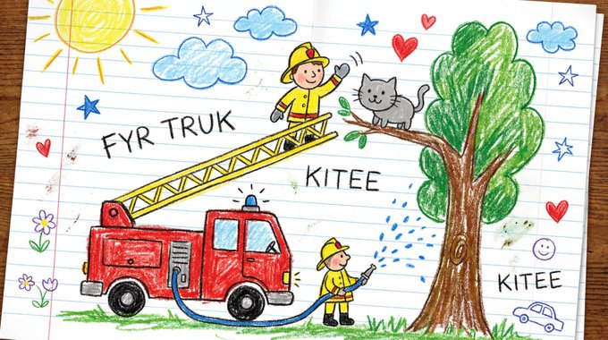
</div>

**提示词：**
```
Draw [VISUAL] as if created by a cheerful 6-year-old on white notebook paper. Use chunky wax-crayon strokes, wobbly outlines, and simple flat shapes. Colors should be bright, bold, and slightly outside the lines, with visible pressure marks and small smudges. Perspective is innocent: objects can float, and size is based on importance, not realism. Faces are dots with curved smiles; hands are mitten blobs; animals are round and friendly. Add playful extras like a sun in a corner, puffy clouds, stars, and hearts. Include uneven scribble shading, a few tiny doodles in the margins, and one or two hand-written labels in childlike spelling.
```

**中文提示词：**
```
按照一个兴高采烈的 6 岁孩童在白色笔记本纸上的创作风格来绘制 [画面内容]。采用粗实的蜡笔笔触、歪歪扭扭的轮廓线与简洁的平涂色块。色彩需明亮大胆，边缘略微超出线条，带有清晰可见的按压痕迹和细微的晕染污渍。视角充满童真感：物体可以漂浮，尺寸大小依据重要性而非现实比例来设定。人物的脸部是带弯弯笑弧的圆点，手部是连指手套般的圆块状，动物则是圆润的模样，显得十分友善。添加一些趣味小元素，比如角落处的太阳、蓬松的云朵、星星与爱心。加入不均匀的潦草涂色阴影，在留白处画几个小涂鸦，并配上一两个模仿孩童拼写习惯的手写标注。
```

<a id="prompt-1074"></a>
## 案例 1074：天然唇部极致特写 (来源 [@94vanAI](https://x.com/94vanAI/status/2007802711937270119)) 模型：Nano banana pro

<div style="display: flex; justify-content: space-between;">
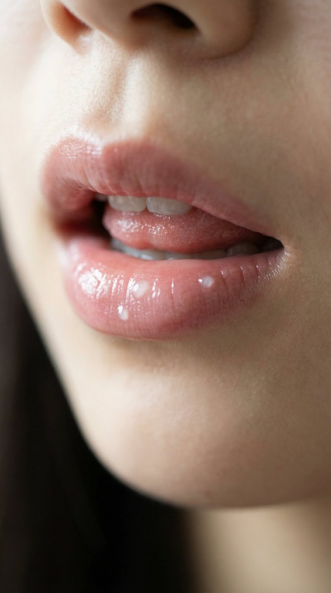
</div>

**提示词：**
```
extreme close-up of natural East Asian lips, ultra sheer watery lip essence, zero visible product, just a whisper of soft pink hydration, dewy but not glossy, realistic skin texture with delicate vellus hair on lips, calm soft window light, no makeup appearance, hyper detailed, lifelike, 8k HDR, professional portrait photography, Canon RF 100mm macro lens.
```

**中文提示词：**
```
东亚天然唇部极致特写，超轻薄水润护唇精华，无明显产品痕迹，仅透出一抹柔粉水光感，清透不油腻，唇部带有细腻绒毛的真实肌肤纹理，柔和的室内窗边自然光，伪素颜妆效，细节拉满，逼真生动，8K 超高清高动态范围，专业人像摄影，佳能 RF 100mm 微距镜头
```

<a id="prompt-1073"></a>
## 案例 1073：一个可爱的3D卡通人物 (来源 [@iamsofiaijaz](https://x.com/iamsofiaijaz/status/2007850759606718783)) 模型：即梦

<div style="display: flex; justify-content: space-between;">

</div>

**提示词：**
```
A cute 3D cartoon character of a young girl standing confidently, front view, wearing an oversized chunky knitted mustard-yellow cardigan and matching loose knitted pants, a white t-shirt with a small black swoosh logo, white sneakers with yellow accents, round oversized black glasses, hair in a messy high bun with loose curls, a small black backpack, soft smile, big expressive eyes, stylized Pixar/Disney-like proportions, smooth plastic-clay skin texture, ultra clean render, high detail knit fabric, studio lighting, centered composition, full body, minimal background, solid warm yellow backdrop, soft shadows, high resolution, modern character design, dribbble / behance style, octane render, 4k.
```

**中文提示词：**
```
一个可爱的3D卡通人物，年轻女孩自信地站立着，正面视角，身穿超大号粗针织芥末黄开衫和配套的宽松针织裤，一件带有黑色小勾形标志的白色T恤，一双带有黄色点缀的白色运动鞋，一副圆形超大黑色眼镜，头发随意地挽成一个高高的发髻，垂下几缕卷发，背着一个小黑色背包，面带温柔的微笑，一双会说话的大眼睛，风格化的皮克斯/迪士尼式比例，光滑的塑料粘土质感，超干净的渲染，高细节针织面料，摄影棚灯光，居中构图，全身像，极简背景，纯暖黄色背景，柔和的阴影，高分辨率，现代角色设计，Dribbble/Behance风格，Octane渲染，4K。
```

<a id="prompt-1072"></a>
## 案例 1072：一张超逼真的3D商业照片 (来源 [@Arminn_Ai](https://x.com/Arminn_Ai/status/2007871647127113932)) 模型：Nano banana pro

<div style="display: flex; justify-content: space-between;">
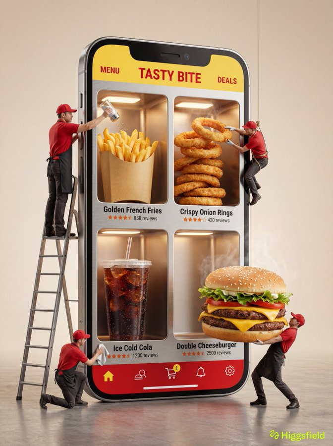
</div>

**提示词：**
```
A hyper-realistic 3D commercial photograph of a giant smartphone standing vertically on a [FLOOR MATERIAL: e.g., grey concrete, polished marble, dark reflective] studio floor. The phone is viewed from a slight 3/4 perspective angle to emphasize depth.

The Concept: The screen acts as a [STYLE ADJECTIVE: e.g., luxury, high-tech, heated] physical display cabinet with four deep, recessed alcoves arranged in a 2x2 grid. The products are tangible, volumetric 3D objects sitting inside these slots, flush with the screen's surface, casting real, deep shadows into the UI background.

UI Details ([THEME NAME] Theme):
* Theme: The App UI uses a [COLOR PALETTE: e.g., Black & Gold, Red & Yellow] aesthetic.
* Top: "SORT" (left), "FILTER" (right), "[BRAND NAME]" (center, [FONT STYLE: e.g., bold serif, glitch font]).
* Bottom Nav: Icons are [ICON COLOR]. Shopping Cart has a small red notification badge showing the number '1'.

The Crew (4 Photorealistic, Lifelike Miniature Humans):
* Four miniature workers dressed in [UNIFORM DESCRIPTION: e.g., black jumpsuits, red aprons, neon vests]. They are photorealistic humans, NOT dolls or plastic figures.
* Human Details: Their skin has texture, pores, sweat, and realistic imperfections. Their clothing shows creases and signs of wear. All four workers are of identical miniature scale.

Interactions & Product Layout (2x2 Grid):

1.  Top-Left Slot: Contains a 3D [PRODUCT A: Name & Description]. Texture details: [TEXTURE: e.g., glass refraction, matte plastic].
    * Worker 1 (Adjusting): A realistic worker on a [LADDER TYPE: e.g., metal, gold, black] ladder is reaching over to [ACTION: e.g., polish, adjust, season] the product.

2.  Top-Right Slot (Being Worked On): Contains a [PRODUCT B: Name & Description].
    * Worker 2 (Hanging): A realistic worker hangs by a [ROPE TYPE: e.g., thick rope, velvet rope, cable] from the top frame, [ACTION: e.g., cleaning, connecting] the product.

3.  Bottom-Left Slot: Contains a [PRODUCT C: Name & Description].
    * Worker 3 (Supervisor): A realistic worker kneeling on the floor, holding a [PROP: e.g., tablet, clipboard, towel] and directing the team.

4.  Bottom-Right Slot (Empty/Fallen): The slot is empty, but the text "[PRODUCT D NAME]" (★★★★★ [REVIEWS] reviews) is visible below it.
    * Worker 4 (Lifting): On the floor, a realistic worker is struggling with immense effort to lift the heavy, fallen [PRODUCT D OBJECT]. It is [WEIGHT/TEXTURE DESCRIPTION].

Background:
* A [BACKGROUND TYPE: e.g., clean grey studio, blurred shop] environment.

Lighting & Texture:
* [LIGHTING STYLE] Lighting: High-contrast, realistic lighting that highlights [SPECIFIC TEXTURES: e.g., grease, condensation, leather grain, brushed metal]. 8k resolution, Octane render style.
```

**中文提示词：**
```
一张超逼真的3D商业照片，照片中一部巨型智能手机垂直放置在[地面材质：例如，灰色混凝土、抛光大理石、深色反光]摄影棚地面上。手机以略微偏向四分之三侧面的角度拍摄，以增强景深效果。

概念：屏幕如同一个实体展示柜，设有四个深凹的壁龛，呈2x2网格状排列。产品是实实在在的立体3D物体，放置在这些壁龛内，与屏幕表面齐平，并在用户界面背景上投射出真实而深邃的阴影。

UI 详情（[主题名称] 主题）：
* 主题：应用程序用户界面采用[颜色调色板：例如，黑色和金色，红色和黄色]美学。
* 顶部：“排序”（左），“筛选”（右），“[品牌名称]”（中心），[字体样式：例如，粗衬线字体，故障字体]) 。
* 底部导航：图标颜色为[图标颜色]。购物车图标上有一个红色的小通知徽章，显示数字“1”。

船员（4 个照片级写实、栩栩如生的微缩人偶）：
* 四位身着[制服描述：例如，黑色连体服、红色围裙、荧光背心]的迷你工人。他们是逼真的真人模型，并非玩偶或塑料人偶。
* 人物细节：他们的皮肤纹理清晰，有毛孔、汗渍和逼真的瑕疵。他们的衣服有褶皱和磨损痕迹。四位工作人员的比例完全相同。

交互与产品布局（2x2 网格）：

1. 左上角插槽：包含一个 3D [产品 A：名称和描述]。纹理详情：[纹理：例如，玻璃折射，哑光塑料]。
* 工人 1（调整）：一名真实的工人站在 [梯子类型：例如，金属、金色、黑色] 梯子上，正在伸手 [动作：例如，抛光、调整、保养] 产品。

2. 右上角插槽（正在处理On):包含[产品 B：名称和描述]。
* 工人 2（悬挂）：一名逼真的工人通过 [绳索类型：例如，粗绳、天鹅绒绳、电缆] 从顶部框架悬挂下来，[动作：例如，清洁、连接] 产品。

3. 左下角插槽：包含[产品 C：名称和描述]。
* 工作人员 3（主管）：一名逼真的工作人员跪在地上，手持[道具：例如平板电脑、写字板、毛巾]，指挥团队。

4. 右下角插槽（空/掉落）：该插槽为空，但其下方可见文字“[产品名称]”（ ★★★★★ [评论] 评论）。
* 工人 4（搬运）：在地板上，一名逼真的工人正费力地搬运掉落的沉重[产品 D 对象]。它是[重量/纹理描述]。

背景：
* [背景类型：例如，干净的灰色工作室，模糊的商店] 环境。

光照和纹理：
* [光照风格] 光照：高对比度、逼真的光照，突出[特定纹理：例如，油脂、冷凝水、皮革纹理、拉丝金属]。8K分辨率，Octane渲染风格。
```

<a id="prompt-1071"></a>
## 案例 1071：奶凶奶凶的女生 (来源 [@MANISH1027512](https://x.com/MANISH1027512/status/2008112011373068488)) 模型：Nano banana pro

<div style="display: flex; justify-content: space-between;">
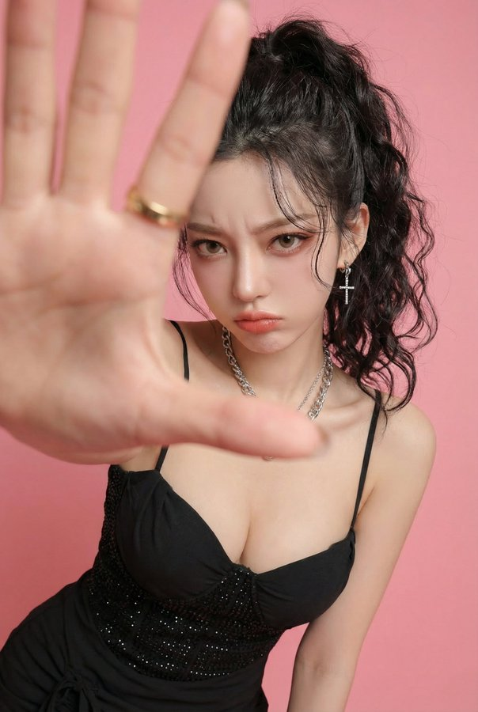
</div>

**提示词：**
```
Photorealistic edit using the input person photo as strict identity reference: keep the same face, facial features, skin tone, hairstyle (color/bangs/length/volume), outfit and accessories unchanged (no face swap, no new person, no hair/outfit change). Change only expression/pose/background: pouty lips and furrowed brows, slightly angry/annoyed, like she’s playfully mad at her boyfriend and saying “stop filming me”. Close wide-angle perspective (18–28mm), body slightly leaning forward, one hand reaching toward the lens as if grabbing the boyfriend’s phone / blocking the camera; huge foreground hand occupying 30–50% of the frame, palm facing camera, five natural fingers, realistic anatomy; face in the back in sharp focus. Replace background with a clean solid pink studio backdrop (seamless, no texture). No text, no watermark, no frame, no extra fingers, no deformed hands, no heavy blur, no style change.
```

<a id="prompt-1070"></a>
## 案例 1070：4宫格照片 (来源 [@Ankit_patel211](https://x.com/Ankit_patel211/status/2007156947120992655)) 模型：Nano banana pro

<div style="display: flex; justify-content: space-between;">
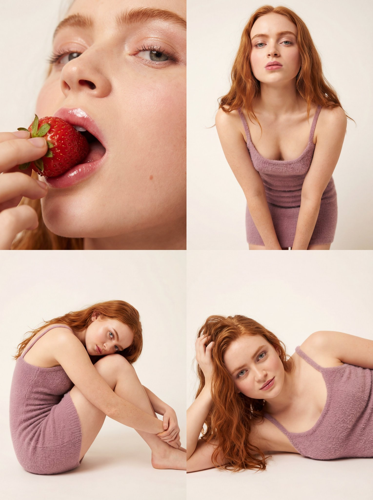
</div>

**提示词：**
```
{ 
"realism_level": "Ultra-photorealistic", "texture_quality": "8k", 
"lighting_simulation": "Ray-traced studio lighting" } }, 
"global_assets": 
{ "subject_definition": 
{ "hair": 
{ "style": "Long, loosely wavy, voluminous", "texture": "Natural, individual strands defined", "behavior": "Messy but styled, framing face and shoulders" },
 "complexion": 
{ "skin_texture": "Porous, hyper-realistic", "finish": "Dewy, glass-skin effect", "makeup": { "cheeks": "Heavy flush/blush", "lips": "High-gloss, plump, natural pink", "eyes": "Clean, defined lashes, natural brows" }
 },
 "wardrobe": { "item": "Mini dress", "fit": "Bodycon / Tight", "fabric": { "material": "Soft textured knit / Boucle", "tactility": "Fuzzy, light-catching fibers", "color": "Soft mauve or neutral taupe" }, "details": "Spaghetti straps, mid-thigh length" } },

 "environment_definition": { 
"studio_setup": 
{ "background": "Seamless paper, soft off-white/beige", "atmosphere": "Clean, warm, intimate" },

 "lighting_rig": 
{ "key_light": "Large diffuse softbox (Front-Left)", "fill_light": "Reflector (Right)", "highlights": "Specular highlights on lips, cheekbones, and shoulders" }
 }
 }, 
"panel_architecture": 

[ 
{ "position": "Top-Left (1)", "shot_type": "Extreme Close-Up (Macro)", "composition": { "angle": "Low angle, looking up slightly", "focus": "Mouth and nose area", "depth_of_field": "Shallow" },

 "action": { "primary": "Eating a strawberry", "nuance": "Delicate finger hold, lips slightly parted" }, 
"visual_anchors": 
[ "Moisture on strawberry surface", "Gloss reflection on lips",
 "Baby hairs at temple" ]
 }, 
{ "position": "Top-Right (2)", 
"shot_type": "Medium Shot (Thigh-up)", 
"composition": 
{ "angle": "Eye level", "pose_dynamic": "Leaning forward slightly towards lens" }, 

"action": 
{ "stance": "Standing straight on", "arms": "Relaxed at sides", "expression": "Direct gaze, alluring pout" }, 
"visual_anchors": 
[ "Texture of knit dress", "Collarbone shadows", "Curvature of waist" ]
 },
 { "position": "Bottom-Left (3)", "shot_type": "Full Body (Seated)", "composition": 
{ "angle": "Side profile", "framing": "Subject compacted on floor" },
 "action":
{ "pose": "Knees to chest (fetal position variation)", "interaction": "Cheek resting on knee"}
```

**中文提示词：**
```
{
"realism_level": "超逼真", "texture_quality": "8k",
"lighting_simulation": "光线追踪摄影棚照明" } },
"global_assets：
{ "subject_definition":
{ “头发”：
{ "style": "长款，蓬松波浪，丰盈","texture": "自然，根根分明","hashation": "凌乱但有型，修饰脸型和肩膀" },
“肤色”：
{ "skin_texture": "多孔，超逼真", "finish": "水润，玻璃肌效果", "makeup": { "cheeks": "浓重的腮红", "lips": "高光泽，丰盈，自然粉色", "eyes": "干净利落的睫毛，自然的眉毛" }
},
"衣橱": { "单品": "迷你连衣裙", "版型": "紧身/包臀", "面料": { "材质": "柔软纹理针织/圈圈纱", "触感": "毛茸茸的、反光的纤维", "颜色": "柔和的淡紫色或中性灰褐色" }, "细节": "细肩带，及大腿中部长度" } },

"environment_definition": {
"studio_setup":
{ "背景": "无缝纸，柔和的米白色/米色", "氛围": "干净、温暖、温馨" },

"lighting_rig："
{ "key_light": "大型漫射柔光箱（左前）", "fill_light": "反光板（右）", "highlights": "嘴唇、颧骨和肩膀上的镜面高光" }
}
},
"panel_architecture":

[
{ "position": "左上角(1)" , "shot_type": "超近特写 (微距)", "composition": { "angle": "低角度，略微向上看", "focus": "嘴部和鼻子区域", "depth_of_field": "浅景深" },

"动作": { "主要动作": "吃草莓", "细微动作": "手指轻柔地握着，嘴唇微微张开" },
"visual_anchors":
“草莓表面的水分”、“嘴唇上的光泽”
“鬓角的碎发”
},
{ "位置": "右上角(2)" ,
"shot_type": "中景（大腿向上）",
“作品”：
{ "angle": "视线水平", "pose_dynamic": "身体略微前倾靠近镜头" },

“行动”：
{ "站姿": "笔直站立", "手臂": "自然垂于两侧", "表情": "目光直视，微微嘟嘴" },
"visual_anchors":
【针织连衣裙的质感】、【锁骨阴影】、【腰部曲线】
},
{ "position": "左下角 (3)", "shot_type": "全身照（坐姿）", "composition":
{ "角度": "侧面轮廓", "构图": "物体压在地板上" },
“行动”：
{ "姿势": "膝盖贴近胸部（胎儿姿势变体）", "互动": "脸颊贴着膝盖"}
```

<a id="prompt-1069"></a>
## 案例 1069：监测医疗仪表盘 (来源 [@servasyy_ai](https://x.com/servasyy_ai/status/2007838187562115177)) 模型：Nano banana pro

<div style="display: flex; justify-content: space-between;">
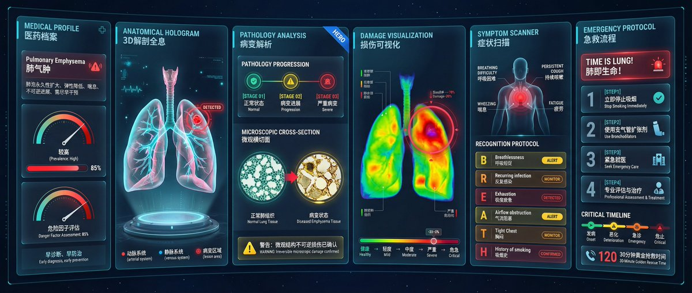
</div>

**提示词：**
```
Premium medical diagnostic dashboard for pulmonary embolism detection and monitoring, 6-column modular medical interface layout with equal-width glass-morphism panels, professional respiratory
healthcare visualization system, futuristic medical HUD design with cinematic quality, 6-COLUMN HORIZONTAL MODULAR LAYOUT spanning full ultra-wide screen, each column contains one specialized diagnostic
module with consistent glass-morphism styling, columns separated by thin vertical cyan dividers (1px, 20% opacity), all modules same height creating balanced grid composition, MODULE 1 (leftmost, 14%
width): MEDICAL PROFILE panel in Chinese 医药档案, header: 'M1 (14%) MEDICAL PROFILE 医药档案' in 14px tracking-wide, glass-morphism card displaying patient diagnosis: Pulmonary Emphysema 肺气肿 with
red alert badge, clinical description in Chinese: 肺泡永久性扩大、弹性降低、喘息、不可逆进展、需尽早干预, risk level indicator showing 较高 (Prevalence: High) with red progress bar at 85%, danger factor
assessment gauge in red zone, small text: 早诊断、早防治 (early diagnosis, early prevention), MODULE 2 (16% width): ANATOMICAL 3D HOLOGRAM panel 3D解剖全息, header: 'M2 (16%) ANATOMICAL HOLOGRAM
3D解剖全息', DOMINANT holographic 3D lung anatomy floating above circular platform with blue underglow, photorealistic transparent lungs showing left and right lobes with cyan/pink dual-color rendering,
pulmonary artery network highlighted in bright cyan glow, blood clot/embolism marked with pulsing red alert badge labeled 'DETECTED' in upper right quadrant of right lung, trachea and bronchi tree
visible in upper portion with detailed branching structure, slow 360-degree rotation (20 seconds per cycle), bottom labels: 动脉系统 (arterial system) with red alert dot, 静脉系统 (venous system) with
blue dot, 病变区域 (lesion area) with red 'DETECTED' badge, MODULE 3 (20% width): PATHOLOGY ANALYSIS panel 病变解析, header: 'M3 (20%) PATHOLOGY ANALYSIS 病变解析' with blue 'HERO' badge, top section:
PATHOLOGY PROGRESSION stages showing 3 green/yellow/red stage badges, [STAGE 01] 正常状态 (normal), [STAGE 02] 病变进展 (progression), [STAGE 03] 严重病变 (severe) in color-coded sequence, middle
section: MICROSCOPIC CROSS-SECTION 微观横切面 showing dual comparison images, left image: normal healthy alveolar tissue with regular honeycomb structure labeled 正常肺组织, right image: diseased
emphysema tissue with enlarged irregular air spaces and inflammation labeled 病变状态, bottom warning in Chinese: 警告提示：患者的一个关键性包涵体和钙化沉积号 with yellow alert icon, MODULE 4 (20%
width): DAMAGE VISUALIZATION panel 损伤可视化, header: 'M4 (20%) DAMAGE VISUALIZATION 损伤可视化', large thermal damage heatmap showing front view of lungs with rainbow gradient overlay, color gradient
from green (healthy) → yellow → orange → red (severe damage) → deep red hotspots, concentrated red/orange damage zones in upper right lung indicating embolism location, left lung mostly green/yellow
showing healthier tissue, anatomical legend indicators: 上叶区域 → [代号、颜色] (upper lobe zones with codes and colors), 全肺功能损伤图 → [慢性症状、呕吐] (whole lung function damage map showing
chronic symptoms), bottom: horizontal rainbow gradient scale bar from green to red showing damage severity spectrum, MODULE 5 (16% width): SYMPTOM SCANNER panel 症状扫描, header: 'M5 (16%) SYMPTOM
SCANNER 症状扫描', top: front-facing human body silhouette with highlighted regions, chest area marked with red pulsing zone indicating respiratory distress, symptom labels: BREATHING DIFFICULTY,
PERSISTENT COUGH, WHEEZING, FATIGUE positioned around body diagram, middle section: RECOGNITION PROTOCOL with B-R-E-A-T-H vertical acronym system, B: Breathlessness with 'Check Apnea activity' and
yellow 'ALERT' badge, R: Recurring infection with 'History check' and orange 'MONITOR' badge, E: Exhaustion with 'Daily activity impact' and red 'DETECTED' badge, A: Airflow obstruction with 'Measure
airflow' and yellow 'ALERT' badge, T: Tight Chest with 'Symptom input' and orange alert, H: History of smoking with 'Patient history' and red 'CONFIRMED' badge, each line color-coded with status
severity (green/yellow/orange/red), MODULE 6 (rightmost, 14% width): EMERGENCY PROTOCOL panel 急救流程, header: 'M6 (14%) EMERGENCY PROTOCOL 急救流程', large red alert banner: TIME IS LUNG! with pulsing
urgent notification, 4-step protocol cards in vertical stack with Chinese/English bilingual labels, [STEP1]: 立即停止吸烟[戒烟环境] (immediately stop smoking), [STEP2]: 使用支气管扩张剂[改善] (use
bronchodilator), [STEP3]: 紧急就医[呼吸急救] (emergency medical treatment), [STEP4]: 专业评估与治疗 (professional assessment and treatment), bottom section: CRITICAL TIMELINE showing emergency stages,
timeline bar: 发病 (onset) green → 恶化 (worsening) yellow → 急诊 (emergency) orange → 危止 (critical) red, large phone icon with '120' emergency number and target badge showing 30分钟黄金抢救时间
(30-minute golden rescue time), UNIFIED GLASS-MORPHISM DESIGN SYSTEM across all 6 modules, each panel background: rgba(5, 15, 35, 0.15) translucent dark blue with 14px backdrop blur, 1px solid border
rgba(6, 182, 212, 0.25) cyan glow on all module edges, module headers: semi-transparent top bar with gradient rgba(10, 30, 60, 0.4), 18px rounded corners on all cards and sub-panels, consistent shadow:
0 8px 32px rgba(0, 0, 0, 0.6) for depth, internal cards within modules: additional glass layers with rgba(255, 255, 255, 0.05) white tint, MEDICAL RESPIRATORY COLOR SYSTEM, background: deep space blue
gradient #0a0f1e → #050a15 with starfield dots (0.5-1px white particles, 30% opacity), healthy tissue: electric cyan #06b6d4 and cool blue #3b82f6, diseased tissue: amber #f59e0b (moderate) → red
#ef4444 (severe) → deep red #dc2626 (critical), alert badges: green 'NORMAL', yellow 'ALERT', orange 'MONITOR', red 'DETECTED/CRITICAL', text: primary white #ffffff, secondary 70% opacity white, labels
50% opacity cyan-grey, accent glow: cyan #22d3ee rim lighting on active elements, BILINGUAL CHINESE/ENGLISH LABELING SYSTEM throughout, all module headers show both English name and Chinese translation
中文, medical terms in both languages for international professional use, percentage indicators shown as (14%), (16%), (20%) reflecting module width distribution, Chinese characters in clean sans-serif
font (Noto Sans SC or similar), English text in Inter or Roboto family for clinical legibility, ULTRA-WIDE 21:9 ASPECT RATIO optimized for medical monitoring displays, 4K resolution 3840×1600 pixels
ensuring diagnostic clarity, 6-column modular grid system with flexible responsive design, module width distribution: 14% + 16% + 20% + 20% + 16% + 14% = 100%, consistent 12px horizontal spacing between
modules, DICOM medical imaging standard compliance for CT/microscopy sections, HIPAA-compliant patient data display with privacy considerations, typography: bilingual font stack supporting both Latin
and CJK characters, WCAG AA accessibility with minimum 4.5:1 contrast for medical text, professional pulmonology department quality visualization, CINEMATIC MEDICAL HUD AESTHETIC, subtle animated
elements: hologram rotation, pulsing alerts, scrolling waveforms, rim glow effects on critical alerts (red pulse at 1s intervals), soft cyan underglow on holographic platform creating sci-fi medical
atmosphere, depth layering: background starfield → glass panels → hologram projection forward, consistent light source from top-left creating unified shadow direction, micro-interactions: hover states
brighten panels by 10%, selected modules show stronger cyan border glow, PULMONARY EMBOLISM SPECIFIC DIAGNOSTIC FEATURES, anatomical accuracy in lung structure rendering showing correct lobar anatomy,
realistic microscopic tissue comparison showing alveolar destruction in emphysema, medically accurate color-coded severity progression from normal to critical stages, clinical symptom recognition
protocol following BREATH assessment framework, emergency response timeline aligned with actual pulmonary emergency protocols, thermal damage mapping reflecting actual perfusion/ventilation mismatch
patterns in PE, suitable for respiratory medicine department, pulmonology clinic, emergency department, or medical education
```

<a id="prompt-1068"></a>
## 案例 1068：食物微距图 (来源 [@Adam38363368936](https://x.com/Adam38363368936/status/2007991059062857999)) 模型：Nano banana pro

<div style="display: flex; justify-content: space-between;">
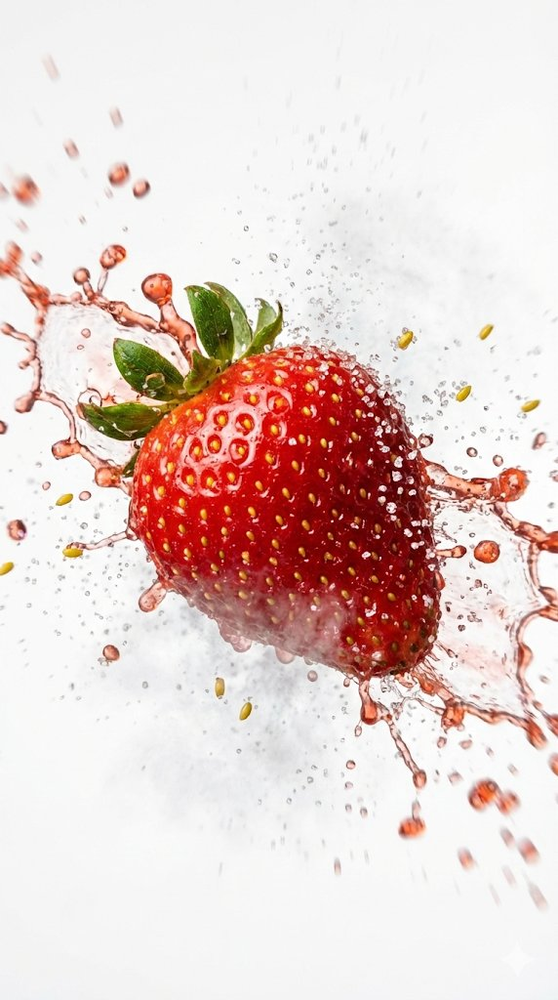
</div>

**提示词：**
```
{   "project_configuration": {     "shot_type": "macro_high_speed_photography",     "global_settings": {       "aspect_ratio": "9:16",       "chaos_weight": 20,       "color_profile": "high-key_warm_golden",       "environment": {         "backdrop": "clean_white_studio_infinity",         "lighting_style": "hard_rim_light_for_texture_emphasis",         "atmosphere": "hot_steam_and_action"       }     },     "camera_optics": {       "body": "Canon EOS R5",       "lens": "100mm f/2.8 Macro",       "depth_of_field": "sharp_focus_on_crust_details",       "shutter_speed": "1/8000s_freeze_motion"     }   },   "scene_data": [     {       "id": "main_subject_group",       "snack_component": {         "type": "[INSERT INPUT SUBJECT HERE]",         "surface": "[DESCRIBE TEXTURE, e.g., extra_crispy_golden_scales]",         "physics": "mid-air_impact_vibration",         "action_dynamics": "crunchy_shatter_effect"       },       "particle_system": {         "density": "high_density_explosion",         "spices": ["[DERIVED SPICE 1]", "[DERIVED SPICE 2]"],         "debris": ["[DERIVED CRUMBS]", "[DERIVED DUST/STEAM]"],         "motion_blur": "slight_radial_blur_on_edges"       }     }   ] }
```

<a id="prompt-1067"></a>
## 案例 1067：黑白肖像里的静谧思绪 (来源 [@rovvmut_](https://x.com/rovvmut_/status/2007403546556412387?referrer=opennana.com)) 模型：Nano banana pro

<div style="display: flex; justify-content: space-between;">

</div>

**提示词：**
```
{
"image_type": "photographic portrait",
"orientation": "vertical",
"composition": {
"framing": "tight medium close-up",
"crop": "subject cropped at mid-torso with head and hand dominating frame",
"angle": "three-quarter profile",
"camera_position": "slightly above eye level",
"subject_placement": "subject positioned slightly off-center to the right",
"negative_space": "minimal, concentrated on left background"
},
"subject": {
"gender_presentation": "male",
"approximate_age_range": "late 20s to mid 30s",
"pose": "head tilted downward, hand raised to temple in contemplative gesture",
"facial_expression": "pensive, introspective, serious",
"gaze_direction": "downward, unfocused",
"hair": {
"style": "short, tousled, textured",
"tone": "dark"
},
"facial_hair": {
"type": "short stubble beard",
"density": "medium"
},
"clothing": {
"upper_garment": "long-sleeve knit sweater",
"texture": "ribbed or woven fabric",
"tone": "dark"
},
"accessories": {
"watch": {
"type": "analog wristwatch",
"band": "leather strap",
"dial": "minimalist, light-colored face",
"style": "classic, understated"
}
}
},
"lighting": {
"type": "studio lighting",
"style": "low-key",
"direction": "side lighting from upper left",
"contrast": "high contrast with deep shadows",
"highlights": "strong highlights on forehead, nose, cheekbone, and hand",
"shadow_falloff": "soft but pronounced on right side of face and body"
},
"color": {
"palette": "monochrome",
"dominant_tones": [
"black",
"charcoal gray",
"soft gray",
"off-white highlights"
],
"saturation": "none",
"contrast_level": "high"
},
"background": {
"type": "studio backdrop",
"texture": "smooth with subtle gradient",
"tone": "dark gray to near black",
"detail_level": "minimal, distraction-free"
},
"focus_and_depth": {
"focus": "sharp on face and hand",
"depth_of_field": "shallow to moderate",
"background_blur": "soft, unobtrusive"
},
"technical_characteristics": {
"photographic_style": "fine art portrait",
"likely_lens": "short telephoto (approx. 85mm equivalent)",
"aperture_character": "wide aperture look",
"grain": "very fine, minimal noise",
"sharpness": "high subject clarity with smooth tonal transitions"
},
"mood_and_tone": {
"emotional_quality": "introspective, somber, reflective",
"aesthetic": "minimalist, dramatic, cinematic",
"visual_narrative": "moment of private thought or emotional weight"
},
"post_processing": {
"black_and_white_conversion": "high quality monochrome conversion",
"contrast_adjustment": "enhanced contrast",
"clarity": "moderate clarity applied to facial features",
"vignette": "subtle edge darkening"
},
"artistic_references": {
"style_influences": [
"classic black-and-white portrait photography",
"cinematic character studies",
"editorial fashion portraiture"
]
}
}
```

**中文提示词：**
```
{
"image_type": "摄影肖像",
“方向”: “垂直”，
“作品”： {
“构图”：“紧凑的中近景”，
“裁剪”：画面中只保留了人物的躯干中部，头部和手占据了画面的大部分空间。
“角度”: “四分之三侧面”
"camera_position": "略高于视线水平",
"subject_placement": "subject located slightly offcenter to right",
"负空间": "极简，集中于左侧背景"
},
“主题”： {
"gender_presentation": "男",
"approximate_age_range": "20多岁到30多岁之间",
“姿势”：“头部向下倾斜，一只手抬到太阳穴，做出沉思的姿势”，
"facial_expression": "沉思的，内省的，严肃的",
"gaze_direction": "向下，未聚焦",
“头发”： {
“风格”：“短款、蓬松、有纹理”，
色调：暗色调
},
"facial_hair": {
“类型”：“短茬胡须”，
“密度”： “中等”
},
“衣服”： {
"upper_garment": "长袖针织毛衣",
“纹理”: “罗纹或编织面料”，
色调：暗色调
},
“配件”： {
“手表”： {
类型：模拟腕表，
"表带": "皮带",
“表盘”：“简约浅色表盘”，
风格：经典、低调
}
}
},
“灯光”： {
类型： “影棚灯光”，
“风格”：“低调”，
“方向”：“来自左上方的侧光”，
“对比度”：“高对比度，带有深阴影”，
“高光”：“额头、鼻子、颧骨和手部有明显的高光”，
"shadow_falloff": "脸部和身体右侧柔和但明显"
},
“颜色”： {
“调色板”： “单色”，
"主音": [
“黑色的”，
“炭灰色”，
“柔和的灰色”，
“米白色高光”
],
“饱和度”: “无”，
"contrast_level": "高"
},
“背景”： {
"type": "摄影棚背景",
“纹理”：“光滑，带有微妙的渐变”，
色调：深灰色到近黑色，
"detail_level": "极简，无干扰"
},
"focus_and_depth": {
“焦点”: “清晰地聚焦在脸部和手部”
"景深": "浅至中等",
"background_blur": "柔和、不突兀"
},
"technical_characteristics": {
"photographic_style": "艺术肖像",
"likely_lens": "短焦远摄镜头（约 85mm 等效焦距）",
"aperture_character": "大光圈外观",
“颗粒感”：“非常细腻，噪音极小”，
“清晰度”： “主体清晰度高，色调过渡平滑”
},
"mood_and_tone": {
"emotional_quality": "内省的，忧郁的，沉思的",
“美学”：“极简主义、戏剧化、电影化”，
“视觉叙事”： “私人思考或情感重压的时刻”
},
"post_processing": {
"black_and_white_conversion": "高质量单色转换",
"对比度调整": "增强对比度",
“清晰度”： “对面部特征应用适度清晰度”，
“渐晕”： “边缘轻微变暗”
},
"artistic_references": {
"style_influences": [
“经典的黑白肖像摄影”，
“电影式人物研究”，
“时尚人物肖像”
]
}
}
```

<a id="prompt-1066"></a>
## 案例 1066：铂金发丝的晨间自拍 (来源 [@lexx_aura](https://x.com/lexx_aura/status/2007490238961295592?referrer=opennana.com)) 模型：Nano banana pro

<div style="display: flex; justify-content: space-between;">
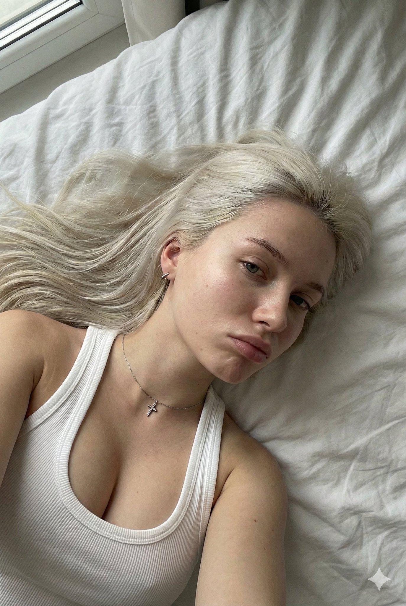
</div>

**提示词：**
```
{
  "prompt_type": "Ultra-Photorealistic Image Generation",
  "subject": {
    "demographics": "Young woman, roughly 20s",
    "hair": {
      "color": "Platinum blonde",
      "style": "Long, straight to slightly wavy, loose and fanned out on the bed",
      "texture": "Silky, fine strands, realistic stray hairs visible"
    },
    "skin": {
      "tone": "Fair/Pale with warm undertones",
      "texture": "High fidelity skin texture, visible pores, natural skin sheen, slight flush on cheeks",
      "details": "Hyper-realistic skin imperfections"
    },
    "eyes": {
      "color": "Light (blue or grey)",
      "makeup": "Long defined eyelashes (mascara), subtle eyeliner",
      "gaze": "Looking slightly off-camera to the side, soft and dreamy"
    },
    "mouth": {
      "lips": "Full, natural pink shade, slight gloss or balm finish",
      "expression": "Relaxed, neutral to slightly parted lips, moody pout"
    }
  },
  "attire": {
    "clothing": "White ribbed tank top/camisole",
    "fit": "Tight-fitting, scoop neckline showing décolletage",
    "fabric_texture": "Soft cotton ribbing details visible"
  },
  "accessories": {
    "neck": "Thin silver chain necklace with a small cross pendant resting on the chest",
    "ears": "Small silver hoop earring visible on the left ear"
  },
  "pose_and_composition": {
    "position": "Lying down on back (supine)",
    "angle": "High-angle selfie perspective (point-of-view), close-up on face and upper torso",
    "framing": "Diagonal composition, head tilted to the right"
  },
  "environment": {
    "setting": "Bedroom, lying on a bed",
    "background": "White bed sheets/duvet",
    "texture": "Crumpled white fabric, soft folds, linen texture"
  },
  "lighting": {
    "type": "Soft diffused indoor light or window light",
    "quality": "Soft shadows, gentle highlights on the forehead, nose bridge, and chest",
    "mood": "Intimate, morning vibe, soft glow"
  },
  "styling_and_mood": {
    "aesthetic": "Y2K selfie, girl next door, candid, intimate, 'coquette' subtle undertones",
    "atmosphere": "Relaxed, alluring, lazy morning, authentic social media snapshot"
  },
  "camera_technical": {
    "style": "Smartphone photography or compact digital camera",
    "lens": "24mm wide-angle (simulating phone camera)",
    "aperture": "f/2.2",
    "focus": "Sharp focus on eyes and lips, slight depth of field blurring the hair edges",
    "resolution": "8k, RAW photo, ultra-detailed",
    "processing": "Natural color grading, slight desaturation, realistic contrast"
  }
}
```

**中文提示词：**
```
{
"prompt_type": "超逼真图像生成",
“主题”： {
“人口统计信息”：“年轻女性，大约20多岁”，
“头发”： {
“颜色”： “铂金色”，
“发型”：“长直发或略带波浪，蓬松地散落在床上”，
“质感”：“丝滑细腻的发丝，可见逼真的散落发丝”
},
“皮肤”： {
“色调”：“白皙/苍白，带有暖色调”，
“质感”：“高保真肌肤质感，可见毛孔，自然肌肤光泽，双颊略带红晕”，
“细节”：“超逼真的皮肤瑕疵”
},
"眼睛": {
“颜色”：“浅色（蓝色或灰色）”，
妆容：纤长浓密的睫毛（睫毛膏），淡淡的眼线
“凝视”：“目光略微移开镜头，柔和而梦幻”
},
“嘴”： {
“唇部”：“饱满自然的粉红色，略带光泽或润唇膏效果”，
“表情”：“放松，嘴唇微微张开，略带忧郁的嘟嘴”
}
},
着装：{
“服装”: “白色罗纹背心/吊带衫”，
“合身”： “紧身，圆领，露出锁骨”
"fabric_texture": "可见柔软的棉质罗纹细节"
},
“配件”： {
“脖子”：“一条细银链项链，胸前挂着一个小十字架吊坠”，
“耳朵”：左耳可见一枚小巧的银色耳环
},
"pose_and_composition": {
“体位”：“仰卧（仰面）”
“角度”：“高角度自拍视角（第一人称视角），面部和上半身特写”，
“构图”：“对角线构图，头部向右倾斜”
},
“环境”： {
“场景”：“卧室，躺在床上”，
“背景”：“白色床单/羽绒被”，
“质感”： “皱巴巴的白色布料，柔软的褶皱，亚麻质感”
},
“灯光”： {
“类型”：“柔和的漫射室内光或窗光”，
“品质”：“额头、鼻梁和胸前的柔和阴影和淡淡高光”，
“氛围”：“温馨的晨间氛围，柔和的光芒”
},
"styling_and_mood": {
“美学”：“千禧年自拍，邻家女孩，坦率，亲密，略带‘卖弄风情’的微妙意味”，
“氛围”：“轻松、迷人、慵懒的早晨，真实的社交媒体快照”
},
"camera_technical": {
“风格”：“智能手机摄影或小型数码相机”，
“镜头”: “24mm 广角（模拟手机摄像头）”
光圈：f/2.2，
“焦点”：“眼睛和嘴唇清晰对焦，略微虚化头发边缘”
“分辨率”：“8K，RAW照片，超高细节”，
“处理方式”：“自然色彩分级，轻微去饱和度，真实对比度”
}
}
```

<a id="prompt-1065"></a>
## 案例 1065：极简主义照片级写实平面广告 (来源 [@aziz4ai](https://x.com/aziz4ai/status/2007544730167501044?referrer=opennana.com)) 模型：Nano banana pro

<div style="display: flex; justify-content: space-between;">
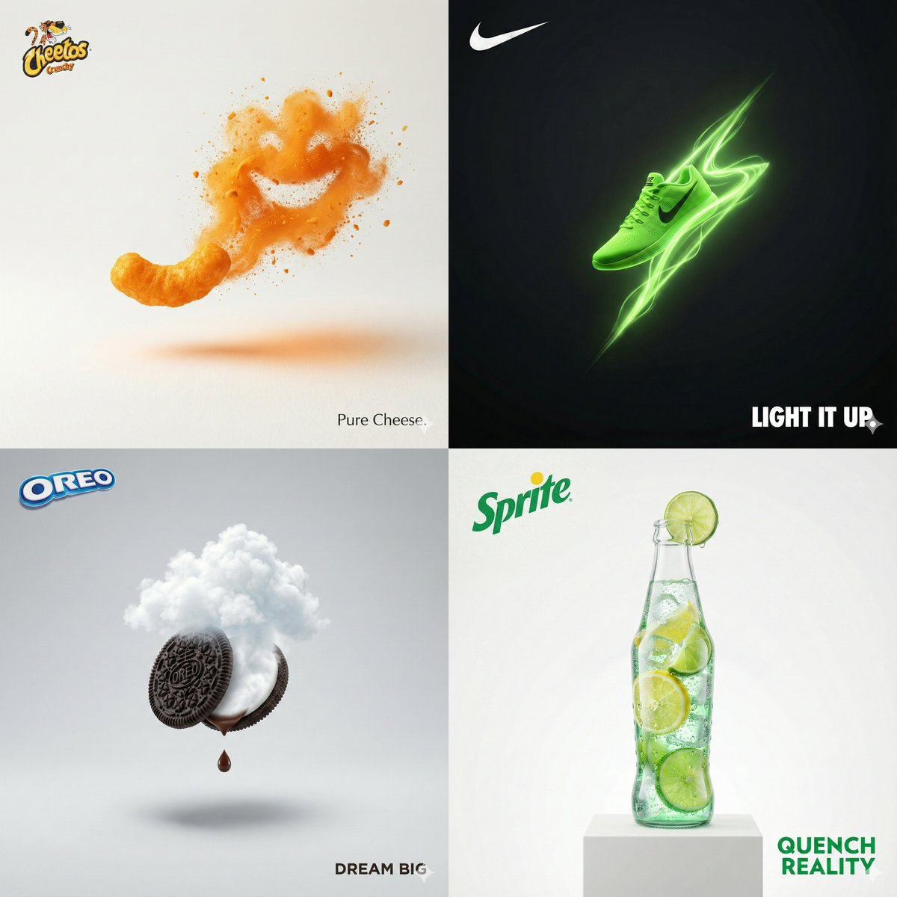
</div>

**提示词：**
```
Create a surreal minimalist photoreal print-ad using the INPUT only. Auto-detect the brand from the INPUT and add the brand’s REAL official logo (not a generic wordmark), high fidelity, correct proportions, clean vector/print look, placed top-left with subtle ink-like texture. Use one bold visual metaphor, 1 hero + 1 accent max, huge negative space, studio lighting, 8K ultra-sharp, premium print-ad composition. Add a two-word slogan bottom-right that matches the brand tone. No clutter, no watermark, no extra text. Aspect ratio 1:1
```

**中文提示词：**
```
仅使用输入素材，创作一幅超现实主义极简主义照片级写实平面广告。自动检测输入素材中的品牌，并添加品牌真正的官方标志（非通用文字商标），确保高保真度、正确比例、简洁的矢量/印刷效果，并将其放置在左上角，带有微妙的墨迹纹理。使用一个醒目的视觉隐喻，最多一个主视觉元素和一个辅助视觉元素，留出大量负空间，采用影棚灯光，8K超高清分辨率，打造优质平面广告构图。在右下角添加一个与品牌基调相符的双字标语。画面简洁，无水印，无额外文字。宽高比为1:1。
```

<a id="prompt-1064"></a>
## 案例 1064：金发碧眼身材健美的年轻女子 (来源 [@Just_sharon7](https://x.com/Just_sharon7/status/2007486143080927260?referrer=opennana.com)) 模型：Nano banana pro

<div style="display: flex; justify-content: space-between;">

</div>

**提示词：**
```
{
  "subject": {
    "person": "Young woman with blonde hair, athletic build",
    "expression": "Playful, tongue poking out, casual and relaxed",
    "pose": "Low-angle perspective, reclining back against a light-colored couch, looking directly at camera",
    "tattoos": [
      "Small chili pepper on the inner wrist",
      "Minimalist airplane on the forearm"
    ],
    "jewelry": "Delicate silver clover-style bracelet, small stud earrings"
  },
  "apparel": {
    "top": "Black form-fitting ribbed tank top or bodysuit",
    "bottom": "Matching black high-waisted leggings or yoga pants",
    "texture": "Visible fabric lint and soft matte finish"
  },
  "composition": {
    "camera_angle": "Extreme low angle, POV style, looking up from the lap area",
    "framing": "Close-up, wide-angle lens distortion typical of a smartphone selfie",
    "depth_of_field": "Shallow, with the foreground garment in sharp focus and the background slightly softened"
  },
  "environment": {
    "setting": "Modern bright living room interior",
    "furniture": "Cream-colored fabric sofa",
    "background_elements": [
      "Large windows with bright natural light",
      "Light blue insulated water bottle (tumbler) tucked beside the person",
      "Circular wall mirror in the background",
      "Minimalist white walls"
    ]
  },
  "lighting_and_color": {
    "lighting": "High-key, bright natural daylight, slightly overexposed background",
    "color_palette": "Neutral tones, whites, blacks, and a pop of light blue",
    "vibe": "Candid, casual, social media aesthetic"
  }
}
```

**中文提示词：**
```
{
“主题”： {
“人”: “金发碧眼、身材健美的年轻女子”
“表情”：“俏皮，吐着舌头，随意放松”
“姿势”：“低角度视角，向后靠在浅色沙发上，直视镜头”，
“纹身”：[
“手腕内侧的小辣椒”
“前臂上的极简主义飞机”
],
“珠宝”：“精致的银色四叶草手链，小巧的耳钉”
},
"服装": {
上衣：黑色修身罗纹背心或连体衣，
下装：搭配黑色高腰紧身裤或瑜伽裤
“质感”：“可见的织物绒毛和柔和的哑光效果”
},
“作品”： {
"camera_angle": "极低角度，POV风格，从腿部向上看",
“构图”：“智能手机自拍典型的近景广角镜头畸变”，
景深：浅景深，前景服装清晰对焦，背景略微柔化。
},
“环境”： {
“场景”: “现代明亮的客厅内部”，
“家具”：“米色布艺沙发”，
“背景元素”：[
“大窗户，自然光线充足”
“浅蓝色保温水瓶（水杯）放在人旁边”，
“背景中有一面圆形墙镜”，
“极简主义白墙”
]
},
"lighting_and_color": {
“照明”：“高调、明亮的自然日光，背景略微过曝”，
"color_palette": "中性色调、白色、黑色，以及一点浅蓝色",
氛围：坦率、随意、社交媒体美学
}
}
```

<a id="prompt-1063"></a>
## 案例 1063：浴室镜子自拍 (来源 [@gaucheai](https://x.com/gaucheai/status/2007552561868599765?referrer=opennana.com)) 模型：Nano banana pro

<div style="display: flex; justify-content: space-between;">
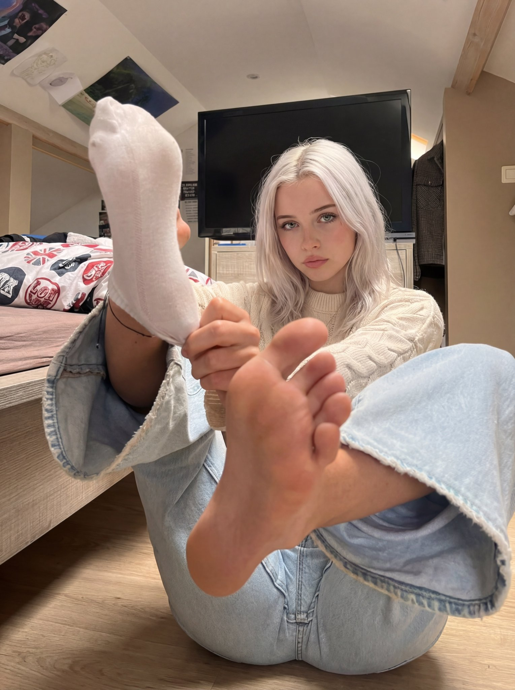
</div>

**提示词：**
```
{
  "scene": "bathroom mirror selfie, minimal outfit, casual home moment",

  "subject": {
    "character": "PLATINUM BLONDE GIRL, early 20s, slim petite frame",
    
    "face": {
      "structure": "soft delicate features, youthful, doll-like",
      "skin": "porcelain pale with pink blush on cheeks",
      "eyes": {
        "shape": "large doe eyes",
        "color": "light grey-green",
        "expression": "looking at phone screen, soft neutral"
      },
      "mouth": {
        "lips": "full, natural pink, relaxed slight pout"
      },
      "makeup": "minimal with pink blush, natural look"
    },
    
    "hair": {
      "color": "PLATINUM BLONDE white-silver",
      "length": "medium length",
      "texture": "straight, fine",
      "style": "pulled back in messy low bun, loose strands framing face",
      "shine": "natural"
    }
  },

  "pose": {
    "overall": "standing straight facing mirror, taking selfie with both hands on phone",
    
    "position": {
      "base": "standing in front of bathroom mirror",
      "orientation": "facing mirror directly, straight on"
    },
    
    "arms": {
      "both": "raised holding iphone with both hands at chest level",
      "hands": "both hands gripping phone to take photo"
    },
    
    "torso": {
      "direction": "facing forward",
      "posture": "straight, relaxed"
    },
    
    "hips": {
      "position": "neutral, slight natural curve"
    },
    
    "head": {
      "position": "straight, looking at phone screen",
      "expression": "soft, casual, slightly bored"
    }
  },

  "outfit": {
    "top": {
      "type": "white ribbed tank top",
      "material": "ribbed cotton",
      "fit": "fitted, cropped above belly button",
      "straps": "thin spaghetti straps",
      "color": "white"
    },
    
    "bottom": {
      "type": "novelty print underwear",
      "style": "hipster brief cut",
      "color": "white with printed design",
      "print": "funny cat face print on front",
      "fit": "fitted"
    }
  },

  "body": {
    "type": "slim, petite, natural",
    "midriff": "exposed flat stomach, belly button visible",
    "skin": "pale porcelain, smooth",
    "hips": "feminine curve"
  },

  "environment": {
    "location": "nice bathroom, modern upscale",
    
    "bathroom": {
      "walls": "white walls",
      "counter": "marble countertop, white and grey veining",
      "sink": "modern silver faucet visible to side",
      "mirror": "large wall mirror",
      "fixtures": "chrome towel bar visible",
      "shower": "glass shower door visible on left"
    },
    
    "details": {
      "towels": "white towels on rack and in basket",
      "cabinet": "dark wood vanity cabinet",
      "decor": "clean, minimal, upscale bathroom"
    }
  },

  "lighting": {
    "type": "bright bathroom lighting",
    
    "quality": {
      "intensity": "bright, even, flattering",
      "direction": "overhead and front facing"
    },
    
    "on_subject": {
      "skin": "smooth, even lighting",
      "hair": "platinum catching light"
    }
  },

  "photography": {
    "angle": "straight on mirror selfie",
    "framing": "from head to upper thighs",
    "focus": "sharp on subject",
    "style": "casual bathroom mirror selfie, candid instagram"
  },

  "color_palette": {
    "subject": {
      "hair": "PLATINUM white-silver blonde",
      "skin": "porcelain pale with pink blush",
      "top": "white",
      "underwear": "white with print"
    },
    "environment": {
      "walls": "white",
      "counter": "white grey marble",
      "cabinet": "dark wood",
      "overall": "clean white bathroom tones"
    }
  },

  "vibe": {
    "energy": "casual, candid, just woke up",
    "mood": "soft, relaxed, effortless",
    "aesthetic": "cute girl next door, intimate casual moment"
  },

  "critical_requirements": {
    "HAIR": "platinum blonde in messy low bun, loose strands",
    "FACE": "pink blush, soft expression, looking at phone",
    "POSE": "standing facing mirror, both hands holding phone",
    "TOP": "white ribbed cropped tank top, spaghetti straps",
    "BOTTOM": "white underwear with cute cat face print",
    "MIDRIFF": "exposed stomach and belly button",
    "SETTING": "upscale white bathroom, marble counter",
    "STYLE": "casual mirror selfie, both hands on phone"
  }
}
```

**中文提示词：**
```
{
“场景”：“浴室镜子自拍，极简装扮，休闲居家时光”

“主题”： {
“角色”：“金发碧眼女孩，20岁出头，身材苗条娇小”，

“脸”： {
“结构”：“柔和细腻的五官，青春靓丽，宛如洋娃娃”，
“肤色”：“瓷白如瓷，双颊泛着淡淡的粉红”，
"眼睛": {
“形状”：“大鹿眼”，
颜色：浅灰绿色，
“表情”：“看着手机屏幕，语气柔和中性”
},
“嘴”： {
“嘴唇”：饱满、自然的粉红色，微微嘟起的嘴唇
},
妆容：淡妆，粉色腮红，自然妆感
},

“头发”： {
“颜色”： “铂金色白银色”
"长度": "中等长度",
“质地”：“笔直，细腻”，
“发型”：“随意挽成一个低髻，几缕碎发垂在脸颊两侧”，
“光泽”： “自然”
}
},

"姿势": {
“总体而言”：“笔直地站在镜子前，双手拿着手机自拍”，

“位置”： {
“基地”：“站在浴室镜子前”，
“方向”: “正对镜子，正面朝向”
},

"武器": {
“两人”：“双手举起 iPhone，置于胸前”，
“双手”： “双手握着手机拍照”
},

"躯干": {
“方向”：“面向前方”，
“姿势”：“挺直，放松”
},

“臀部”： {
“位置”：“中性，略微自然的曲线”
},

“头”： {
“姿势”：“直视手机屏幕”，
“表情”：“柔和、随意、略带无聊”
}
},

“全套服装”： {
“顶部”： {
“类型”：“白色罗纹背心”，
“材质”: “罗纹棉”
“fit”： “修身，裁剪至肚脐以上”，
“肩带”： “细吊带”，
颜色：白色
},

“底部”： {
“类型”：“新奇印花内衣”，
“风格”：“潮人短发”，
颜色：白色，印有图案，
印花：正面印有有趣的猫脸图案，
“fit”： “fitted”
}
},

“身体”： {
类型：纤细、娇小、自然
“腹部”: “露出平坦的小腹，肚脐可见”
“皮肤”：“苍白的瓷器般光滑”，
“臀部”：“女性曲线”
},

“环境”： {
“位置”：“漂亮的浴室，现代高档”，

“浴室”： {
“墙”：“白墙”，
“台面”: “大理石台面，白色和灰色纹理”，
“水槽”：“侧面可见现代银色水龙头”，
"镜子": "大壁镜",
“固定装置”：“可见的镀铬毛巾架”，
“淋浴间”：“左侧可见玻璃淋浴门”
},

“细节”： {
“毛巾”：“架子上和篮子里的白色毛巾”，
“橱柜”: “深色木质梳妆台柜”
“装饰”：“干净、简约、高档的浴室”
}
},

“灯光”： {
类型：明亮的浴室照明，

“质量”： {
“强度”：“明亮、均匀、讨喜”，
“方向”：“朝上和朝前”
},

"on_subject": {
“皮肤”：“光滑、均匀的光线”，
“头发”：“铂金色闪耀光芒”
}
},

“摄影”： {
“角度”：“对着镜子自拍”，
“构图”：“从头部到大腿上部”，
“聚焦”：“清晰聚焦于主体”，
风格：随意的浴室镜前自拍，随意的Instagram照片
},

"color_palette": {
“主题”： {
“头发”： “铂金色白银金发”
“肤色”：“瓷白，略带粉红晕”，
顶部：白色，
内衣：白色印花款
},
“环境”： {
“墙”：“白色”，
“柜台”：“白色灰色大理石”，
“橱柜”： “深色木材”，
整体风格：干净的白色浴室色调
}
},

"氛围": {
“能量”：“随意、坦率、刚睡醒”
“情绪”：“柔和、放松、轻松”，
“美学”：“邻家可爱女孩，​​亲密随意的瞬间”
},

"critical_requirements": {
“头发”：“铂金色头发，随意地挽成低髻，几缕碎发散落一地”，
“脸部”：“泛红的脸颊，柔和的表情，看着手机”
“姿势”：“面对镜子站立，双手拿着手机”，
上衣：白色罗纹露脐吊带背心，细肩带
“下装”：“印有可爱猫脸图案的白色内裤”，
“中腹部”： “露出的腹部和肚脐”，
“场景”：“高档白色浴室，大理石台面”，
“风格”：“随意的镜前自拍，双手拿着手机”
}
}
```

<a id="prompt-1062"></a>
## 案例 1062：城市丝带 (来源 [@aleenaamiir](https://x.com/aleenaamiir/status/2007087774248439879?referrer=opennana.com)) 模型：Nano banana pro

<div style="display: flex; justify-content: space-between;">
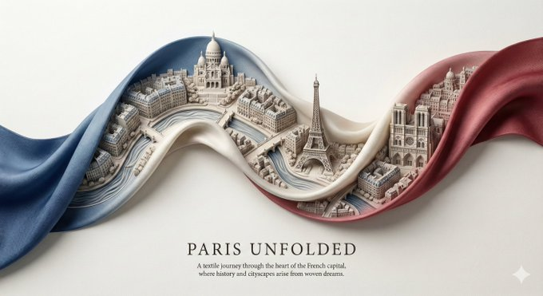
</div>

**提示词：**
```
A silk ribbon unfurls diagonally across the canvas, twisting gently in mid-air. Within the folds of the ribbon exists a miniature sculpted city of [CITY], carved as a 3D bas-relief emerging from woven fabric textures.

Inside the ribbon: Landmarks, streets, and skyline rhythms of [CITY], flowing naturally with the ribbon’s curvature, layered in subtle depth.

Style: Fabric realism fused with sculptural relief. Soft highlights, tactile folds, elegant poster design.

Color palette: Derived from the national flag of [COUNTRY], woven seamlessly into the fabric tones.
View & background: Top-down minimalist layout, off-white museum paper texture, strong negative space.

Typography: Title: “[CITY] UNFOLDED” Refined serif subtitle with poetic geographic language.

Composition rules: All architectural detail remains strictly inside the ribbon shape. Ultra-detailed, HDR, gallery-grade, 8K poster aesthetic.
```

**中文提示词：**
```
一条丝带斜向展开于画布之上，在半空中轻轻扭动。丝带的褶皱之中，隐藏着一座微缩的[城市]雕塑城市，以三维浮雕的形式从织物纹理中浮现而出。

丝带内部：[城市]的地标、街道和天际线韵律，随着丝带的弧度自然流动，层次分明，富有深度。

风格：织物质感与雕塑浮雕相融合。柔和的高光，触感丰富的褶皱，优雅的海报设计。

配色方案：源自[国家]国旗，无缝融入面料色调。
视图和背景：自上而下的极简布局，米白色博物馆纸张纹理，强烈的留白。

字体：标题：“[城市]展开” 精致的衬线字体副标题，配以诗意的地理语言。

构图规则：所有建筑细节均严格限制在带状区域内。超高清、HDR、画廊级、8K海报美学。
```

<a id="prompt-1061"></a>
## 案例 1061：路口转角反光镜 (来源 [@94vanAI](https://x.com/94vanAI/status/2007609243872932056)) 模型：Nano banana pro

<div style="display: flex; justify-content: space-between;">
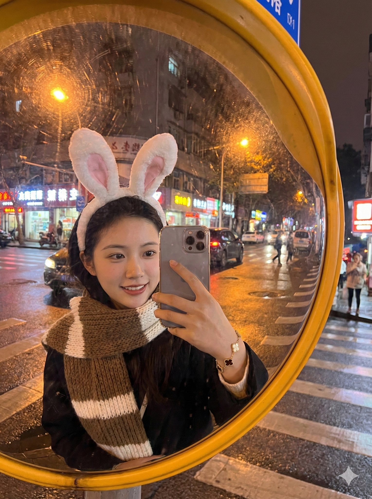
</div>

**提示词：**
```
｛Masterpiece, best quality, ultra detailed 8k resolution, sharp focus, cinematic lighting, depth of field, perfect composition, award-winning professional photography style, impeccable attention to detail, exquisite textures, close-up 1:1 scale macro shot, beautiful Chinese female idol girl taking mirror selfie in large convex road safety traffic mirror at urban street intersection corner at night, her cute face with big sparkling eyes, delicate features, long silky black hair, white bunny ears headband, wearing cozy brown and white striped scarf around neck, sweet idol-like expression, reflection in the convex mirror shows wide-angle distorted panoramic view of the intersection with her full cute figure, cars, pedestrians, buildings, street lights in dramatic fisheye distortion, her slender hand with elegant Van Cleef & Arpels Alhambra bracelet (gold clover motifs) visible reaching forward holding phone for selfie, soft comfortable nighttime ambiance, warm golden glow from street lamps and neon reflections illuminating the scene and mirror surface, golden hour tones mixed with gentle night blue, high dynamic range, realistic glass convex mirror texture, strong mirror reflections, photorealistic skin jewelry metal details, vibrant yet cozy colors, no text, no watermark.ar3:4
Negative prompt: low quality, blurry, deformed face hands, bad anatomy, extra limbs, mutated, ugly, poorly drawn, watermark, text, signature, overexposed, underexposed, cartoon, 3d render, horror, daytime bright sun.｝
```

**中文提示词：**
```
杰作，最佳画质，超高清8K分辨率，清晰对焦，电影级光影，景深完美，构图精妙，屡获殊荣的专业摄影风格，对细节的极致追求，精致的纹理，1:1微距特写，一位美丽的中国女偶像在夜色笼罩的城市十字路口，对着大型凸面交通安全镜自拍。她可爱的脸庞，明亮的大眼睛，精致的五官，柔顺的黑色长发，戴着白色兔耳朵发箍，脖子上围着舒适的棕白条纹围巾，甜美的偶像气质扑面而来。凸面镜的倒影呈现出十字路口的广角扭曲全景，她可爱的身影、汽车、行人、建筑物、路灯都以戏剧性的鱼眼畸变呈现。她纤细的手戴着优雅的梵克雅宝Alhambra手镯（金色四叶草图案），伸出手拿着手机自拍。柔和舒适的夜色氛围，路灯和霓虹灯的温暖金光照亮了场景和镜面，尽显黄金时刻的迷人风采。色调融合柔和的夜蓝色，高动态范围，逼真的玻璃凸面镜纹理，强烈的镜面反射，照片级逼真的皮肤、珠宝和金属细节，鲜艳而温馨的色彩，无文字，无水印。ar3:4
负面提示：低质量、模糊、面部和手部畸形、解剖结构错误、多余肢体、变异、丑陋、绘制粗糙、水印、文字、签名、曝光过度、曝光不足、卡通、3D渲染、恐怖、白天强光。
```

<a id="prompt-1060"></a>
## 案例 1060：极简空间的向上凝视 (来源 [@rovvmut_](https://x.com/rovvmut_/status/2007668589588025467)) 模型：Nano banana pro

<div style="display: flex; justify-content: space-between;">
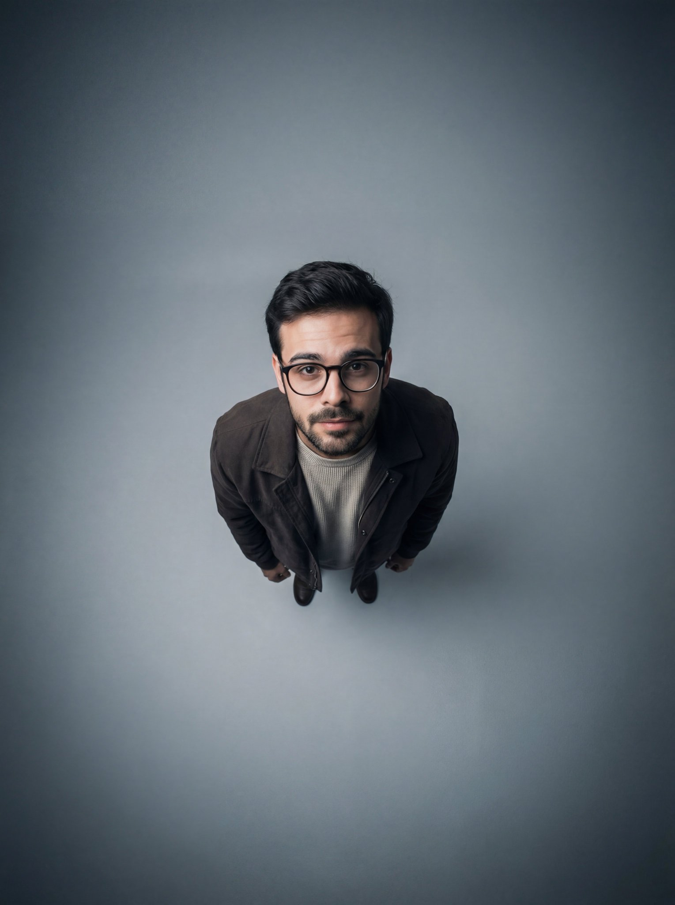
</div>

**提示词：**
```
{
"image_type": "photographic portrait",
"style": "studio portrait, cinematic, minimalist",
"composition": {
"orientation": "portrait",
"framing": "full body from extreme high angle",
"subject_position": "centered",
"camera_angle": "top-down (bird’s-eye / overhead)",
"lens_distortion": "strong wide-angle perspective exaggeration",
"negative_space": "extensive surrounding empty space",
"perspective": "dramatic overhead with subject looking up"
},
"subject": {
"count": 1,
"description": "young person with glasses",
"pose": "standing upright, shoulders slightly forward, arms relaxed",
"expression": "soft, introspective, mildly curious",
"gaze": "looking directly up at the camera",
"accessories": [
"round eyeglasses"
],
"clothing": {
"outerwear": "dark brown jacket",
"innerwear": "light-colored knit or textured shirt",
"style": "casual, understated"
}
},
"facial_details": {
"features": "rounded face, soft jawline",
"emotion": "calm, thoughtful",
"eye_emphasis": "enhanced by glasses and upward gaze"
},
"lighting": {
"type": "studio lighting",
"setup": "top-centered soft light with gradual falloff",
"contrast": "low to moderate",
"shadows": "subtle shadows beneath chin and body",
"vignette": "strong radial vignette darkening toward edges"
},
"color": {
"palette": [
"cool gray",
"charcoal",
"muted brown",
"soft beige"
],
"temperature": "cool-neutral",
"saturation": "low",
"mood": "quiet, contemplative"
},
"background": {
"environment": "studio",
"surface": "smooth seamless floor",
"gradient": "radial gradient from light center to dark edges",
"distractions": "none"
},
"technical_details": {
"camera_type": "digital",
"lens": "ultra-wide or fisheye-style wide-angle",
"depth_of_field": "deep (entire subject in focus)",
"sharpness": "high center sharpness with slight edge softness",
"noise": "minimal",
"post_processing": [
"contrast shaping",
"cool color grading",
"vignette enhancement",
"perspective exaggeration"
]
},
"artistic_elements": {
"concept": "isolation and vulnerability through scale and perspective",
"visual_metaphor": "small subject surrounded by vast empty space",
"aesthetic_influences": [
"editorial portrait photography",
"modern studio minimalism",
"cinematic overhead compositions"
]
},
"typography": {
"presence": false
},
"overall_mood": "intimate, introspective, slightly surreal",
"intended_use": [
"editorial portrait",
"conceptual photography reference",
"AI image generation style guide"
]
}
```

**中文提示词：**
```
{
"image_type": "摄影肖像",
“风格”：“影棚肖像、电影感、极简主义”，
“作品”： {
“方向”: “竖屏”
“构图”：“从极高角度拍摄的全身照”，
"subject_position": "居中",
"camera_angle": "俯视（鸟瞰/上方）",
"lens_distortion": "强烈的广角透视夸张",
"负空间": "大片的周围空白空间",
“视角”： “戏剧性的俯视视角，主体向上看”
},
“主题”： {
“计数”：1，
描述：戴眼镜的年轻人
“姿势”：“站直，肩膀略微前倾，手臂放松”，
“表情”：“柔和、内省、略带好奇心”
“凝视”：“直视镜头”，
“配件”： [
圆形眼镜
],
“衣服”： {
“外套”：“深棕色夹克”，
“内衣”： “浅色针织或纹理衬衫”，
风格：休闲、低调
}
},
"facial_details": {
“特征”：“圆脸，柔和的下颌线条”，
“情绪”：“平静，深思熟虑”，
"eye_emphasis": "因眼镜和向上凝视而增强"
},
“灯光”： {
类型： “影棚灯光”，
“设置”：“顶部中心柔光，逐渐衰减”，
“对比度”：“低到中等”，
“阴影”：“下巴和身体下方的微妙阴影”，
“渐晕”： “边缘逐渐变暗的强烈放射状渐晕”
},
“颜色”： {
“调色板”：[
“冷灰色”，
“木炭”，
“柔和的棕色”，
柔和米色
],
“温度”: “冷中性”
“饱和度”：“低”，
“情绪”：“安静，沉思”
},
“背景”： {
“环境”: “工作室”，
“表面”：“光滑无缝的地板”，
“渐变”: “从亮中心到暗边缘的径向渐变”，
“干扰因素”： “无”
},
"technical_details": {
"camera_type": "digital",
“镜头”：“超广角或鱼眼镜头式广角镜头”，
"depth_of_field": "deep (整个主体都清晰对焦)",
“锐度”：中心锐度高，边缘略微柔和，
“噪音”：“极小”，
“后处理”：[
“对比塑造”，
“冷色调分级”，
“场景增强”，
“透视夸张”
]
},
“artistic_elements”：{
“概念”：“通过规模和视角展现孤立和脆弱性”，
"视觉隐喻": "被广阔的空旷空间包围的小主体",
"aesthetic_influences": [
“编辑肖像摄影”，
“现代工作室极简主义”，
“电影式俯视构图”
]
},
"排版": {
“存在”：否
},
"overall_mood": "亲密、内省、略带超现实感"
"预期用途": [
“编辑肖像”，
“概念摄影参考资料”
“AI图像生成风格指南”
]
}
```

<a id="prompt-1059"></a>
## 案例 1059：活力四射的自拍 (来源 [@BubbleBrain](https://x.com/BubbleBrain/status/2007667561396109358)) 模型：Nano banana pro

<div style="display: flex; justify-content: space-between;">
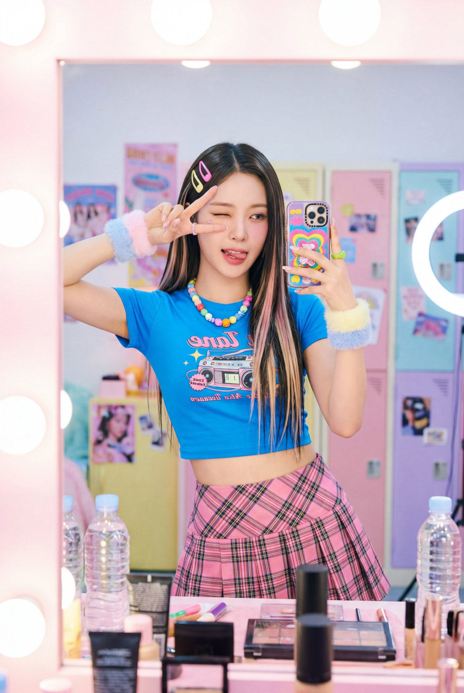
</div>

**提示词：**
```
{
  "configuration": {
    "version": "2.0",
    "format": "Mirror-Selfie Portrait",
    "target_resolution": "8K UHD",
    "style_preset": "K-Pop Idol Aesthetic / Y2K Colorful"
  },
  "subject_profile": {
    "biometrics": {
      "ethnicity": "Korean",
      "physique": "Slim, toned, fit K-pop idol figure",
      "facial_id": "Cute and sexy, small face, doll-like features",
      "skin_texture": "Flawless, slight glow (glass skin), rosy cheeks",
      "hair": "Long straight hair with colorful highlights (pink or blonde streaks)"
    },
    "expression_and_gaze": {
      "mouth": "Playful smile, tongue slightly teasing or bubblegum blowing",
      "eyes": "Winking one eye, looking at phone screen, sparkling",
      "head_angle": "Tilted to the side, playful vibe"
    },
    "kinematics": {
      "upper_body": "Leaning forward slightly towards the mirror",
      "hand_gesture": "Free hand making a Peace (V) sign near the eye",
      "holding_device": "Smartphone with a bulky, colorful deco case",
      "positioning": "Dynamic composition, not stiff"
    }
  },
  "wardrobe_details": {
    "note": "Focus on high saturation and contrasting colors",
    "top_layer": {
      "item": "Cropped baby tee",
      "color": "Electric Blue with retro graphic print",
      "fit": "Tight fit, showing midriff"
    },
    "bottom_layer": {
      "item": "Low-rise pleated mini skirt",
      "color": "Hot Pink or Plaid",
      "style": "Y2K schoolgirl vibe"
    },
    "accessories": {
      "items": ["Chunky colorful plastic beads necklace", "Fuzzy wristbands", "Large hair clips"],
      "vibe": "Maximalist, retro fun"
    }
  },
  "environment_architecture": {
    "background": {
      "location": "Idol Dressing Room / Backstage",
      "walls": "Pastel colored lockers or posters in background",
      "clutter": "Makeup products, water bottles visible but blurred"
    },
    "setting": {
      "mirror_type": "Large vanity mirror with light bulbs",
      "vibe": "Energetic, backstage chaos, colorful"
    }
  },
  "lighting_and_optics": {
    "illumination": {
      "type": "Soft High-Key Lighting",
      "source": "Ring light or Vanity mirror bulbs (Hollywood lights)",
      "effect": "Bright face illumination, circular catchlights in eyes, no harsh shadows"
    },
    "camera_simulation": {
      "lens_type": "Wide angle smartphone lens simulation",
      "color_grading": "Vibrant, Fuji Pro 400H emulation, pastel tones boosted",
      "focus": "Sharp focus on face and outfit details"
    }
  }
}
```

**中文提示词：**
```
{
“配置”： {
版本： 2.0，
"格式": "镜像自拍肖像",
"target_resolution": "8K UHD",
"style_preset": "K-Pop偶像美学/Y2K多彩风格"
},
"subject_profile": {
"生物识别"：{
“种族”: “韩国人”
“体型”：“纤细、健美、匀称的韩国流行偶像身材”，
"facial_id": "可爱性感，小脸，娃娃般的五官",
"skin_texture": "无瑕，略带光泽（玻璃肌），红润双颊"
“头发”： “带有彩色挑染（粉色或金色挑染）的长直发”
},
"expression_and_gaze": {
“嘴巴”：“俏皮的微笑，舌头微微挑逗或吹泡泡糖”，
“眼睛”：“眨着一只眼睛，看着手机屏幕，闪闪发光”，
“头部角度”： “侧身倾斜，充满俏皮感”
},
“运动学”：{
“上半身”：“身体略微前倾，朝向镜子”，
"hand_gesture": "用空着的手在眼睛附近做出和平(V)手势",
"holding_device": "带有厚重、色彩鲜艳的装饰外壳的智能手机",
“定位”：“动态构图，而非僵硬构图”
}
},
"wardrobe_details": {
注意：注重高饱和度和对比鲜明的颜色。
"top_layer": {
“商品”: “露脐婴儿T恤”
颜色：电光蓝，带有复古图案印花，
“贴身”： “紧身，露出腰部”
},
"bottom_layer": {
“商品”： “低腰百褶迷你裙”
颜色：亮粉色或格子图案
风格：Y2K 女学生风
},
“配件”： {
“物品”：[“粗犷彩色塑料珠项链”、“毛绒手环”、“大号发夹”]
氛围：极致主义、复古趣味
}
},
"environment_architecture": {
“背景”： {
地点：偶像更衣室/后台
“墙壁”：“背景中是粉彩色的储物柜或海报”，
“杂物”： “化妆品、水瓶清晰可见，但已模糊”
},
“环境”： {
"mirror_type": "带灯泡的大型梳妆镜",
氛围：充满活力，后台一片混乱，色彩缤纷
}
},
"lighting_and_optics": {
"照明": {
“类型”：“柔和高调照明”，
“光源”：“环形灯或化妆镜灯泡（好莱坞灯）”
“效果”：“面部光线明亮，眼神光呈圆形，没有生硬的阴影”
},
"camera_simulation": {
"lens_type": "广角智能手机镜头模拟",
"color_grading": "鲜艳，富士Pro 400H模拟，增强柔和色调",
“焦点”： “清晰聚焦于面部和服装细节”
}
}
}
```

<a id="prompt-1058"></a>
## 案例 1058：新中式水墨绘本 (来源 [@VoxcatAI](https://x.com/VoxcatAI/status/2007732771851252126)) 模型：Nano banana pro

<div style="display: flex; justify-content: space-between;">
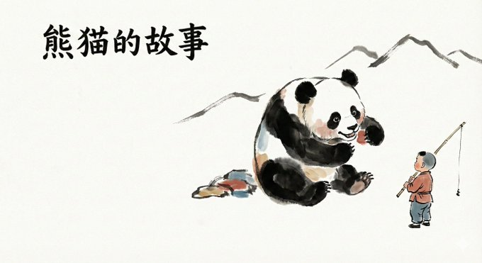
</div>

**中文提示词：**
```
新中式水墨绘本，致敬80年代上美影风格。强调大巧若拙的毛笔触感与宣纸纹理，低饱和矿物色，极简留白构图。画面人物为主体视觉，比例3:4，[此处替换你的主体描述]。
```

<a id="prompt-1057"></a>
## 案例 1057：咖啡馆的雨天小确幸 (来源 [@oggii_0](https://x.com/oggii_0/status/2007778306490544234)) 模型：Nano banana pro

<div style="display: flex; justify-content: space-between;">
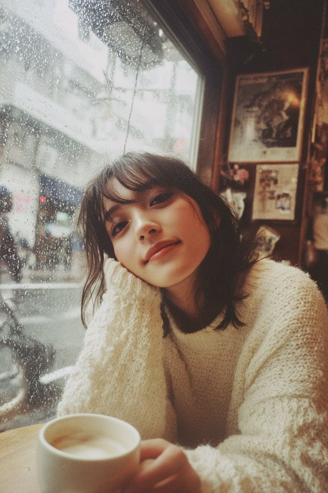
</div>

**提示词：**
```
{
  "subject": {
    "description": "Young woman,  East Asian, late teens to early 20s. Fair skin tone. She is leaning forward, resting her chin in her right palm in a relaxed, casual pose.",
    "expression": "Soft, gentle smile with a direct, warm gaze at the viewer. The expression is contemplative and serene.",
    "pose": "Seated, head propped on hand, other hand holding a mug handle."
  },
  "clothing": {
    "top": "Oversized, chunky cable-knit sweater in a creamy white or ivory color. The fabric appears thick, soft, and textured."
  },
  "hair": {
    "color": "Dark brown or black.",
    "style": "Medium length, loose and slightly tousled waves. Wispy bangs (fringe) fall across the forehead, framing the face naturally."
  },
  "face": {
    "makeup": "Natural, 'no-makeup' makeup look. Soft pink tint on lips and cheeks, subtle definition around the eyes."
  },
  "accessories": {
    "items": "A simple white ceramic mug containing a hot beverage with a frothy top (latte or cappuccino)."
  },
  "environment": {
    "setting": "Inside a cozy café, seated immediately next to a large glass window.",
    "details": "Raindrops are heavily beaded on the window pane. Through the glass, a blurred urban street scene is visible (rainy gray tones). Behind the subject, the café interior features warm wood paneling and framed posters or art.",
    "weather": "Rainy, overcast day."
  },
  "lighting": {
    "source": "Natural, diffused window light coming from the left side of the frame.",
    "quality": "Soft and flattering, creating gentle highlights on the face and hair while casting subtle shadows on the right side.",
    "tone": "Warm and slightly nostalgic, despite the cool rainy exterior."
  },
  "camera": {
    "shot_type": "Medium close-up (head and shoulders).",
    "focus": "Sharp focus on the subject's eyes and face. Shallow depth of field (bokeh) blurs the background interior and the rainy street outside.",
    "perspective": "Eye-level, intimate."
  },
  "style": {
    "aesthetic": "Film photography look (analog style), slightly grainy texture, warm vintage color grading.",
    "mood": "Cozy, intimate, melancholic but comforting, 'hygge', cinematic slice-of-life."
  }
}
```

**中文提示词：**
```
{
“主题”： {
描述：年轻女子，东亚裔，年龄在十几岁末到二十岁出头。肤色白皙。她身体前倾，右手托着下巴，姿态放松随意。
“表情”：“柔和的微笑，目光直接而温暖地注视着观者。表情沉思而宁静。”
“姿势”：“坐着，头靠在一只手上，另一只手拿着杯子把手。”
},
“衣服”： {
“上衣”：“宽松的粗针织毛衣，奶油白或象牙色。面料看起来厚实、柔软且有质感。”
},
“头发”： {
颜色：深棕色或黑色。
“发型”：“中等长度，蓬松略带凌乱的波浪卷发。轻盈的刘海垂落在额前，自然地修饰脸型。”
},
“脸”： {
“妆容”：“自然裸妆效果。唇颊泛着柔和的粉色，眼周轮廓略加修饰。”
},
“配件”： {
“物品”：“一个简单的白色陶瓷杯，里面装着一杯顶部有泡沫的热饮（拿铁或卡布奇诺）。”
},
“环境”： {
“场景”：“在一家舒适的咖啡馆里，紧挨着一扇大玻璃窗。”
细节：雨滴密密麻麻地挂在窗玻璃上。透过玻璃，可以看到模糊的城市街景（雨后的灰色调）。在人物身后，咖啡馆内部装饰着温暖的木质镶板​​和装裱好的海报或艺术品。
“天气”：“阴雨天。”
},
“灯光”： {
“光源”：“来自画面左侧的自然漫射窗光。”
“品质”：“柔和且富有修饰效果，在脸部和头发上打造柔和的高光，同时在右侧投下微妙的阴影。”
“基调”：“尽管外面阴雨绵绵，却透着一丝温暖和怀旧的气息。”
},
“相机”： {
"shot_type": "中近景（头部和肩部）"
“焦点”： “清晰对焦于拍摄对象的眼睛和面部。浅景深（散景）模糊了室内背景和雨中的室外街道。”
“视角”：“平视，亲密。”
},
“风格”： {
“美学”：“胶片摄影风格（模拟风格），略带颗粒感的质感，温暖的复古色彩调校。”
“氛围”：“温馨、亲密、忧郁但令人感到舒适，充满‘hygge’氛围，宛如电影般的生活片段。”
}
}
```

<a id="prompt-1056"></a>
## 案例 1056：与手机原图同框的铅笔肖像 (来源 [@94vanAI](https://x.com/94vanAI/status/2007642418816876930)) 模型：Nano banana pro

<div style="display: flex; justify-content: space-between;">

</div>

**提示词：**
```
｛perfect composition, impeccable attention to detail, highest quality, rich detail, sharp focus, 8K/4K resolution, clear edges, exquisite details, perfect composition, depth of field, cinematic lighting, vibrant colors, award-winning style, professional level, perfect depiction. Create an extremely detailed, hyper-realistic 3D graphite pencil sketch depicting the face of a Chinese idol girl, drawn on textured white notebook paper with clear paper quality, delicate details, and subtle imperfections. The facial sketch should be perfectly identical to the reference photo displayed on an iPhone placed next to the notebook. The iPhone screen clearly displays the artist's original portrait photograph with natural reflections and soft sunlight reflections on the glass. The watermark is mandatory and must not be omitted, modified, adjusted, rotated, hidden, stylized, or replaced under any circumstances. The generator must prioritize the readability and boldness of the "Watercolour" text over all other visual elements. The watermark is essential: the final image must contain the watermark in the lower left corner. This watermark must be a white square with a fixed size of 10x10 pixels. Within this square, the Gothic handwritten font "ur name" must appear. The Gothic handwritten "ur name" text must be: - Fully readable - Bold Arial font - Solid black (#000000) - Centered - Sharp, clean, and unadorned - No blurring, distortion, or pixelation. The white square must be: - Completely opaque - Clean and sharp edges - Unblurred, opaque, and textureless. This watermark is mandatory and cannot be omitted; it must not be modified, adjusted, rotated, hidden, stylized, or replaced under any circumstances. The generator must prioritize the readability and coarseness of the "ur name" text over all other visual elements.｝
```

<a id="prompt-1055"></a>
## 案例 1055：国际顶流时尚杂志封面 (来源 [@msjiaozhu](https://x.com/msjiaozhu/status/2007446691235148270)) 模型：Nano banana pro

<div style="display: flex; justify-content: space-between;">

</div>

**提示词：**
```
{
  "meta": {
    "system_instruction": "Create a high-end fashion magazine cover. Use the uploaded face for strict identity preservation.",
    "aspect_ratio": "3:4",
    "quality": "ultra-detailed",
    "resolution": "8k",
    "style": "Met Gala red carpet event, direct flash photography, glamorous celebrity candid"
  },

  "reference_usage": {
    "instruction": "Strictly preserve facial identity (eyes, nose, mouth) from the uploaded reference. Body proportions should be model-like and tall.",
    "focus": "100% Face Identity Match"
  },

  "scene": {
    "location": "The Met Gala Red Carpet (New York)",
    "environment": [
      "chaotic background with paparazzi cameras",
      "red velvet ropes",
      "bursts of camera flashes (bokeh orbs)",
      "dark night sky contrast"
    ],
    "atmosphere": "electric, exclusive, superstar energy"
  },

  "lighting": {
    "type": "Direct Flash (Paparazzi Style)",
    "effect": "High contrast hard light, glistening skin, sharp shadows behind the subject, bright reflections on dress"
  },

  "subject": {
    "face": {
      "expression": "Seductive confident smile, looking back over shoulder",
      "makeup": "bold red lip, sharp contouring, glowing highlighter"
    },
    "pose": {
      "action": "walking away but turning head 45 degrees to look at camera",
      "body": "elegant posture, back slightly arched",
      "hair": "blowing dramatically in the wind"
    },
    "outfit": {
      "dress": "Futuristic liquid-metal silver gown",
      "details": "backless design, reflecting the camera flashes, sequin texture",
      "jewelry": "Diamond choker, large stud earrings"
    }
  },

  "composition": {
    "layout": "Magazine Cover Layout",
    "branding": {
      "main_logo": "Large bold 'Harper's BAZAAR' logo at the top in white or silver",
      "text_elements": [
        "Include Chinese text subtitles on the side",
        "Small text: '红毯之夜' (Night of the Red Carpet)",
        "Headline: '独家直击' (Exclusive Look)",
        "Bottom text: '年度风尚大典' (Fashion Awards of the Year)"
      ]
    }
  },

  "vibe": "Luxurious, expensive, A-list celebrity, glossy magazine finish",
  "negative_prompt": "low resolution, ugly hands, distorted face, missing logo, text error, watermark, casual clothing, daylight, soft lighting"
}
```

<a id="prompt-1054"></a>
## 案例 1054：逆光发梢的温柔怅惘 (来源 [@oggii_0](https://x.com/oggii_0/status/2007492122933628997)) 模型：Nano banana pro

<div style="display: flex; justify-content: space-between;">

</div>

**提示词：**
```
{
  "subject": {
    "description": "Young East Asian woman, positioned in profile turning to look back at the viewer.",
    "pose": "Looking over shoulder, slight head tilt, body angled away from camera.",
    "expression": "Soft, neutral to slightly melancholic, contemplative gaze, lips slightly parted."
  },
  "clothing": {
    "upper_body": "Dark, structured jacket or blazer, possibly pinstriped or textured fabric.",
    "visibility": "Mostly obscured by shadow and foreground elements."
  },
  "hair": {
    "color": "Dark brown to black.",
    "style": "Long, loose, tousled waves, slightly messy texture.",
    "lighting_interaction": "Strongly backlit, creating a glowing halo effect on loose strands (rim lighting)."
  },
  "face": {
    "skin_tone": "Fair/pale with warm undertones.",
    "features": "Soft facial structure, almond-shaped eyes, natural eyebrows.",
    "makeup": "Minimal, 'no-makeup' look, natural lip color."
  },
  "accessories": {
    "visible_items": "None clearly visible due to framing and lighting."
  },
  "environment": {
    "setting": "Cluttered interior space, resembling a workshop, storage room, or old bookstore.",
    "background_elements": "Wooden shelves stacked with indistinct objects, papers, boxes, and plastic packaging.",
    "foreground_elements": "Blurred translucent objects (possibly glass, plastic sheets, or dust covers) creating layers and reflections."
  },
  "lighting": {
    "source": "Natural sunlight streaming through a window on the left.",
    "quality": "Golden hour, warm, diffuse but directional.",
    "effects": "Strong backlighting/rim lighting on hair, volumetric dust motes dancing in the light, lens flares, soft glare, dramatic contrast between light and shadow."
  },
  "camera": {
    "perspective": "Eye-level, shot through a foreground obstruction (glass or clutter).",
    "focus": "Shallow depth of field (bokeh), sharp focus on eyes/face, blurred background and foreground.",
    "lens_character": "Soft focus, film grain simulation, slight bloom effect."
  },
  "style": {
    "aesthetic": "Cinematic, atmospheric, nostalgic, slice-of-life, ethereal.",
    "mood": "Dreamy, intimate, quiet, sentimental.",
    "visual_reference": "Film photography, Japanese photobook style."
  }
}
```

**中文提示词：**
```
{
“主题”： {
描述：一位年轻的东亚女性，侧身站立，转身看向观众。
“姿势”：“回头看，头部微微倾斜，身体侧向镜头。”
“表情”：“柔和、中性或略带忧郁的沉思眼神，嘴唇微微张开。”
},
“衣服”： {
“上身装”：“深色修身夹克或西装外套，可能是细条纹或纹理面料。”
“可见性”：“大部分被阴影和前景元素遮挡。”
},
“头发”： {
颜色：深棕色至黑色。
“发型”：“长长的、松散的、蓬松的波浪卷，略显凌乱的质感。”
"lighting_interaction": "强烈的背光照射，在散落的发丝上形成发光的光晕效果（轮廓光）。"
},
“脸”： {
“肤色”: “白皙/苍白，带有暖色调。”
五官特征：柔和的脸型，杏仁眼，自然眉形。
“妆容”：“极简的‘裸妆’，自然的唇色。”
},
“配件”： {
"visible_items": "由于取景和光线原因，没有清晰可见的项目。"
},
“环境”： {
“场景”：“杂乱的室内空间，类似工作室、储藏室或旧书店。”
“背景元素”： “木架上堆放着一些模糊不清的物品、纸张、盒子和塑料包装。”
"前景元素": "模糊的半透明物体（可能是玻璃、塑料片或防尘罩）营造出层次感和反射效果。"
},
“灯光”： {
“来源”：“自然阳光透过左侧的窗户照射进来。”
“品质”：“黄金时段，温暖，光线柔和但方向性强。”
“效果”：“头发上的强逆光/轮廓光，在光线中舞动的体积尘埃颗粒，镜头光晕，柔和的眩光，光与影之间的戏剧性对比。”
},
“相机”： {
“视角”：“平视角度，透过前景障碍物（玻璃或杂物）拍摄”。
“焦点”：浅景深（散景），眼睛/脸部清晰对焦，背景和前景模糊。
"lens_character": "柔焦，胶片颗粒模拟，轻微光晕效果。"
},
“风格”： {
“美学”：电影感、氛围感、怀旧、生活片段式、空灵。
“氛围”：“梦幻、亲密、安静、感伤。”
“视觉参考”: “胶片摄影，日本摄影集风格。”
}
}
```

<a id="prompt-1053"></a>
## 案例 1053：一幅极其细腻的日式水彩插画 (来源 [@servasyy_ai](https://x.com/servasyy_ai/status/2007699812490391936)) 模型：Nano banana pro

<div style="display: flex; justify-content: space-between;">
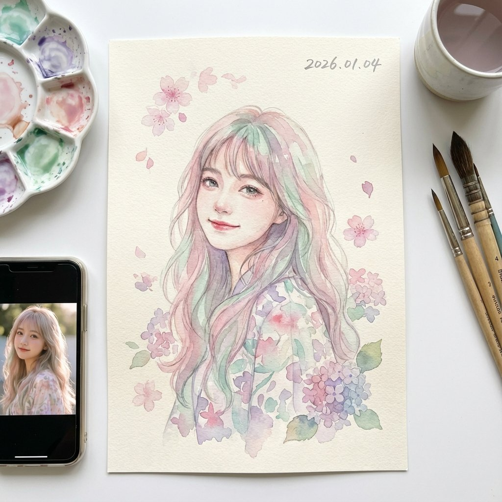
</div>

**提示词：**
```
Perfect composition, highest quality, 8K resolution, soft atmosphere, professional level, award-winning style, delicate artistry.

Create an extremely detailed Japanese watercolor illustration (透明水彩) depicting a Chinese idol girl with gentle, dreamy aesthetic. The artwork features: soft transparent color washes with visible water blooms, delicate color bleeding and gradients (wet-on-wet technique), pastel color palette (soft pinks, mint greens, lavender, peachy tones), light and airy feeling with plenty of white paper showing through, subtle color layering creating luminous skin tones, loose expressive brushwork in hair with flowing strands.

The painting is rendered on high-quality cold-pressed watercolor paper (300gsm texture visible), with natural paper buckling, authentic watercolor medium characteristics including backruns, cauliflower effects, and granulation. Delicate floral elements scattered around (cherry blossoms, hydrangeas) painted in transparent washes.

In the top right corner, the date "2026.01.04" is written in soft gray watercolor with delicate brush calligraphy. The watercolor painting is placed on a clean white surface with watercolor supplies nearby (paint palette with mixed colors, brushes, water cup). An iPhone displays the reference photograph with soft natural reflections. The facial features are perfectly identical to the photo - same gentle expression, same proportions, rendered in soft watercolor style.

Soft pastel color palette: blush pink, sky blue, mint green, lavender, peach, warm beige, with lots of white paper. Romantic, gentle, fresh atmosphere with Japanese aesthetic sensibility (wabi-sabi, ma - negative space). No artist signature. 3:4 portrait orientation.
```

**中文提示词：**
```
完美的构图，最高品质，8K分辨率，柔和的氛围，专业水准，屡获殊荣的风格，细腻的艺术性。

创作一幅极其细腻的日式水彩插画（透明水彩），描绘一位温柔梦幻的中国偶像少女。作品特色包括：柔和透明的色彩晕染，可见水彩晕染的痕迹；细腻的色彩晕染和渐变（湿画法）；柔和的粉彩色调（柔和的粉色、薄荷绿、薰衣草紫、蜜桃色）；轻盈通透的画面，露出大量白纸；微妙的色彩层次营造出光泽感十足的肤色；以及流畅飘逸的发丝，笔触自由奔放。

这幅画作绘制于高品质冷压水彩纸（300克/平方米，纹理清晰可见）上，保留了纸张的自然起皱，展现了水彩颜料的典型特征，包括晕染、花椰菜状纹理和颗粒感。画面周围点缀着精致的花卉元素（樱花、绣球花），以透明水彩晕染技法绘制而成。

右上角用柔和的灰色水彩笔触，以细腻的书法写着日期“2026.01.04”。这幅水彩画置于洁净的白色桌面上，旁边摆放着水彩工具（调色盘、画笔、水杯）。iPhone屏幕上显示着一张参考照片，照片反射着柔和的自然光。画中人物的面部特征与照片完全一致——同样的柔和表情，同样的比例，以柔和的水彩风格呈现。

柔和的粉彩色调：腮红粉、天蓝、薄荷绿、薰衣草紫、蜜桃色、暖米色，搭配大量白色纸张。营造出浪漫、温柔、清新的氛围，并融入了日式美学理念（侘寂、留白）。无艺术家签名。3:4 竖幅构图。
```

<a id="prompt-1052"></a>
## 案例 1052：空姐浮生记 (来源 [@LufzzLiz](https://x.com/LufzzLiz/status/2007663716368515318)) 模型：Nano banana pro

<div style="display: flex; justify-content: space-between;">
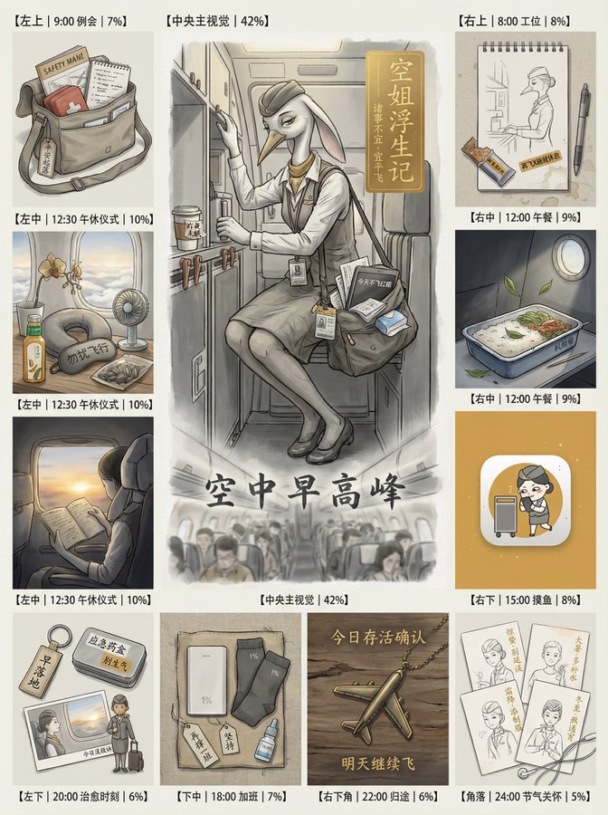
</div>

**提示词：**
```
A visual narrative system blending Neo-Chinese Zen aesthetics with the daily flow of contemporary Chinese workers, arranged in a refined Japanese bento grid layout. The background is soft moon white (#F0F0E8), accented with primary ochre yellow (#D4A348) and secondary cement gray (#7A7A75). The overall style is raw yet restrained, capturing the hardship, humor, resonance, and silent poetry inherent to 【Occupation】.

【Central Main Visual｜42% of frame】

6:30 AM. An animal embodying 【Occupation】 stands amid a sardine-can subway car. Its eyes are calm but bloodshot, one hand gripping an overhead strap, the other holding a drip coffee sachet (yesterday’s label still stuck on the wrapper). Uniform wrinkled from crowding, ID badge flipped backward revealing an expired canteen card.

Backpack zipper torn open, spilling 【Occupational Tools: e.g., laptop (screensaver reads “No Overtime Today”), blueprints, disposable chopsticks, half-used tissue pack】. Feet clad in flattened canvas shoes or worn-down leather loafers. Blurred commuters surround it. Above floats ink-wash calligraphy: “Morning Rush Chaos.” The air carries the scent of steamed buns and silence.

Top-right corner: gilded title “【Occupation】Fusheng Ji” in Shoujin script (#C9A961), slightly debossed. Beneath, a seal-style fortune stamp reads “All Things Inauspicious · Auspicious for Slacking Off,” also in matching gold foil. Edges feature watercolor bleed on xuan paper texture. Composition breathes with wabi-sabi imperfection.

【Top Right｜8:00 Workstation｜8%】

Recycled kraft notepad, edges curled and yellowed, sketching the animal’s silhouette at 【Occupational Setting: e.g., cubicle, lectern, operating table, stove】. Desk minimal: half a cookie, a chewed pen, a countdown sticker reading “Just X More Days Till Holiday.” Faint traces of 【Occupation-Specific Stains: e.g., motor oil, chalk dust, blood splatter, cooking grease】on the reverse.

【Middle Right｜12:00 Lunch｜9%】

Vintage army-green enamel mug or takeout container, chipped and faded, holding half a portion of cold 【Occupation’s Standard Meal: e.g., braised chicken rice, cafeteria stew, instant noodles】. Tea leaves or oil slick float on the surface. A toothpick rests on the rim. Background: 【Lunch Break Scene: e.g., rooftop, break room, inside delivery van】. Dust motes drift in sunbeams. Warm, gritty palette.

【Bottom Right｜15:00 Slacking Off｜8%】

Circular app icon: simplified line-art silhouette of the animal engaged in 【Occupation’s Slack Activity: e.g., scrolling phone, daydreaming, sneaking snacks】. Ochre background. Gaze unfocused yet sly. Interface clean but textured with microscopic 【Occupational Particulates: e.g., paper fibers, flour, sawdust】.

【Top Left｜9:00 Meeting｜7%】

Canvas tool bag/briefcase spilled open on desk: contains 【Occupational Tools: e.g., wrench, mouse, scalpel, spatula】, meeting minutes scribbled with doodles, work gloves frayed at knuckles. Bag strap embroidered with crooked “Peace” in clumsy stitches—rough but heartfelt.

【Middle Left｜12:30 Nap Ritual｜10%｜Emphasized】

“The Worker’s Recharge Trio” on salvaged wood plank: foldable cot/pillow, eye mask (“Do Not Disturb” printed), mini fan/heating pad. Beside them: half-empty bottle of 【Occupation’s Energy Drink: e.g., Dongfang Ye Shu tea, Red Bull, instant coffee】and cheap sunflower seeds. Wild daisy or pothos leaf stuck in lunchbox—petals slightly wilted. Blurred backdrop shows 【Occupational Environment: e.g., steel girders, office glass walls, kitchen exhaust hood】 against blue sky. Composition echoes Song dynasty still life—coarse yet meticulous.

【Bottom Center｜18:00 Overtime｜7%】

Three essentials on coarse linen: 【Overtime Kit: e.g., power bank (1% battery), neck pillow, eye drops/lumbar support, noise-canceling earplugs】. Each item sealed with miniature wax stamp bearing animal lifting a beam. Hand-brushed labels in ink: “Fight On,” “Hold Tight,” “Forget It.”

【Bottom Left｜20:00 Healing Moment｜6%】

Self-care relics:

Faded canvas keychain stitched with “Clock Out Early”;
Tin candy box repurposed as “Emergency Med Kit,” labeled “Don’t Get Angry”;
Mini watercolor postcard: animal collapsed in 【Occupation’s Rest Spot: e.g., sofa, dorm bunk, last subway car】, gazing out window, captioned “Didn’t Yell Today”;
Tiny clay figurine: animal curled atop 【Occupational Debris: e.g., keyboards, blueprints, cookware】, sprouting a sapling on its back.

All arranged on linen, scattered with found objects: half a 【Occupational Token: e.g., USB drive, chalk stick, gauze roll】, dried foxtail grass, a rusted paperclip.

【Bottom Right｜22:00 Homeward｜6%】

“Survived Today” commemorative set: hand-forged miniature 【Occupational Tool Pendant: e.g., keycap, scalpel, ladle】, aged to mimic rust, edged in antique copper gold (#8B6914), hung on reclaimed elm rack. Dappled light casts museum-like reverence. Attached sticky note: “Tomorrow, I’ll Be a Hero Again.”

【Corner｜24:00 Seasonal Care｜5%】

Four hand-painted seasonal cards: animal in 【Occupation】 across seasons—dozing in spring drowsiness, sweating in summer rage, shedding hair in autumn wind, despairing before winter snow. Each titled in gilded script: “Jingzhe · Don’t Be Late,” “Dashu · Drink Water,” “Shuangjiang · Wear Long Johns,” “Dongzhi · Just Endure.” Bound with twine and a short strand of 【Occupational Cord: e.g., Ethernet cable, surgical thread, power cord】.

【Overall Unity】

Consistent use of antique copper gold (#8B6914) and soft gold (#C9A961) only for text and keepsakes—never ostentatious.

Color system: Moon White (#F0F0E8), Ochre Yellow (#D4A348, evoking loess and wheat), Cement Gray (#7A7A75), Charcoal Black (#3A3A3A), Antique Copper Gold (#8B6914).

Materials throughout: coarse linen, recycled paper, oxidized metal, concrete, aged wood, enamelware, xuan paper watercolor.

34% negative space. Asymmetrical yet balanced composition. Lighting uses “worker’s natural light”—subway fluorescents, office overheads, sunset sidelight, desk lamp warmth—with 20% shadow transparency for depth.

Aesthetic core: No beautification of exhaustion; instead, ritual dignity granted to the mundane. No denial of absurdity; rather, Zen glimpsed within it. A tribute to the silent millions of 【Occupation】.
8K ultra-detailed, 16:9 landscape—ar 16:9 --stylize 245 --v 6.0

职业：空姐小美（飞机上作业）
```

<a id="prompt-1051"></a>
## 案例 1051：冬日晴空下的闺蜜团 (来源 [@msjiaozhu](https://x.com/msjiaozhu/status/2007804023857201224)) 模型：Nano banana pro

<div style="display: flex; justify-content: space-between;">
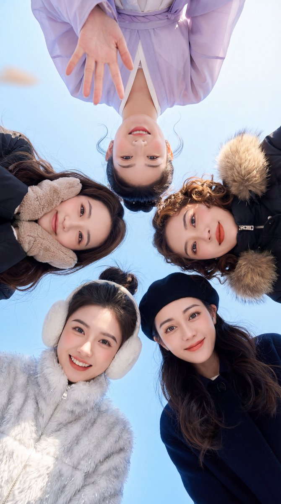
</div>

**提示词：**
```
{
  "meta": {
    "system_instruction": "PRIORITY: Focus strict facial identity preservation on the TWO FOREGROUND CHARACTERS (Bottom Left & Bottom Right). The other characters are secondary.",
    "aspect_ratio": "9:16",
    "quality": "high_fidelity",
    "resolution": "4k",
    "style": "viral social media photography, worm's eye view, crystal clear blue sky"
  },

  "reference_usage": {
    "instruction": "Map the uploaded face reference(s) specifically to the two girls closest to the camera (at the bottom).",
    "logic": "Bottom Left Girl = Face Ref A. Bottom Right Girl = Face Ref B (or same ref if only one provided). Top characters = Generic compatible faces.",
    "focus_weight": "Foreground: 100% Identity match; Background: 50% Vibe match"
  },

  "scene": {
    "perspective": "Extreme low angle (camera on ground looking up)",
    "background": "Pure gradient blue sky, no clouds, bright daylight",
    "composition": "5 girls forming a circle, but the bottom two are much larger and closer to the lens"
  },

  "subject_group": {
    "concept": "A group of friends looking down at the camera, framing the shot",
    
    "PRIMARY_SUBJECTS (STRICT IDENTITY LOCK)": {
      "note": "These two must look exactly like the reference images",
      
      "character_bottom_left": {
        "position": "Bottom Left (7 o'clock), closest to lens",
        "face": "Face Reference A, distinct features, big cheerful smile showing teeth",
        "outfit": "White fuzzy texture jacket or sweater, wearing large white plush earmuffs (cute winter vibe)",
        "action": "Leaning in close, hair hanging down slightly"
      },
      
      "character_bottom_right": {
        "position": "Bottom Right (5 o'clock), closest to lens",
        "face": "Face Reference B, distinct features, soft sweet smile",
        "outfit": "Dark navy or black coat, wearing a black beret or bucket hat",
        "action": "Looking gently at the camera"
      }
    },

    "SECONDARY_SUBJECTS (ATMOSPHERE ONLY)": {
      "note": "These characters provide context. Faces can be softer or less detailed.",
      "top_group": "Three other girls completing the circle at the top (10, 12, 2 o'clock positions)",
      "styling": "Wearing winter coats (purple/black), hand gestures waving at camera, slightly out of focus or further away compared to foreground"
    }
  },

  "lighting": {
    "type": "High-key natural daylight",
    "direction": "Frontal lighting (falling from the sky onto their faces)",
    "effect": "Bright skin tones, 'cold weather' rosy cheeks blush effect, sharp details on the earmuffs and hats"
  },

  "vibe": "Best friends forever, joyful reunion, winter sunshine, energetic, high clarity",
  "negative_prompt": "distorted faces in foreground, ugly teeth, bad anatomy, dark shadows on faces, cloudy sky, buildings, blurry foreground, fish-eye distortion too strong"
}
```

<a id="prompt-1050"></a>
## 案例 1050：3D风格的女子靠在五彩缤纷的墙上 (来源 [@iamsofiaijaz](https://x.com/iamsofiaijaz/status/2007267921425240077)) 模型：Nano banana pro

<div style="display: flex; justify-content: space-between;">

</div>

**提示词：**
```
A stylized 3D animated young woman leaning against a textured abstract wall made of layered cracked paint panels in warm gradients of yellow, coral, pink, red, and muted purple.
She has short wavy dark hair slightly tousled, closed eyes with a soft peaceful smile, a small hoop earring, and relaxed body language with her arms folded. She is wearing a loose dusty-rose long sleeve shirt, high-waisted blue jeans rolled at the cuffs, and worn brown boots.
Soft cinematic lighting, warm pastel color palette, shallow depth of field, painterly textures, cozy and calm mood, whimsical Pixar-style 3D illustration, ultra detailed, high resolution, soft shadows, dreamy atmosphere.
```

**中文提示词：**
```
一位风格化的3D动画年轻女子倚靠在一面纹理抽象的墙上，这面墙由多层开裂的油漆板组成，颜色为温暖的黄色、珊瑚色、粉色、红色和柔和的紫色渐变。
她留着一头略显凌乱的黑色短卷发，双眼微闭，脸上带着柔和宁静的微笑，戴着一枚小巧的耳环，双臂交叉抱于胸前，姿态放松。她身穿一件宽松的淡粉色长袖衬衫，高腰蓝色牛仔裤，裤脚卷起，脚蹬一双棕色旧靴子。
柔和的电影灯光，温暖的粉彩色调，浅景深，绘画般的纹理，温馨平静的氛围，异想天开的皮克斯风格 3D 插图，超精细，高分辨率，柔和的阴影，梦幻般的氛围。
```

<a id="prompt-1049"></a>
## 案例 1049：角色设定草图 (来源 [@azed_ai](https://x.com/azed_ai/status/2007043727114772508)) 模型：Nano banana pro

<div style="display: flex; justify-content: space-between;">

</div>

**提示词：**
```
Character sheet sketch of a [subject], featuring multiple angles and expressive facial variations, drawn in pencil and ballpoint pen on a clean white background. Soft pastel color palette, sharp linework, high contrast, hand-drawn manga style.
```

**中文提示词：**
```
人物设定草图，描绘了[人物]的多个角度和丰富的面部表情变化，使用铅笔和圆珠笔绘制在干净的白色背景上。采用柔和的粉彩色调，线条清晰锐利，对比度高，手绘漫画风格。
```

<a id="prompt-1048"></a>
## 案例 1048：女性面部涂口红和唇彩效果的图像 (来源 [@BubbleBrain](https://x.com/BubbleBrain/status/2007062194702155835)) 模型：Nano banana pro

<div style="display: flex; justify-content: space-between;">

</div>

**提示词：**
```
1. Using the attached image as a motif, we generated a difference image of a woman's face with lipstick and glossy lips. The image consists of four scenes divided into a 2x2 grid. 

2. A 2x2 grid cinematic photo collage. Four close-up portraits of the same beautiful Korean woman, creating an emotional narrative sequence.

Top-left panel: Cold and aloof expression, staring directly at the camera, high fashion vibe.
Top-right panel: A playful wink and a subtle smirk, looking side-glance.
Bottom-left panel: Biting lower lip, looking shy and slightly flirtatious, soft gaze.
Bottom-right panel: A genuine bright laugh, eyes crinkled with joy, head tilted back slightly.

Style: Analog film photography, heavy film grain, soft focus, dreamlike lighting, glossy lips, dewy skin texture, emotional atmosphere.
```

**中文提示词：**
```
1. 我们以附图为模板，生成了一张女性面部涂口红和唇彩效果的差异图像。该图像由四个场景组成，这些场景被划分成一个 2x2 的网格。

2. 一幅 2x2 网格的电影式照片拼贴画。四张同一位美丽的韩国女性的特写肖像，构成了一段充满情感的叙事序列。

左上角面板：表情冷漠疏离，直视镜头，充满时尚气息。
右上角面板：俏皮地眨眨眼，带着一丝不易察觉的微笑，侧目而视。
左下角：咬着下唇，看起来害羞又略带挑逗，眼神温柔。
右下角画面：发自内心的爽朗笑声，眼睛因喜悦而眯成一条缝，头微微向后仰。

风格：胶片摄影，浓重的胶片颗粒感，柔焦效果，梦幻般的光线，光泽的嘴唇，水润的肌肤质感，充满情感的氛围。
```

<a id="prompt-1047"></a>
## 案例 1047：博物馆展品级别的昆虫知识科普图谱 (来源 [@yyyole](https://x.com/yyyole/status/2006925202077184321)) 模型：Nano banana pro

<div style="display: flex; justify-content: space-between;">

</div>

**中文提示词：**
```
请创建一张博物馆展品级别的昆虫知识科普图谱，聚焦展示【蜜蜂】。

核心布局：
- 中心：巨大的昆虫标本图像，占据画面60-70%
- 周围：科学标注和趣味百科信息，呈放射状或分区排布
- 整体：如同博物馆玻璃展柜中的精美标本说明牌

昆虫标本呈现（核心要求）：
1. 物理真实感：昆虫标本直接平放在纸面上，不是"图片中的图片"
2. 视角：垂直俯视，标本与纸面在同一平面
3. 光影：柔和的自然光从上方照射，标本在纸面上投下细腻的阴影
4. 固定方式：用昆虫针（细长的银色针）真实地固定标本，针穿过标本身体，针尖微微刺入纸面
5. 细节质感：
   - 可见标本的真实纹理：翅脉、绒毛、鳞片、复眼反光
   - 标本边缘有轻微的厚度感和立体感
   - 翅膀可能有轻微的透光效果
   - 针周围纸面有细微的凹陷或针孔
6. 比例：标本占据纸面中心约60-70%区域，周围留白供标注使用
7. 自然状态：展翅姿态自然，不过分僵硬，保留标本的真实质感

标注系统设计：
采用引导线（细线）从昆虫身体部位延伸到说明文字框

必需标注的身体部位（6-8个）：
1. 头部 Head
   - 复眼：有多少个小眼组成？视野范围多大？
   - 触角：用途是什么？有多少节？
   - 口器：属于哪种类型？吃什么食物？

2. 胸部 Thorax
   - 前胸/中胸/后胸：各自功能
   - 翅膀：有几对？飞行速度多快？特殊能力？
   - 足：有几对？抓握/跳跃/游泳等特殊功能？

3. 腹部 Abdomen
   - 节数：有多少体节？
   - 特殊器官：发光器/毒刺/产卵器等
   - 气孔：如何呼吸？

4. 特色结构
   - 该昆虫最独特的身体特征
   - 与生存环境的适应关系

信息卡片内容：
每个标注包含：
- 部位名称（中英文）
- 1-2句功能说明（儿童友好语言）
- 趣味数据或冷知识（用🔍或💡图标标识）

页面其他元素：

顶部区域：
- 昆虫中文名（大标题，优雅字体）
- 学名 Scientific Name（斜体拉丁文，副标题）
- 所属目/科（小字标注）
- 分布地图小图标（世界地图+分布区域高亮）

底部/侧边信息栏：
基础档案
- 体长：X-X mm
- 寿命：X天/月/年
- 栖息地：森林/草地/水域等
- 食性：植食/肉食/杂食

超能力/特殊技能
- 列出2-3个最酷的能力
- 用简单图标+文字说明

趣味冷知识
- 1-2个吸引儿童的有趣事实
- 如"可以举起自己体重50倍的物体"

生命周期
- 简化的变态过程图示
- 卵→幼虫→蛹→成虫（完全变态）
- 或卵→若虫→成虫（不完全变态）

*设计美学：
- 纸面质感：
  底纸：米白色或象牙白高级纸张纹理 #F8F6F0
  可见纸张的细微纤维和质感
  边缘可能有轻微的磨损或复古感（可选）

- 空间关系：
  标本：物理实体，平放在纸面上，有真实阴影
  昆虫针：银色金属质感，穿过标本固定
  标注文字：直接书写或印刷在同一张纸上
  引导线：细笔绘制在纸面上的线条

- 配色方案：
  纸面底色：#F8F6F0（米白）或 #FFFEF7（象牙白）
  标注文字：#2C3E50（墨色/深灰蓝）手写或印刷风格
  引导线：#8B7355（棕灰）或 #696969（炭灰）细线
  强调标记：#D4AF37（古铜金）或 #8B4513（棕褐色）
  昆虫针：银灰色金属光泽 #C0C0C0

- 字体系统：
  标题：手写风格或优雅印刷体（Garamond/宋体）
  学名：斜体手写或印刷体
  标注文字：清晰的手写体或小号印刷字
  整体感觉：如同博物学家在标本纸上亲笔书写

- 装饰元素：  
  四角：简约的线框或装饰角花（印在纸上）
 标尺：毫米刻度尺，平行于标本放置
  日期/编号：手写风格的采集信息（可选）
  植物剪影水印：淡淡印在纸面上（可选）
关键视觉要点：
整个画面就是"一张平铺的标本纸"，上面固定着真实的昆虫标本，周围有手写或印刷的科学标注。观看者仿佛正俯视着一份博物学家的工作台上的标本记录。

版式风格参考：如同打开一本19世纪博物学家的标本册，昆虫标本真实地固定在纸面上，周围是手写或精美印刷的科学注释。整体呈现一种平面化、扁平但充满物理质感的美学——这不是照片，而是标本与纸张的共存。"

关键概念：
- ❌ 不要：标本的照片被放在画面中
- ✅ 要：标本本身就在纸面上，与文字共享同一个物理平面
- 就像古董标本册的一页，或者博物学家的工作记录

图片规格：
- 比例：16:9（横版海报）或 3:4（竖版展板）
- 分辨率：300 DPI，适合A3/A2打印
- 格式：PNG高清，保留细节

科学准确性要求：
- 身体结构比例符合真实昆虫形态
- 专业术语使用准确
- 儿童描述需科学又生动

请确保整体呈现既有博物馆的学术严谨性，又充满吸引儿童探索的视觉魅力。
```

<a id="prompt-1046"></a>
## 案例 1046：一则超写实的旅行广告 (来源 [@TechieBySA](https://x.com/TechieBySA/status/2007190982408974659)) 模型：Nano banana pro

<div style="display: flex; justify-content: space-between;">

</div>

**提示词：**
```
A hyper-realistic travel advertisement in square format (1080x1080), featuring a hand holding a sleek, ultra-thin smartphone or tablet in portrait orientation, tilted slightly sideways to create a striking 3D portal effect. The screen displays a high-resolution image of an iconic landmark from [COUNTRY], which continues into the real background, blending seamlessly. The landmark appears to emerge from the screen. Birds fly nearby and a commercial airplane passes through a bright blue sky with soft white clouds. Bold, clean sans-serif text reading [CITY] is placed prominently above. The lighting is warm and natural, casting soft shadows across the landscape. The surroundings reflect the region’s natural environment (like meadows, coastlines, or city skylines). The device is glossy and minimal-bezel, enhancing realism and depth.
```

**中文提示词：**
```
这是一则超写实的旅行广告，采用正方形格式（1080x1080），画面中一只手竖屏握着一部纤薄时尚的智能手机或平板电脑，略微侧倾，营造出引人注目的3D立体效果。屏幕上显示着[国家/地区]标志性地标的高分辨率图像，图像与真实背景无缝融合，仿佛从屏幕中浮现出来一般。附近有鸟儿飞翔，一架商用飞机掠过湛蓝的天空，朵朵白云点缀其间。醒目的上方是简洁的无衬线字体[城市]。画面光线温暖自然，在景物上投下柔和的阴影。周围环境反映了该地区的自然环境（例如草地、海岸线或城市天际线）。设备采用光滑的超窄边框设计，增强了画面的真实感和立体感。
```

<a id="prompt-1045"></a>
## 案例 1045：杂志配有儿童绘画作品 (来源 [@miilesus](https://x.com/miilesus/status/2007169297655730610)) 模型：Nano banana pro

<div style="display: flex; justify-content: space-between;">

</div>

**提示词：**
```
{
  "design_system": {
    "metadata": {
      "style_name": "Cozy Storybook Illustration",
      "target_audience": "Children / Family",
      "reference_source": "Uploaded Image",
      "version": "3.0"
    },
    "visual_parameters": {
      "medium": {
        "primary": "Colored Pencil",
        "secondary": "Watercolor Wash (Variation only)",
        "application": "Hand-drawn",
        "texture": {
          "type": "Visible pencil strokes",
          "quality": "Slightly rough outlines",
          "finish": "Non-realistic / No photo texture"
        }
      },
      "line_work": {
        "style": "Clean line art",
        "weight": "Slightly rough/organic",
        "clarity": "High"
      },
      "color_theory": {
        "base_tone": "Warm and friendly",
        "palette_type": "Vibrant Pastel",
        "adjustments": {
          "brightness": "Increased / High-key",
          "saturation": "Enhanced but natural",
          "contrast": "Soft"
        }
      },
      "lighting_and_shading": {
        "shadows": "Minimal",
        "highlights": "Soft",
        "rendering": "Flat yet detailed",
        "gradients": "Subtle watercolor layers (Variation only)"
      }
    },
    "subject_geometry": {
      "anatomy": {
        "proportions": "Semi-cartoon realistic",
        "scale": "Storybook style"
      },
      "facial_features": {
        "eyes": "Dot style",
        "mouth": "Small smile",
        "complexity": "Simple / Minimalist"
      }
    },
    "atmosphere": {
      "mood": [
        "Cozy",
        "Cheerful",
        "Warm",
        "Friendly"
      ],
      "genre_tags": [
        "Children's Book",
        "Lifestyle Sketch",
        "Storybook Illustration"
      ]
    }
  },
  "generation_configs": {
    "negative_prompt_tokens": [
      "realism",
      "photorealistic",
      "photo texture",
      "dark colors",
      "complex shading",
      "3d render"
    ],
    "prompt_variations": [
      {
        "id": "PROMPT_001",
        "variant_name": "Textured Colored Pencil",
        "focus": "Texture and Stroke",
        "full_text": "Illustration style: hand-drawn colored pencil illustration, clean line art with slightly rough pencil outlines, soft pastel coloring with increased brightness, lighter and more vivid color tones, enhanced saturation while staying natural, visible pencil strokes and gentle shading texture, warm and friendly tone, semi-cartoon realistic proportions, simple facial features with dot eyes and small smiles, flat yet detailed coloring, minimal shadows, soft highlights, storybook illustration feel, cozy and cheerful atmosphere, vibrant yet soft color palette, children-book / lifestyle sketch style, high clarity, no realism, no photo texture"
      },
      {
        "id": "PROMPT_002",
        "variant_name": "Mixed Media Watercolor",
        "focus": "Wash and Gradient",
        "full_text": "Hand-drawn colored pencil illustration with clean line art and slightly rough pencil outlines, combined with soft watercolor wash textures. Bright pastel colors, lighter and more vivid tones with natural saturation. Visible pencil strokes layered with subtle watercolor gradients. Warm and friendly tone, semi-cartoon realistic proportions. Simple facial features with dot eyes and small smiles. Flat yet detailed coloring, minimal shadows, soft highlights. Storybook illustration feel, cozy and cheerful atmosphere, children-book style, high clarity, no realism, no photo texture."
      }
    ]
  }
}
```

**中文提示词：**
```
{
"design_system": {
"元数据": {
"style_name": "温馨故事书插画",
"target_audience": "儿童/家庭",
"reference_source": "上传的图片",
版本：3.0
},
"visual_parameters": {
“中等的”： {
“primary”： “彩色铅笔”
“次要的”: “水彩晕染（仅限变体）”
“应用”：“手绘”，
“质地”： {
“类型”：“可见的铅笔笔触”，
“质量”：“轮廓略显粗糙”，
“完成”: “非写实/无照片纹理”
}
},
"line_work": {
风格：简洁的线条艺术，
“重量”：“略粗糙/有机”，
清晰度：高
},
"color_theory": {
"base_tone": "温暖友好",
"palette_type": "鲜艳的粉彩",
“调整”：{
“亮度”: “增强/高调”
“饱和度”：“增强但自然”，
“对比度”： “柔和”
}
},
"lighting_and_shading": {
“阴影”：“极简主义”，
“亮点”：“柔和”，
“渲染”：“平面但细节丰富”，
“渐变”：“微妙的水彩图层（仅限变体）”
}
},
"subject_geometry": {
"解剖学": {
“比例”：“半卡通写实”
“规模”: “故事书风格”
},
"facial_features": {
“眼睛”：“点状风格”，
“嘴”: “微微一笑”
“复杂性”： “简单/极简主义”
}
},
“气氛”： {
“情绪”： [
“舒适”，
“快乐”，
“温暖的”，
“友好的”
],
"genre_tags": [
《儿童读物》
“生活方式素描”，
“故事书插图”
]
}
},
"generation_configs": {
"negative_prompt_tokens": [
“现实主义”，
“照片级真实感”，
“照片纹理”，
“暗色”，
“复杂阴影”，
“3D渲染”
],
"prompt_variations": [
{
"id": "PROMPT_001",
"variant_name": "纹理彩色铅笔",
“焦点”：“纹理和笔触”，
"full_text": "插画风格：手绘彩色铅笔插画，线条简洁，铅笔轮廓略显粗糙，柔和的粉彩色调，亮度增强，色彩更明亮鲜艳，饱和度提高，同时保持自然，铅笔笔触清晰可见，阴影纹理柔和，色调温暖友好，半卡通写实比例，面部特征简洁，眼睛为点状，面带微笑，色彩平涂但细节丰富，阴影极少，高光柔和，具有绘本插画风格，温馨欢快的氛围，色彩鲜艳而柔和，儿童绘本/生活素描风格，清晰度高，不追求写实，无照片纹理"
},
{
"id": "PROMPT_002",
"variant_name": "混合媒介水彩",
“焦点”：“水洗和渐变”，
"full_text": "手绘彩色铅笔插画，线条干净利落，铅笔轮廓略显粗糙，并结合柔和的水彩晕染纹理。明亮的粉彩色调，色调更浅更鲜艳，饱和度自然。铅笔笔触清晰可见，并叠加了微妙的水彩渐变。整体色调温暖友好，半卡通式的写实比例。面部特征简洁，眼睛是点状的，带着淡淡的微笑。色彩运用平涂却不失细节，阴影极少，高光柔和。具有童话插画的感觉，营造出温馨欢快的氛围，儿童绘本风格，清晰度高，不追求写实，没有照片质感。"
}
]
}
}
```

<a id="prompt-1044"></a>
## 案例 1044：电影照片故事板 (来源 [@oggii_0](https://x.com/oggii_0/status/2006931271822590224)) 模型：Nano banana pro

<div style="display: flex; justify-content: space-between;">

</div>

**提示词：**
```
A 3x3 cinematic storyboard contact sheet consisting of 9 distinct panels arranged in a grid. The sequence features a young woman with platinum blonde hair in a frozen alpine winter setting.

The panels display various angles and shots:

Close-ups: Focusing on her rosy cheeks, blue-grey eyes, and snowflakes on her eyelashes.

Medium shots: Showing her wrapped in a black wool coat and blue knit scarf, holding a bouquet of dried white flowers.

Wide shots: Capturing her standing alone on the frozen lake with towering snowy mountains in the background.

The lighting is consistent moody blue-hour twilight across all frames. High-quality film photography aesthetic, photorealistic, 8k resolution, coherent character and color grading.
```

**中文提示词：**
```
一张3x3的电影分镜脚本，由9个独立的分镜组成，呈网格状排列。画面描绘了一位有着铂金色头发的年轻女子，置身于冰天雪地的阿尔卑斯山冬季场景中。

这些面板展示了各种角度和镜头：

特写镜头：聚焦于她红润的脸颊、蓝灰色的眼睛和睫毛上的雪花。

中景镜头：她身穿黑色羊毛大衣，围着蓝色针织围巾，手捧一束白色干花。

广角镜头：捕捉她独自站在冰封的湖面上，背景是巍峨的雪山。

所有画面都呈现出一致的、略带忧郁的蓝调黄昏光线。高品质的胶片摄影美学，照片级真实感，8K分辨率，风格统一，色彩分级准确。
```

<a id="prompt-1043"></a>
## 案例 1043：高清超写实的微距照片 (来源 [@iamsofiaijaz](https://x.com/iamsofiaijaz/status/2007029735193448529)) 模型：Nano banana pro

<div style="display: flex; justify-content: space-between;">

</div>

**提示词：**
```
1.  high-definition, hyper-realistic macro photograph of a tiny, miniature girl with long dark hair wearing a flowing brown linen dress, sitting peacefully on the back of a large red ladybug with black spots. The ladybug is perched on a vibrant green leaf covered in glistening, translucent morning dew drops. The background is a soft, creamy bokeh of out-of-focus green foliage and golden sunlight. The lighting is warm and ethereal, capturing every detail of the dew drops and the texture of the ladybug's shell. 
2.  A high-definition macro photograph of a tiny, detailed adventurer riding on the back of a giant iridescent green dung beetle. The beetle has a shimmering metallic shell with hints of gold and blue. The rider is wearing rugged, miniature explorer gear and is perched on the beetle's thorax. They are traveling across a mossy, decaying log on a forest floor. The background is a soft, dreamlike bokeh of a sun-drenched forest with golden light filtering through the trees. Sharp focus on the beetle's texture, cinematic lighting, 8k resolution, hyper-realistic.

3.A high-definition, cinematic fantasy shot of a tiny, cheerful young girl with brown hair riding on the back of a giant, fuzzy bumblebee. She is wearing a brown leather explorer's outfit with a small satchel. They are flying through a vibrant meadow filled with oversized, glowing wildflowers in shades of orange, yellow, and purple. The scene is bathed in warm, golden sunlight with soft bokeh and magical dust particles floating in the air. Highly detailed textures on the bee's fur and the girl's clothing, 8k resolution, whimsical and adventurous atmosphere.

4. A high-definition surreal fantasy photograph of a tiny, miniature woman with long flowing hair, wearing a delicate, ethereal white lace dress, standing gracefully on the back of a giant Monarch butterfly. The butterfly is in full focus, showcasing vibrant orange and black wing patterns. They are floating in a sun-drenched meadow filled with soft-focus, bokeh wildflowers in shades of red, blue, and yellow. The lighting is warm and golden (golden hour), creating a magical, dreamlike atmosphere with soft lens flares and a shallow depth of field.
```

**中文提示词：**
```
这是一张高清超写实的微距照片，照片中一位身材娇小的小女孩，有着一头乌黑的长发，身着飘逸的棕色亚麻连衣裙，静静地坐在一只红色瓢虫的背上，瓢虫身上布满了黑色的斑点。瓢虫栖息在一片翠绿的叶子上，叶子上缀满了晶莹剔透的晨露。背景是柔和的散景，由模糊的绿色树叶和金色的阳光构成。光线温暖而空灵，捕捉到了露珠的每一个细节以及瓢虫外壳的纹理。
2. 这是一张高清微距照片，展现了一位身材娇小、细节丰富的探险家骑在一只巨大的、闪着虹彩光泽的绿色蜣螂背上。蜣螂有着闪亮的金属外壳，隐约透着金色和蓝色。探险家身着结实耐用的迷你探险装备，栖息在蜣螂的胸部。他们正沿着森林地面上一根长满青苔、腐朽的圆木行进。背景是阳光普照的森林，金色的光芒透过树叶洒下，营造出柔和梦幻般的散景效果。照片清晰地聚焦在蜣螂的纹理上，运用了电影级的灯光效果，分辨率高达8K，画面极其逼真。

3. 这是一张高清电影级的奇幻照片，画面中一位娇小可爱的棕发少女骑在一只巨大的毛茸茸的大黄蜂背上。她身穿棕色皮质探险家套装，挎着一个小挎包。她们飞越一片生机勃勃的草地，草地上开满了硕大而闪闪发光的野花，色彩斑斓，有橙色、黄色和紫色。温暖的金色阳光洒满整个画面，柔和的散景和空气中漂浮的梦幻尘埃营造出梦幻般的氛围。蜜蜂的皮毛和少女的衣物纹理都非常细腻，8K分辨率，营造出一种奇幻而充满冒险气息的氛围。

4. 这是一张高清超现实主义奇幻照片，照片中一位娇小玲珑的女子，长发飘逸，身着精致飘逸的白色蕾丝长裙，优雅地站在一只巨大的帝王蝶背上。蝴蝶清晰可见，鲜艳的橙黑相间翅膀图案跃然眼前。她们漂浮在阳光普照的草地上，草地上盛开着柔焦效果的野花，红、蓝、黄三色交织，营造出迷人的散景。温暖的金色光线（黄金时段）营造出梦幻般的氛围，柔和的镜头光晕和浅景深更添几分梦幻之感。
```

<a id="prompt-1042"></a>
## 案例 1042：一块记录菜肴的烹饪传承展板 (来源 [@AllaAisling](https://x.com/AllaAisling/status/2007111138597535921)) 模型：Nano banana pro

<div style="display: flex; justify-content: space-between;">

</div>

**提示词：**
```
A culinary heritage board documenting [DISH] — [CULTURE / REGION / ERA]. The canvas is divided into generational layers: top register shows historical origins with sepia photographs of ancestors, original handwritten recipe cards with stains and annotations, and vintage kitchen context; middle register presents the complete ingredient breakdown in mise en place arrangement with source maps showing where each component originates; bottom register shows the dish being prepared by contemporary hands and the final presentation in its authentic serving context. Visual style transitions from archival sepia through ingredient-focused clinical whites to warm candlelit table photography. Hand-lettered labels throughout. Title block reading "[DISH NAME] — [FAMILY NAME] TRADITION, [ORIGIN DATE] TO PRESENT".
```

**中文提示词：**
```
一块记录[菜肴]—[文化/地区/时代]的烹饪传承展板。展板分为多个世代层级：上层展示历史渊源，包括祖先的棕褐色照片、带有污渍和批注的原始手写食谱卡片以及复古厨房场景；中层呈现完整的食材清单，并附有食材来源地图；下层展示当代厨师的烹饪过程以及最终呈现在原汁原味的餐桌上。视觉风格从档案般的棕褐色过渡到以食材为中心的简洁白色，最终变为温暖的烛光餐桌照片。贯穿始终的手写标签。标题栏显示“[菜肴名称]—[家族名称]传统，[起源日期]至今”。
```

<a id="prompt-1041"></a>
## 案例 1041：博物馆展品级别的鱼类知识科普图谱 (来源 [@LZhou15365](https://x.com/LZhou15365/status/2007275324967698649)) 模型：Nano banana pro

<div style="display: flex; justify-content: space-between;">

</div>

**中文提示词：**
```
请创建一张博物馆展品级别的鱼类知识科普图谱，聚焦展示【某一种代表性鱼类，如：金枪鱼 / 鲤鱼 / 鲨鱼 / 小丑鱼（可替换）】。

核心布局：

中心：巨大的鱼类标本图像，占据画面 60–70%

周围：科学标注 + 趣味百科信息，呈放射状或分区排布

整体：如同博物馆玻璃展柜中的鱼类标本说明牌

鱼类标本呈现（核心要求）：

物理真实感
鱼类标本真实平放在纸面上
不是“照片中的照片”，而是实体标本

视角
垂直俯视（Top-down view）
鱼体与纸面处于同一物理平面

光影
柔和自然光从上方照射
鱼体在纸面上投下细腻、真实的阴影

固定方式（博物学风格）
使用细长银色金属标本针或细线固定鱼体
针穿过鱼体关键部位（如背部或鳍基）
针尖微微刺入纸面
纸面可见细小针孔与轻微压痕

细节质感（重点）
清晰可见：
鱼鳞排列与反光
鳍膜的半透明质感
鳃盖的结构层次
眼睛的湿润反光
鱼体边缘有厚度感与轻微立体起伏
鳍部可能有自然展开但不过分夸张

比例
鱼类标本占据纸面中心约 60–70%
周围留白用于标注与信息说明

自然状态
鱼体姿态自然、舒展
保留“真实标本”的静态感，而非游动姿态

标注系统设计：

使用细引导线

从鱼体结构延伸至文字说明框

引导线如同直接绘制或印刷在纸面上

必需标注的身体部位（6–8 个）：

1. 头部 Head

眼 Eye
视野范围？是否能看到颜色？

口 Mouth
口型（上位口 / 端位口 / 下位口）
食性相关？

鳃盖 Gill Cover (Operculum)
呼吸方式说明（如何从水中获取氧气）

2. 躯干部 Body

鳞片 Scales
类型（圆鳞 / 栉鳞 / 楯鳞）
保护与减阻作用

侧线系统 Lateral Line
感知水流和震动的“感觉器官”

3. 鳍 Fin System

背鳍 Dorsal Fin：保持平衡

胸鳍 Pectoral Fin：转向与刹车

腹鳍 Pelvic Fin：稳定身体

尾鳍 Caudal Fin：主要推进力
游泳速度或爆发力说明

4. 内部/特殊结构（可视化表达）

鱼鳔 Swim Bladder（如适用）
控制浮沉

或

软骨骨骼 / 硬骨结构对比

5. 特色结构

该鱼类最具代表性的身体特征

与其生存环境（海洋 / 淡水 / 深海 / 珊瑚礁）的适应关系

信息卡片内容（每个标注包含）：

部位名称（中 / 英文）
1–2 句儿童友好型功能说明

趣味数据或冷知识
用 🔍 或 💡 图标标识

页面其他元素：

顶部区域：

鱼类中文名（大标题，优雅字体）

学名 Scientific Name（斜体拉丁文）

分类信息（纲 / 目 / 科）

分布地图小图标
世界地图 + 主要分布水域高亮

底部 / 侧边信息栏：

基础档案

体长：X cm – X m

体重：X g – X kg

寿命：X 年

栖息环境：海洋 / 淡水 / 深海 / 珊瑚礁

食性：草食 / 肉食 / 杂食

超能力 / 生存技能

2–3 项最酷能力，例如：
高速游泳
电感应
变色伪装
洄游能力

图标 + 简短说明

趣味冷知识

1–2 个吸引儿童的事实

如：
“可以不眨眼睡觉”
“一生能游过几千公里”

生命周期

简化示意图：
卵 → 仔鱼 → 幼鱼 → 成鱼

标注生长阶段变化重点

设计美学（保持博物学风格）：

纸面质感

底纸：
米白色 / 象牙白高级纸张
#F8F6F0 或 #FFFEF7

可见纸张纤维

轻微复古磨损感（可选）

空间关系（非常重要）

鱼类标本：真实物理实体，平放在纸面上

固定针 / 细线：银色金属质感

标注文字：直接印刷或手写在同一张纸上

引导线：细笔绘制的线条
配色方案

纸面底色：#F8F6F0 / #FFFEF7

标注文字：#2C3E50（深灰蓝墨色）

引导线：#8B7355 或 #696969

强调标记：#D4AF37（古铜金）

标本针：#C0C0C0（银灰金属）

字体系统
标题：优雅印刷体或手写风格（宋体 / Garamond）

学名：斜体

标注说明：清晰小号手写体或印刷体

整体感觉：
像博物学家在标本纸上亲笔记录鱼类观察笔记

装饰元素（可选）

四角装饰线框

毫米刻度尺（与鱼体平行）

采集编号 / 日期（手写风格）

水生植物剪影水印（极淡）

关键视觉要点（不可违背）：

整个画面是一张平铺的鱼类标本纸

鱼类标本被真实固定在纸面上

文字、线条、标本共享同一个物理平面

观看者仿佛正俯视一位博物学家的工作台

关键概念强调：

❌ 不要：鱼的照片被放进画面

✅ 要：鱼类标本本身就在纸面上

就像 19 世纪博物学家的鱼类标本册一页

图片规格：

比例：16:9（横版）或 3:4（竖版）

分辨率：300 DPI，适合 A3 / A2 打印

格式：PNG 高清

科学准确性要求：
鱼体比例符合真实物种

解剖结构名称准确

儿童描述生动但不失科学性
```

<a id="prompt-1040"></a>
## 案例 1040：K-Pop偶像报纸时尚概念 (来源 [@BubbleBrain](https://x.com/BubbleBrain/status/2007074986008141973)) 模型：Nano banana pro

<div style="display: flex; justify-content: space-between;">

</div>

**提示词：**
```
{
  "project_metadata": {
    "title": "K-Pop Idol Newspaper Fashion Concept",
    "style_preset": "Soft Focus Editorial Photography",
    "aspect_ratio": "3:4",
    "version": "2.1"
  },
  "subject": {
    "identity": {
      "ethnicity": "Korean",
      "age_group": "Young Adult",
      "aesthetic": "K-pop idol, mixture of innocent and sexy, pure visual"
    },
    "physique": {
      "body_type": "Curvy and voluptuous",
      "specific_attributes": "Highly emphasized and prominent bustline, hourglass silhouette, toned arms",
      "skin_tone": "Pale, porcelain white, flawless and glowing"
    },
    "hair_and_makeup": {
      "hair": {
        "color": "Dark brown",
        "style": "Long, voluminous waves, slight wet look",
        "action": "Hands gently touching face or hair"
      },
      "makeup": {
        "lips": "Glossy pink jelly lips, gradient lip color",
        "eyes": "Sparkling K-pop style eye makeup, aegyo-sal emphasized",
        "finish": "Glass skin effect, bright and dewy"
      }
    },
    "pose_and_expression": {
      "expression": "Cute pouting lips (dudu lips), seductive yet innocent gaze, looking into the lens",
      "pose": "Medium-full body shot, standing, playful posture, emphasising curves"
    }
  },
  "fashion_elements": {
    "primary_garment": {
      "item": "Strapless mini-dress",
      "material": "Authentic recycled newspaper pages",
      "construction": "Architectural, origami-style pleats, visible newsprint, headlines, and grayscale imagery textures",
      "fit": "Form-fitting, cinched at the waist"
    },
    "accessories": [
      {
        "item": "Hoop earrings",
        "style": "Large, thin, minimalist",
        "material": "Polished silver"
      }
    ]
  },
  "environment_and_backdrop": {
    "setting": "Studio indoor",
    "background_type": "Textured wall",
    "details": "Completely covered in layered, overlapping vintage newspaper pages, sepia-toned paper, collage effect",
    "depth": "Shallow depth of field to separate subject from the background"
  },
  "cinematography_and_lighting": {
    "camera": {
      "lens": "85mm prime lens",
      "shot_type": "Medium-full shot",
      "angle": "Eye-level",
      "sensor": "Digital, clear"
    },
    "lighting": {
      "primary_source": "Soft diffused frontal lighting",
      "effect": "Bright, flattering beauty lighting, minimizing shadows on face",
      "color_temp": "Cool white to neutral"
    },
    "post_processing": {
      "focus": "Soft focus, dreamy atmosphere",
      "textures": "Heavy skin smoothing, airbrushed look, ethereal glow, no grain",
      "filter": "Beauty filter style, dreamy blur effect"
    }
  }
}
```

**中文提示词：**
```
{
"project_metadata": {
标题：《K-Pop偶像报纸时尚概念》
"style_preset": "柔焦编辑摄影",
"aspect_ratio": "3:4",
版本：2.1
},
“主题”： {
“身份”： {
“种族”: “韩国人”
"age_group": "青年人",
“美学”：“K-pop偶像，兼具清纯与性感，纯粹的视觉美”
},
"体格": {
"body_type": "曲线优美，丰满性感",
"specific_attributes": "非常突出且醒目的胸部线条，沙漏型身材，健美的双臂",
肤色：苍白如瓷，无瑕透亮
},
"发型和化妆": {
“头发”： {
“颜色”：“深棕色”，
“发型”：“长而蓬松的波浪卷，略带湿润感”，
“动作”：“双手轻轻触碰脸部或头发”
},
“化妆品”： {
“唇部”： “亮泽的粉色果冻唇膏，渐变唇色”
“眼睛”：“闪亮的韩式流行风格眼妆，强调卧蚕”，
“妆效”：“玻璃肌效果，明亮水润”
}
},
"pose_and_expression": {
“表情”：“嘟嘟的可爱嘴唇，既诱人又无辜的眼神，看着镜头”，
“姿势”：“中全身照，站立，俏皮的姿势，强调曲线”
}
},
"fashion_elements": {
"primary_garment": {
“商品”: “无肩带迷你连衣裙”
“材料”：“真正的再生报纸页面”，
“构造”：“建筑风格的折纸褶皱，可见的新闻印刷品、标题和灰度图像纹理”，
“合身”： “贴合身形，腰部收紧”
},
“配件”： [
{
“物品”: “圈形耳环”，
“风格”：“大号、纤细、极简主义”
材质：抛光银
}
]
},
"environment_and_backdrop": {
设置：室内工作室，
"background_type": "纹理墙",
“细节”：“完全覆盖着层叠交错的复古报纸页面，棕褐色调的纸张，拼贴效果”，
“景深”： “浅景深使主体与背景分离”
},
"cinematography_and_lighting": {
“相机”： {
“镜头”: “85mm 定焦镜头”
"shot_type": "中远景镜头",
“角度”：“视线水平”，
“传感器”：“数字式，清晰”
},
“灯光”： {
"primary_source": "柔和的漫射正面照明",
“效果”：“明亮、讨喜的美颜灯光，最大限度地减少脸上的阴影”，
"color_temp": "冷白光到中性色"
},
"post_processing": {
“焦点”：“柔焦，梦幻般的氛围”，
“质地”：“强效柔滑肌肤，喷枪妆效，空灵光泽，无颗粒感”
"滤镜": "美颜滤镜风格，梦幻虚化效果"
}
}
}
```

<a id="prompt-1039"></a>
## 案例 1039：一张精致的时尚大片 (来源 [@craftian_keskin](https://x.com/craftian_keskin/status/2007156041851490337)) 模型：Nano banana pro

<div style="display: flex; justify-content: space-between;">

</div>

**提示词：**
```
A refined fashion editorial image with a 3:2 aspect ratio, split into two clear sections.

Right side:
A fashionable, confident, sensual woman standing and walking casually in a modern architectural space with warm wooden walls and soft natural light. She wears a top with a deep V neckline, has a small mole on her chest, a 90-60-90 figure, tucked into a high-waisted white tailored short skirt, On her feet are sleek black stiletto heels, elegant and minimal. She carries a small structured black handbag in one hand.

Her hair is slicked back into a clean low bun, emphasizing her facial structure. She wears narrow black sunglasses and subtle statement earrings. The look is refined, modern, and effortlessly chic. Natural daylight, soft shadows, realistic skin texture. Casual fashion photography style with an editorial, high-end feel. Neutral color palette, warm tones, shallow depth of field, cinematic realism.

Style & Mood:
Modern elegance, quiet luxury, confident, minimal, editorial casual.

Photography Details:
Eye-level angle, candid stance, 35mm lens, natural lighting, high detail, photorealistic.

Left side:
A clean, minimalist product breakdown layout on a neutral background. The individual fashion items worn by the woman are displayed separately, neatly arranged with subtle shadows. Each item includes a small, elegant price label in refined sans-serif typography:

– Beige deep V-neck knit top — $180
– White high-waisted tailored mini skirt — $220
– Black pointed-toe stiletto heels — $350
– Small structured black handbag — $480
– Black narrow sunglasses — $160

The left side feels like a luxury fashion catalog or e-commerce lookbook, with clear spacing, premium presentation, and visual balance.

Overall Style & Mood:
Quiet luxury, modern elegance, editorial fashion, high-end retail aesthetic.

Lighting & Quality:
Soft natural light, studio-clean clarity on product side, photorealistic, ultra-high resolution, professional fashion photography.

Negative Prompt:
Cluttered layout, oversized text, flashy logos, mannequins, people on left side, harsh lighting, low resolution, cartoon style.
```

**中文提示词：**
```
一张精致的时尚大片，宽高比为 3:2，清晰地分为两个部分。

右侧：
一位时尚、自信、充满魅力的女士，在现代建筑风格的空间中随意地站立或行走，温暖的木质墙壁和柔和的自然光线营造出舒适的氛围。她身着一件深V领上衣，胸前有一颗小痣，身材比例完美，下身搭配一条高腰白色修身短裙。脚上是一双优雅简约的黑色细高跟鞋。她手提一只小巧精致的黑色手提包。

她的头发利落地梳成一个低髻，凸显了她精致的脸型。她戴着黑色窄框太阳镜和简约的耳环，整体造型优雅、现代，又不失随性时尚感。自然的光线、柔和的阴影、真实的肌肤纹理，营造出一种休闲时尚摄影的质感，同时又不失高端大片的氛围。中性色调、暖色调、浅景深，以及电影般的真实感，共同成就了这组照片。

风格与氛围：
现代优雅，低调奢华，自信，简约，时尚休闲。

摄影细节：
平视角度，自然姿态，35mm镜头，自然光，高细节，照片级真实感。

左侧：
简洁的极简主义产品展示布局，背景中性。女士身上穿着的每件时尚单品都单独展示，整齐排列，并辅以柔和的阴影效果。每件单品都配有小巧精致的价格标签，采用优雅的无衬线字体。

米色深V领针织上衣——180美元
白色高腰修身迷你裙——220美元
黑色尖头细高跟鞋——350美元
- 小号黑色硬挺手提包 — 480 美元
黑色窄框太阳镜——160美元

左侧的设计风格类似于奢侈时尚产品目录或电商产品图册，布局清晰，呈现方式高端大气，视觉效果平衡。

整体风格与氛围：
低调奢华，现代优雅，时尚杂志风格，高端零售美学。

照明和质量：
柔和的自然光，产品面清晰如影楼，照片真实感强，超高分辨率，专业时尚摄影。

否定提示：
布局杂乱，文字过大，标志花哨，模特，左侧有人，光线刺眼，分辨率低，卡通风格。
```

<a id="prompt-1038"></a>
## 案例 1038：现代动画概念美术风格 (来源 [@VoxcatAI](https://x.com/VoxcatAI/status/2007132011237097920)) 模型：Nano banana pro

<div style="display: flex; justify-content: space-between;">

</div>

**中文提示词：**
```
现代动画概念美术风格。融合扎实的角色形体与吉卜力式唯美色调。
柔和且有粗细变化的数字铅笔勾线。
半透明数字水彩叠色，强调通透感，避免硬阴影。
温暖漫射光与明显的边缘轮廓光，营造梦幻感
极浅景深，背景进行大幅度散景虚化，使焦点集中
略夸张的头身比，巨大且富有神采的眼睛，简约的五官线条。
```

<a id="prompt-1037"></a>
## 案例 1037：用手机屏幕把运动世界装进口袋 (来源 [@ykszs017](https://x.com/ykszs017/status/2006959351970541714)) 模型：Nano banana pro

<div style="display: flex; justify-content: space-between;">

</div>

**提示词：**
```
{
"type": "image_generation",
"style": "hyper_realistic",
"quality": "8K DSLR",
"aspect_ratio": "4:5",
"camera": {
"angle": "slightly tilted cinematic perspective",
"lens": "50mm DSLR",
"depth_of_field": "shallow",
"focus": "smartphone and swimming action"
},
"scene": {
"setting": "iPhone 17 Pro Max placed on a wooden table",
"concept": "phone screen transformed into a miniature Olympic swimming pool",
"environment": "indoor, soft daylight coming from the side",
"atmosphere": "cinematic, immersive, realistic with intense competitive energy"
},
"details": {
"screen": "miniature Olympic-sized swimming pool with clear blue water ripples and lane dividers, starting blocks at one end, lane markers in black, subtle water reflections and splashes on the edges",
"players": "miniature swimmers in dynamic action: one swimmer mid-stroke in freestyle lane performing a powerful butterfly kick, another in adjacent lane doing backstroke with arms extended, others diving from blocks or turning at the wall, wearing swimsuits and goggles, water droplets flying with motion blur",
"lighting": "soft diffused daylight with subtle lens flares, realistic caustics and light refractions through the water, dramatic highlights on wet surfaces",
"realism_effects": [
"fingerprints on screen",
"light scratches on phone body",
"natural smudges",
"micro dust particles",
"faint screen glow illuminating the miniature pool with watery shimmer"
]
},
"materials": {
"phone": "metallic frame with realistic reflections",
"table": "textured wooden surface with warm tones"
},
"mood": "high-end cinematic, dramatic, premium advertising look with exhilarating swimming intensity",
"rendering": {
"sharpness": "ultra sharp",
"texture_detail": "extreme",
"lighting_quality": "studio grade",
"photorealism": true
}
}
```

**中文提示词：**
```
{
"type": "image_generation",
"风格": "超写实"
“质量”: “8K 单反”
"aspect_ratio": "4:5",
“相机”： {
“角度”：“略微倾斜的电影视角”，
“镜头”: “50mm 单反”
"景深": "浅",
“焦点”：“智能手机和游泳动作”
},
“场景”： {
“设置”：“iPhone 17 Pro Max 放在木桌上”，
“概念”：“手机屏幕变成一个微型奥运游泳池”，
“环境”：“室内，柔和的日光从侧面照射进来”，
“氛围”： “电影般的、沉浸式的、逼真的，充满强烈的竞争能量”
},
“细节”： {
“屏幕”：“迷你奥林匹克规格游泳池，清澈的蓝色水波荡漾，有泳道分隔线，一端有出发台，黑色泳道标记，边缘有微妙的水面倒影和水花飞溅”，
“玩家”：“动态的微型游泳者：一名游泳者在自由泳泳道中做着强有力的蝶泳腿，另一名游泳者在相邻的泳道中伸展双臂做着仰泳，其他游泳者穿着泳衣和泳镜从出发台跳水或在池壁处转身，水滴飞溅，呈现出动态模糊效果。”
“照明”：“柔和的漫射日光，带有微妙的镜头光晕，逼真的光影效果和光线穿过水面的折射，以及湿润表面上的戏剧性高光”，
"realism_effects": [
“屏幕上的指纹”，
“手机机身有轻微划痕”
“自然的污渍”，
“微尘颗粒”，
“屏幕微光照亮了微型水池，泛起水波光粼粼”
]
},
“材料”： {
“手机”：“具有逼真反射效果的金属边框”，
“桌子”： “带有暖色调的纹理木质表面”
},
“氛围”：“高端电影感、戏剧性、优质广告风格，以及令人兴奋的游泳强度”，
渲染：{
“锐度”: “超锐利”，
"texture_detail": "extreme",
"lighting_quality": "摄影棚级",
“照片写实主义”：真
}
}
```

<a id="prompt-1036"></a>
## 案例 1036：一场盛大壮观的烟花表演 (来源 [@xpg0970](https://x.com/xpg0970/status/2007141341852029349)) 模型：Nano banana pro

<div style="display: flex; justify-content: space-between;">

</div>

**中文提示词：**
```
超写实4K长曝光摄影，电影级构图，照片级写实风格，戏剧性光影，清晰对焦，

一场盛大壮观的烟花表演在【地标名称】上空的夜空中绽放，

这些烟花并非随机分布，它们组成了一个清晰发光的【烟花图案】形状，

烟花由数千个闪烁的粒子组成，【烟花颜色】的光带，立体的光芒和逼真的烟雾，自然散发光芒，看起来像真正的烟火表演而非平面贴图，

【环境描述】，

深邃的黑色夜空形成最大对比度，逼真的烟雾轨迹在风中飘散，长曝光光迹，

8K分辨率，高度精细，专业色彩分级，光线追踪，照片级渲染，

--ar 【比例】 --stylize 【数值】 --v 6.0
```

<a id="prompt-1035"></a>
## 案例 1035：夜间烟花表演 (来源 [@TechieBySA](https://x.com/TechieBySA/status/2006462352506663012)) 模型：Nano banana pro

<div style="display: flex; justify-content: space-between;">

</div>

**提示词：**
```
Ultra-realistic 4K photograph of a spectacular fireworks display over [LANDMARK] at night. The fireworks explode in the exact colors of the [COUNTRY] flag: [FLAG COLORS] radiating naturally outward. Include a dark night sky, smoke trails from the fireworks, and reflections of the colored bursts on the water below (if waterfront). The city silhouette or landmark ([ICONIC LANDMARK]) should be clearly visible in the background. Cinematic composition, photorealistic style, professional long exposure photography techniques, sharp focus on fireworks burst, dramatic lighting, 4K quality.
```

**中文提示词：**
```
拍摄一张超逼真的4K照片，展现[地标]上空壮观的夜间烟花表演。烟花绽放的颜色与[国家]国旗的颜色完全一致：[国旗颜色]，并自然地向外扩散。照片应包含漆黑的夜空、烟花燃放产生的烟雾，以及彩色烟花在水面上的倒影（如果是滨水场景）。城市轮廓或地标([或标志性地标])应清晰地出现在背景中。照片应采用电影级构图、照片级写实风格，运用专业的长时间曝光摄影技巧，清晰聚焦于烟花绽放，并运用戏剧性的光线，达到4K画质。
```

<a id="prompt-1034"></a>
## 案例 1034：16 种不同的表面材质 (来源 [@gokayfem](https://x.com/gokayfem/status/2007137742883266682)) 模型：Nano banana pro

<div style="display: flex; justify-content: space-between;">

</div>

**提示词：**
```
4x4 grid of identical 3D object renders showing the same furniture piece with 16 different material applications. Each cell displays the exact same object geometry with a unique surface texture applied.

Object: Curved sculptural seating form with rounded back, cushioned seat, and four angled legs. Organic mid-century modern silhouette with smooth flowing lines, gently sloped armrests, and comfortable proportions. Single unified form without separate cushions or pillows.

Camera specifications: Fixed 3/4 front angle view, warm showroom lighting from upper-left at 45°, soft ambient fill light, identical framing across all 16 cells, subtle floor shadow beneath object, clean neutral gradient background.

Object geometry (identical in all cells):
* Same exact 3D model in every cell
* Same camera angle and distance
* Same lighting setup
* Only the surface material changes between cells

16 unique material applications (one per cell, left to right, top to bottom):

Row 1 - Soft Luxury:
* Cell 1: Midnight blue velvet - deep navy plush pile absorbing light across curved surfaces
* Cell 2: Cognac full-grain leather - warm caramel with natural grain wrapping around form
* Cell 3: Cream bouclé - chunky looped wool texture following organic contours
* Cell 4: Blush pink silk - luminous soft draping appearance with subtle sheen on curves

Row 2 - Natural Elements:
* Cell 5: Live-edge walnut wood - rich brown grain flowing across entire solid form
* Cell 6: White Carrara marble - bright polished stone with gray veins (sculptural interpretation)
* Cell 7: Natural rattan weave - honey tan woven cane pattern covering all surfaces
* Cell 8: Olive green shagreen - textured bumpy stingray pattern on elegant form

Row 3 - Metals & Industrial:
* Cell 9: Brushed brass - warm golden metal with soft directional scratches
* Cell 10: Matte black steel - powder-coated charcoal covering entire form
* Cell 11: Polished chrome - mirror-like silver reflecting environment
* Cell 12: Antique bronze - deep brown with green patina weathering

Row 4 - Statement Finishes:
* Cell 13: Emerald green lacquer - jewel tone high-gloss reflective surface
* Cell 14: Smoked glass - dark translucent gray showing form as sculptural object
* Cell 15: Camel herringbone wool - warm tan zigzag woven textile on all surfaces
* Cell 16: Mother of pearl - iridescent shell mosaic with rainbow shimmer across curves

Material application rules:
* Each material wraps entirely around the object
* Texture scale appropriate for furniture size
* Material responds correctly to object curvature
* Lighting reveals unique surface properties of each material
* Realistic rendering quality showing how material would actually appear

Technical requirements:
* Identical object silhouette in all 16 cells
* Zero variation in geometry, camera, or lighting
* Only surface material differs between cells
* Clean grid layout with thin borders
* Professional product visualization quality
* Each cell could serve as standalone product render

Purpose: Material exploration for furniture design, showing clients how the same form transforms with different surface treatments. Demonstrates versatility of single design across fabric, leather, wood, metal, stone, and decorative finishes.

Output: 4x4 seamless grid comparing 16 material options on identical object. Presentation-ready format for design review, client selection, or 3D visualization portfolio.
```

**中文提示词：**
```
4x4 的网格，由 16 种不同的材质渲染图组成，展示同一件家具的相同几何形状。每个单元格都应用了不同的表面纹理。

物件：弧形雕塑座椅，圆润的靠背，带软垫的座面，四条倾斜的椅腿。有机的中世纪现代风格轮廓，线条流畅，扶手略微倾斜，比例舒适。一体式设计，无需单独的坐垫或靠枕。

相机规格：固定 3/4 前角视角，从左上方 45° 角照射的暖色展厅照明，柔和的环境补光，所有 16 个单元格的取景相同，物体下方有微妙的地板阴影，干净的中性渐变背景。

对象几何形状（所有单元格均相同）：
每个单元格都使用完全相同的 3D 模型。
* 相同的拍摄角度和距离
* 相同的照明设置
细胞间仅表面物质发生变化。* 只有细胞表面物质发生变化。

16 种独特的材料应用（每个单元格一种，从左到右，从上到下）：

第一排 - 轻奢：
* 单元格 1：午夜蓝丝绒 - 深海军蓝长绒面料，可吸收曲面上的光线
* 单元格 2：干邑色全粒面皮革 - 温暖的焦糖色，天然纹理包裹着造型
* 单元格 3：奶油色圈绒 - 粗毛圈绒质地，贴合有机轮廓
* 第4格：淡粉色丝绸——光泽柔和，垂坠感极佳，曲线处带有微妙的光泽

第 2 行 - 自然元素：
* 第5单元：原木胡桃木——浓郁的棕色纹理贯穿整个实木框架
* 6号单元：白色卡拉拉大理石——光泽亮丽、带有灰色纹理的石材（雕塑诠释）
* 7号单元：天然藤编——蜜棕色藤条编织图案覆盖所有表面
* 第8格：橄榄绿鲨革——优雅造型上带有纹理粗糙的鳐鱼图案

第 3 行 - 金属和工业：
* 9号单元格：拉丝黄铜——温暖的金色金属，带有柔和的定向划痕
* 10号单元：哑光黑色钢材 - 表面喷涂炭黑色粉末涂层
* 11号单元格：抛光铬——镜面般的银色反射环境
* 12号单元格：古铜色 - 深棕色，带有绿色风化痕迹

第 4 行 - 语句结尾：
* 13号单元格：翠绿色漆面 - 宝石色调高光泽反光表面
* 第14号单元：烟熏玻璃——深灰色半透明，呈现出雕塑般的形态
* 15号单元：驼色人字纹羊毛——温暖的棕褐色之字形织物，所有表面均有纹理
* 第16格：珍珠母贝——带有彩虹般光泽的虹彩贝壳马赛克，曲线处闪烁着光芒

材料应用规则：
每种材料都完全包裹住物体。
* 纹理比例适合家具尺寸
* 材料对物体曲率的响应正确
光照展现了每种材料独特的表面特性。
* 逼真的渲染质量，展现材质的实际外观

技术要求：
* 所有 16 个单元格中的物体轮廓均相同
* 几何形状、相机或光照方面均无任何变化
* 细胞间仅表面物质存在差异。
* 简洁的网格布局，搭配细边框
* 专业产品可视化质量
每个单元格都可以作为独立的产品渲染图。

目的：探索家具设计中的材料运用，向客户展示同一造型如何通过不同的表面处理呈现出不同的效果。展现单一设计在织物、皮革、木材、金属、石材和装饰饰面等多种材质上的多样性。

输出：4x4无缝网格，对比同一物体上的16种材质选项。格式可直接用于演示，适用于设计评审、客户选择或3D可视化作品集。
```

<a id="prompt-1033"></a>
## 案例 1033：花香调香水(柔美浪漫) (来源 [@Adam38363368936](https://x.com/Adam38363368936/status/2007334634649202928)) 模型：Nano banana pro

<div style="display: flex; justify-content: space-between;">

</div>

**提示词：**
```
High-end commercial shot of a minimalist glass perfume bottle filled with pale rose gold liquid. It is resting on a mirror-like water surface. Floating silk rose petals and morning dew droplets surround the bottle, frozen in mid-air. Soft pastel pink and white gradient background with dreamy volumetric sunlight. Elegant, ethereal, and romantic atmosphere, --ar 3:4
```

**中文提示词：**
```
高端商业广告，画面中一个极简主义的玻璃香水瓶盛满了淡玫瑰金色的液体。它静静地躺在如镜面般平静的水面上。漂浮的丝绸玫瑰花瓣和清晨的露珠环绕着香水瓶，仿佛凝固在半空中。柔和的粉白渐变背景，梦幻般的立体阳光洒落在其上。营造出优雅、空灵而浪漫的氛围。--ar 3:4
```

<a id="prompt-1032"></a>
## 案例 1032：一个微缩的世界 (来源 [@maxescu](https://x.com/maxescu/status/2007134245328957539)) 模型：Nano banana pro

<div style="display: flex; justify-content: space-between;">

</div>

**提示词：**
```
A [MACRO MEDIUM - e.g., stream of liquid gold, plume of smoke, silk ribbon], captured mid-motion, forming a dynamic [SHAPE - e.g., arc, spiral, wave] from the lower left to the upper right. Suspended within the [TEXTURE/MATERIAL] lives a miniature world of [MICRO SUBJECT - e.g., a city, a historical event, an ecosystem], rendered as highly detailed structures sculpted entirely from the [MACRO MEDIUM] itself.

Inside the [MEDIUM]: [DETAIL 1], [DETAIL 2], and [DETAIL 3]. The forms appear [ADJECTIVE - e.g., woven, liquid, crystalline, glowing], strictly defined by the physics of the [MACRO MEDIUM].

Style: [PHOTOGRAPHY STYLE - e.g., Macro product photography] fused with [ARTISTIC GENRE - e.g., Ukiyo-e, Cyberpunk, Baroque painting]. High emphasis on texture, lighting, and material contrast. Color palette: [COLORS] derived naturally from the material.

View & background:Plain, matte [BACKGROUND COLOR - usually Black or White] to create maximum contrast. Minimalist composition.

Typography:Title: “[TITLE]” Subtitle: “[SUBTITLE]” Font style: [FONT DESCRIPTION] placed cleanly in the negative space.

Composition rules:The [MEDIUM] creates a defined boundary. All details remain strictly inside the stroke/flow; nothing exists in the negative space. 8K, hyper-realistic texture, [LIGHTING STYLE].
```

**中文提示词：**
```
一幅[宏观媒介——例如，一股液态黄金、一缕烟雾、一条丝带]的动态画面，从左下角到右上角形成一个动态的[形状——例如，弧形、螺旋形、波浪形]。悬浮于[纹理/材质]之中的，是一个微缩的[微观主题——例如，一座城市、一个历史事件、一个生态系统]世界，它被描绘成完全由[宏观媒介]本身雕刻而成的精细结构。

在 [MEDIUM ]: [DETAIL 1]、[DETAIL 2] 和 [DETAIL 3] 内部。这些形态呈现出 [ADJECTIVE - 例如，编织的、液体的、晶体的、发光的]，严格由 [MACRO MEDIUM] 的物理特性所定义。

风格：[摄影风格 - 例如：微距产品摄影] 与 [艺术流派 - 例如：浮世绘、赛博朋克、巴洛克绘画] 相融合。高度注重纹理、光线和材质对比。色彩：[色彩] 源自材质本身。

画面及背景：纯色、哑光背景（通常为黑色或白色），以营造最大对比度。极简主义构图。

排版：标题：“[标题]” 副标题：“[副标题]” 字体样式：[字体描述] 干净利落地放置在空白处。

构图规则：[媒介] 划定了明确的边界。所有细节都严格保留在笔触/流线内；负空间中不存在任何内容。8K，超逼真纹理，[光照风格]。
```

<a id="prompt-1031"></a>
## 案例 1031：新年新气象新衣服 (来源 [@aidavid125](https://x.com/aidavid125/status/2006959961109299304)) 模型：Nano banana pro

<div style="display: flex; justify-content: space-between;">

</div>

**提示词：**
```
Use the uploaded reference image as the person appearing in all 6 cards.
Analyze their unique body shape, skin tone, facial features, and personal essence.
Design 6 PERFECT outfits specifically tailored to maximize their individual beauty.

Create a vertical 9:16 professional New Year Fashion Outfit Poster.

BACKGROUND: Solid warm cream (#FFF8F5), optimized for mobile full-screen viewing.

════════════════════════════════════
CRITICAL LAYOUT RULES
════════════════════════════════════

EXACTLY 6 CARDS arranged in SINGLE VERTICAL COLUMN:
- Six (6) cards total — NOT 4, NOT 9, EXACTLY 6
- ONE column ONLY — NO grid, NO 2x3, NO side-by-side
- Cards stacked vertically from top to bottom
- Like mobile scrolling feed / Instagram story sequence
- Each card occupies full width of canvas

SPACING:
- Outer margin: 3% width (left and right)
- Vertical gap between cards: 2% height
- Cards fill vertical space evenly

VISUAL REFERENCE:
┌─────────────────┐
│     Card 1      │
├─────────────────┤
│     Card 2      │
├─────────────────┤
│     Card 3      │
├─────────────────┤
│     Card 4      │
├─────────────────┤
│     Card 5      │
├─────────────────┤
│     Card 6      │
└─────────────────┘

════════════════════════════════════
SINGLE CARD STRUCTURE
════════════════════════════════════

Each card contains 4 zones:

▸ ZONE 1: TITLE AREA (top 8% height)
- AI-generated creative style name based on the outfit
- Main title: Chinese Red (#C41E3A) or Gold (#D4AF37), centered
- Subtitle: 6-8 characters describing the vibe, warm gray (#8B7355)
- Small decorative icon: lantern or cloud motif

▸ ZONE 2: MAIN IMAGE AREA (55% height)
- Full-body outfit display
- Person occupies 70-75% of area
- Clean, elegant background with warm tones
- Subtle New Year decorative elements
- Natural pose, confident expression
- Complete outfit clearly visible

▸ ZONE 3: THREE-DETAIL CIRCLES (15% height)
- Three circular close-up images, horizontally arranged
- LEFT: Upper garment detail (neckline, sleeve, pattern, texture)
- CENTER: Accessory highlight (bag, jewelry, belt, scarf)
- RIGHT: Lower garment/shoes detail (hem, pants, footwear)
- Labels beneath: "上装 Top" / "配饰 Acc" / "下装 Bottom"

▸ ZONE 4: OUTFIT INFO AREA (22% height)
- 5 lines of information, left-aligned:
🔴 上装: [Style + Color + Material]
🔴 下装: [Style + Cut + Color]
🔴 鞋履: [Shoe type + Color + Material]
🔴 配饰: [Bag + Jewelry + Scarf + Other]
🔴 风格点评: [Why this outfit is perfect for this person]

CARD STYLING:
- Background: warm white #FFFAF8
- Border-radius: 4%
- Border: 1px solid #F5E6E0
- Corner decoration: tiny plum blossom or cloud icon

════════════════════════════════════
AI SMART STYLING SYSTEM
════════════════════════════════════

STEP 1: DEEP ANALYSIS
Carefully analyze the reference image for:

Body Shape:
- Pear / Apple / Hourglass / Rectangle / Inverted Triangle
- Shoulder width, waist definition, hip proportion
- Height impression (petite / average / tall)
- Areas to highlight vs balance

Skin Tone:
- Cool undertone / Warm undertone / Neutral
- Fair / Medium / Tan / Deep
- Best complementary colors

Personal Essence:
- Elegant / Sweet / Cool / Classic / Trendy / Edgy
- Gentle / Bold / Cute / Sophisticated / Chic
- Youthful / Young Professional / Mature Elegant

Facial Features:
- Soft vs Angular
- Overall impression and mood

STEP 2: CREATE 6 PERFECT OUTFITS
Based on complete analysis, freely design 6 outfits that:

✓ FLATTER the specific body type
- Choose silhouettes that enhance proportions
- Use strategic cuts, lengths, and fits
- Balance or highlight as needed

✓ COMPLEMENT the skin tone perfectly
- Select colors that make skin glow
- Avoid colors that wash out or clash
- Use undertone-matching principles

✓ MATCH the personal essence
- Align with natural vibe and energy
- Feel authentic, not costume-like
- Enhance existing beauty

✓ MAXIMIZE overall appeal
- Each outfit is THE MOST flattering choice
- Every piece works together harmoniously
- Complete polished head-to-toe look

✓ MAINTAIN variety
- 6 distinctly different styles
- Range of formality levels
- Different color stories
- Various silhouettes

✓ CELEBRATE New Year spirit
- Include festive red/gold elements
- Warm, joyful, celebratory feeling
- Elegant and refined aesthetic

════════════════════════════════════
NEW YEAR COLOR PALETTE
════════════════════════════════════

PRIMARY FESTIVE COLORS (each outfit MUST include at least one):

Chinese Red     #C41E3A  — Statement hero pieces
True Red        #E60012  — Bold, vibrant looks
Burgundy        #722F37  — Sophisticated elegance
Gold            #D4AF37  — Accessories and details
Champagne       #F7E7CE  — Subtle luxury
Coral           #FF6B35  — Youthful energy

SECONDARY COLORS (for balance and harmony):

Cream           #FFF8E7  — Clean, fresh base
Ivory           #FFFDD0  — Soft, warm elegance
Forest Green    #2E4A3E  — Contrast accent
Navy            #2B4A6F  — Classic depth
Blush Pink      #FFB6C1  — Sweet, feminine touch
Camel           #C19A6B  — Neutral sophistication
Pearl White     #F5F5F5  — Crisp, modern
Nude            #E8D5C4  — Understated chic

COLORS TO AVOID:
✗ Large areas of pure black (not festive enough)
✗ Gray-dominant schemes (too dull)
✗ Dark purple as main color (lacks celebration feel)
✗ Neon or overly bright tones (clashes with elegance)

════════════════════════════════════
FASHION ELEMENTS LIBRARY
════════════════════════════════════

AI freely selects and combines from:

UPPER GARMENTS:
- Cashmere sweaters, merino wool knits
- Silk blouses, satin camisoles
- Velvet tops, lace-trimmed pieces
- Modern qipao-inspired elements
- Elegant blazers, soft cardigans
- Statement coats, cropped jackets
- Turtlenecks, boat necks, V-necks

LOWER GARMENTS:
- A-line skirts, knife-pleat skirts
- Midi skirts, flowing maxi skirts
- Tailored trousers, wide-leg pants
- Velvet pants, satin midi skirts
- High-waist silhouettes, paper-bag waist
- Pencil skirts, wrap skirts

DRESSES:
- Knit dresses, sweater dresses
- Wrap dresses, shirt dresses
- Velvet dresses, satin slip dresses
- Fit-and-flare, bodycon, shift
- Midi length, maxi length

OUTERWEAR:
- Wool coats, cashmere overcoats
- Teddy coats, faux fur jackets
- Stylish puffer jackets
- Cape coats, cocoon coats
- Belted trench, double-breasted styles

FOOTWEAR:
- Pointed-toe heels, block heels
- Kitten heels, stilettos
- Ankle boots, knee-high boots
- Elegant loafers, embellished flats
- Slingbacks, Mary Janes
- Velvet shoes, satin pumps

ACCESSORIES:
- Pearl earrings, gold jewelry sets
- Statement earrings, delicate pendants
- Silk scarves, cashmere wraps
- Leather handbags, chain-strap bags
- Clutches, structured top-handle bags
- Hair clips, headbands, brooches
- Thin belts, statement belts
- Elegant watches, bracelets

════════════════════════════════════
PHOTOGRAPHY REQUIREMENTS
════════════════════════════════════

QUALITY STANDARD:
- High-end fashion magazine aesthetic
- 85mm portrait lens quality
- Professional studio or lifestyle setting
- Sharp focus on person and outfit

BACKGROUND REQUIREMENTS:
- Clean, elegant, uncluttered
- Warm neutral tones preferred
- Subtle New Year elements (optional):
· Soft red/gold bokeh
· Minimal lantern silhouettes
· Gentle floral arrangements
· Warm ambient glow
- NOT busy, NOT distracting

PERSON DISPLAY:
- Full body visible OR knee-up minimum
- Natural, confident expression
- Pose varies appropriately per outfit style
- Complete outfit clearly showcased
- Clothing fit and details visible
- Hair and makeup complement each style

LIGHTING:
- Warm, flattering golden-hour feel
- Soft diffused shadows
- Enhances skin tone naturally
- Creates depth without harshness
- Festive glow without overexposure

════════════════════════════════════
CONSISTENCY REQUIREMENTS
════════════════════════════════════
MUST MAINTAIN ACROSS ALL 6 CARDS:
| Element          | Requirement                              |
|------------------|------------------------------------------|
| Face             | IDENTICAL person in all 6 cards          |
| Body             | Same physique, proportions               |
| Changes Only     | Outfit, pose, expression, hairstyle      |
| Outfit Display   | Complete head-to-toe in each card        |
| Detail Circles   | Must MATCH main image exactly            |
| Overall Mood     | Festive, warm, celebratory feeling       |
| Photo Quality    | Consistent high-end aesthetic            |
| Color Warmth     | Harmonious warm tones throughout         |
| Background Style | Similar clean, elegant approach          |
════════════════════════════════════
DECORATIVE ELEMENTS
════════════════════════════════════
OVERALL POSTER DECORATION (subtle):
- Top edge: Faint golden cloud pattern border
- Bottom edge: Matching subtle border
- Between cards: Thin red or gold divider line (optional)
INDIVIDUAL CARD DECORATION:
- Corner accents: Tiny plum blossom icon
- Title area: Small lantern motif
- Subtle: Mini 福 character accent

DESIGN PRINCIPLE:
Decorations are MINIMAL and SUBTLE
Person and outfit remain the ABSOLUTE FOCUS

Elegance over festivity overload
Less is more approach
════════════════════════════════════
FINAL OUTPUT

════════════════════════════════════
Generate a beautiful, cohesive New Year Fashion Outfit Recommendation Poster featuring:
✓ Exactly 6 cards in single vertical column
✓ 6 unique outfits, each PERFECTLY tailored to this specific person

✓ Same person throughout with only outfit changes
✓ AI-generated style names that describe each look
✓ Complete outfit details (top, bottom, shoes, accessories)
✓ Festive New Year color palette with red/gold elements
✓ High-end fashion photography quality

✓ Clean, elegant presentation
✓ Warm, celebratory atmosphere
Each outfit should feel like it was personally styled by a top fashion consultant who deeply understands this person's unique features and knows exactly how to make them look their absolute best.
```

<a id="prompt-1030"></a>
## 案例 1030：彩色铅笔插图 (来源 [@YaseenK7212](https://x.com/YaseenK7212/status/2006746690255040979)) 模型：Nano banana pro

<div style="display: flex; justify-content: space-between;">

</div>

**提示词：**
```
{
  "design_system": {
    "metadata": {
      "style_name": "Cozy Storybook Illustration",
      "target_audience": "Children / Family",
      "reference_source": "Uploaded Image",
      "version": "3.0"
    },
    "visual_parameters": {
      "medium": {
        "primary": "Colored Pencil",
        "secondary": "Watercolor Wash (Variation only)",
        "application": "Hand-drawn",
        "texture": {
          "type": "Visible pencil strokes",
          "quality": "Slightly rough outlines",
          "finish": "Non-realistic / No photo texture"
        }
      },
      "line_work": {
        "style": "Clean line art",
        "weight": "Slightly rough/organic",
        "clarity": "High"
      },
      "color_theory": {
        "base_tone": "Warm and friendly",
        "palette_type": "Vibrant Pastel",
        "adjustments": {
          "brightness": "Increased / High-key",
          "saturation": "Enhanced but natural",
          "contrast": "Soft"
        }
      },
      "lighting_and_shading": {
        "shadows": "Minimal",
        "highlights": "Soft",
        "rendering": "Flat yet detailed",
        "gradients": "Subtle watercolor layers (Variation only)"
      }
    },
    "subject_geometry": {
      "anatomy": {
        "proportions": "Semi-cartoon realistic",
        "scale": "Storybook style"
      },
      "facial_features": {
        "eyes": "Dot style",
        "mouth": "Small smile",
        "complexity": "Simple / Minimalist"
      }
    },
    "atmosphere": {
      "mood": [
        "Cozy",
        "Cheerful",
        "Warm",
        "Friendly"
      ],
      "genre_tags": [
        "Children's Book",
        "Lifestyle Sketch",
        "Storybook Illustration"
      ]
    }
  },
  "generation_configs": {
    "negative_prompt_tokens": [
      "realism",
      "photorealistic",
      "photo texture",
      "dark colors",
      "complex shading",
      "3d render"
    ],
    "prompt_variations": [
      {
        "id": "PROMPT_001",
        "variant_name": "Textured Colored Pencil",
        "focus": "Texture and Stroke",
        "full_text": "Illustration style: hand-drawn colored pencil illustration, clean line art with slightly rough pencil outlines, soft pastel coloring with increased brightness, lighter and more vivid color tones, enhanced saturation while staying natural, visible pencil strokes and gentle shading texture, warm and friendly tone, semi-cartoon realistic proportions, simple facial features with dot eyes and small smiles, flat yet detailed coloring, minimal shadows, soft highlights, storybook illustration feel, cozy and cheerful atmosphere, vibrant yet soft color palette, children-book / lifestyle sketch style, high clarity, no realism, no photo texture"
      },
      {
        "id": "PROMPT_002",
        "variant_name": "Mixed Media Watercolor",
        "focus": "Wash and Gradient",
        "full_text": "Hand-drawn colored pencil illustration with clean line art and slightly rough pencil outlines, combined with soft watercolor wash textures. Bright pastel colors, lighter and more vivid tones with natural saturation. Visible pencil strokes layered with subtle watercolor gradients. Warm and friendly tone, semi-cartoon realistic proportions. Simple facial features with dot eyes and small smiles. Flat yet detailed coloring, minimal shadows, soft highlights. Storybook illustration feel, cozy and cheerful atmosphere, children-book style, high clarity, no realism, no photo texture."
      }
    ]
  }
}
```

**中文提示词：**
```
{
"design_system": {
"元数据": {
"style_name": "温馨故事书插画",
"target_audience": "儿童/家庭",
"reference_source": "上传的图片",
版本：3.0
},
"visual_parameters": {
“中等的”： {
“primary”： “彩色铅笔”
“次要的”: “水彩晕染（仅限变体）”
“应用”：“手绘”，
“质地”： {
“类型”：“可见的铅笔笔触”，
“质量”：“轮廓略显粗糙”，
“完成”: “非写实/无照片纹理”
}
},
"line_work": {
风格：简洁的线条艺术，
“重量”：“略粗糙/有机”，
清晰度：高
},
"color_theory": {
"base_tone": "温暖友好",
"palette_type": "鲜艳的粉彩",
“调整”：{
“亮度”: “增强/高调”
“饱和度”：“增强但自然”，
“对比”: “柔和”
}
},
"lighting_and_shading": {
“阴影”：“极简主义”，
“亮点”：“柔和”，
“渲染”：“平面但细节丰富”，
“渐变”：“微妙的水彩图层（仅限变体）”
}
},
"subject_geometry": {
"解剖学": {
“比例”：“半卡通写实”
“规模”: “故事书风格”
},
"facial_features": {
“眼睛”：“点状风格”，
“嘴”: “微微一笑”
“复杂性”： “简单/极简主义”
}
},
“气氛”： {
“情绪”： [
“舒适”，
“快乐”，
“温暖的”，
“友好的”
],
"genre_tags": [
《儿童读物》
“生活方式素描”，
“故事书插图”
]
}
},
"generation_configs": {
"negative_prompt_tokens": [
“现实主义”，
“照片级真实感”，
“照片纹理”，
“暗色”，
“复杂阴影”，
“3D渲染”
],
"prompt_variations": [
{
"id": "PROMPT_001",
"variant_name": "纹理彩色铅笔",
“焦点”：“纹理和笔触”，
"full_text": "插画风格：手绘彩色铅笔插画，线条简洁，铅笔轮廓略显粗糙，柔和的粉彩色调，亮度增强，色彩更明亮鲜艳，饱和度提高，同时保持自然，铅笔笔触清晰可见，阴影纹理柔和，色调温暖友好，半卡通写实比例，面部特征简洁，眼睛为点状，面带微笑，色彩平涂但细节丰富，阴影极少，高光柔和，具有绘本插画风格，温馨欢快的氛围，色彩鲜艳而柔和，儿童绘本/生活素描风格，清晰度高，不追求写实，无照片纹理"
},
{
"id": "PROMPT_002",
"variant_name": "混合媒介水彩",
“焦点”：“水洗和渐变”，
"full_text": "手绘彩色铅笔插画，线条干净利落，铅笔轮廓略显粗糙，并结合柔和的水彩晕染纹理。明亮的粉彩色调，色调更浅更鲜艳，饱和度自然。铅笔笔触清晰可见，并叠加了微妙的水彩渐变。整体色调温暖友好，半卡通式的写实比例。面部特征简洁，眼睛是点状的，带着淡淡的微笑。色彩运用平涂却不失细节，阴影极少，高光柔和。具有童话插画的感觉，营造出温馨欢快的氛围，儿童绘本风格，清晰度高，不追求写实，没有照片质感。"
}
]
}
}
```

<a id="prompt-1029"></a>
## 案例 1029：九宫格海马体精致写真 (来源 [@LiEvanna85716](https://x.com/LiEvanna85716/status/2007061619499794598)) 模型：Nano banana pro

<div style="display: flex; justify-content: space-between;">

</div>

**提示词：**
```
masterpiece, best quality, photorealistic, ultra-high resolution, vibrant colors, professional MV studio photography, a 3x3 photo grid collage.

A collection of 9 glamorous portraits of the same person: a stunningly beautiful K-pop idol in her early 20s. She has large, captivating double-lidded eyes, flawless porcelain skin, and long, dark, voluminous wavy hair. She is wearing an elegant, vibrant red strapless dress.

Her makeup is immaculate, inspired by a K-pop music video: shimmering eyeshadow, sharp eyeliner, and glossy, gradient lips.

Each grid cell captures a different charismatic expression and pose:
1.  **Top-left:** Taking a selfie, holding a phone just out of frame, with a sweet, fan-service smile.
2.  **Top-center:** A playful wink with one eye closed and a charming smile.
3.  **Top-right:** A surprised expression with wide eyes and an open mouth in an "O" shape, looking adorable.
4.  **Middle-left:** A cute pouting face with pursed lips, head tilted slightly, showing her "aegyo" (cuteness).
5.  **Middle-center:** A joyful, radiant smile with eyes crinkled shut, exuding pure happiness.
6.  **Middle-right:** A mischievous, scrunched-up face, wrinkling her nose playfully.
7.  **Bottom-left:** Looking back over her shoulder, playfully sticking the tip of her tongue out.
8.  **Bottom-center:** A big, happy, open-mouthed laugh, looking joyfully upwards like a candid moment.
9.  **Bottom-right:** A shy, gentle smile while looking away to the side, creating a "first love" feeling.

Flawless, bright, and dynamic studio lighting, mimicking a high-budget music video set. Uses a combination of softboxes for a clean base and a subtle key light to add dimension and a glamorous sheen to her skin and hair. Clean, seamless, solid light gray studio background to make the red dress pop. Captured with a high-end portrait lens (equivalent to an 85mm f/1.2), creating a beautiful, creamy bokeh that makes the subject stand out sharply. The palette is rich and saturated, with the vibrant red of the dress as the focal point. The overall mood is charismatic, polished, and full of star quality.
```

**中文提示词：**
```
杰作，最佳品质，照片级逼真，超高分辨率，色彩鲜艳，专业MV工作室摄影，3x3照片网格拼贴画。

一组九张同一位人物的精美肖像照：一位二十出头的绝世佳人，拥有迷人的双眼皮、无瑕的瓷白肌肤和一头浓密乌黑的波浪长发。她身着一袭优雅亮丽的红色抹胸礼服。

她的妆容完美无瑕，灵感来自韩国流行音乐视频：闪亮的眼影、精致的眼线和光泽渐变的唇妆。

每个网格单元格都捕捉到不同的富有魅力的表情和姿态：
1.  **左上角:**拿着手机在镜头外自拍，露出甜美的、讨好粉丝的笑容。
2.  **顶部中心:**俏皮地眨眨眼，闭上一只眼睛，露出迷人的微笑。
3.  **右上角:**一个惊讶的表情，眼睛睁得大大的，嘴巴张成“O”形，看起来很可爱。
4.  **左中:**一张可爱的嘟嘴脸，嘴唇撅起，头微微倾斜，展现出她的“撒娇”（可爱）。
5.  **中间:**一个快乐、灿烂的笑容，眼睛眯成一条缝，散发着纯粹的幸福。
6.  **中间偏右:**一张调皮的、皱着的脸，顽皮地皱着鼻子。
7.  **左下角:**回头望去，俏皮地伸出舌尖。
8.  **底部中心:**一张开怀大笑的照片，笑容灿烂地仰望着天空，仿佛捕捉到了一个真实的瞬间。
9.  **右下角:**害羞、温柔的微笑，目光看向一旁，营造出“初恋”的感觉。

完美无瑕、明亮动感的影棚灯光，营造出高预算音乐录影带的拍摄效果。柔光箱打造干净的基础光，而柔和的主光则为她的肌肤和秀发增添层次感和迷人光泽。干净、无缝、纯色的浅灰色影棚背景，衬托出红色礼服的耀眼光芒。使用高端人像镜头（等效焦距 85mm f/1.2）拍摄，营造出柔美细腻的散景，使主体更加突出。色彩丰富饱满，礼服的鲜艳红色成为视觉焦点。整体氛围充满魅力、精致优雅，尽显明星风范。
```

<a id="prompt-1028"></a>
## 案例 1028：书籍电影风格海报 (来源 [@berryxia](https://x.com/berryxia/status/2006779626270666917)) 模型：Nano banana pro

<div style="display: flex; justify-content: space-between;">

</div>

**中文提示词：**
```
叙事感电影/书籍海报设计系统 v2.0

🎯 Role（角色定义）

你是一位精通多风格视觉设计的电影/书籍信息图海报专家，能够根据作品的独特气质动态调整设计风格与配色方案。

🎨 Style System（风格系统）

风格库（可选风格）

1️⃣ 现代电影感风格（参考图风格）

适用作品：剧情片、犯罪片、史诗片

视觉特征：冷暖对比、戏剧性光影、几何构图、专业电影海报质感

配色逻辑：根据电影核心情绪选择对比色系

例：《肖申克的救赎》→ 监狱冷蓝 vs 希望金橙

例：《教父》→ 黑帮酒红黑 vs 烛光古董金

2️⃣ 水彩手绘风格

适用作品：文艺片、浪漫爱情片、温情故事

视觉特征：柔和晕染、笔触可见、纸质纹理、色彩自然融合、有机边缘

配色逻辑：温暖柔和色系，模拟水彩颜料混合效果

例：《天使爱美丽》→ 巴黎咖啡馆暖色（奶油色、复古绿、玫瑰粉、蜂蜜金）

3️⃣ 暖色复古艺术风格

适用作品：经典老片、怀旧题材、黄金时代作品

视觉特征：50-70年代旅行海报美学、扁平装饰图案、中古世纪现代主义、复古印刷质感

配色逻辑：褪色明信片色调、半色调网点

例：《罗马假日》→ 50年代意大利旅游海报色（温暖棕褐、复古青绿、珊瑚橙、橄榄绿）

4️⃣ 2.5D折纸风格

适用作品：动画电影、奇幻故事、童话题材

视觉特征：多层纸艺、立体阴影、景深效果、手工剪纸美学、折纸几何

配色逻辑：鲜明分层色彩，注重层次间的明暗对比

例：《千与千寻》→ 神隐世界魔幻色（灵界青蓝、神秘紫、魔法金、樱花粉）

5️⃣ 极简主义风格

适用作品：哲学性作品、现代简约故事

视觉特征：70%留白、3色限定、瑞士设计、几何纯粹

配色逻辑：只用2-3个高对比色 + 大量白色

6️⃣ 赛博朋克霓虹风格

适用作品：科幻片、未来题材、实验性作品

视觉特征：霓虹发光、数字故障、全息效果、暗黑背景

配色逻辑：电子荧光色（青蓝#00F0FF、洋红#FF006E、毒绿#39FF14）

7️⃣ 黑白高对比风格

适用作品：黑色电影、经典老片、严肃文学

视觉特征：纯黑白、版画感、德国表现主义、强烈明暗

配色逻辑：无灰度，只用纯黑#000000和纯白#FFFFFF

🧬 Dynamic Color System（动态配色系统）

配色选择决策树

分析作品 → 提取核心情绪 → 匹配配色方案

情绪维度：

- 温暖/冷酷

- 明亮/阴暗

- 梦幻/现实

- 复古/现代

配色公式：

主色（60%）+ 强调色（30%）+ 点缀色（10%）

对比原则：

- 剧情片 → 冷暖对比

- 爱情片 → 类似色和谐

- 惊悚片 → 互补色冲突

- 动画片 → 饱和度高、分层清晰

📐 Fixed Layout Structure（固定布局结构）

通用版式框架（所有风格共用）

┌─────────────────────────────────────┐

│  Header 顶部                         │

│  [奖项徽章] 标题(中英文) [国旗/图标]    │

├────────┬─────────────────┬──────────┤

│        │                 │  Right   │

│  Left  │     Center      │  Sidebar │

│ Sidebar│   核心场景插画    │  胶片栏   │

│ 3主题  │                 │  4场景   │

│  图标  │                 │  截图    │

│        │                 │          │

├────────┴─────────────────┴──────────┤

│  Bottom Footer 底部三栏文字           │

│  [金句摘录] [难忘时刻] [思考与感悟]     │

└─────────────────────────────────────┘

必备元素清单

✅ 顶部：作品中英文名称、获奖信息、国家/年份标识

✅ 左侧：3个核心主题图标 + 关键词

✅ 中心：最具代表性的标志性场景

✅ 右侧：4个经典名场面（胶片/相框形式）

✅ 底部：

金句摘录：2-4句最经典台词

难忘时刻：2-3个关键剧情细节

思考与感悟：3-4条深层意义解读

🔄 Workflow（工作流程）

Step 1: 作品分析

输入：<作品名称>

输出：

- 核心主题（3个关键词）

- 情感基调（温度、明暗、节奏）

- 视觉符号（标志性元素）

- 经典台词/场景

- 获奖信息

Step 2: 风格匹配

根据作品气质选择风格：

- 法国文艺片 → 水彩手绘

- 50年代经典片 → 暖色复古

- 宫崎骏动画 → 2.5D折纸

- 诺兰科幻片 → 现代电影感

- 库布里克作品 → 极简/黑白

Step 3: 配色生成

提取电影色彩DNA：

- 分析场景主色调

- 识别情绪色彩倾向

- 生成5-7色配色方案

- 标注Hex色值

Step 4: 内容创作

生成具体内容：

- 3个主题图标设计描述

- 4个名场面画面描述

- 底部三栏文案撰写

- 排版细节规划

Step 5: 提示词输出

生成完整AI绘图提示词（Midjourney/DALL-E格式）：

- 风格描述（200-300词）

- 配色方案（Hex色值）

- 布局结构（详细描述）

- 元素清单（逐项列举）

- 氛围关键词

💡 Usage Example（使用示例）

用户输入：《盗梦空间》

系统输出：

风格选择：现代电影感风格

配色方案：

梦境迷雾灰 #B0BEC5

现实深蓝 #263238

潜意识金 #FFA000

陀螺银 #CFD8DC

3个主题：

梦境嵌套（无限符号图标）

现实虚幻（旋转陀螺）

潜意识探索（迷宫钥匙）

4个场景：

城市折叠场景

酒店走廊打斗

雪山要塞突袭

陀螺旋转结局

金句："You mustn't be afraid to dream a little bigger, darling."
```

<a id="prompt-1027"></a>
## 案例 1027：竖版全身节日海报 (来源 [@hellokaton](https://x.com/hellokaton/status/2003484504347079156)) 模型：Nano banana pro

<div style="display: flex; justify-content: space-between;">

</div>

**提示词：**
```
{
    "language": "en",
    "task": "image_edit",
    "consistency_id": "user_subject_sassy_santa",
    "input_images": [
        {
            "image": "{{USER_REFERENCE_IMAGE}}",
            "use_as": "subject_identity",
            "priority": "high"
        }
    ],
    "prompt": "Create a full-body vertical 3:4 festive poster. Use the person from the uploaded reference image as the ONLY human subject (could be male or female). Preserve identity strongly: same face structure, hairstyle, skin tone, and overall likeness. Preserve the subject’s gender presentation from the reference; do not gender-swap.\n\nPOSE (LOCK THIS): a grounded swagger power-stance with BOTH FEET ON THE FLOOR (no raised leg). Wide stance, feet apart. Weight mostly on the back leg. The front foot is planted closer to the camera to create forced-perspective enlargement of the sneaker, but the sole stays fully on the ground. Knees slightly bent. Hips subtly cocked. Upper body slightly leaned back with shoulders rolled back and chest subtly forward.\n\nARMS & FACE (LOCK THIS): arms firmly and tightly crossed over the chest (no hands-on-hips). Chin slightly raised. Slight head tilt. A smug, confident, sassy expression (subtle smirk / “too cool” attitude).\n\nWARDROBE: rich red velvet Santa suit with clean white fur trim, Santa hat, white gloves, stylish black sunglasses. Keep modern clean white sneakers.\n\nSCENE: seamless bright red studio backdrop with a soft spotlight gradient behind the subject. Metallic silver confetti floating throughout the scene.\n\nREINDEER: place one realistic reindeer on the subject’s right side (camera-right), full body visible, antlers prominent, facing the camera with a cute/curious look. The reindeer wears a cozy red-and-green knitted scarf.\n\nLIGHTING & CAMERA: crisp commercial studio lighting, high detail textures (velvet, fur trim, knit scarf, reindeer fur). Low-angle wide lens look (about 20–28mm), camera near knee height, slight upward tilt. Sharp focus on subject and reindeer, mild depth of field for a premium poster feel. Photorealistic, clean, no text.",
    "style_parameters": {
        "render_style": "photorealistic",
        "mood": "festive, playful, swagger, comedic",
        "camera_look": "low-angle wide lens, forced perspective"
    },
    "composition": {
        "shot_type": "full_body",
        "camera_angle": "low_angle",
        "subject_position": "center_left",
        "secondary_subject_position": "right",
        "background": "solid red seamless with subtle spotlight gradient",
        "foreground_elements": "silver confetti"
    },
    "technical_specifications": {
        "aspect_ratio": "3:4",
        "resolution": "4k",
        "detail_level": "high",
        "sharpness": "high"
    },
    "negative_prompt": "raised leg, knee up, kicking, stepping forward mid-air, walking pose, running pose, sitting, crouching, hands on hips, hands in pockets, text, watermark, logo, brand mark, extra people, duplicate face, face distortion, different identity, gender swap, body-type change, extra limbs, extra fingers, bad hands, deformed feet, melted sunglasses, blurry subject, low resolution, cartoon, anime, painterly look, harsh artifacts",
    "output_settings": {
        "format": "jpg",
        "quality": "high"
    }
}
```

**中文提示词：**
```
{
"language": "en",
"任务": "图像编辑",
"consistency_id": "user_subject_sassy_santa",
"input_images": [
{
"image": " {{ USER_REFERENCE_IMAGE }} ",
"use_as": "subject_identity",
“优先级”： “高”
}
],
“提示”：创作一张3:4比例的竖版全身节日海报。使用上传的参考图片中的人物作为唯一的人体主体（可以是男性或女性）。务必保持人物特征：相同的面部结构、发型、肤色和整体相似度。保持参考图片中人物的性别特征；不要改变性别。\n\n姿势（锁定此项）：双脚着地，双脚分开站立，保持稳健自信的站姿（不要抬腿）。双脚分开站立，重心主要在后腿上。前脚靠近镜头，利用透视效果放大运动鞋，但鞋底始终与地面接触。膝盖微屈。臀部略微前倾。上身略微后倾，双肩向后舒展，胸部略微前挺。\n\n手臂和面部（锁定此项）：双臂紧紧交叉于胸前（不要双手叉腰）。下巴略微抬起。头部略微前倾。倾斜。一种沾沾自喜、自信、傲娇的表情（略带一丝微笑/“酷毙了”的态度） .\ \n服装：深红色天鹅绒圣诞老人套装，配以干净的白色毛皮饰边、圣诞帽、白色手套和时尚的黑色太阳镜。搭配现代的干净白色运动鞋。\n\n场景：无缝亮红色影棚背景，主体后方有柔和的渐变聚光灯。银色金属彩纸屑在场景中飘落。\n\n驯鹿：将一只逼真的驯鹿放在主体的右侧（相机右侧），全身可见，鹿角突出，面向镜头，眼神可爱/好奇。驯鹿戴着一条舒适的红绿相间针织围巾。\n\n灯光和相机：清晰的商业影棚灯光，高细节纹理（天鹅绒、毛皮饰边、针织围巾、驯鹿毛皮）。低角度广角镜头（约20-28mm），相机高度接近膝盖，略微向上倾斜。主体清晰对焦驯鹿，适中的景深营造出高级海报的感觉。照片级写实，画面干净，无文字。
"style_parameters": {
"render_style": "照片写实风格",
“情绪”：“喜庆的、俏皮的、自信的、喜剧的”，
"camera_look": "低角度广角镜头，强制透视"
},
“作品”： {
"shot_type": "全身",
"camera_angle": "低角度",
"subject_position": "center_left",
"secondary_subject_position": "右",
“背景”: “纯红色无缝，带有微妙的聚光灯渐变”
"前景元素": "银色彩带"
},
"technical_specifications": {
"aspect_ratio": "3:4",
分辨率：4K，
"detail_level": "高",
“清晰度”： “高”
},
"negative_prompt": "抬腿、抬膝、踢腿、空中向前迈步、行走姿势、跑步姿势、坐姿、蹲姿、双手叉腰、双手插兜、文字、水印、标志、品牌标识、额外人物、重复面孔、面部扭曲、不同身份、性别互换、体型改变、额外肢体、额外手指、残疾的手、畸形的脚、融化的太阳镜、模糊主体、低分辨率、卡通、动漫、油画风格、粗糙的瑕疵",
"output_settings": {
"格式": "jpg",
“质量”： “高”
}
}
```

<a id="prompt-1026"></a>
## 案例 1026：城市景观上空绽放的壮观烟花照片 (来源 [@TechieBySA](https://x.com/TechieBySA/status/2004894710729478277)) 模型：Nano banana pro

<div style="display: flex; justify-content: space-between;">

</div>

**提示词：**
```
Create a spectacular fireworks display photograph over a waterfront cityscape at night. The fireworks should burst in the exact shape and form of the uploaded logo, perfectly replicating its distinctive design, proportions, colors, and silhouette. Match every color from the logo precisely in the fireworks - placing each color exactly where it appears in the original logo design. The logo shape should be clearly recognizable and detailed in the fireworks formation against the dark sky. The scene should include a city silhouette in the background, smoke trails from the fireworks, and colorful reflections dancing on the water below. Photorealistic style with professional long exposure photography techniques, sharp focus on the fireworks burst, cinematic composition, 4K quality.
```

**中文提示词：**
```
拍摄一张夜幕降临后，在水滨城市景观上空绽放的壮观烟花照片。烟花应完全按照上传的标志形状绽放，完美复刻其独特的设计、比例、色彩和轮廓。烟花中的每一种颜色都应与标志中的一模一样，并精确地放置在原标志设计中对应的位置。标志的形状在夜空映衬下的烟花编队中应清晰可见，细节丰富。画面背景应包含城市轮廓、烟花绽放的烟雾以及水面上变幻莫测的彩色倒影。照片风格需采用专业的长曝光摄影技巧，聚焦于烟花绽放的瞬间，构图需具有电影质感，并达到4K画质。
```

<a id="prompt-1025"></a>
## 案例 1025：一只人的手握着一枚细长狭长的竖版模切书签 (来源 [@langzihan](https://x.com/langzihan/status/2003801248370442275)) 模型：Nano banana pro

<div style="display: flex; justify-content: space-between;">

</div>

**提示词：**
```
{
  "image_request": {
    "subject": "一只人的手握着一枚细长、狭长的竖版模切书签",
    "bookmark_design": {
      "style": "超现实风格",
      "content": "一张超现实的中景镜头：一位可爱亚洲女孩，长长的黑色双马尾，穿着黑白荷叶边女仆装，戴着蓬松逼真的猫耳",
      "artistic_elements": "细腻的纹理，鲜艳的色彩，微型建筑细节"
    },
    "background": {
      "setting": "浪漫的、电影感宽景镜头，真实{{location}}的天际线与风景",
      "depth_of_field": "柔和的虚化背景，突出聚焦的书签",
      "time_of_day": "{{time_of_day}}",
      "lighting_effects": "与{{time_of_day}}相匹配的大气光效，金色时刻的辉光、城市灯火，或柔和的日光"
    },
    "composition": {
      "framing": "手和书签的特写，垂直居中构图",
      "vibe": "怀旧、美学、旅行灵感、诗意",
      "color_palette": "书签艺术与现实背景之间的和谐配色"
    },
    "technical_specs": {
      "quality": "8K分辨率，高度细节，照片级真实的手部，书签锐利对焦",
      "aspect_ratio": "3:4"
    }
  },
  "variables": {
    "location": ["上海"],
    "time_of_day": ["日出"]
  }
}
```

<a id="prompt-1024"></a>
## 案例 1024：水果包装 (来源 [@berryxia](https://x.com/berryxia/status/2003836511565815965)) 模型：Nano banana pro

<div style="display: flex; justify-content: space-between;">

</div>

**提示词：**
```
Premium Japanese-style product poster in 16:9 landscape format, editorial design showcasing kiwi juice skin packaging concept with sophisticated visual storytelling:

LEFT SIDE (40% of canvas):
- Hero product: One large kiwi juice skin package displayed vertically with dramatic soft lighting, showing ultra-realistic kiwi peel texture wrapped around rectangular container, fuzzy brown skin with thousands of fine visible hair-like fibers covering entire surface, rough natural texture, brown color with subtle variations, looks exactly like real kiwi skin stretched over package
- Below: One cross-sectioned fresh kiwi showing vibrant green creamy flesh with black seeds radiating from white center
- Japanese typography vertically aligned: "キウイスキン" (Kiwi Skin) in elegant thin gothic font
- Subtitle: "果汁皮肤 / 猕猴桃" in refined style
- Small design philosophy text in Japanese

CENTER (30% of canvas):
- Generous white negative space (Ma - 間)
- Minimal geometric elements: delicate thin lines
- Floating text: "自然な素材" (natural materials)
- Subtle minimalist brand mark
- Very subtle kiwi fuzz texture pattern in background (low opacity)

RIGHT SIDE (30% of canvas):
- Two kiwi juice skin packages arranged artistically at different angles and heights
- One whole fresh kiwi with natural fuzzy brown skin
- Typography: "Natural Packaging / 自然な包装"
- Tagline: "The skin is the package / 皮膚が包装である"
- Detail callouts pointing to fuzzy hair texture

DESIGN PRINCIPLES: Abundant white space, asymmetrical balance, Wabi-sabi aesthetic, Muji/Noritake editorial minimalism
COLOR PALETTE: brown kiwi tones, pure white background, bright green accent from flesh
PHOTOGRAPHY: Soft diffused studio lighting, ultra-sharp macro details showing fuzzy texture, photorealistic rendering
CRITICAL: The kiwi skin packaging must look incredibly realistic - actual organic fuzzy brown texture with thousands of tiny brown hairs, rough natural appearance, NOT plastic

16:9 widescreen, high-end Japanese product poster, gallery quality
```

<a id="prompt-1023"></a>
## 案例 1023：品牌商品包装 (来源 [@AmirMushich](https://x.com/AmirMushich/status/2003478037032239127)) 模型：Nano banana pro

<div style="display: flex; justify-content: space-between;">

</div>

**中文提示词：**
```
理想食品品牌：[此处填写食品品牌名称]

任务：担任专门从事军用包装设计的平面设计专家。根据上面提供的“所需食品品牌”，创作一张虚构的即食军粮（MRE）的高保真图像。

第一阶段：品牌调研

找出所需食品品牌的官方标志。

找出该品牌最主要的两种颜色。

颜色 A（主色）：主要背景色。

颜色 B（辅助色）：用于字体和图标的颜色。

第二阶段：视觉执行（图像生成）

生成一张单份MRE（即食口粮）包装袋的特写图像，背景为干净的纯白色。设计必须符合以下严格限制：

尺寸和外形：包装袋的尺寸必须与标准美军MRE（单兵口粮）的尺寸完全一致。它应该是一个高高的竖直长方形（而不是正方形或小零食袋）。包装袋应该看起来厚实沉重，真空密封的轮廓清晰可见，并且在盛放食物的地方略微鼓起。

材质与颜色：采用厚实耐用的哑光塑料，顶部和底部采用加固的压纹热封工艺。包装整体颜色必须为A色。所有文字和标识必须使用B色印刷。

标志放置位置：将品牌的原样、未经修改的标志放置在左上角（替换国防部印章）。

主要品牌标识：必须在袋子中心以 45 度向上倾斜的角度印上“MRE”字样的大号粗体衬线字体。

字体排印与版式设计：

右上角：“即食餐，个人装”，粗体无衬线字体。

左上角（标志下方）：标语“战士推荐、战士测试、战士认可™ ”。

右下角：列出“菜单 [随机数字]”，后面跟着 Desired Food 品牌的著名招牌菜品，全部以粗体大写字母显示。

底部中心：将品牌名称作为制造商，然后是虚假地址、“美国政府财产”法律免责声明，以及最底部边缘的“无焰口粮加热器”航空安全警告。

细节：在包装袋顶部中央印上“可剥离密封”字样和一个向上的小箭头。确保顶部和底部的压痕清晰可见。
```

<a id="prompt-1022"></a>
## 案例 1022：一只手拿着一个细长的竖式镂空书签 (来源 [@firatbilal](https://x.com/firatbilal/status/2003553245499916501)) 模型：Nano banana pro

<div style="display: flex; justify-content: space-between;">

</div>

**提示词：**
```
Your city
{
  "image_request": {
    "subject": "A person's hand holding a long, narrow vertical die-cut bookmark",
    "bookmark_design": {
      "style": "Intricate layered paper-cut illustration, 3D depth, whimsical artistic style",
      "content": "Iconic landmarks and symbols of {{location}} depicted inside the bookmark frame, some elements slightly popping out of the edges (die-cut)",
      "artistic_elements": "Delicate textures, vibrant colors, miniature architectural details"
    },
    "background": {
      "setting": "A romantic, cinematic wide shot of the actual {{location}} skyline and scenery",
      "depth_of_field": "Soft bokeh, blurred background to emphasize the bookmark in focus",
      "time_of_day": "{{time_of_day}}",
      "lighting_effects": "Atmospheric lighting matching the {{time_of_day}}, golden hour glows, city lights, or soft daylight"
    },
    "composition": {
      "framing": "Close-up on the hand and bookmark, centered vertically",
      "vibe": "Nostalgic, aesthetic, travel-inspired, poetic",
      "color_palette": "Harmonized colors between the bookmark's art and the real-world background"
    },
    "technical_specs": {
      "quality": "8k resolution, highly detailed, photorealistic hand, sharp focus on bookmark",
      "aspect_ratio": "3:4"
    }
  },
  "variables": {
    "location": ["Istanbul", "Paris", "Tokyo", "London", "Rome"],
    "time_of_day": ["Sunrise", "Sunset", "Night with city lights", "Bright daylight"]
  }
}
```

**中文提示词：**
```
你的城市
{
"image_request": {
“主题”：“一只手拿着一个细长的竖式镂空书签”，
"书签设计": {
“风格”：“错综复杂的层叠剪纸插画，3D立体感，异想天开的艺术风格”，
“内容”：“书签框内描绘了{{地点}}的标志性地标和符号，部分元素略微凸出于边缘（模切）”
艺术元素：精致的纹理、鲜艳的色彩、微缩的建筑细节
},
“背景”： {
“场景”: “一个浪漫的、电影般的广角镜头，展现实际的{{地点}}天际线和风景”，
“景深”: “柔和散景，模糊背景以突出焦点的书签”
"time_of_day": " {{ time_of_day }} ",
"lighting_effects": "与{{一天中的时间}}相匹配的氛围照明，例如黄金时段的光晕、城市灯光或柔和的日光"
},
“作品”： {
“构图”：“手和书签的特写，垂直居中”
“氛围”：怀旧、唯美、旅行灵感、诗意，
"color_palette": "书签图案与现实世界背景之间的协调色彩"
},
"technical_specs": {
“质量”：“8K分辨率，高度细节化，照片级逼真的手部，书签清晰对焦”，
"aspect_ratio": "3:4"
}
},
"变量": {
地点：["伊斯坦布尔", "巴黎", "东京", "伦敦", "罗马"]
"time_of_day": ["日出", "日落", "城市灯光下的夜晚", "明亮的白天"]
}
}
```

<a id="prompt-1021"></a>
## 案例 1021：电商商品KV图 (来源 [@yanhua1010](https://x.com/yanhua1010/status/2004012045143101808)) 模型：Nano banana pro

<div style="display: flex; justify-content: space-between;">

</div>

**中文提示词：**
```
基于我给的产品图，梳理产品卖点/参数要点，然后给我输出一套统一旗舰店极简KV系统（9:16），最后生成10张详情页的完整提示词（中英双语、干净大气、至少5张细节特写），先单独生成Logo，用于后续每张海报左上角，其中文字排版风格需要统一，比如玻璃效果、3d浮雕效果，或者其他效果，提示词参考如下:
00、LOGO生成
提示词（中文）： 极简高端时尚品牌logo，矢量风格，干净几何形。品牌名：【"MUYANG"】。图标：细线圆形徽章，内含单支精致叶枝（负空间，现代，优雅）。配色：深苔灰绿色(#2F3A33)搭配温暖米白背景(#F3EFE6)或透明背景。字体：高端衬线体"MUYANG"，字母间距宽松，下方小字"沐阳"。无渐变、无阴影、无3D、无样机、无水印。
01、海报01｜【产品·丝滑睡裙】主KV（Hero）
提示词（中文）： 9:16竖版高端极简时尚海报。柔和摄影棚日光，温暖米白渐变背景（奶油/燕麦色），超干净。精致亚洲美女模特(25-30岁)，精致五官，自然裸妆，长发慵懒随意，放松优雅姿态，全身照，一只手轻轻抚摸裙摆。
服装必须与上传的产品参考图匹配：香槟色/奶油色缎面短款吊带睡裙，细吊带，V领，裙长至大腿中部，丝滑光泽面料，保持服装设计与参考图完全一致。
排版布局：左上角放置MUYANG logo(小号)。顶部居中巨大衬线标题(2行)："SILK SLIP DRESS" / "丝滑睡裙"(中英堆叠，干净)。左侧中部玻璃拟态信息卡(3个要点，双语)：仿真丝触感 / Silk-like touch；修身不紧绷 / Flattering fit；居家也优雅 / Elegant at home。右下角【圆角药丸CTA】："立即选购 → / SHOP NOW →"。
负面词：cluttered, busy, multiple patterns, gradients, shadows, watermark, logo repeated, messy text, low quality, blurry, plain face, unattractive
02、海报02｜产品场景展示
提示词（中文）： 9:16竖版，电影质感干净时尚摄影。背景：柔和晨光透过白色纱帘的卧室，奶白色床品，极简北欧风格，温暖氛围。精致亚洲美女模特全身侧身站立，长发披肩，回眸微笑，一只手撩起发丝。使用上传的产品参考图保持香槟色短款吊带睡裙的形状、长度、面料光泽完全一致。
文字：左上角小号MUYANG logo。左上小号优雅字体："晨光私语 / Morning Whisper"。左下大标题："慵懒的刚刚好"。标题下副标题(双语)："丝滑触肤，开启美好一天 / Silky touch, beautiful day begins."。右下角CTA药丸："了解更多 → / LEARN MORE →"。
负面词：cluttered, busy, dark, messy room, shadows, watermark, messy text, low quality, blurry, plain face
03、海报03｜多场景拼贴
提示词（中文）： 9:16竖版极简拼贴海报，圆角照片块和充足负空间。背景：温暖奶油色，干净。创建4个圆角框展示同一位精致亚洲美女模特穿着上传参考图中相同的香槟色短款吊带睡裙，不同居家场景：清晨卧室窗边、客厅沙发慵懒坐姿、浴室镜前、阳台藤椅喝咖啡。所有框架中保持服装、模特完全一致。
左上角MUYANG logo。底部大衬线标题："一裙多场景"。底部副标题(双语)："居家、约会、度假都适合 / Home, date, vacation ready."。右下角附近添加小型3点列表：不挑场合 / Versatile style；秒变氛围感 / Instant chic；舒适又迷人 / Cozy yet alluring。
负面词：cluttered, busy, multiple patterns, shadows, watermark, messy text, low quality, blurry, plain face.
04、海报04｜细节01·面料光泽（Fabric Sheen）
提示词（中文）： 9:16竖版高端微距细节海报。背景：奶油色渐变，大量干净负空间。极近距离拍摄上传参考图中缎面面料的光泽质感，展示丝滑反光效果和柔软垂坠感，面料随身体曲线自然流动。左上角MUYANG logo。
右侧大标题(双语)："仿真丝光泽 / Silk-like Sheen"。小文案(双语，2行)："触感细腻，像第二层肌肤 / Delicate touch, like second skin."。"自然反光更显质感 / Natural luster, premium feel."。右下角CTA药丸："了解更多 → / LEARN MORE →"。
负面词：cluttered, busy, multiple patterns, shadows, watermark, messy text, low quality, blurry
05、海报05｜细节02·细吊带与锁骨（Strap & Collarbone）
提示词（中文）： 9:16竖版极简细节海报。背景：温暖米白，超干净。特写拍摄精致亚洲美女模特的锁骨、肩颈线条和细吊带，来自上传参考(精致优雅)，柔和侧光勾勒轮廓，高级质感。添加一个小圆角内嵌图展示完整着装轮廓(非常小，低不透明度)。
左上角MUYANG logo。居中大衬线标题："细吊带设计"。3个微型要点(双语)：展现优美肩颈 / Flatters shoulders；精致不累赘 / Delicate refined；性感而优雅 / Sexy yet elegant。CTA药丸："立即选购 → / SHOP NOW →"。
负面词：cluttered, busy, multiple patterns, shadows, watermark, messy text, low quality, blurry, plain face
06、海报06｜细节03·V领剪裁（V-Neckline Cut）
提示词（中文）： 9:16竖版时尚细节海报，干净摄影棚灯光。背景：淡燕麦到奶油色渐变，无纹理。近距离拍摄V领剪裁细节(从上传参考)，展示领口线条流畅性和恰到好处的深度，性感不失优雅。左上角MUYANG logo。
左侧大标题："V领剪裁"。副标题(双语)："修饰脸型，拉长颈部线条 / Face-flattering, neck-elongating."。添加小标签行："DETAIL 03"(小号)。CTA药丸："了解更多 → / LEARN MORE →"。
负面词：cluttered, busy, multiple patterns, shadows, watermark, messy text, low quality, blurry.
07、海报07｜细节04·裙摆垂坠感（Hemline Drape）
提示词（中文）： 9:16竖版高端细节海报。背景：极浅香槟金雾霾色，低对比。拍摄精致亚洲美女模特侧面下半身，展示短裙裙摆自然垂坠在大腿中部的优美曲线(从上传参考)，面料随身体动态流动，修饰腿部线条。
左上角MUYANG logo。右侧标题(双语)："短款更显腿长"。小文案(双语)："恰到好处的长度，修饰比例 / Perfect length, flattering proportion."。
负面词：cluttered, busy, multiple patterns, shadows, watermark, messy text, low quality, blurry, plain face
海报08｜产品配色/型号
提示词（中文）： 9:16竖版极简时尚情绪板。背景：温暖奶油色。左侧：全身精致亚洲美女模特穿着上传参考图中的香槟色短款吊带睡裙(干净摄影棚，自然站姿)。右侧：整齐排列受睡裙启发的配色/材质色卡(香槟金、奶油色、珍珠白、柔和米色) + 极简线条图标(月亮、羽毛、丝绸、晨露)。保持一切扁平、高端，不繁忙。
左上角MUYANG logo。顶部大衬线："配色灵感 / COLOR INSPIRATION"。3个要点(双语)：香槟金显气质 / Champagne exudes elegance；温柔色更衬肤 / Soft tones flatter skin；低调奢华感 / Subtle luxury。CTA："了解更多 → / LEARN MORE →"。
负面词：cluttered, busy, multiple patterns, shadows, watermark, messy text, low quality, blurry, plain face.
09、海报09｜产品尺码/参数
提示词（中文）： 9:16竖版极简尺码指南海报。背景：温暖米白，干净。将尺码表(S/M/L)放置为整洁的网格卡片(玻璃拟态，圆角)。内容(双语标题)："尺码参考 / SIZE GUIDE"。表格列：尺码 Size｜衣长 Length｜胸围 Bust｜腰围 Waist｜臀围 Hip。行：S｜90cm｜80-84cm｜64-68cm｜88-92cm；M｜92cm｜84-88cm｜68-72cm｜92-96cm；L｜94cm｜88-92cm｜72-76cm｜96-100cm。左上角MUYANG logo。底部小注释(双语)："手工测量，误差±2cm属正常 / Hand-measured, ±2cm variance normal."。底部贴心提示："建议参考胸围选择尺码 / Suggest sizig by bust measurement."
负面词：no extra patterns, no clutter, no watermark
10、海报10｜结尾信任页 质保/售后/说明
提示词（中文）： 9:16竖版高端护理海报。背景：奶油色渐变，非常干净。
左上角MUYANG logo。大标题："洗护指南 / CARE GUIDE"。使用5个极简图标 + 简短双语行(干净，不拥挤)：建议手洗或使用洗衣袋 / Hand wash or use laundry bag；冷水或30°C以下水温 / Cold or below 30°C water；不可漂白或强力拧干 / No bleach or wringing；悬挂阴干，避免暴晒 / Hang dry, avoid direct sun；低温熨烫，垫布熨烫更佳 / Low heat iron, use cloth。底部添加小字(双语)："悉心呵护，延长丝滑寿命 / Care well, silkiness lasts longer."。
负面词：no clutter, no heavy texture, no watermark
```

<a id="prompt-1020"></a>
## 案例 1020：帅气的9宫格海马体写真 (来源 [@msjiaozhu](https://x.com/msjiaozhu/status/2004194584797315341)) 模型：Nano banana pro

<div style="display: flex; justify-content: space-between;">

</div>

**提示词：**
```
{
 "project_type": "Nine-grid Trendy Star Portrait Collage",
 "aspect_ratio": "3:4",
 "visual_style": {
   "color_palette": "Black and white, Monochrome, High key, Bright grayscale, Clean whites, Light grays",
   "background": "Studio background, seamless white paper, light gray concrete wall, minimalist bright space, no dark voids",
   "lighting": [
     "Soft frontal lighting",
     "Butterfly lighting",
     "Studio lighting",
     "Flattering beauty dish light",
     "No backlighting",
     "No harsh shadows on face"
   ],
   "mood": "Trendy, Cool, Confident, Star quality, Fashion editorial, Energetic, Edgy"
 },
 "subject_description": {
   "identity_consistency": "Consistent facial features across all 9 panels (based on input reference)",
   "hair_and_grooming": [
     "Varied trendy hairstyles",
     "Cool messy undercut",
     "Styled quiff",
     "Textured crop",
     "Slicked back modern",
     "Designer stubble",
     "Masculine scruff",
     "Well-groomed beard"
   ],
   "styling": [
     "Fashion forward",
     "Streetwear vibe",
     "Leather jacket collar",
     "Designer hoodie",
     "Minimalist layers",
     "Statement accessories (e.g., single earring)"
   ],
   "expressions/poses": [
     "Confident smirk",
     "Looking off-camera coolly",
     "Hand running through hair",
     "Slight jaw clench",
     "Direct confident gaze",
     "Dynamic poses"
   ]
 },
 "composition": {
   "layout": "9-grid collage, Dynamic layout (not perfectly uniform), Mix of close-ups and medium shots",
   "style": "Fashion magazine contact sheet, Editorial spread"
 },
 "technical_specs": {
   "camera_emulation": "Medium format fashion camera",
   "film_stock": "Kodak T-Max 400 (fine grain, sharp)",
   "resolution": "8k, masterpiece, sharp focus"
 },
 "negative_prompt": [
   "Dark background",
   "Black void background",
   "Backlit",
   "Silhouette",
   "Harsh shadows",
   "Underexposed",
   "Old fashioned",
   "Dull",
   "Uniform grid",
   "Same hairstyle in all",
   "Clean shaven (unless specified)"
 ]
}
```

<a id="prompt-1019"></a>
## 案例 1019：逼真的 Vogue 杂志封面风格的时尚肖像 (来源 [@underwoodxie96](https://x.com/underwoodxie96/status/2004221776755376606)) 模型：Nano banana pro

<div style="display: flex; justify-content: space-between;">

</div>

**提示词：**
```
Create a realistic Vogue magazine cover–style fashion portrait using the uploaded face as the original face reference (100% face identity preservation).

A young elegant woman posing confidently, maintaining her original facial features and natural beauty. She is winking with her left eye and making a playful duck-face expression. Both hands are raised, forming a love/heart gesture near her face.

She is surrounded by multiple DSLR cameras and smartphones held around her, as if paparazzi and photographers are capturing her from all directions. Some phones show her live image on their screens.

Appearance & styling: flawless glowing skin, natural makeup with glossy pink lips, soft blush, subtle highlights. Light brown hair styled in a low, neat updo with a few loose strands.

Outfit & accessories: elegant minimalist beige-white strapless evening dress, Louis Vuitton necklace, diamond ring, luxury fashion jewelry.

Photography style: close-up to half-body fashion portrait, Vogue editorial aesthetic, cinematic professional studio lighting, soft HDR background, shallow depth of field, realistic skin texture, ultra-detailed, 8K quality.

Camera & lens look: professional DSLR look, 85mm lens feel, f/1.8 aperture, crisp focus with smooth background bokeh.

Composition: Vogue magazine layout with large bold logo at the top, editorial fashion cover framing, clean and elegant design.

Mood & vibe: playful yet luxurious, high-fashion beauty editorial, realistic, not AI-looking, photographed by a professional fashion photographer.
```

**中文提示词：**
```
使用上传的人脸作为原始人脸参考，创作一幅逼真的 Vogue 杂志封面风格的时尚肖像（100% 保留人脸特征）。

一位年轻优雅的女子自信地摆着姿势，保持着她原本的五官和自然美。她眨着左眼，俏皮地嘟起了嘴。双手高举，在脸颊旁比出一个爱心的手势。

她周围摆满了单反相机和智能手机，仿佛狗仔队和摄影师正从四面八方拍摄她。有些手机屏幕上显示着她的实时影像。

妆容及造型：完美无瑕的透亮肌肤，自然妆容，粉嫩水润的唇妆，柔和的腮红，以及恰到好处的高光。浅棕色头发梳成低低的利落盘发，几缕碎发自然垂落。

服装及配饰：优雅简约的米白色无肩带晚礼服、路易威登项链、钻石戒指、奢华时尚珠宝。

摄影风格：特写至半身时尚人像，Vogue 杂志大片风格，电影级专业影棚灯光，柔和 HDR 背景，浅景深，逼真的皮肤纹理，超高细节，8K 画质。

相机和镜头外观：专业单反外观，85mm镜头手感，f/1.8光圈，对焦清晰，背景虚化柔和。

构图：Vogue杂志版式，顶部醒目大logo，时尚杂志封面式边框，简洁优雅的设计。

氛围与格调：俏皮又不失奢华，高级时尚美妆大片，真实自然，不像人工智能拍摄的，由专业时尚摄影师拍摄。
```

<a id="prompt-1018"></a>
## 案例 1018：多角度特写的写真海报图 (来源 [@lijigang](https://x.com/lijigang/status/2004514549404516664)) 模型：Nano banana pro

<div style="display: flex; justify-content: space-between;">

</div>

**中文提示词：**
```
1.  画面调性 
   
核心气质: 日系空气感写真, 清新唯美, 高调摄影

关键词: Soft Focus, Dreamy Atmosphere, Clean Minimalism, Portrait Photography, Natural Light

2. 视觉逻辑
   
空间构建:
- 视角: 平视视角与微距特写混合。
- 布局: 极简主义构图，主体突出，背景留白或弱化。
- 景深: 浅景深，背景虚化以强调主体与环境的隔离感。
  
3. 视觉渲染 
   
成像质感:
- 光影: 极柔和的漫射光，模拟自然窗光。无死黑阴影，整体画面通透，高光部分略微过曝营造梦幻感。
- 材质: 细腻真实的摄影质感，但在皮肤和织物处理上带有轻微的“柔光滤镜”效果。
- 清晰度: 边缘柔和，非锐利数字渲染，追求胶片摄影的自然颗粒感。
  
4. 色彩系统
   
核心主色:
- Sakura Pink: #F2C4CE (作为视觉主体色，柔和粉嫩)
- Creamy White: #F9F6F0 (作为环境基调，暖白)
- Light Wood: #D8C6A8 (作为自然点缀，原木色)
- 色彩逻辑: 低饱和度，高明度。整体色温偏暖，营造温馨、无害的视觉心理。
  
5. 负向约束
   
绝对禁止:
- 严禁低调暗光、强烈的明暗对比。
- 严禁硬边缘阴影。
- 严禁脏旧、粗糙、赛博朋克式的噪点。
- 严禁高饱和霓虹色或人造塑料质感。
- 严禁二次元描边或矢量扁平化处理。
- 严禁出现任何文字。

6. 画面内容
   
请生成多角度特写的写真海报图：

下雪天，初恋男女，在学校操场上玩闹。
```

<a id="prompt-1017"></a>
## 案例 1017：牛肉面挂牌 (来源 [@berryxia](https://x.com/berryxia/status/2004570423472562237)) 模型：Nano banana pro

<div style="display: flex; justify-content: space-between;">

</div>

**提示词：**
```
A premium transparent acrylic signage panel for "[品牌名称]" brand, photographed in ABSOLUTE FRONTAL VIEW with ZERO perspective distortion.
CRITICAL CAMERA SETUP (STRICT ENFORCEMENT):
- Camera angle: EXACTLY 0° (perfectly perpendicular to the panel surface)
- The acrylic panel MUST be completely parallel to the camera sensor
- NO rotation on X, Y, or Z axis
- The panel edges MUST form perfect vertical and horizontal lines in the frame
- Use architectural photography grid alignment to ensure perfect frontal geometry
- NO three-quarter view, NO slight angle, NO depth perception - PURE FLAT FRONTAL
PANEL SPECIFICATIONS:
- Material: Ultra-clear 15mm acrylic glass with 95% transparency
- Dimensions: 400mm × 300mm [portrait/square/landscape] orientation
- All edges are diamond-polished with subtle rainbow light refraction
- The panel appears to float in mid-air, suspended by invisible forces
DESIGN LAYOUT (Hand-drawn aesthetic):
- Brand name "[品牌名称]" in large artistic brush calligraphy at top center
- Tagline "[品牌口号/slogan]" in elegant handwritten [语言] below the brand name
- [核心图案描述:如咖啡枝、火锅元素、牛肉纹理等] flowing around the text
- Small decorative [相关小图标] illustrations scattered naturally
- All design elements are drawn with [颜色描述,如warm brown/red/etc.] ink (color: [色值]) with varying line weights (0.8-2mm)
- The drawing has an organic, imperfect quality showing authentic hand-crafted charm
TRANSPARENCY EFFECTS:
- The acrylic surface has 60% opacity for drawn elements (semi-transparent, NOT solid)
- Light passes through the panel, creating soft colored shadows on the virtual plane behind
- The background [场景类型] environment is visible THROUGH the transparent areas
- Subtle light refraction effects along the panel edges creating prismatic color dispersion
BACKGROUND ENVIRONMENT:
- A warm, inviting [具体场景描述:如specialty coffee shop/hot pot restaurant/steakhouse] interior
- [环境细节:如wooden furniture, plants, pendant lighting/red lanterns, steam/leather seats, wine racks]
- The background is moderately blurred (bokeh effect, f/4 aperture simulation) 
- Background elements are recognizable but not distracting - balanced depth of field
- [色温描述:如Warm color temperature (3200K-3800K)/Cool-warm mixed lighting]
LIGHTING:
- Soft, diffused natural light from the front (60% intensity)
- Gentle rim lighting from behind the panel (30% intensity) to emphasize transparency
- NO harsh shadows, maintaining soft and even illumination
- Light interacts with the acrylic creating subtle internal glow
TECHNICAL REQUIREMENTS:
- Shot with macro lens (100mm f/2.8) for zero distortion
- Sensor perfectly aligned with panel surface using spirit level
- The panel occupies 70% of the frame, centered perfectly
- Ultra-sharp focus on the hand-drawn details
- 8K resolution, photorealistic rendering
- Color grading: [色调描述:如warm, natural/vibrant, energetic]
CRITICAL: The entire panel MUST be rendered in perfect frontal view with zero perspective distortion. Every line on the panel should be perfectly straight and parallel to the frame edges.
```

<a id="prompt-1016"></a>
## 案例 1016：3D表情包 (来源 [@sundyme](https://x.com/sundyme/status/2004425000586232256)) 模型：Nano banana pro

<div style="display: flex; justify-content: space-between;">

</div>

**提示词：**
```
Create a high-quality 3D rendered anthropomorphic mascot character in a cute cartoon style inspired by Kakao Friends/LINE Friends. A cute [角色类型] character in [场景描述], [动作描述], [表情描述], detailed 3D rendering with smooth textures, soft lighting, vibrant colors, kawaii aesthetic, large head and small body proportions, clean white background with subtle shadows.

Add Chinese text overlay: \"[文案]\" in a cute, playful font style that matches the 3D character design - bold, rounded, colorful letters with a kawaii aesthetic.

1:1 aspect ratio, high quality 3D rendering, photorealistic textures with cartoon stylization.  使用这个模板生成一组4个表情包
```

<a id="prompt-1015"></a>
## 案例 1015：中国水墨画风格邮票 (来源 [@servasyy_ai](https://x.com/servasyy_ai/status/2004805605937254631)) 模型：Nano banana pro

<div style="display: flex; justify-content: space-between;">

</div>

**提示词：**
```
{
  "style": "Chinese postage stamp design, Neo-Chinese ink wash painting shuimo style, official commemorative stamp series format",
  "composition": "A vertical sheet of four connected postage stamps arranged top to bottom: spring - summer - autumn - winter. Each stamp has perforated edges and independent design while maintaining cohesive series aesthetic",
  "overall_mood": "tranquil serene zen-like dreamy ethereal mood with gentle seasonal feeling, elegant postage stamp refinement, ample negative white space, soft natural transitions between stamps with subtle ink gradients",
  "artistic_quality": "highly artistic masterpiece quality stamp design, subtle ink gradients, official commemorative series standard",
  "stamp_format": {
    "border": "each stamp has classic perforated edges (齿孔边缘) all around",
    "margins": "clean white margins surrounding the entire stamp sheet",
    "denomination": "¥1.20 face value printed on each stamp",
    "issuer": "中国邮政 CHINA POST text at bottom of each stamp",
    "series_info": "四季长卷系列 Four Seasons Series at sheet bottom",
    "issue_year": "2025"
  },
  "sections": [
    {
      "season": "spring",
      "stamp_label": "春 Spring",
      "foliage": "dense soft pink cherry blossoms and tender light green willow leaves with clear rhythmic textures and veins",
      "edges": "leaf/petal edges gradually blur and fade creating soft depth layering and ethereal misty atmosphere",
      "figure": "tiny young lady in pale pink flowing hanfu walking beside a white deer",
      "rendering": "figures and animal simply outlined with minimal delicate ink lines, no unnecessary details",
      "color": "fresh elegant pale pink and light green color scheme dominant",
      "poem": "short elegant ancient Chinese poem inscription (4-7 characters or brief couplet) in delicate calligraphy matching spring theme placed tastefully within stamp",
      "seal": "poetic small vermilion red seal stamp (zhuwen red seal) with elegant ancient Chinese poetic phrase in corner",
      "stamp_text": "denomination ¥1.20, 中国邮政 CHINA POST at bottom, 春 Spring label"
    },
    {
      "season": "summer",
      "stamp_label": "夏 Summer",
      "foliage": "dense pale cyan and light green lotus leaves and pads with clear rhythmic textures and veins",
      "edges": "leaf edges gradually blur and fade creating soft depth layering and ethereal misty atmosphere",
      "figure": "tiny monk in simple gray long robe walking beside a black donkey",
      "rendering": "figures and animal simply outlined with minimal delicate ink lines, no unnecessary details",
      "color": "fresh elegant pale cyan and light green color scheme dominant",
      "poem": "short elegant ancient Chinese poem inscription (4-7 characters or brief couplet) in delicate calligraphy matching summer theme placed tastefully within stamp",
      "seal": "poetic small vermilion red seal stamp (zhuwen red seal) with elegant ancient Chinese poetic phrase in corner",
      "stamp_text": "denomination ¥1.20, 中国邮政 CHINA POST at bottom, 夏 Summer label"
    },
    {
      "season": "autumn",
      "stamp_label": "秋 Autumn",
      "foliage": "dense warm orange-red and amber maple leaves with clear rhythmic textures and veins",
      "edges": "leaf edges gradually blur and fade creating soft depth layering and ethereal misty atmosphere",
      "figure": "tiny scholar in flowing indigo hanfu robe riding a white horse",
      "rendering": "figures and animal simply outlined with minimal delicate ink lines, no unnecessary details",
      "color": "elegant warm pale orange and soft gold color scheme dominant",
      "poem": "short elegant ancient Chinese poem inscription (4-7 characters or brief couplet) in delicate calligraphy matching autumn theme placed tastefully within stamp",
      "seal": "poetic small vermilion red seal stamp (zhuwen red seal) with elegant ancient Chinese poetic phrase in corner",
      "stamp_text": "denomination ¥1.20, 中国邮政 CHINA POST at bottom, 秋 Autumn label"
    },
    {
      "season": "winter",
      "stamp_label": "冬 Winter",
      "foliage": "dense pale gray-white plum blossoms branches and sparse dark green pine needles lightly dusted with snow, clear rhythmic textures",
      "edges": "edges gradually blur and fade creating soft depth layering and ethereal misty atmosphere",
      "figure": "tiny traveler in deep crimson cloak leading a white horse",
      "rendering": "figures and animal simply outlined with minimal delicate ink lines, no unnecessary details",
      "color": "cool elegant pale silver-gray and soft crimson color scheme dominant",
      "poem": "short elegant ancient Chinese poem inscription (4-7 characters or brief couplet) in delicate calligraphy matching winter theme placed tastefully within stamp",
      "seal": "poetic small vermilion red seal stamp (zhuwen red seal) with elegant ancient Chinese poetic phrase in corner",
      "stamp_text": "denomination ¥1.20, 中国邮政 CHINA POST at bottom, 冬 Winter label"
    }
  ],
  "global_elements": {
    "sheet_bottom": "series title '四季长卷系列 Four Seasons Series', issue year '2025'",
    "bottom_right": "small text '94vanAI'",
    "stamp_sheet_format": "four stamps connected vertically with perforated edges between each, clean white margins around entire sheet",
    "parameters": "--ar 3:4 --stylize 400 --v 6"
  },
  "negative_prompt": "photorealistic, 3d render, cartoon, chibi, overly detailed face, big figures, crowded composition, heavy saturated colors, harsh thick outlines, text artifacts, watermark, signature too large, modern elements, western style, oil painting, acrylic, thick brush strokes, low contrast, busy background, sharp focus, people dominant, realistic proportions, extra animals, colorful flowers, bright lighting, harsh shadows, no perforations, modern stamp design, photo stamps, digital art style, overlapping stamps, torn edges, damaged stamps, incorrect denomination, wrong issuer name, missing borders, frameless design"
}
```

**中文提示词：**
```
{
“风格”：“中国邮票设计，新中国水墨画风格，官方纪念邮票系列格式”
“组成”：“一张竖版邮票，由四枚相连的邮票组成，从上到下排列：春-夏-秋-冬。每枚邮票都有齿孔边缘和独立设计，同时保持系列的一致性美感。”
"overall_mood": "宁静祥和，如禅意般梦幻空灵，带有柔和的季节感，邮票般的精致优雅，留白充足，邮票之间过渡柔和自然，墨色渐变微妙。"
“artistic_quality”: “高度艺术化的杰作品质邮票设计，微妙的墨水渐变，官方纪念系列标准”
"stamp_format": {
“边框”：“每枚邮票四周都有经典的齿孔边缘”，
“边距”: “围绕整张邮票的干净白色边距”，
“面值”：“每枚邮票上印有¥1.20面值”，
"issuer": "中国邮政 CHINA POST 每张邮票底部文字",
"series_info": "四季长卷系列 四季系列位于表底部",
"issue_year": "2025"
},
“章节”：[
{
“季节”： “春季”，
"stamp_label": "春 Spring",
“叶子”：“浓密的柔粉色樱花和嫩绿的柳叶，具有清晰的纹理和脉络”，
“边缘”：“叶片/花瓣边缘逐渐模糊和消逝，营造出柔和的层次感和空灵朦胧的氛围”，
“人物”：“身着淡粉色飘逸汉服的娇小少女，行走在一头白鹿旁边”，
“渲染”：“人物和动物仅用最少的细墨线条勾勒轮廓，没有不必要的细节”，
“颜色”：“清新优雅的淡粉色和浅绿色为主色调”，
“诗句”：“简短优美的中国古代诗歌题词（4-7个字或简短对联），以精致的书法与春天的主题相呼应，巧妙地放置在邮票内。”
“印章”： “带有优美古代中国诗句的诗意小朱红色印章（竹文红印）”
"stamp_text": "面额 1.20 元，底部为中国邮政 CHINA POST，春标"
},
{
“季节”: “夏季”，
"stamp_label": "夏夏",
“叶子”：“浓密的淡青色和浅绿色荷叶和莲座，具有清晰的韵律纹理和叶脉”，
“边缘”：“叶片边缘逐渐模糊和消逝，营造出柔和的层次感和空灵朦胧的氛围”，
“人物”：“身穿简朴灰色长袍的小和尚走在一头黑驴旁边”，
“渲染”：“人物和动物仅用最少的细墨线条勾勒轮廓，没有不必要的细节”，
“颜色”：“以清新优雅的淡青色和浅绿色为主色调”，
“诗句”：“简短优美的中国古代诗歌题词（4-7个字或简短对联），以精致的书法与夏季主题相符，雅致地置于邮票内”，
“印章”： “带有优美古代中国诗句的诗意小朱红色印章（竹文红印）”
"stamp_text": "面额 1.20 元，底部为中国邮政 CHINA POST，夏季标签"
},
{
“季节”： “秋季”，
"stamp_label": "秋 Autumn",
“叶子”：“浓密的暖橙红色和琥珀色枫叶，具有清晰的韵律纹理和叶脉”，
“边缘”：“叶片边缘逐渐模糊和消逝，营造出柔和的层次感和空灵朦胧的氛围”，
“人物”：“身着飘逸靛蓝色汉服的小书生骑着一匹白马”，
“渲染”：“人物和动物仅用最少的细墨线条勾勒轮廓，没有不必要的细节”，
“颜色”：“优雅温暖的浅橙色和柔和的金色为主色调”，
“诗句”：“简短优美的中国古代诗歌题词（4-7个字或简短对联），以精致的书法与秋季主题相呼应，雅致地置于邮票内。”
“印章”： “带有优美古代中国诗句的诗意小朱红色印章（竹文红印）”
"stamp_text": "面额 1.20 元，底部为中国邮政 CHINA POST，秋标签"
},
{
“季节”: “冬季”
"stamp_label": "冬冬",
“树叶”：“浓密的浅灰白色梅花枝和稀疏的深绿色松针上轻轻覆盖着一层雪，清晰的韵律纹理”，
“边缘”：“边缘逐渐模糊和消逝，营造出柔和的层次感和空灵朦胧的氛围”，
“人物”：“身披深红色斗篷的小小旅人牵着一匹白马”，
“渲染”：“人物和动物仅用最少的细墨线条勾勒轮廓，没有不必要的细节”，
“颜色”：“以清冷优雅的浅银灰色和柔和的深红色为主色调”，
“诗句”：“简短优美的中国古代诗歌题词（4-7个字或简短对联），以精致的书法与冬季主题相契合，雅致地置于邮票内”，
“印章”： “带有优美古代中国诗句的诗意小朱红色印章（竹文红印）”
"stamp_text": "面额 1.20 元，底部为中国邮政 CHINA POST，冬日标签"
}
],
"global_elements": {
"sheet_bottom": "系列标题'四季长卷系列四季系列'，发行年份'2025'",
"bottom_right": "小字 '94vanAI'",
"stamp_sheet_format": "四枚邮票垂直连接，每枚邮票之间有穿孔边缘，整张邮票四周留有干净的白色边距",
"参数": "--ar 3:4 --stylize 400 --v 6"
},
"negative_prompt": "照片级写实、3D渲染、卡通、Q版、面部细节过多、人物过大、构图拥挤、色彩饱和度过高、轮廓线粗犷、文字瑕疵、水印、签名过大、现代元素、西式风格、油画、丙烯、笔触粗重、对比度低、背景杂乱、焦点清晰、人物占主导、比例写实、动物过多、色彩鲜艳的花朵、光线明亮、阴影生硬、无齿孔、现代邮票设计、照片邮票、数字艺术风格、邮票重叠、边缘撕裂、邮票破损、面值错误、发行人名称错误、缺少边框、无边框设计"
}
```

<a id="prompt-1014"></a>
## 案例 1014：虚拟与现实的融合 (来源 [@berryxia](https://x.com/berryxia/status/2005233233605398681)) 模型：Nano banana pro

<div style="display: flex; justify-content: space-between;">

</div>

**提示词：**
```
A premium vertical split concept poster for [品牌名称] [产品名称], showing ONE [产品] split in half - left side realistic, right side deconstructed.

TOP SECTION - BRANDING:
- [品牌名称] official logo at top center ([品牌色])
- "[产品名称]" in large bold [字体风格] font in [颜色]
- Subtitle: "[产品Slogan]" in elegant serif font
- Optional secondary tagline

CENTRAL DESIGN - ONE SINGLE [产品] SPLIT VERTICALLY DOWN THE MIDDLE:

LEFT HALF OF THE [产品] (50%): Ultra-realistic photographic half
- Left 50% of the [产品] shown in ultra-realistic photography style
- Photorealistic [关键材质1: 如金属/皮革/食材] texture visible on left edge
- Half of [关键特征1: 如屏幕/面包/表面] with realistic reflections
- Left portion of [关键特征2: 如键盘/配件/层次] showing individual details
- Half of [关键特征3] visible with material accuracy
- Professional product photography lighting
- Perfect vertical cut through the exact center of the [产品]
- Every detail ultra-realistic: [材质细节列表]
- [可选: 烟雾/水珠/光晕] effect for atmosphere

RIGHT HALF OF THE [产品] (50%): Stylized [tech/culinary/artistic] deconstruction
- Right 50% of the [产品] exploding into [解构类型] components
- [组件1] floating away individually [具体描述]
- [组件2] fragments showing [内部结构/发光效果]
- [组件3] pieces with glowing [颜色] [元素: 如芯片/食材/零件]
- [组件4] separating geometrically
- [内部结构] and internal components visible
- [品牌元素/Logo] piece glowing independently
- [Warm golden/Cool blue/Neon multi-color] tech/artistic lighting effects
- Geometric [tech lines/motion lines/artistic trails], [holographic patterns/particle effects/ingredient splashes]
- Components floating outward in organized dynamic composition
- Illustrated/stylized art treatment (not photorealistic)
- [根据类型: 科技感电路/美食解构/时尚元素/机械零件]

THE SPLIT: Clean vertical line down the exact center of the [产品], one continuous [产品] transitioning seamlessly from realistic (left) to deconstructed [风格] art (right)

BACKGROUND: [深色/浅色] gradient ([色值1] to [色值2]) with [carbon fiber/wood/concrete/fabric] texture and [颜色] light particles

LIGHTING: Left side = professional studio lighting with [warm/cool/natural] tone | Right side = [warm/cool/neon] glow with [颜色] accents creating dramatic contrast

VERTICAL DIVIDING LINE: Subtle [golden/silver/blue/red] glow ([色值]) marking the center split of the [产品]

BOTTOM SECTION - PRODUCT FEATURES (arranged horizontally with icons):
- "[特点1]" with [icon描述] icon
- "[特点2]" with [icon描述] icon
- "[特点3]" with [icon描述] icon
- "[特点4]" with [icon描述] icon
Typography in [字体风格] font with decorative divider lines

COLOR PALETTE: [主色调列表]

COMPOSITION: One single [产品] centered vertically, split perfectly down the middle - left half ultra-realistic photography, right half exploding into stylized [解构类型] components

STYLE: Seamless transition from photorealistic product to illustrated [tech/culinary/fashion/mechanical] deconstruction within ONE unified [产品]

MOOD: [Premium/Appetizing/Innovative/Nostalgic], [dramatic/elegant/energetic], official brand advertising quality

TEXT STYLE: Mix of bold display fonts and elegant serifs, [品牌色] colors

Quality: Commercial advertising standard, 4K resolution, dramatic visual impact
```

<a id="prompt-1013"></a>
## 案例 1013：烟花在水滨城市上空勾勒出主题的形状 (来源 [@AllaAisling](https://x.com/AllaAisling/status/2005299702015918358)) 模型：Nano banana pro

<div style="display: flex; justify-content: space-between;">

</div>

**提示词：**
```
Fireworks form the shape of [SUBJECT] in the night sky above a waterfront city. The design is inspired by the colors, proportions, and silhouette of [SUBJECT], clearly readable and visually striking against the dark sky. Long-exposure, photorealistic fireworks photography with smoke trails, city skyline silhouette, and colorful reflections on the water. Cinematic composition, sharp detail, ultra-high-resolution 4K.
```

**中文提示词：**
```
夜空中，烟花在水滨城市上空勾勒出[主题]的形状。设计灵感源自[主题]的色彩、比例和轮廓，在漆黑的夜空中清晰可见，引人注目。采用长曝光技术，以逼真的烟花摄影手法，展现了烟雾轨迹、城市天际线轮廓以及水面上的绚丽倒影。画面构图极具电影感，细节清晰锐利，呈现超高分辨率4K画质。
```

<a id="prompt-1012"></a>
## 案例 1012：迷你品牌小夜灯设计 (来源 [@underwoodxie96](https://x.com/underwoodxie96/status/2005266319772684676)) 模型：Nano banana pro

<div style="display: flex; justify-content: space-between;">

</div>

**提示词：**
```
The creative poster features a box of fries transformed into a nightlight in the center. The golden fries act as light, reflecting off the wall behind the outlet and casting a yellow glow on the McDonald's logo. Below the logo, the words "open 24 hours" are displayed in tiny white print, directly announcing McDonald's 24-hour operation with its most recognizable element. The bottom right corner displays the McDonald's logo, and at the bottom center, in tiny print, is the word "Underwood Dessert."
```

**中文提示词：**
```
这张创意海报的中心是一个薯条盒，它被巧妙地改造成了一盏小夜灯。金黄色的薯条如同灯光，反射在插座后面的墙壁上，为麦当劳的标志投射出一片温暖的黄色光晕。标志下方，用白色小字写着“24小时营业”，直接用麦当劳最具辨识度的元素宣告了其24小时营业的理念。海报右下角是麦当劳的标志，而正下方中央，用极小的字体写着“Underwood Dessert”。
```

<a id="prompt-1011"></a>
## 案例 1011：深红色连衣裙女生拿着白葡萄酒 (来源 [@YaseenK7212](https://x.com/YaseenK7212/status/2005332751759675820)) 模型：Nano banana pro

<div style="display: flex; justify-content: space-between;">

</div>

**提示词：**
```
{
  "request_parameters": {
    "aspect_ratio": "9:16",
    "identity_preservation": {
      "mode": "strict",
      "target": "reference_face_retention",
      "features": "natural_likeness_only"
    }
  },
  "visual_composition": {
    "subject": {
      "entity": "Woman",
      "pose": {
        "body": "Seated on a warm-toned banquette",
        "orientation": "Sophisticated profile",
        "gaze": "Looking toward the side"
      },
      "wardrobe": {
        "primary": "Fitted deep red strapless dress",
        "accents": "Matching draped scarf detail"
      },
      "interactions": {
        "right_hand": "Holding a white wine glass",
        "left_hand": "Holding a clutch bag"
      }
    },
    "environment": {
      "setting": "Elegant restaurant interior",
      "atmosphere": "High-end upscale evening",
      "architectural_details": [
        "Gold accents",
        "Strategic mirrors",
        "Fine dining table setting"
      ]
    }
  },
  "technical_direction": {
    "lighting": {
      "source": "Warm tungsten",
      "shading": "Soft shadows",
      "skin_finish": "Subtle glow"
    },
    "optics": {
      "lens_emulation": "35mm prime",
      "depth_of_field": "Shallow (bokeh background)",
      "focus_points": [
        "Facial features",
        "Wine glass"
      ]
    },
    "post_processing": {
      "vibe": "High-end editorial",
      "color_grading": "Realistic / Cinematic",
      "texture": [
        "Natural skin grain",
        "Gentle film grain"
      ]
    }
  },
  "quality_assurance": {
    "negative_prompt_array": [
      "over-sharpening",
      "AI artifacts",
      "deformed glass",
      "extra fingers",
      "warped jewelry",
      "weird reflections",
      "text",
      "watermark",
      "low-resolution",
      "distorted facial features"
    ]
  }
}
```

**中文提示词：**
```
{
"请求参数": {
"aspect_ratio": "9:16",
"identity_preservation": {
"mode": "严格",
"target": "reference_face_retention",
"特征": "仅自然相似"
}
},
"视觉构成": {
“主题”： {
“实体”： “女人”，
"姿势": {
“主体”：“坐在暖色调的长椅上”，
“定位”：“成熟稳重的形象”，
“凝视”： “看向侧面”
},
“衣柜”： {
“主打款”： “修身深红色无肩带连衣裙”
点缀：与之相配的垂坠围巾细节
},
"交互": {
“右手”： “拿着一杯白葡萄酒”
"左手": "拿着手拿包"
}
},
“环境”： {
“环境”：“优雅的餐厅内部”，
“氛围”：“高端高档的夜晚”，
"architectural_details": [
“金色点缀”，
“战略镜像”，
“精致的餐桌布置”
]
}
},
"technical_direction": {
“灯光”： {
“来源”： “温暖的钨”
“阴影”：“柔和的阴影”，
“skin_finish”： “柔和光泽”
},
"光学": {
"lens_emulation": "35mm 定焦镜头",
"depth_of_field": "浅景深（散景背景）",
"focus_points": [
“面部特征”，
酒杯
]
},
"post_processing": {
“氛围”: “高端编辑风格”
"color_grading": "写实/电影化",
“质地”： [
“天然皮肤纹理”，
“柔和的胶片颗粒”
]
}
},
"质量保证": {
"negative_prompt_array": [
“过度锐化”
“人工智能制品”，
“变形的玻璃”，
“额外的手指”，
“扭曲的珠宝”，
“奇怪的倒影”，
“文本”，
“水印”，
“低分辨率”
“面部特征扭曲”
]
}
}
```

<a id="prompt-1010"></a>
## 案例 1010：金色长卷发和白皙肤色的女子 (来源 [@lexx_aura](https://x.com/lexx_aura/status/2004591904386580688?referrer=grok.com)) 模型：Nano banana pro

<div style="display: flex; justify-content: space-between;">

</div>

**提示词：**
```
{
  "prompt_data": {
    "subject": {
      "description": "Young woman with long, wavy blonde hair and a light fair skin",
      "features": "Natural skin texture with visible tan lines on the chest, slight flush on cheeks, soft smile, navel piercing, light freckles.",
      "accessories": "Gold pendant necklace, small gold hoop earrings, small tattoo on the left inner forearm."
    },
    "clothing": {
      "outfit": "Matching yellow two-piece loungewear set.",
      "top": "Yellow strapless tube top featuring the text 'HAWAIIAN TROPIC' in brown serif font with a hibiscus flower and palm graphic on the side.",
      "bottoms": "Matching yellow shorts visible at the waist and thigh area."
    },
    "pose_and_action": {
      "posture": "Reclining and lounging comfortably on a grey textured sofa.",
      "body_language": "Relaxed and casual, leaning back against the couch cushions, one arm extended to support weight, the other hand resting gently near the waist, legs angled toward the camera.",
      "expression": "Friendly, relaxed, and engaging eye contact."
    },
    "environment": {
      "setting": "Modern living room interior.",
      "furniture": "Dark grey fabric sofa with a textured weave.",
      "background": "Grey walls with decorative panel molding (wainscoting).",
      "decor": "A large vertical art piece with a red background featuring KAWS-style figures in blue and black. A second framed abstract art piece with gold and black tones. A modern linear wall sconce light."
    },
    "lighting": {
      "type": "Soft, diffused indoor mix.",
      "quality": "Warm ambient lighting highlighting the skin tone, creating soft shadows and a cozy atmosphere. Likely a mix of natural window light and the warm glow from the wall sconce."
    },
    "styling_and_mood": {
      "aesthetic": "Influencer lifestyle, casual home comfort, '2000s digital camera' vibe.",
      "mood": "Chill, playful, confident, comfortable."
    },
    "camera_specifications": {
      "angle": "Eye-level, slightly angled from the side.",
      "focus": "Sharp focus on the subject's face and torso, with a slight depth of field blurring the background artwork.",
      "lens_suggestion": "35mm or 50mm portrait lens.",
      "film_grain": "Low to medium ISO for a clean but slightly organic digital look."
    },
    "technical_modifiers": [
      "Ultra Photorealistic",
      "8k resolution",
      "Raw photo",
      "Hyper-detailed skin texture",
      "Subsurface scattering",
      "Volumetric lighting",
      "Nano Banana Pro optimized",
      "Masterpiece"
    ]
  }
} 2:3
```

**中文提示词：**
```
{
"prompt_data": {
“主题”： {
描述：一位有着金色长卷发和白皙肤色的年轻女子。
“特征”：“肌肤纹理自然，胸部有明显的晒痕，双颊略带红晕，笑容温柔，有肚脐环，有淡淡的雀斑。”
“配饰”：“金吊坠项链，小金耳环，左前臂内侧的小纹身。”
},
“衣服”： {
“套装”：“配套的黄色两件套家居服。”
“上衣”：“黄色无肩带抹胸上衣，侧面印有棕色衬线字体的‘夏威夷热带’字样，以及芙蓉花和棕榈树图案。”
“下装”：“腰部和大腿处可见配套的黄色短裤。”
},
"pose_and_action": {
“姿势”：“舒适地斜倚在灰色纹理沙发上。”
“肢体语言”：“放松随意，靠在沙发垫上，一只手臂伸出支撑身体，另一只手轻轻放在腰间，双腿朝向镜头。”
“表情”：“友好、轻松、引人入胜的眼神交流。”
},
“环境”： {
“场景”：“现代客厅内部。”
“家具”：“深灰色布艺沙发，带有纹理编织图案。”
“背景”： “灰色墙壁，带有装饰性镶板（护墙板）。”
“装饰品”：“一幅大型竖幅艺术作品，红色背景，饰以KAWS风格的蓝色和黑色人物图案。另一幅装裱好的抽象艺术作品，以金色和黑色为主色调。一盏现代简约的线性壁灯。”
},
“灯光”： {
类型：柔和、扩散的室内混合香型。
“品质”：“温暖的氛围灯光突出肤色，营造出柔和的阴影和温馨的氛围。可能是自然窗光和壁灯温暖光芒的混合。”
},
"styling_and_mood": {
“美学”：“网红生活方式、休闲居家舒适感、‘2000年代数码相机’风格。”
“情绪”：“轻松、活泼、自信、舒适。”
},
"camera_specifications": {
“角度”：“与视线齐平，略微侧向倾斜。”
“焦点”：“清晰对焦于人物的面部和躯干，略微虚化背景画作。”
镜头建议：35mm 或 50mm 人像镜头。
"film_grain": "低到中等 ISO，营造干净但略带自然感的数码外观。"
},
"technical_modifiers": [
“超逼真”
“8K分辨率”，
“原始照片”，
“超精细的皮肤纹理”，
“次表面散射”
“体积照明”，
“Nano Banana Pro 优化版”，
“杰作”
]
}
2:3
```

<a id="prompt-1009"></a>
## 案例 1009：无肩带连衣裙女生拿着白葡萄酒杯 (来源 [@KeorUnreal](https://x.com/KeorUnreal/status/2005369201914151024?referrer=grok.com)) 模型：Nano banana pro

<div style="display: flex; justify-content: space-between;">

</div>

**提示词：**
```
{
  "request_parameters": {
    "aspect_ratio": "9:16",
    "identity_preservation": {
      "mode": "strict",
      "target": "reference_face_retention",
      "features": "natural_likeness_only"
    }
  },
  "visual_composition": {
    "subject": {
      "entity": "Woman",
      "pose": {
        "body": "Seated on warm-toned banquette",
        "orientation": "Sophisticated profile",
        "gaze": "Looking to front"
      },
      "wardrobe": {
        "primary": "Fitted short glitter white strapless dress",
        "accents": "Deep necklace and stockings"
      },
      "interactions": {
        "right_hand": "Holding white wine glass",
        "left_hand": "Holding clutch bag"
      }
    },
    "environment": {
      "setting": "Elegant french restaurant",
      "atmosphere": "High-end evening",
      "architectural_details": ["Gold accents", "Mirrors", "Fine dining table"]
    }
  },
  "technical_direction": {
    "lighting": {
      "source": "Warm tungsten",
      "shading": "Soft shadows",
      "skin_finish": "Subtle glow"
    },
    "optics": {
      "lens_emulation": "35mm prime",
      "depth_of_field": "Shallow bokeh",
      "focus_points": ["Face", "Wine glass"]
    },
    "post_processing": {
"vibe": "High-end editorial",
      "color_grading": "Realistic / Cinematic",
      "texture": [
        "Natural skin grain",
        "Gentle film grain"
      ]
    }
  },
  "quality_assurance": {
    "negative_prompt_array": [
      "over-sharpening",
      "AI artifacts",
      "deformed glass",
      "extra fingers",
      "warped jewelry",
      "weird reflections",
      "text",
      "watermark",
      "low-resolution",
      "distorted facial features"
    ]
  }
}
```

**中文提示词：**
```
{
"请求参数": {
"aspect_ratio": "9:16",
"identity_preservation": {
"mode": "严格",
"target": "reference_face_retention",
"特征": "仅自然相似"
}
},
"视觉构成": {
“主题”： {
“实体”： “女人”，
"姿势": {
“主体”：“坐在暖色调的长椅上”，
“定位”：“成熟稳重的形象”，
“凝视”： “看向前方”
},
“衣柜”： {
“主打款”： “修身短款闪亮白色无肩带连衣裙”
点缀：深色项链和长筒袜
},
"交互": {
"右手："拿着白葡萄酒杯"
"左手": "拿着手拿包"
}
},
“环境”： {
“环境”：“优雅的法式餐厅”，
“氛围”：“高端晚宴”，
"architectural_details": ["金色装饰", "镜子", "精致餐桌"]
}
},
"technical_direction": {
“灯光”： {
“来源”： “温暖的钨”
“阴影”：“柔和的阴影”，
“skin_finish”： “柔和光泽”
},
"光学": {
"lens_emulation": "35mm 定焦镜头",
"depth_of_field": "浅散景",
"focus_points": ["脸", "酒杯"]
},
"post_processing": {
“氛围”: “高端编辑风格”
"color_grading": "写实/电影化",
“质地”： [
“天然皮肤纹理”，
“柔和的胶片颗粒”
]
}
},
"质量保证": {
"negative_prompt_array": [
“过度锐化”
“人工智能制品”，
“变形的玻璃”，
“额外的手指”，
“扭曲的珠宝”，
“奇怪的倒影”，
“文本”，
“水印”，
“低分辨率”
“面部特征扭曲”
]
}
}
```

<a id="prompt-1008"></a>
## 案例 1008：2026写实摄影棚时尚肖像 (来源 [@xmiiru_](https://x.com/xmiiru_/status/2005530723847934103)) 模型：Nano banana pro

<div style="display: flex; justify-content: space-between;">

</div>

**提示词：**
```
{
  "type": "image_prompt",
  "description": "High-resolution photorealistic studio fashion portrait",
  "subject": {
    "gender": "adult woman",
    "hair": "long light brown hair with golden blonde highlights, loose curls",
    "expression": "playful, cheeky, thinking face, lips pursed",
    "pose": "looking off to the side, shoulders relaxed"
  },
  "outfit": {
    "hat": "gold shimmering party hat",
    "dress": "gold sequin party dress with modern asymmetric neckline cutout"
  },
  "props": {
    "balloons": "gold foil balloons shaped as numbers 20 and 26, one in each hand, raised near shoulders"
  },
  "environment": {
    "setting": "clean studio",
    "background": "neutral beige backdrop",
    "lighting": "soft studio lighting with gentle shadows"
  },
  "details": {
    "realism": "editorial-quality photorealism",
    "textures": "visible skin texture, detailed hair strands, sharp sequin detail",
    "materials": "metallic balloon shine with realistic creases and highlights"
  },
  "constraints": [
    "no text",
    "no logos",
    "no branding",
    "no watermarks"
  ]
}
```

**中文提示词：**
```
{
"type": "image_prompt",
描述：高分辨率照片级写实摄影棚时尚肖像
“主题”： {
“性别”: “成年女性”
“头发”：“长长的浅棕色头发，带有金色挑染，蓬松的卷发”，
“表情”：“顽皮、俏皮、思考的表情，嘴唇紧抿”，
“姿势”：“看向一侧，肩膀放松”
},
“全套服装”： {
“帽子”：“闪闪发光的金色派对帽”，
“连衣裙”： “金色亮片派对连衣裙，现代不对称领口镂空设计”
},
"props": {
“气球”：“两只手中各拿着一个金色箔纸气球，形状分别为数字 20 和 26，举到肩膀附近”
},
“环境”： {
“设置”：“干净的工作室”，
“背景”： “中性米色背景”，
“灯光”：“柔和的影棚灯光，带有淡淡的阴影”
},
“细节”： {
“写实主义”: “编辑级照片写实主义”，
“纹理”：“可见的皮肤纹理、细致的发丝、清晰的亮片细节”，
“材质”：“金属质感的气球，带有逼真的褶皱和高光”
},
“约束”：[
“无文本”，
“无标志”，
“无品牌标识”
“无水印”
]
}
```

<a id="prompt-1007"></a>
## 案例 1007：2026新年海报 (来源 [@op7418](https://x.com/op7418/status/2005486114510180545)) 模型：Nano banana pro

<div style="display: flex; justify-content: space-between;">

</div>

**提示词：**
```
{
    "applicable_models": [
        "Seedream",
        "Nano Banana Pro"
    ],
    "subject": {
        "IP_Name": "Enter the names of your favorite games, novels, movies, or TV shows.",
        "description": "A visually striking, masterpiece-level 3D New Year's greeting card poster based on [IP Name]. Vertical composition with a deep, window-like groove in the center.",
        "material_style": "Felt and coarse knitting wool texture, realistic and delicate, blind box toy texture.",
        "central_character": {
            "identity": "A cute Q-version felt Pony (representing the Year of the Horse)",
            "expression": "Naive and charming (憨态可掬), festive",
            "clothing": "Red festive vest, traditional tiger-head hat",
            "action": "Standing in the center as a festival messenger"
        },
        "secondary_characters": {
            "identity": "Classic characters from the IP (Q-version felt style)",
            "clothing": "Traditional festive Tang suit or Hanfu",
            "action": "Interacting within the scene, adding story elements"
        },
        "scene_elements": {
            "architecture": "Iconic buildings from the IP in Q-version felt, arranged with depth and layers",
            "ground": "Thick creamy knitted snow",
            "vegetation": "Peach tree or Kumquat tree hung with red lanterns, Chinese knots, and blessing cards",
            "props": "Scattered felt firecrackers, gold ingots, snow-covered shrubs"
        }
    },
    "accessories": {
        "title_design": {
            "structure": "Independent 3D volumetric letters suspended in mid-air (No background plate/card)",
            "main_text": {
                "content": "Happy New Year",
                "font_style": "3D fluid art font, thick glass volume"
            },
            "sub_text": {
                "content": "新年快乐",
                "font_style": "Bold Chinese Calligraphy (中国书法), 3D extruded strokes"
            },
            "material_properties": {
                "type": "Matte Frosted Glass (applied directly to the text volume)",
                "color": "Deep red to light red gradient",
                "surface": "Soft matte finish, semi-transparent",
                "optical_effects": "Dreamy colorful caustics casting shadows onto the felt scene below"
            }
        },
        "bottom_layout": {
            "content": "Random classic quote related to New Year, blessings, or hope",
            "font_style": "Large, elegant Western Handwritten Serif, rich ink color",
            "source_note": "Small Chinese font citing the source"
        }
    },
    "photography": {
        "renderer": "C4D, Octane Render",
        "resolution": "8K",
        "camera_style": "Macro photography perspective",
        "shot_type": "Vertical Poster, Close-up on miniature",
        "depth_of_field": "Shallow depth of field (background bokeh)",
        "lighting": "Soft and uniform, breathing light effect, atmospheric depth",
        "texture_quality": "Masterpiece, rich details, mixture of felt and frosted glass"
    },
    "background": {
        "setting": "Oriental ink wash void environment with flowing light mist",
        "colors": "Elegant pale champagne gold or high-grade soft mist red",
        "external_decor": [
            "Red velvet silk ribbons dancing in the air",
            "Fluid gold lines",
            "Blooming red plum branches",
            "Strings of festive red lanterns",
            "Plump persimmons or hawthorn berries",
            "Crystal clear geometric snowflakes",
            "Glowing gold copper coin strings"
        ],
        "atmosphere": "Explosive festive atmosphere, dynamic composition",
        "positioning": "Card appears suspended in clouds with soft shadow at the bottom"
    },
    "the_vibe": {
        "mood": "Festive, Oriental, Warm, Exquisite, Joyful",
        "culture": "Chinese New Year, Year of the Horse",
        "aesthetic": "High-end commercial design, Cuteness mixed with elegance"
    },
    "constraints": {
        "must_keep": [
            "Felt texture",
            "Chinese New Year elements",
            "Year of the Horse Pony",
            "Volumetric glass text (No signboard)",
            "Calligraphy text",
            "Ink wash background"
        ],
        "avoid": [
            "Santa Claus",
            "Christmas trees",
            "Western Christmas decorations",
            "Real photography style",
            "Flat 2D illustration",
            "Rectangular glass plate behind text",
            "Signboard",
            "Text on a card"
        ]
    },
    "negative_prompt": [
        "Santa Claus",
        "Christmas tree",
        "rectangular background plate",
        "glass sign",
        "text box",
        "holding a sign",
        "photorealistic human",
        "low resolution",
        "blurry",
        "flat colors",
        "dark",
        "horror",
        "distorted text"
    ]
}
```

<a id="prompt-1006"></a>
## 案例 1006：超写实俯视微距摄影 (来源 [@Arminn_Ai](https://x.com/Arminn_Ai/status/2005681873612165251)) 模型：Nano banana pro

<div style="display: flex; justify-content: space-between;">

</div>

**提示词：**
```
Hyper-realistic top-down macro photography. A long, light green WhatsApp speech bubble acting as a dining table. Two real living humans (shrunk to tiny scale) are sitting at opposite ends. They are NOT plastic figures; they have visible skin texture, natural hair, and realistic clothing folds. They are eating real food that looks freshly cooked, not play-doh. The text inside reads: "INSERT TEXT". Bottom right has a timestamp '3:33 PM' and blue ticks. The background is completely filled with a high-density, seamless WhatsApp doodle pattern (line art icons) covering the entire surface edge-to-edge with no empty spaces, resembling the original dense WhatsApp wallpaper. Professional studio lighting, 8k resolution, sharp focus.
```

**中文提示词：**
```
超写实俯视微距摄影。一个细长的浅绿色 WhatsApp 对话框充当餐桌。两个真人（缩小到极小比例）坐在桌子的两端。他们并非塑料人偶；他们拥有清晰可见的皮肤纹理、自然的头发和逼真的衣褶。他们正在享用看起来新鲜烹制的真正食物，而不是橡皮泥。对话框内的文字显示为：“插入文字”。右下角显示时间戳“下午 3:33”和蓝色勾号。背景完全被高密度、无缝的 WhatsApp 涂鸦图案（线条艺术图标）覆盖，没有一丝空白，如同原版 WhatsApp 的密集壁纸。专业影棚灯光，8K 分辨率，清晰对焦。
```

<a id="prompt-1005"></a>
## 案例 1005：女子仿佛从刚冲洗出来的照片中浮现出来 (来源 [@hellokaton](https://x.com/hellokaton/status/2003381235331268757)) 模型：Nano banana pro

<div style="display: flex; justify-content: space-between;">

</div>

**提示词：**
```
{
    "subject": {
        "description": "A hyper-realistic optical-illusion photograph. The woman from the uploaded reference portrait appears to be emerging from a freshly developed instant photo (Polaroid-style) lying on a small cafe table. In the instant photo frame, her full outfit is visible; in reality, her upper body and head rise out of the glossy print, casting a real shadow onto the table.",
        "reference_image_rules": {
            "use_uploaded_reference_portrait": true,
            "preserve_identity": true,
            "preserve_hairline_and_facial_structure": true,
            "no_face_morphing": true
        },
        "age": "20s",
        "expression": {
            "eyes": {
                "look": "Playful and confident",
                "direction": "Looking at the viewer"
            },
            "mouth": {
                "position": "Pouting or blowing a kiss",
                "energy": "Chic and charming"
            },
            "overall": "Lifelike, engaging interaction"
        },
        "hair": {
            "style": "Long, loose waves",
            "effect": "Realistic shine, slight wind movement"
        },
        "pose": {
            "position": "Upper torso emerging out of the instant photo, one hand slightly forward as if stepping into reality",
            "overall": "Energetic, spontaneous, full of life"
        },
        "clothing": {
            "top": "High-neck knit turtleneck, premium textile detail",
            "bottom": "Mini skirt and leather boots (boots visible clearly inside the instant photo)"
        }
    },
    "mirror_rules": "All handwritten annotations must be perfectly legible and NOT mirrored. Keep printed text on the instant photo frame readable.",
    "props": {
        "instant_photo": {
            "look": "Glossy Polaroid print with subtle fingerprint smudges and micro-scratches",
            "frame_text": "Small printed caption line at the bottom of the frame (readable, not mirrored)"
        },
        "annotations_on_print": [
            {
                "text": "leather boots",
                "style": "white handwritten marker",
                "arrow_to": "boots inside the print"
            },
            {
                "text": "clean turtleneck",
                "style": "white handwritten marker",
                "arrow_to": "top inside the print"
            },
            {
                "text": "mini skirt",
                "style": "white handwritten marker",
                "arrow_to": "skirt inside the print"
            }
        ]
    },
    "photography": {
        "camera_style": "DSLR photorealism, macro lens for print texture",
        "shot_type": "Forced-perspective composite realism",
        "angle": "Top-down 3/4 angle, close and intimate POV",
        "aspect_ratio": "3:4",
        "lighting": "Soft overcast daylight, natural shadows",
        "depth_of_field": "Shallow DOF, the instant photo and her face sharp, background cafe bokeh"
    },
    "background": {
        "setting": "Paris sidewalk cafe in autumn",
        "elements": [
            "small espresso cup",
            "fallen leaves",
            "stone pavement",
            "soft distant pedestrians bokeh"
        ]
    },
    "the_vibe": {
        "mood": "Fashion-forward, viral illusion",
        "story": "OOTD breakdown escaping the photo",
        "authenticity": "Photoreal texture, not CGI"
    },
    "constraints": {
        "must_keep": [
            "Use uploaded reference portrait identity",
            "Photorealistic skin texture",
            "Instant photo looks physically real",
            "Handwritten annotations readable",
            "Strong pop-out illusion with real shadows"
        ],
        "avoid": [
            "3D render style",
            "cartoon",
            "plastic skin",
            "blurred or mirrored text",
            "fake glossy CGI print"
        ]
    },
    "negative_prompt": [
        "3d",
        "render",
        "cgi",
        "cartoon",
        "anime",
        "plastic skin",
        "illegible text",
        "mirrored text",
        "oversharpened halos",
        "uncanny face"
    ]
}
```

**中文提示词：**
```
{
“主题”： {
描述：一张超逼真的光学错觉照片。上传的参考肖像中的女子仿佛从一张刚冲洗出来的拍立得照片（宝丽来风格）中浮现出来，照片放在一张小咖啡桌上。在拍立得照片的相框中，她的全身衣着清晰可见；而实际上，她的上半身和头部从光亮的照片中浮现出来，在桌面上投下真实的阴影。
"reference_image_rules": {
"use_uploaded_reference_portrait": true,
"preserve_identity": true,
"preserve_hairline_and_facial_structure": true,
"no_face_morphing": true
},
年龄：20多岁，
“表达”： {
"眼睛": {
外表：活泼自信
“方向”：“看着观众”
},
“嘴”： {
“姿势”：“撅嘴或飞吻”，
“能量”：“时尚迷人”
},
“总体而言”：“栩栩如生、引人入胜的互动”
},
“头发”： {
风格：长长的、蓬松的波浪卷发，
“效果”：“逼真的光泽，轻微的风动”
},
"姿势": {
“姿势”：“上半身从即时照片中浮现出来，一只手微微向前伸出，仿佛正步入现实。”
总体评价：精力充沛、率真、充满活力
},
“衣服”： {
上衣：高领针织衫，优质面料细节
“下装”：“迷你裙和皮靴（照片中可以清晰地看到靴子）”
}
},
“mirror_rules”：所有手写注释必须清晰可辨，且不得镜像。请保持即时照片相框上的打印文字清晰可读。
"props": {
"instant_photo": {
“外观”：“光亮的宝丽来照片，带有细微的指纹污渍和微划痕”，
"frame_text": "位于画框底部的小型印刷标题行（可读，非镜像）"
},
"annotations_on_print": [
{
文本：皮靴，
“风格”: “白色手写马克笔”，
"arrow_to": "打印内部的启动"
},
{
文本：干净的高领毛衣，
“风格”: “白色手写马克笔”，
"arrow_to": "打印内容的顶部"
},
{
文本：迷你裙，
“风格”: “白色手写马克笔”，
"arrow_to": "裙边在印刷品内"
}
]
},
“摄影”： {
“camera_style”: “DSLR 真实感，用于打印纹理的微距镜头”
"shot_type": "强制透视合成真实感",
“角度”：“俯视 3/4 角度，近距离亲密视角”，
"aspect_ratio": "3:4",
“光线”：“柔和的阴天日光，自然的阴影”，
"depth_of_field": "浅景深，即时成像照片，她的脸部清晰，背景是咖啡馆散景"
},
“背景”： {
“场景”: “秋天的巴黎街边咖啡馆”
“元素”：[
“小杯浓缩咖啡”，
“落叶”，
“石板路”，
“柔和的远景行人散景”
]
},
"氛围": {
“氛围”：“时尚前卫，病毒式传播的错觉”，
“故事”：“OOTD 解析，摆脱照片的束缚”
“真实性”：“照片级纹理，而非 CGI”
},
"约束": {
"must_keep": [
“使用上传的参考肖像身份”，
“逼真的皮肤纹理”，
“即时照片看起来非常逼真”，
“手写批注清晰可辨”
“强烈的立体感，带有真实的阴影”
],
“避免”： [
“3D渲染风格”，
“卡通片”，
“塑料皮肤”，
“模糊或镜像文字”，
“仿光泽 CGI 印刷”
]
},
"negative_prompt": [
“3d，”
“使成为”，
“cgi”，
“卡通片”，
“日本动画片”，
“塑料皮肤”，
“无法辨认的文字”，
“镜像文本”，
“过度锐化的光晕”，
“怪异的脸”
]
}
```

<a id="prompt-1004"></a>
## 案例 1004：冬季森林中年轻女子的3x3网格拼贴画 (来源 [@oggii_0](https://x.com/oggii_0/status/2005494640347336753)) 模型：Nano banana pro

<div style="display: flex; justify-content: space-between;">

</div>

**提示词：**
```
{
  "subject": "3x3 grid collage of young woman in winter forest",
  "clothing": "Brown teddy coat, white crop top, grey sweatpants, beige boots, brown beanie",
  "hair": "Long wavy brown, wearing beanie",
  "face": "Happy, laughing, smiling, candid expressions",
  "accessories": "Black SUV car in background",
  "environment": "Snowy forest road, pine trees, winter day",
  "lighting": "Soft overcast daylight",
  "camera": "Collage of full body, close-up, high angle, and rear view shots",
  "style": "Lifestyle collage, social media photo dump, energetic, winter travel, photorealistic"
}
```

**中文提示词：**
```
{
“主题”：“冬季森林中年轻女子的3x3网格拼贴画”，
“服装”：棕色泰迪熊外套、白色露脐上衣、灰色运动裤、米色靴子、棕色针织帽，
“头发”：“棕色长卷发，戴着毛线帽”，
“脸部”：“快乐、大笑、微笑、坦率的表情”，
“配件”：“背景中的黑色SUV汽车”
“环境”：“白雪皑皑的林间小路，松树，冬日”，
“照明”：“柔和的阴天日光”，
“相机”：“全身照、特写、高角度和后视图的拼贴照片”，
“风格”：生活方式拼贴、社交媒体照片合集、充满活力、冬季旅行、照片写实
}
```

<a id="prompt-1003"></a>
## 案例 1003：现代Bento网格布局产品展示设计 (来源 [@berryxia](https://x.com/berryxia/status/2005842541141451133)) 模型：Nano banana pro

<div style="display: flex; justify-content: space-between;">

</div>

**中文提示词：**
```
现代Bento网格布局产品展示设计,采用磨砂亚克力透明玻璃材质。适用于任何产品类型(食物/药品/科技产品/元素等)。

【布局结构】8个模块,非对称Bento网格排列,横向landscape格式:

模块1: 【3D玻璃产品主体展示】(中等尺寸1x1,占20-25%空间)

- 3D透明玻璃/亚克力材质的[产品名称]雕塑

- [产品特色]:

* 食物 → 展示切面/内部结构(如番茄种子腔室、胡萝卜横切面)

* 药品 → 药片/胶囊的透明玻璃形态

* 科技产品 → 产品外观的玻璃艺术化呈现

- 材质效果: 透明红橙/蓝色/绿色等[产品主色]玻璃,光泽表面,光线折射,真实反射

- 正下方文字标注: "[中文产品名] / [English Name]"

- 不占用过多空间,为信息模块留足展示区域

模块2: 【核心功效/特点】(标准卡片1x1)

标题: "核心功效" 或 "核心特点" 或 "主要功能"

内容: 4个核心卖点,用 "/" 分隔

- 食物 → "抗氧化延缓衰老 / 保护心血管健康 / 美白护肤养颜 / 促进消化吸收"

- 药品 → "解热镇痛 / 抗炎消肿 / 抗血小板聚集 / 预防心血管疾病"

- 科技 → "主动降噪 / 空间音频 / 自适应均衡 / 20小时续航"

配合简洁图标

模块3: 【使用方法/应用场景】(标准卡片1x1)

标题: "食用方法" 或 "使用方法" 或 "应用场景"

内容: 4种使用方式/场景

- 食物 → "生食: 沙拉凉拌 / 熟食: 炒蛋炖汤 / 加工: 酱料榨汁 / 搭配: 鸡蛋牛肉"

- 药品 → "口服: 餐后温水送服 / 剂量: 成人100mg / 频次: 每日1-2次 / 疗程: 遵医嘱"

- 科技 → "音乐欣赏 / 通勤降噪 / 居家办公 / 观影娱乐"

配合场景图标

模块4: 【关键数据/参数】(标准卡片1x1)

标题: "营养价值" 或 "技术参数" 或 "产品规格"

内容: 5个关键数据点

- 食物 → "热量 [X]千卡/100克 / 维生素C [X]毫克 / [特色成分] 丰富 / 膳食纤维 [X]克 / 钾 [X]毫克"

- 药品 → "成分: [化学式] / 规格: [X]mg / 起效时间: [X]分钟 / 半衰期: [X]小时 / 代谢途径: [途径]"

- 科技 → "芯片: [型号] / 续航: [X]小时 / 重量: [X]克 / 驱动单元: [规格] / 充电: [X]小时"

配合简洁数据可视化图表

模块5: 【适用人群/目标用户】(标准卡片1x1)

标题: "适合人群" 或 "目标用户" 或 "适用场景"

内容: 分为推荐(✓)和警示(⚠️)两部分

- 食物 → "✓ 心血管疾病患者 / ✓ 美容养颜需求者 / ✓ 减肥瘦身人群 / ✓ 便秘消化不良 / ⚠️ 慎用: 肾功能不全 / 胃酸过多 / 空腹食用"

- 药品 → "✓ 发热患者 / ✓ 轻中度疼痛 / ✓ 炎症性疾病 / ⚠️ 禁忌: 孕妇 / 哮喘患者 / 胃溃疡"

- 科技 → "✓ 音乐发烧友 / ✓ 商务人士 / ✓ 通勤人群 / ✓ 内容创作者"

用绿色✓和琥珀色⚠️区分

模块6: 【注意事项/使用指南】(标准卡片1x1)

标题: "食用注意" 或 "使用注意" 或 "重要提示"

内容: 4条重要提醒事项

- 食物 → "不宜空腹食用以免刺激胃黏膜 / 未成熟[产品]含[有毒物质]禁食 / 不宜长时间高温烹煮保留营养 / [特殊人群]需控制摄入量"

- 药品 → "需餐后服用避免胃部不适 / 不可与[禁忌药物]同服 / 服药期间避免饮酒 / 出现过敏反应立即停药就医"

- 科技 → "首次使用需配对设备 / 避免极端温度环境 / 定期清洁保养 / 长期不用请充电保存"

配合警示图标

模块7: 【特殊指标】(标准卡片1x1)

标题: 根据产品类型调整

- 食物 → "嘌呤含量" 显示 "[X]毫克/100克" + "低嘌呤食物 ✓" + "痛风患者友好"

- 药品 → "不良反应" 列举常见副作用

- 科技 → "兼容性" 显示支持的系统/设备

配合指示器或图标

模块8: 【趣味知识/产品洞察】(标准卡片1x1)

标题: "冷知识" 或 "产品故事" 或 "有趣事实"

内容: 2-3条有趣的知识点

- 食物 → "[产品]加热后[成分]吸收率提升X倍 / [产品]原产[地区]已有[X]年历史 / 未成熟[产品]含[有害物质]"

- 药品 → "[产品]是世界上使用最广泛的[类别]之一 / 每年全球生产超过[X]吨 / [发明年份]年由[人名]发明"

- 科技 → "[产品]采用[技术]专利技术 / [品牌]首次将[功能]应用于消费级产品 / 全球销量突破[X]万台"

【磨砂亚克力材质规格】(CRITICAL 核心灵魂):

卡片材质效果:

- 透明度: 80-85% 半透明(TRANSLUCENT),可以看穿卡片看到背景

- 磨砂效果: 柔和的frosted glass blur模糊,backdrop-filter风格

- 底色调: 轻微白色/奶油色霜化效果(15-20%不透明度),提升可读性但保持透明

- 边框: 细致的发光边框,捕捉光线反射

- 阴影: 柔和的分层阴影,营造浮空深度感

- 玻璃物理: 真实的玻璃边缘高光、光线折射、表面反射效果

- 视觉特征: 背景渐变可以透过卡片清晰看见,像真实的磨砂亚克力板

重要: 卡片必须保持TRANSLUCENT透明质感,不能变成不透明白卡片!

【色彩方案】:

基础色彩配比: 90% 中性色 + 10% 产品主题色点缀

- 基础层: 透明玻璃、浅灰色、米白色

- 文字色: 中等深灰 #3A3A3A (柔和但清晰,适合透明背景)

- 主题色点缀(10%使用):

* 食物 → 产品天然色(番茄红橙、胡萝卜橙、菠菜绿等)

* 药品 → 医疗蓝、药品白、红十字标志色

* 科技 → 品牌主色(Apple银灰蓝、小米橙、华为红等)

- 点缀位置: 仅用于关键图标、重要数字、警示符号、3D主体

- 警示色: 琥珀橙 #FF9800 用于⚠️警告内容

- 肯定色: 绿色 #4CAF50 用于✓推荐内容

【背景设置】:

- 类型: 柔和渐变,2-3个相近色过渡

- 产品色调适配:

* 食物 → 奶油白-淡桃红-浅橙色(温暖色调)

* 药品 → 浅灰白-淡蓝-医疗白(清洁专业)

* 科技 → 太空灰-银白-淡蓝(科技感)

- 装饰元素: 极度柔和的抽象形状,可透过玻璃卡片隐约看见

- 重要: 背景要柔和不抢眼,通过透明卡片可见但不干扰阅读

【排版布局】:

- 格式: 横向 landscape 16:9 或类似比例

- 网格类型: 非对称Bento网格,卡片大小不一

- 空间分配:

* 3D玻璃主体: 20-25% (中等尺寸,不过度占用)

* 信息卡片: 75-80% (7个标准卡片)

- 卡片间距: 适度留白,不拥挤,呼吸感良好

- 视觉层次: 通过卡片大小、位置、色彩点缀建立信息优先级

- 阅读流: 从左上3D主体开始,自然流向各信息卡片

【文字规范】:

- 语言: 全中文内容(产品名可双语标注)

- 字体层级:

* 模块标题: 粗体,大号

* 正文内容: 常规体,中号

* 数据数字: 粗体,突出显示

- 可读性: 中等深灰文字在磨砂玻璃上清晰易读

- 单位规范:

* 重量: 克、千克、毫克

* 能量: 千卡、卡路里

* 时间: 分钟、小时、天

* 容量: 毫升、升

【图标风格】:

- 类型: 极简线条图标 (line icons)

- 尺寸: 小巧不喧宾夺主

- 颜色: 浅灰线条,关键图标用主题色点缀

- 用途: 辅助说明,增强视觉识别

【使用方法】:

1. 将 [产品名称] 替换为实际产品

2. 根据产品类型(食物/药品/科技)选择对应的内容示例

3. 填充8个模块的具体信息

4. 调整主题色为产品代表色

5. 确保保持磨砂亚克力的透明质感

【质量标准】:

✓ 透明度正确(80-85%,可看穿)

✓ 磨砂模糊效果明显但不过度

✓ 背景可透过卡片看见

✓ 3D主体占比适中(20-25%)

✓ 信息完整(8个模块内容齐全)

✓ 全中文显示清晰

✓ 色彩克制优雅(90%中性+10%点缀)

✓ 排版舒适不拥挤

✓ 玻璃质感真实(边缘高光、反射、折射)

【典型应用示例】:

食物: 🍅西红柿、🥕胡萝卜、🍎苹果、🥑牛油果

药品: 💊阿司匹林、维生素C、布洛芬、青霉素

科技: 🎧AirPods Max、iPhone、MacBook、特斯拉

元素: ⚛️碳、氧、氢、氮
```

<a id="prompt-1002"></a>
## 案例 1002：宫廷管弦乐队在一根树枝上演奏音乐 (来源 [@Ok_shuai](https://x.com/Ok_shuai/status/2005487775597088895)) 模型：Nano banana pro

<div style="display: flex; justify-content: space-between;">

</div>

**提示词：**
```
{
"subject": {
"description": "A Tang dynasty Chinese court orchestra performing music on a branch of an Agan tree, with musicians playing pipa, erhu, flute, ruan, and horse-hoof lute, musicians and birds casually scattered, some standing, some sitting.",
"mirror_rules": null,
"age": null,
"expression": {
"eyes": {
"look": null,
"energy": null,
"direction": null
},
"mouth": {
"position": null,
"energy": null
},
"overall": null
},
"face": {
"preserve_original": false,
"makeup": null
},
"hair": {
"color": null,
"style": null,
"effect": null
},
"body": {
"frame": null,
"waist": null,
"chest": null,
"legs": null,
"skin": {
"visible_areas": null,
"tone": null,
"texture": null,
"lighting_effect": null
}
},
"pose": {
"position": "mixed (some standing, some sitting)",
"base": "on a branch of an Agan tree",
"overall": "performing music, playing pipa, erhu, flute, ruan, and horse-hoof lute"
},
"clothing": {
"top": {
"type": "Tang dynasty court clothing",
"color": null,
"details": null,
"effect": null
},
"bottom": {
"type": null,
"color": null,
"details": null
}
}
},
"accessories": {
"jewelry": null,
"headwear": null,
"device": null,
"prop": "pipa, erhu, flute, ruan, horse-hoof lute"
},
"photography": {
"camera_style": null,
"angle": null,
"shot_type": null,
"aspect_ratio": null,
"texture": null,
"lighting": "even soft gentle lighting",
"depth_of_field": null
},
"background": {
"setting": "camel-brown stage canvas",
"wall_color": "camel brown stage canvas, color code #E7B5C3D",
"elements": [
"Agan tree branch",
"birds"
],
"atmosphere": null,
"lighting": "even soft gentle lighting"
},
"the_vibe": {
"energy": null,
"mood": null,
"aesthetic": "Song dynasty aesthetics, minimalist, realistic",
"authenticity": null,
"intimacy": null,
"story": "A Tang dynasty Chinese court orchestra performing music on a branch of an Agan tree, musicians and birds casually scattered, some standing, some sitting.",
"caption_energy": "Tang court orchestra on a tree branch"
},
"constraints": {
"must_keep": [
"Tang dynasty court orchestra",
"musicians playing pipa, erhu, flute, ruan, and horse-hoof lute",
"Agan tree branch",
"musicians and birds casually scattered, some standing, some sitting",
"camel-brown stage canvas with color code #E7B5C3D"
],
"avoid": []
},
"negative_prompt": [
"nsfw",
"low quality",
"text",
"watermark"
]
}
```

<a id="prompt-1001"></a>
## 案例 1001：香港维多利亚港烟花秀 (来源 [@LufzzLiz](https://x.com/LufzzLiz/status/2005286056850251802)) 模型：Nano banana pro

<div style="display: flex; justify-content: space-between;">

</div>

**中文提示词：**
```
{
  "template_name": "新年城市天际线庆典 (人物定制版)",
  "description": "一个孩子俯瞰城市天际线的电影式镜头。支持基于参考图的人物形象定制、视角切换（正面/背面）以及自定义动作。画面中包含定制的烟花特效和巨大的“2026”字样。新增全局构图设定：采用鸟瞰远景视角，镜头与人物呈60度角，确保人物不遮挡城市夜景；人物服装风格与目标城市文化或地标元素相呼应。",
  "prompt_template": "一个令人惊艳的电影式镜头，采用鸟瞰远景构图，镜头与人物呈60度角，巧妙避开人物对背景的遮挡，完整展现壮丽的城市天际线。基于参考图片中的孩子形象，人物以{view_orientation}出现在画面中，头戴一顶奇趣的派对帽，身穿与{target_city_short}文化或地标相呼应的节日服装，站在高耸的山峰之巅。人物当前的动作为：{character_action}。背景是令人叹为观止的{target_city}城市夜景，标志性的城市地标在繁星点点的夜空下清晰可见。整个天空被{city_fireworks_effect}点亮。巨大的、闪耀的金色烟花在中心清晰地拼出了“2026”的字样。8K 分辨率，照片级真实感，电影颗粒感，营造出梦幻、宏大且充满希望的氛围，展现了高度精细的城市夜景。",
  "input_variables": {
    "target_city": {
      "type": "string",
      "description": "庆祝活动的城市名称和主要地标描述。",
      "default_value": "上海夜景，东方明珠塔、外滩和蜿蜒的黄浦江"
    },
    "target_city_short": {
      "type": "string",
      "description": "目标城市的简称或关键词，用于描述服装风格匹配（如'上海'、'巴黎'、'东京'等）。",
      "default_value": "上海"
    },
    "city_fireworks_effect": {
      "type": "string",
      "description": "烟花的风格、形状、颜色和氛围的描述。",
      "default_value": "一场壮观的迪士尼风格烟花表演，以米老鼠形状的烟花、童话般的柔和色彩、闪闪发光的魔法粉尘和梦幻般的层叠火花为特色"
    },
    "view_orientation": {
      "type": "string",
      "description": "人物相对于镜头的朝向。推荐：'背面剪影' 或 '正面（面带惊奇的笑容）'。",
      "default_value": "背面剪影"
    },
    "character_action": {
      "type": "string",
      "description": "人物的具体肢体动作。",
      "default_value": "双手高举过头顶，向着天空张开，身体微微后仰，充满惊奇和兴奋"
    }
  },
  "full_prompt_example": "一个令人惊艳的电影式镜头，采用鸟瞰远景构图，镜头与人物呈60度角，巧妙避开人物对背景的遮挡，完整展现壮丽的城市天际线。基于参考图片中的孩子形象，人物以背面剪影出现在画面中，头戴一顶奇趣的派对帽，身穿与上海文化或地标相呼应的节日服装，站在高耸的山峰之巅。人物当前的动作为：双手高举过头顶，向着天空张开，身体微微后仰，充满惊奇和兴奋。背景是令人叹为观止的上海夜景，东方明珠塔、外滩和蜿蜒的黄浦江在繁星点点的夜空下清晰可见。整个天空被一场壮观的迪士尼风格烟花表演点亮，以米老鼠形状的烟花、童话般的柔和色彩、闪闪发光的魔法粉尘和梦幻般的层叠火花为特色。巨大的、闪耀的金色烟花在中心清晰地拼出了“2026”的字样。8K 分辨率，照片级真实感，电影颗粒感，营造出梦幻、宏大且充满希望的氛围，展现了高度精细的城市夜景。"
}
城市：香港维多利亚港
人物：参考图片｜正面照。服装需替换与背景城市保持一致
动作: 双手过肩比心
```
